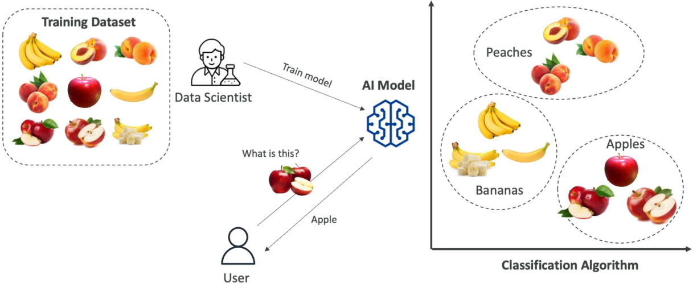
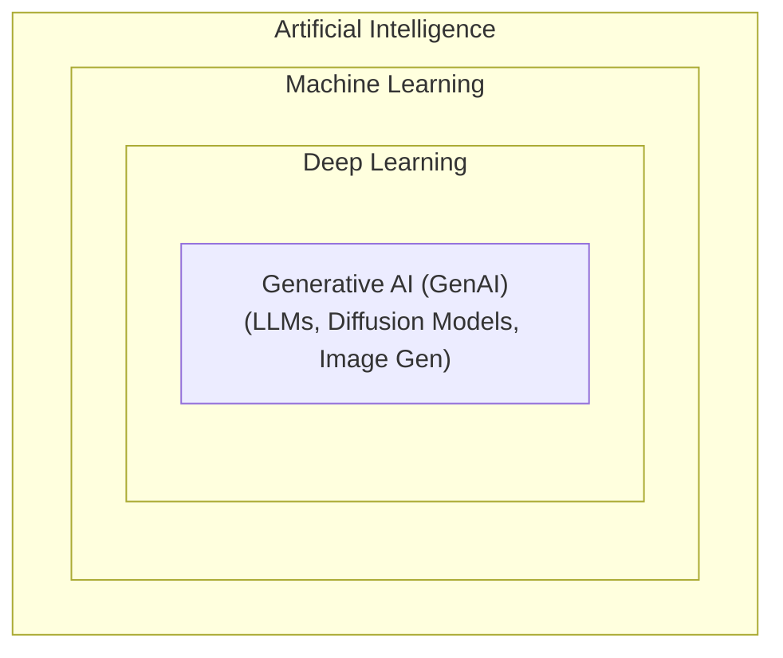
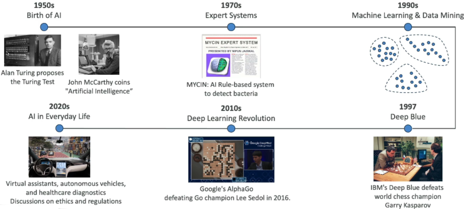
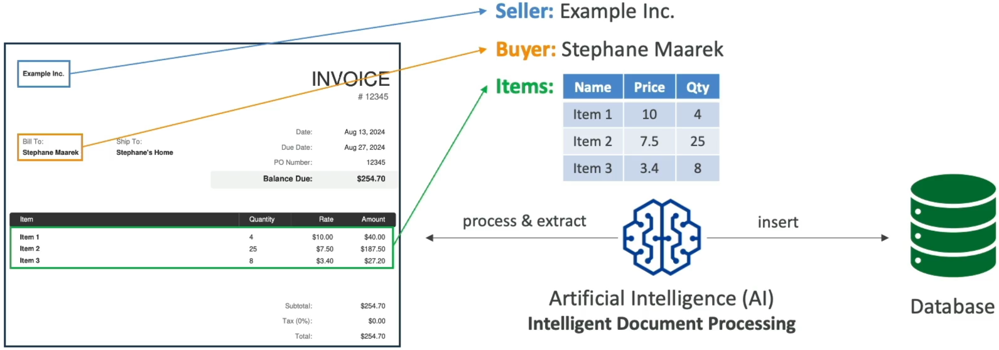
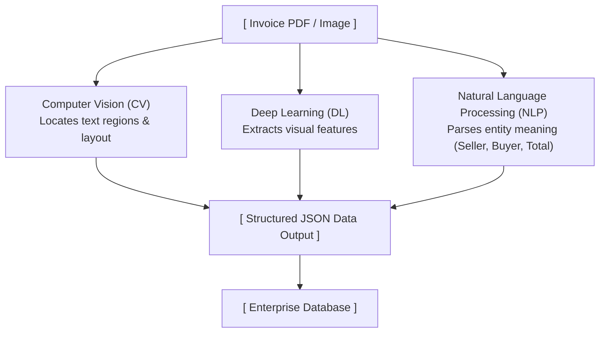
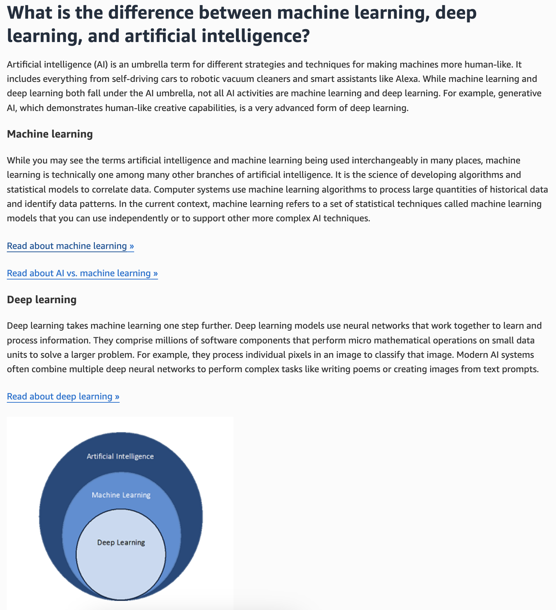
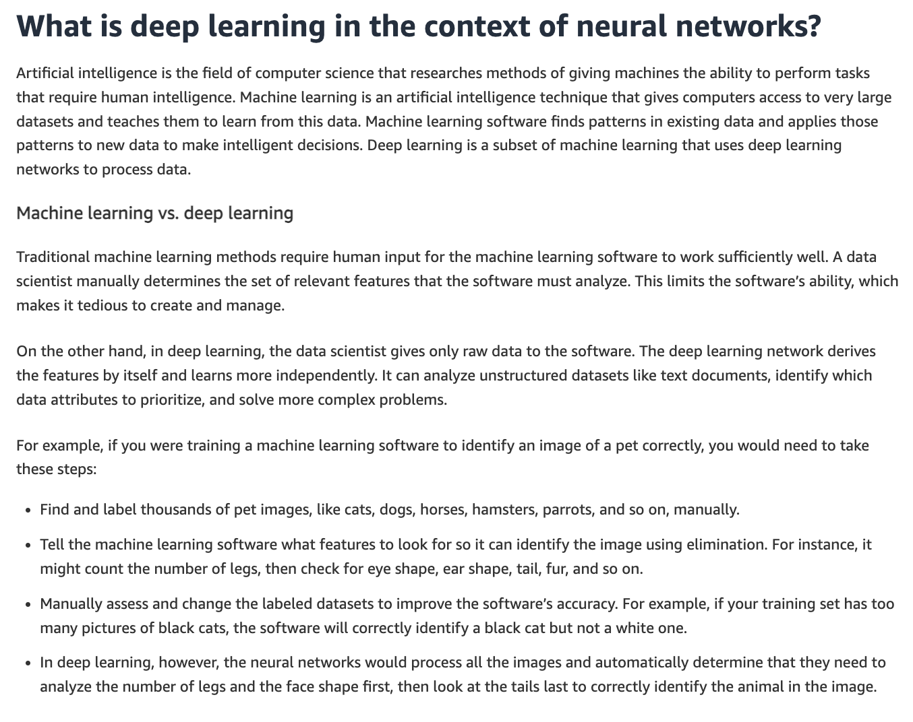

# What is Artificial Intelligence (AI)?

---

## Key Takeaways

AI isn't magic; it's high-level computer science built to mimic human problem-solving. At its core, modern AI relies on using **training datasets** to generate **models** (smart code with statistical capabilities).



Instead of hardcoding every rule, data scientists train models to plot, categorize, and uncover patterns in massive datasets. When you feed new, unseen data into a trained model, it leverages those learned patterns to make predictions or decisions.

---

## Main Discussion

### The Core Mechanics of Model Training & Inference

Modern AI separates the system lifecycle into two distinct phases: **Training** (backend preparation) and **Inference** (user execution).

```mermaid
flowchart TD
    subgraph TP [Training Phase]
        direction LR
        TD[Training Data<br/>(Labeled/Unseen)] --> DS[Data Scientist / Algorithm<br/>(Statistical Math)]
        DS --> TM[Trained Model]
    end

    subgraph IP [Inference Phase]
        direction LR
        NUD[New User Data<br/>(Unseen Sample)] --> TM2[Trained Model<br/>(Pattern Matching)]
        TM2 --> PO[Prediction Output]
    end

    TP --> IP
```

1. **Training Phase:** A large dataset (e.g., millions of fruit images) is processed by statistical code algorithms. The algorithm learns boundary features across multiple dimensional axes (like mapping color, shape, or weight).
2. **Inference Phase:** The user provides brand new data. The model maps this input against its learned mathematical boundary to return a precise classification.

### Mathematical Representation of Machine Intelligence

AI taxonomy forms a nested hierarchy where each inner subfield leverages more specialized techniques:

$$\text{AI} \supset \text{Machine Learning (ML)} \supset \text{Deep Learning (DL)} \supset \text{Generative AI (GenAI)}$$



- **Artificial Intelligence (AI):** Overarching discipline focusing on machines performing tasks requiring human-like intelligence.
- **Machine Learning (ML):** Subset of AI using statistical algorithms to learn patterns from data without explicit programming.
- **Deep Learning (DL):** Subset of ML powered by multi-layered **Artificial Neural Networks** capable of processing complex, unstructured data.
- **Generative AI (GenAI):** Specialized subset of DL focused on creating _new content_ (text, images, synthetic audio) using foundational models.

### Chronological Milestones in AI Evolution



- **1950s (Foundational Concepts):** Alan Turing introduced the **Turing Test** (evaluating if a machine can conversationally pass as human). John McCarthy coined the term _"Artificial Intelligence"_.
- **1970s (Rule-Based Systems):** Development of **Expert Systems** (e.g., MYCIN for bacterial infection diagnosis) driven by strict conditional rules (`IF-THEN` logic).
- **1990s (Statistical ML Era):** Algorithmic advances and computing power enabled data mining. In 1997, IBM's **Deep Blue** defeated world chess champion Garry Kasparov via mass move-computation.
- **2010s (Deep Learning Breakthroughs):** **Neural networks** unlocked new capabilities. In 2016, Google DeepMind's **AlphaGo** defeated Go champion Lee Sedol using advanced Deep Learning, solving a game with possibilities far exceeding chess search trees.
- **Present Day (Ubiquitous GenAI):** Pervasive adoption across code assistance, automated reasoning, real-time voice synthesis, and multi-modal analysis.

### Applied AI Architecture: Intelligent Document Processing (IDP)

A key modern enterprise pattern is **Intelligent Document Processing (IDP)**, which combines multiple AI sub-domains to convert unstructured files into structured database records:





---

## Exam Guide

### Exam Tips

- **Distinguish the Taxonomy:** Expect questions testing your ability to categorize a workload. **GenAI** creates new data, **Deep Learning** utilizes neural networks, **Machine Learning** relies on data-driven statistical training, and **AI** is the umbrella term.
- **IDP Domain Overlap:** Understand that enterprise solutions like IDP aren't a single model—they orchestrate **Computer Vision** (visual identification), **NLP** (context understanding), and **Deep Learning** (feature extraction).
- **Training vs. Inference:** Know the structural difference between generating a model using training data versus running predictions on new data during production inference.

---

### Practice Test

#### Question 1

A financial company wants to automate its invoice processing pipeline. The system must intake PDF document scans, locate text fields, interpret line-item meanings, and convert the output into tabular data. Which combination of AI disciplines powers this solution?

- [ ] A. Deep Learning and Rule-Based Expert Systems only
- [ ] B. Computer Vision, Deep Learning, and Natural Language Processing
- [ ] C. Generative AI and Statistical Anomaly Detection only
- [ ] D. Reinforcement Learning and Computer Vision

<details>
<summary>Correct Answer</summary>

- [x] B. Computer Vision, Deep Learning, and Natural Language Processing
  - **Explanation:** Intelligent Document Processing (IDP) uses **Computer Vision** to visually parse document regions, **Deep Learning** to recognize patterns across unstructured layouts, and **Natural Language Processing (NLP)** to extract semantic meaning (e.g., distinguishing a "Total Due" field from an "Invoice Date").

</details>

---

#### Question 2

An engineer needs to select the correct technology domain for a solution that generates novel synthetic images based on text prompts. Where does this capability fall within the AI hierarchy?

- [ ] A. Machine Learning, but outside of Deep Learning
- [ ] B. Artificial Intelligence, but outside of Machine Learning
- [ ] C. Generative AI, which is a subset of Deep Learning
- [ ] D. Rule-Based Expert Systems, which sit inside Deep Learning

<details>
<summary>Correct Answer</summary>

- [x] C. Generative AI, which is a subset of Deep Learning
  - **Explanation:** **Generative AI (GenAI)** is a specialized subset of **Deep Learning** focused on creating original text, images, or audio from context prompts.

</details>

---

#### Question 3

A financial services company is exploring the use of AI to improve fraud detection and automate credit risk assessments. The data science team is evaluating whether to use traditional machine learning techniques or deep learning, depending on the complexity of the tasks and the size of the data involved. Understanding the key differences between deep learning and traditional machine learning will help the team choose the right approach.

Which of the following would you suggest to the team? (Select two)

- [ ] A. Deep learning models do not require any data preprocessing, while traditional machine learning models require extensive data preprocessing
- [ ] B. Deep learning is a subset of machine learning that uses neural networks with many layers to learn from large amounts of data, while traditional machine learning algorithms often require feature extraction and can use various methods such as decision trees or support vector machines
- [ ] C. Deep learning models are always faster to train than traditional machine learning models, regardless of the dataset size
- [ ] D. Traditional machine learning algorithms are only used for supervised learning tasks, whereas deep learning algorithms are only used for unsupervised learning tasks
- [ ] E. In traditional machine learning, a data scientist manually determines the set of relevant features that the software must analyze, whereas in deep learning, the data scientist gives only raw data to the software and the deep learning network derives the features by itself

<details>
<summary>Correct Answers</summary>

- [x] B. Deep learning is a subset of machine learning that uses neural networks with many layers to learn from large amounts of data, while traditional machine learning algorithms often require feature extraction and can use various methods such as decision trees or support vector machines
  - **Explanation:** Deep learning is a subset of machine learning that employs neural networks with multiple layers (hence the term "deep") to automatically learn representations from large datasets. Traditional machine learning, on the other hand, often involves manual feature extraction and can use a variety of algorithms like decision trees, support vector machines, and linear regression.  
    
- [x] E. In traditional machine learning, a data scientist manually determines the set of relevant features that the software must analyze, whereas in deep learning, the data scientist gives only raw data to the software and the deep learning network derives the features by itself
  - **Explanation:** Traditional machine learning methods require human intervention where a data scientist manually determines the set of relevant features to engineer and analyze. In deep learning, raw data is provided directly to the model, and the multilayer neural network extracts and learns the relevant feature representations automatically.  
    

<details>
<summary>Incorrect Answers</summary>

- [ ] A. Deep learning models do not require any data preprocessing, while traditional machine learning models require extensive data preprocessing
  - **Explanation:** Both deep learning and traditional machine learning require data preprocessing (such as normalization, cleaning, and tokenization/resizing), even though deep learning can learn feature representations directly from raw inputs.
- [ ] C. Deep learning models are always faster to train than traditional machine learning models, regardless of the dataset size
  - **Explanation:** Deep learning models are computationally intensive and typically require considerably longer training times and specialized hardware (GPUs/TPUs) compared to simpler traditional algorithms.
- [ ] D. Traditional machine learning algorithms are only used for supervised learning tasks, whereas deep learning algorithms are only used for unsupervised learning tasks
  - **Explanation:** Both traditional machine learning and deep learning paradigms span across supervised, unsupervised, semi-supervised, and reinforcement learning domains.

</details>

Reference:

- [https://aws.amazon.com/what-is/artificial-intelligence/](https://aws.amazon.com/what-is/artificial-intelligence/)
- [https://aws.amazon.com/what-is/neural-network/](https://aws.amazon.com/what-is/neural-network/)

</details>

---
