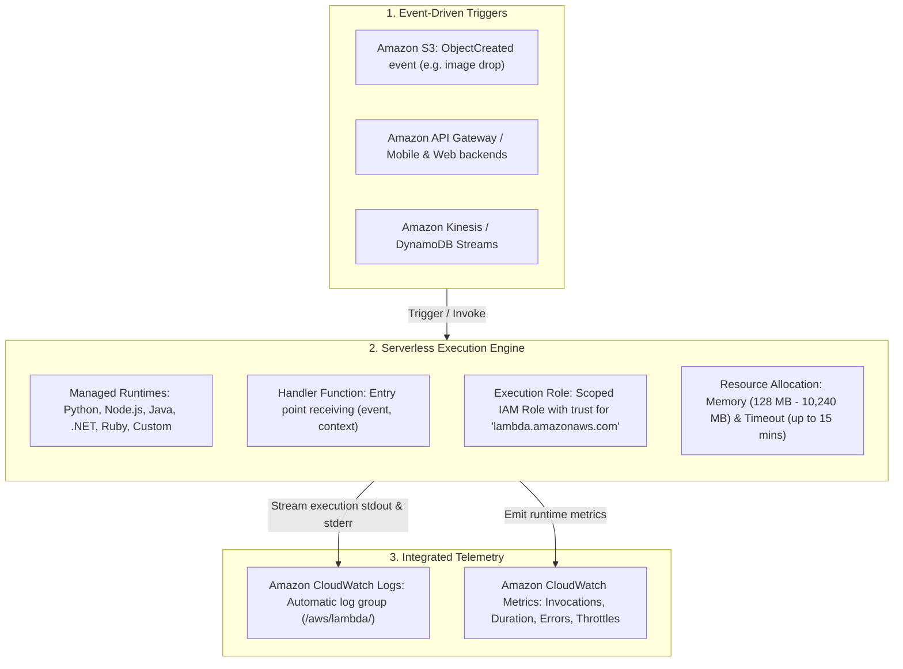
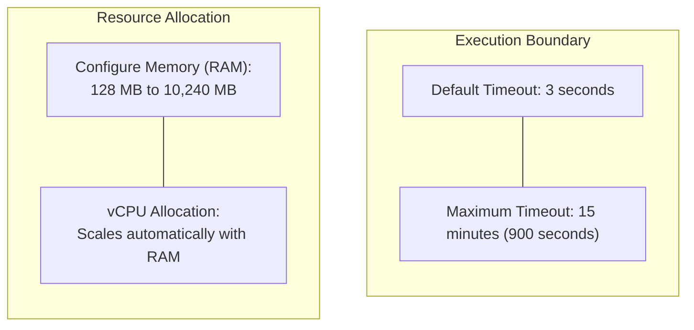
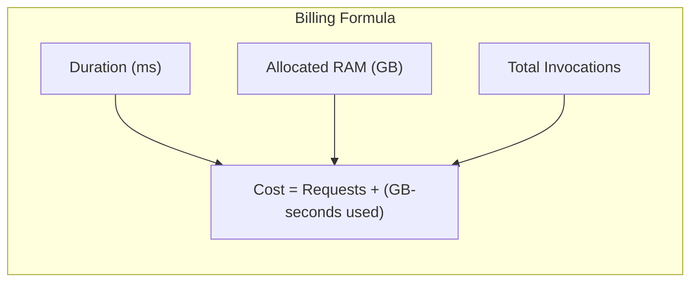

# Hands-On Lab: AWS Lambda Architecture, Event-Driven Invocations, Execution Roles & CloudWatch Observability

---

## Key Takeaways

**AWS Lambda** is the premier **Serverless Compute (Functions as a Service / FaaS)** offering on AWS. It allows you to run code in response to events without provisioning, scaling, patching, or managing any virtual servers or container clusters.



Key principles to remember for the exam:

- **Serverless Paradigm:** You provide the code and select runtime configuration; AWS automatically provisions ephemeral execution environments, handles horizontal auto-scaling based on incoming event volume, and terminates environments when idle.
- **Pay-per-Use Billing:** Billing is based strictly on the **number of requests (invocations)** and the **compute duration** (measured in milliseconds, proportional to allocated RAM). When code is not running, compute costs are zero.
- **Event-Driven Execution:** Functions execute in response to **triggers** (e.g., S3 object uploads, DynamoDB streams, API Gateway HTTP endpoints, IoT telemetry).
- **IAM Execution Roles:** Every Lambda function requires an **IAM execution role** granting it permissions to write logs to Amazon CloudWatch and interact with downstream resources (such as reading an S3 object or invoking an Amazon Bedrock foundation model).
- **Logging & Observability:** System runtime logs and standard outputs (`print` or `console.log`) are automatically ingested into **Amazon CloudWatch Logs** under dedicated log streams.

---

## Hands-On Workflow: Function Provisioning to CloudWatch Debugging

1. **Navigate to the Lambda Console & Review Serverless Scaling:**
   - Open the AWS Management Console and search for **Lambda**.
   - Observe the runtime options supported natively by AWS: Python, Node.js, Java, .NET, Ruby, and Custom Runtimes (provided.al2023).
   - Review the event-driven scaling model: as incoming events surge from sources like streaming analytics, mobile backends, or S3 uploads, Lambda instantiates parallel execution containers automatically without manual intervention.
2. **Create a Function via Blueprint:**
   - Click **Create function**:
   - Select **Use a blueprint** (or Author from scratch).
   - Filter blueprints by entering `hello-world` and select the **hello-world-python** template.
   - **Function name:** Enter `HelloWorld`.
   - **Runtime:** Python (e.g., Python 3.12 / 3.11).
3. **Configure the IAM Execution Role:**
   - Under **Permissions**, inspect the **Execution role** options:
   - Select **Create a new role with basic Lambda permissions**.
   - AWS automatically creates an IAM role that attaches the managed policy `AWSLambdaBasicExecutionRole`.
   - This policy grants the explicit actions `logs:CreateLogGroup`, `logs:CreateLogStream`, and `logs:PutLogEvents`, allowing the function to push stdout/stderr into Amazon CloudWatch Logs.
   - Click **Create function**.
4. **Inspect Function Handler Code:**
   - Once created, inspect the code editor displaying the handler entry point:

   ```python
   import json

   def lambda_handler(event, context):
       # Retrieve values passed in the incoming event JSON payload
       value1 = event.get('key1')
       value2 = event.get('key2')
       value3 = event.get('key3')

       print(f"value1 = {value1}")
       print(f"value2 = {value2}")
       print(f"value3 = {value3}")

       return value1  # Returns the value of key1 to the caller
   ```

   - The **`event`** parameter contains the dynamic JSON payload passed by the invoking trigger or caller.
   - The **`context`** parameter provides runtime metadata (such as remaining execution time and memory limits).

5. **Create Test Events & Execute Manual Tests:**
   - Click the **Test** tab or the dropdown next to **Test**:
   - **Event name:** Enter `HelloWorldEvent`.
   - **Event JSON template:** Keep the default sample JSON:

   ```json
   {
     "key1": "value1",
     "key2": "value2",
     "key3": "value3"
   }
   ```

   - Click **Save**, then click **Test**.
   - **Execution Result:** The response returns `"value1"` with status `Succeeded`.
   - The output summary displays billed duration, execution duration, and allocated memory.

6. **Inspect Runtime Metrics & CloudWatch Logs:**
   - Navigate to the **Monitor** tab:
   - **Metrics View:** Displays graphs for Invocations, Duration, Error count, and Success rate.
   - Click **View CloudWatch logs**.
   - Open the latest **Log Stream** corresponding to your invocation.
   - Review the structured log output containing the `START`, `value1 = value1`, `END`, and `REPORT` lines. The `REPORT` line details runtime duration, memory size, and actual memory used.
7. **Review General Configuration & Triggers:**
   - Navigate to the **Configuration** tab:
   - **General configuration:** Review **Memory** (128 MB up to 10,240 MB) and **Timeout** (defaults to 3 seconds, configurable up to 15 minutes). Note that vCPU scales proportionally with allocated memory.
   - **Permissions:** Review the linked IAM Execution Role and its attached CloudWatch policies.
   - **Triggers:** Click **Add trigger** to observe supported integration services—including Amazon S3, Amazon Kinesis, Amazon DynamoDB, and API Gateway.

---

## Deep Dive: Architectural Concepts & Constraints





| Dimension                           | AWS Lambda Specification                                                      | Operational Implication for AI/ML                                                                                                                                                                |
| ----------------------------------- | ----------------------------------------------------------------------------- | ------------------------------------------------------------------------------------------------------------------------------------------------------------------------------------------------ |
| **Maximum Execution Timeout**       | **15 minutes (900 seconds)**                                                  | Ideal for prompt preprocessing, API response formatting, and lightweight inference. Long-running large model training or multi-hour batch ETL must run on **Amazon SageMaker** or **AWS Batch**. |
| **Memory Allocation**               | 128 MB to 10,240 MB (10 GB)                                                   | CPU allocation scales proportionally with configured memory. Allocating more RAM provides more vCPU power to accelerate matrix operations.                                                       |
| **Ephemeral Disk Storage (`/tmp`)** | 512 MB to 10,240 MB (10 GB)                                                   | Provides local scratch space to download small model checkpoints, configuration files, or image assets temporarily during execution.                                                             |
| **Execution Role**                  | IAM Role assuming `lambda.amazonaws.com`                                      | Controls what AWS APIs the function can call. To invoke foundation models via Amazon Bedrock, the role requires `bedrock:InvokeModel`.                                                           |
| **Deployment Package Formats**      | ZIP archive (up to 250 MB uncompressed) or **Container Images (up to 10 GB)** | Container image support enables packaging larger Python ML dependencies (such as NumPy, PyTorch, or Scikit-learn) within a Lambda environment.                                                   |

---

## Exam Guide

### Exam Tips

- **Serverless Compute Characteristics (High Frequency):**
  - **No servers to manage or patch.**
  - Scales automatically with incoming event traffic.
  - Pay strictly for execution time (in milliseconds) and invocation counts; **zero cost when idle**.
- **15-Minute Timeout Limit:** The maximum execution timeout for an AWS Lambda function is **15 minutes**. If an exam scenario asks to run a machine learning training job that takes hours, **do not select Lambda**; select **Amazon SageMaker Training Jobs** or **AWS Batch**.
- **Lambda Execution Role:** A Lambda function **must** have an IAM Execution Role with a trust policy for `lambda.amazonaws.com` and permissions to write logs to **Amazon CloudWatch Logs** (`AWSLambdaBasicExecutionRole`).
- **Common AI/ML Architecture Patterns:**
  - Preprocessing incoming prompts or validating JSON payloads before calling foundation models via **Amazon Bedrock**.
  - Event-driven processing: Triggering an inference job or invoking **Amazon Rekognition** / **Amazon Comprehend** automatically whenever a user uploads an image or text file to an **Amazon S3 bucket**.
- **CloudWatch Integration:** Debugging and viewing print statements/logs from Lambda functions is performed through **Amazon CloudWatch Logs**.

---

### Practice Test

#### Question 1

A media company wants to analyze user-uploaded profile pictures for inappropriate content automatically. As soon as a user uploads an image to an Amazon S3 bucket, an event should trigger an image moderation check using Amazon Rekognition, and the classification result should be written to Amazon DynamoDB. The solution must require minimal operational overhead and incur zero compute costs when no images are being uploaded. Which architecture meets these requirements?

- [ ] A. Run an Amazon EC2 instance continuously polling the S3 bucket using a cron job
- [ ] B. Configure an Amazon S3 Event Notification to invoke an AWS Lambda function that calls Amazon Rekognition and writes to DynamoDB
- [ ] C. Provision an Amazon SageMaker real-time inference endpoint running an EC2 `p4d.24xlarge` instance
- [ ] D. Deploy an AWS CloudFormation template that provisions an Amazon EMR cluster on demand

<details>
<summary>Correct Answer</summary>

- [x] B. Configure an Amazon S3 Event Notification to invoke an AWS Lambda function that calls Amazon Rekognition and writes to DynamoDB
  - **Explanation:** **AWS Lambda** provides a fully managed, event-driven serverless compute environment that integrates natively with Amazon S3 Event Notifications. It automatically scales to handle incoming uploads, calls Amazon Rekognition, and incurs zero cost when idle.

</details>

---

#### Question 2

A machine learning engineer needs to deploy a custom data preprocessing script on AWS. The script runs for an average of 45 minutes to clean and normalize large historical datasets before passing them to a SageMaker training pipeline. Why is AWS Lambda unsuitable for hosting this preprocessing job directly?

- [ ] A. AWS Lambda only supports JavaScript/Node.js and cannot execute Python scripts
- [ ] B. AWS Lambda has a hard maximum execution timeout of 15 minutes
- [ ] C. AWS Lambda cannot access datasets stored in Amazon S3
- [ ] D. AWS Lambda functions cannot be integrated with Amazon CloudWatch Logs

<details>
<summary>Correct Answer</summary>

- [x] B. AWS Lambda has a hard maximum execution timeout of 15 minutes
  - **Explanation:** AWS Lambda enforces a strict maximum execution timeout of **15 minutes (900 seconds)** per invocation. Workloads requiring 45 minutes of continuous processing exceed this limit and should be executed using **Amazon SageMaker Processing Jobs**, **AWS Glue**, or **AWS Batch**.

</details>

---
