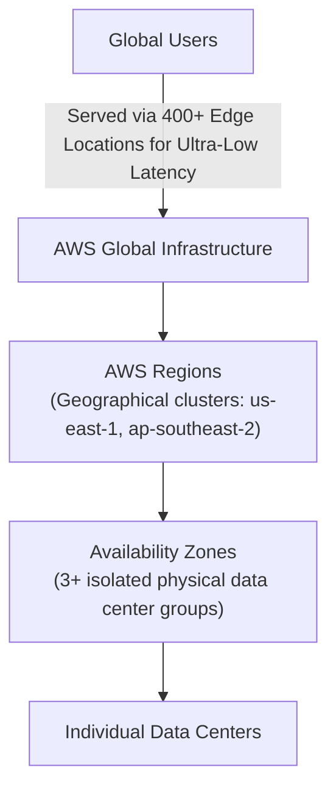
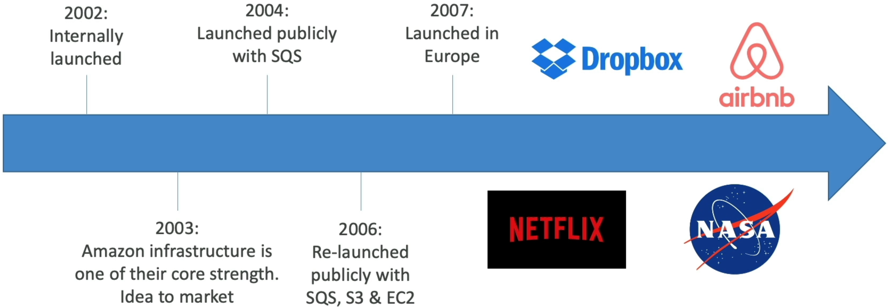
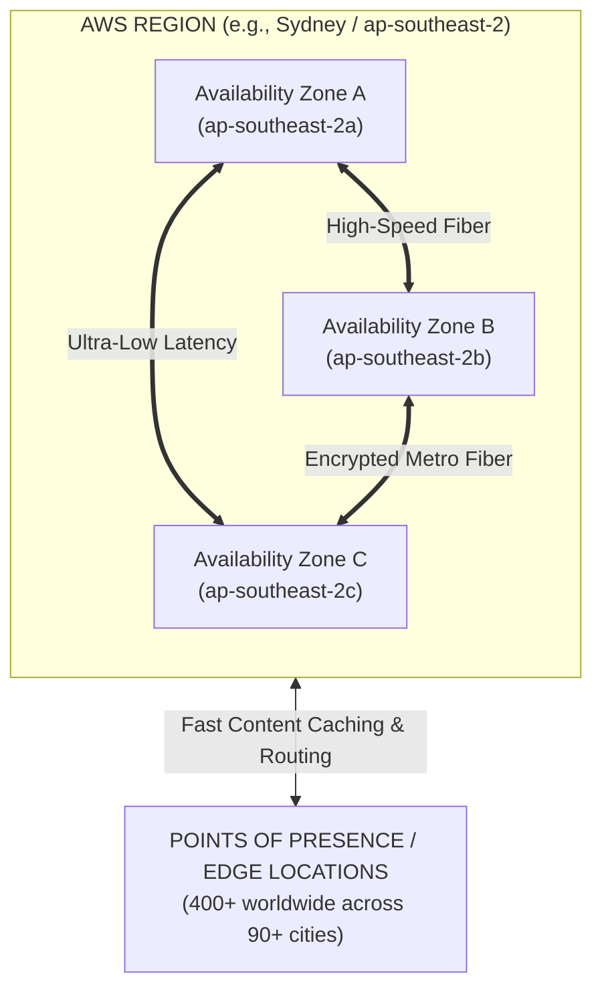
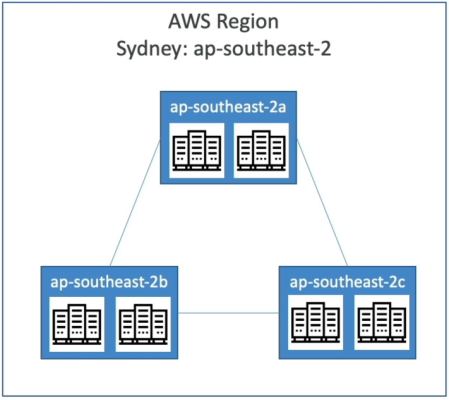
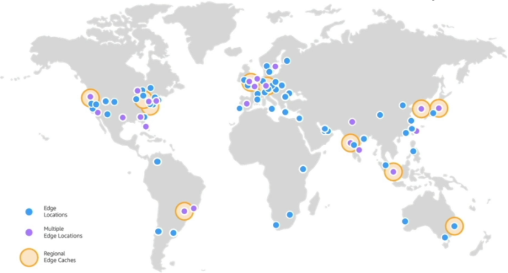
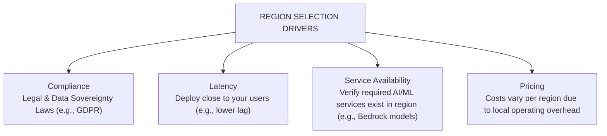
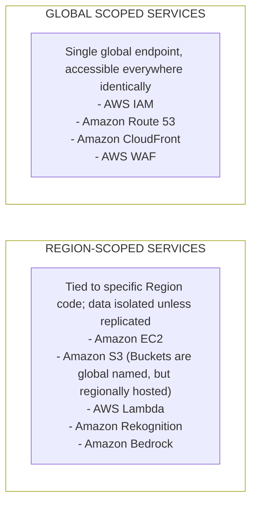

# AWS Cloud Overview

---

## Key Takeaways

AWS pioneered modern cloud infrastructure. From its initial internal launch in 2002 to becoming the world’s leading cloud platform, AWS provides global infrastructure that powers everything from early-stage startups to massive enterprise platforms like Netflix, Airbnb, and NASA.

To optimize application deployments and AI workloads, you must understand how to navigate **AWS Regions**, **Availability Zones (AZs)**, and **Points of Presence / Edge Locations**, along with the key trade-offs (compliance, latency, pricing, service availability) when selecting deployment targets.

---

## Main Discussion

### The Evolution & Market Dominance of AWS

AWS established the cloud computing industry and continues to lead global market share:

- **Historical Milestones:**
  - **2002:** Internal launch at Amazon.com to decouple and externalize IT infrastructure.
  - **2004:** First public service launch with **Amazon Simple Queue Service (SQS)**.
  - **2006:** Official public platform relaunch adding **Amazon Simple Storage Service (S3)** and **Amazon Elastic Compute Cloud (EC2)**.
- **Industry Standing:** Named a **Gartner Magic Quadrant Leader for Strategic Cloud Platform Services for 15+ consecutive years**, commanding roughly **30%+ global market share**.

---

### Global Infrastructure Anatomy: Regions, AZs, and Points of Presence

AWS organizes its physical hardware globally across three primary abstraction layers:

1. **AWS Regions:** Physical geographical locations worldwide containing a cluster of isolated data centers (e.g., `us-east-1` in N. Virginia, `ap-southeast-2` in Sydney). Most AWS services operate within a regional scope.
2. **Availability Zones (AZs):** Distinct physical data centers within a region (typically **3 to 6 AZs per region**). Each AZ is equipped with redundant power, networking, and cooling, and is physically separated from other AZs to prevent failure cascading.  
   
3. **Points of Presence (Edge Locations):** Over **400+ edge locations** across 90+ cities globally, utilized by services like **Amazon CloudFront** and **AWS Global Accelerator** to deliver low-latency content caching and API delivery.  
   

---

### The 4 Criteria for Selecting an AWS Region

Choosing where to host your application or AI model pipeline involves balancing four key business and technical criteria:

$$\text{Optimal Region} = \min(\text{Latency}) + \max(\text{Compliance}) + \text{Service Availability} + \min(\text{Cost})$$

- **Compliance & Data Sovereignty:** Legal requirements forcing data to reside within specific national borders (e.g., European data remaining in EU regions).
- **Latency:** Placing infrastructure geographically closer to your user base to minimize network packet round-trip time.
- **Service Availability:** Ensuring the target region supports the specific AWS services or AI models required (newer AI capabilities often roll out in select primary regions first).
- **Pricing & Cost Structure:** Services have varying price points across regions due to local power, real estate, and operational expenses.

---

### Resource Scope Mapping: Global vs. Region-Scoped

Understanding service scope determines how resources are accessed and replicated across AWS:

---

## Exam Guide

### Exam Tips

- **Minimum AZ Requirement:** Remember that every AWS Region has a **minimum of 3 Availability Zones** to ensure high availability and disaster recovery.
- **Edge Location Function:** Edge locations are **not** full regions; they do not run applications or databases. Their primary role is **content caching and low-latency delivery** at the network edge via Amazon CloudFront.
- **Data Sovereignty Priority:** If an exam scenario mentions compliance or data residency laws, **Compliance** overrides latency and cost considerations when selecting a region.

---

### Practice Test

#### Question 1

A media company wants to serve video content and AI-generated image thumbnails to a global audience with minimal latency. They need to cache static content at edge data centers closer to end users. Which AWS infrastructure component supports this requirement?

- A. Availability Zones
- B. Points of Presence / Edge Locations
- C. AWS Direct Connect Locations
- D. Isolated Private Cloud Regions

Correct Answer

- [x] B. Points of Presence / Edge Locations
  - **Explanation:** **Points of Presence (Edge Locations)** run services like Amazon CloudFront to cache static content and deliver API responses to end users globally with minimal latency.

---

#### Question 2

An enterprise is planning to deploy a generative AI service using Amazon Bedrock. The security team states that all training prompt logs must remain strictly within Australia due to local data privacy laws. What is the primary factor dictating their selection of the `ap-southeast-2` (Sydney) region?

- A. Service Availability
- B. Pricing and Operational Expenses
- C. Compliance and Data Sovereignty
- D. Global Edge Location Mapping

Correct Answer

- [x] C. Compliance and Data Sovereignty
  - **Explanation:** **Compliance and Data Sovereignty** regulations dictate that data must remain physically within specific geographical or national boundaries, requiring the enterprise to deploy in the local region.

