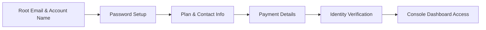

# Creating an AWS Account

---

## Key Takeaways

Setting up an AWS account establishes your root credentials—the ultimate administrative master key to your entire AWS infrastructure. AWS mandates credit card verification during sign-up to prevent fraud and confirm identity, even for free tiers.

Starting with the **Free Plan** grants initial credits and sets a safety boundary: if credits run out, the account closes automatically instead of incurring unexpected credit card charges.

---

## Hands-On Workflow: AWS Account Setup

1. **Initiate Signup & Set Root User Identity:**
   Navigate to the AWS Portal and select **Create an AWS Account**. Enter a valid email address as your **Root User Email Address** along with your desired AWS Account Name. Verify the email via the verification code sent to your inbox.
   - **Root User Definition:** The ultimate owner credential with unrestricted administrative rights over every resource in the account.
2. **Define Password Constraints:**
   Create a strong root password. Ensure it meets security parameters:
   - Minimum length of **8 characters**.
   - At least **3 of the following**: uppercase letters, lowercase letters, numbers, or non-alphanumeric characters.
3. **Select Account Plan:**
   Choose between **Free Plan** and **Paid Plan**:
   - **Free Plan:** Recommended for learning. Provides credits (up to $200) without running an active card; account closes automatically when credits expire rather than silently billing.
   - **Paid Plan:** Tailored for production workloads; charges directly to credit card upon credit exhaustion.
4. **Provide Contact & Billing Verification:**
   Input personal contact details and credit card information.
   - **Identity Verification Hold:** AWS places a temporary **$1 USD pre-authorization hold** (immediately refunded) to verify card legitimacy and block automated fraud bots.
5. **Confirm Identity & Select Support Plan:**
   Verify account ownership via SMS phone verification. On the support selection screen, choose **Basic Support - Free** to avoid recurring monthly support tier fees.
6. **Authenticate as Root User in the Management Console:**
   Once activation completes, sign out and navigate to **Sign in to Console**. Choose **Root User**, enter your root email address, enter your password, and access the AWS Management Console dashboard.

---

## Exam Guide

### Exam Tips

- **Root Account Security Best Practices:** On the exam, remember that the **Root User** should _never_ be used for daily operational tasks or programmatic API calls. Once created, secure the root account with **Multi-Factor Authentication (MFA)** immediately and create individual IAM users or IAM Identity Center roles for daily work.
- **Basic Support Tier Features:** The **Basic Support Plan** is included free for all AWS accounts. It provides access to customer service, documentation, whitepapers, and select core AWS Trusted Advisor checks.

---

### Practice Test

#### Question 1

A cloud engineer has just created a new AWS account using their corporate email address. What is the recommended security best practice for managing this new account?

- A. Share the root account credentials with team members for daily administration
- B. Enable Multi-Factor Authentication (MFA) on the root user and create standard IAM credentials for daily tasks
- C. Use the root user access keys directly inside application deployment scripts
- D. Disable root account access and delete the associated billing credit card

Correct Answer

- [x] B. Enable Multi-Factor Authentication (MFA) on the root user and create standard IAM credentials for daily tasks
  - **Explanation:** AWS security best practices dictate securing the **Root User** with MFA immediately and restricting its use to account-level owner tasks. Daily administrative work should be conducted using least-privilege IAM roles or users.

---

#### Question 2

What is the primary reason AWS requires payment information (such as a credit card) during the creation of an AWS account, even when the user selects the Free plan?

- A. To immediately bill for annual AWS support subscriptions
- B. To verify identity, prevent fraudulent bot activity, and cover potential overages beyond initial credits
- C. To mandate a minimum monthly cloud expenditure
- D. To auto-purchase baseline EC2 instances upon registration

Correct Answer

- [x] B. To verify identity, prevent fraudulent bot activity, and cover potential overages beyond initial credits
  - **Explanation:** AWS requires payment details during registration to verify user identity, curb abusive bot account creation, and ensure a payment method exists if usage exceeds free allowances or promotional credits.

---
