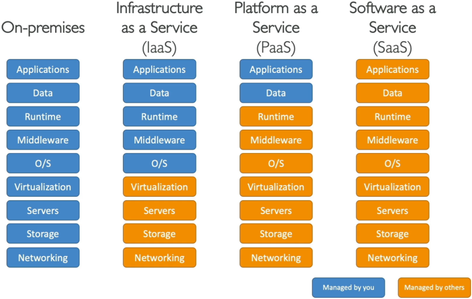

# The Different Types of Cloud Computing

---

## Key Takeaways

Cloud computing isn't one-size-fits-all; it operates on a spectrum of responsibility split between you and AWS. Think of it like building with LEGO bricks: **IaaS** gives you the raw, unconfigured blocks (EC2); **PaaS** gives you a pre-assembled frame where you just drop in your code (Elastic Beanstalk); and **SaaS** gives you a fully finished, ready-to-use toy (Amazon Rekognition or Zoom).

Financially, AWS boils cloud billing down to three core drivers: **Compute** (pay per second/hour), **Storage** (pay per GB), and **Data Transfer Out** (inbound is always free).

```
[ Traditional On-Prem ]  ---> You manage everything (Hardware, OS, App)
[ IaaS ]                 ---> AWS manages Hardware/Virtualization; You manage OS & App
[ PaaS ]                 ---> AWS manages Hardware & OS; You manage Code & Data
[ SaaS ]                 ---> AWS manages everything; You just consume the service
```

---

## Main Discussion

### The Shared Responsibility Gradient: Service Model Breakdown

Understanding cloud service models means understanding **who manages what** in the technology stack.



- **Infrastructure as a Service (IaaS):** Provides raw networking, virtual machines, and storage. Gives maximum flexibility and architectural control.
  - _AWS Example:_ **Amazon EC2**
  - _Industry Examples:_ Google Cloud Compute Engine, Microsoft Azure VMs, Linode, DigitalOcean
- **Platform as a Service (PaaS):** Abstracts away OS patching, hardware provisioning, and runtime management so developers can focus solely on application deployment and code.
  - _AWS Example:_ **AWS Elastic Beanstalk**
  - _Industry Examples:_ Heroku, Google App Engine
- **Software as a Service (SaaS):** Fully managed, end-user applications delivered over the internet. You configure settings and consume capabilities without touching underlying code or infrastructure.
  - _AWS Example:_ **Amazon Rekognition** (pre-trained AI vision API)
  - _Industry Examples:_ Gmail, Zoom, Dropbox

---

### The Operational Responsibility Equation

We can express the management burden on your internal IT operations team as a function of the cloud model chosen:

$$\text{User Management Burden} = \text{Total Stack} - \text{Provider Managed Layer}$$

$$\text{IaaS Burden} = \text{Application} + \text{Data} + \text{Runtime} + \text{Middleware} + \text{OS}$$

$$\text{PaaS Burden} = \text{Application} + \text{Data}$$

$$\text{SaaS Burden} = \text{Zero Infrastructure / Zero Code (Configuration Only)}$$

---

### Deciphering the AWS Financial Engine: The 3 Pricing Pillars

AWS eliminates upfront hardware costs by driving all consumption through a utility-style pay-as-you-go model.

```
                      +----------------------------------+
                      |   AWS 3 PRICING FUNDAMENTALS     |
                      +----------------------------------+
                                       |
         +-----------------------------+-----------------------------+
         |                             |                             |
         v                             v                             v
  [ 1. COMPUTE ]                 [ 2. STORAGE ]              [ 3. NETWORKING ]
Charged per second/hour        Charged per GB stored        Pay for Data OUT only
(EC2, Lambda, Bedrock)           (S3, EBS, DynamoDB)          (Data IN is FREE!)
```

$$\text{Total Monthly AWS Cost} = f(\text{Compute Duration}) + f(\text{GB Stored}) + f(\text{GB Data Transferred OUT})$$

1. **Compute:** Billed based on execution duration and instance size (e.g., clock hours or seconds an EC2 instance or AI inference task runs).
2. **Storage:** Billed based on the total volume of data (in Gigabytes/Terabytes) stored persistently in services like Amazon S3 or EBS.
3. **Networking (Data Transfer):**
   - **Inbound Data Transfer (Data IN):** **100% Free** across all AWS services.
   - **Outbound Data Transfer (Data OUT):** Aggregated across services and charged on a per-GB basis as data leaves the AWS Cloud.

---

## Exam Guide

### Exam Tips

- **Identify Service Models for AI Services:** Pay close attention to how AWS AI services are categorized on the exam:
  - **Amazon EC2 / EBS:** IaaS (you manage the virtual machine and OS).
  - **AWS Elastic Beanstalk / SageMaker Managed Endpoints:** PaaS (managed runtime environment for applications/models).
  - **Amazon Rekognition / Amazon Polly / Amazon Transcribe:** SaaS (turnkey, pre-trained AI APIs where you pass data and get instant results without managing models or servers).
- **Data Transfer In vs. Out:** A classic trap question involves egress fees. Remember: **Data coming into AWS is always free**. You only pay when data leaves the AWS region or cloud environment to the internet.

---

### Practice Test

#### Question 1

A developer wants to integrate image classification capabilities into a web application. They prefer to send images to an existing pre-trained AWS API and receive JSON label predictions without managing training jobs, virtual machines, or operating system patches. Which cloud service model and AWS service best fit this requirement?

- [ ] A. IaaS using Amazon EC2
- [ ] B. PaaS using AWS Elastic Beanstalk
- [ ] C. SaaS using Amazon Rekognition
- [ ] D. Hybrid Cloud using AWS Outposts

<details>
<summary>Correct Answer</summary>

- [x] C. SaaS using Amazon Rekognition
  - **Explanation:** **Amazon Rekognition** provides a ready-to-use, pre-trained machine learning API, making it a **Software as a Service (SaaS)** capability where AWS manages all models, servers, runtimes, and underlying infrastructure.

</details>

---

#### Question 2

A cloud practitioner is reviewing a monthly AWS invoice and notices a line item for network charges. Which network traffic pattern incur a fee under standard AWS billing rules?

- [ ] A. Uploading 500 GB of training datasets from an on-premises workstation into an Amazon S3 bucket
- [ ] B. Inbound data transfer from the internet into an Amazon EC2 instance
- [ ] C. Transferring data out from an Amazon S3 bucket to an external internet destination
- [ ] D. Data ingress coming through a public endpoint into an AI processing pipeline

<details>
<summary>Correct Answer</summary>

- [x] C. Transferring data out from an Amazon S3 bucket to an external internet destination
  - **Explanation:** Under the AWS pricing fundamentals, **Data Transfer IN is always free**. AWS charges network egress fees specifically when data is transferred **OUT** of the AWS cloud to the internet or another external region.

</details>

---
