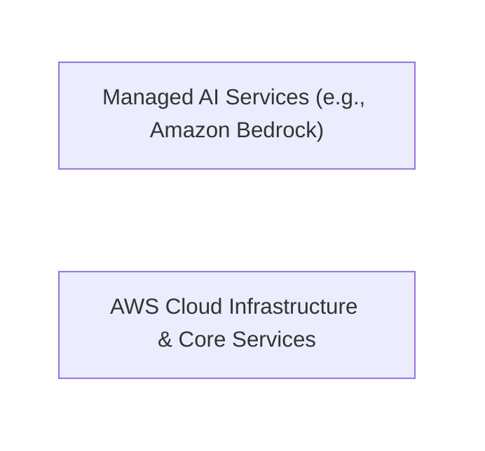
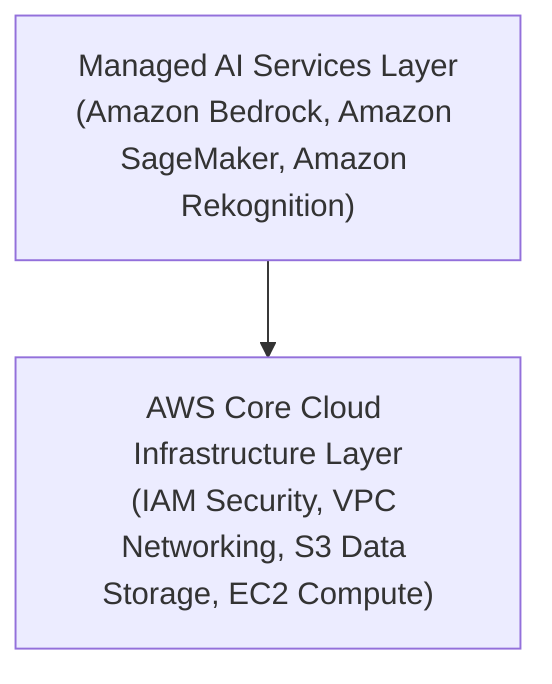

# Section Introduction

---

## Key Takeaways

While the AIF-C01 exam heavily emphasizes AI concepts, foundational **AWS Cloud knowledge** is essential to understand how managed AI services operate. Services like **Amazon Bedrock** rely on underlying AWS infrastructure, security models, and cloud management frameworks.

Mastering core AWS concepts provides the structural foundation required to deploy, secure, and scale AI workloads effectively.

---

## Main Discussion

### The Structural Role of Cloud Infrastructure in AI

Cloud computing provides the scalable compute, storage, and networking foundation required to host modern AI workloads. Managed AI services sit on top of this cloud infrastructure to abstract away server management.

### Architectural Dependencies for AWS Managed AI

- **Compute & Storage Foundations:** Generative AI models and machine learning pipelines require vast storage (e.g., **Amazon S3** for training data) and high-performance compute infrastructure.
- **Identity and Access Management (IAM):** Securing AI models, foundation model access, and training pipelines relies directly on core AWS security policies.
- **Managed vs. Unmanaged AI Workloads:** AWS abstracts server provisioning through managed platforms like **Amazon Bedrock**, allowing developers to invoke models via APIs without managing the underlying hardware.

---

## Exam Guide

### Exam Tips

- **Prerequisite Cloud Fundamentals:** Do not overlook basic AWS cloud concepts. The AIF-C01 exam tests how managed AI services integrate with core AWS services like **IAM**, **Amazon S3**, and **Amazon CloudWatch**.
- **Managed Service Architecture:** Understand that managed services like **Amazon Bedrock** handle the heavy lifting of infrastructure maintenance, allowing focus on model invocation, fine-tuning, and application integration.

---

### Practice Test

#### Question 1

A developer wants to build a generative AI application using Amazon Bedrock without managing underlying servers or GPU infrastructure. Which cloud computing model best describes this setup?

- [ ] A. Infrastructure as a Service (IaaS)
- [ ] B. Managed Service / Platform capability
- [ ] C. On-premises server deployment
- [ ] D. Edge computing hardware provisioning

Correct Answer

- [x] B. Managed Service / Platform capability
  - **Explanation:** **Amazon Bedrock** is a fully managed service that abstracts away infrastructure management, allowing users to access foundation models through API calls without provisioning or maintaining physical servers or GPUs.

---

#### Question 2

When implementing an AI solution on AWS using Amazon Bedrock, which core AWS service is primarily responsible for controlling user access and permissions to specific foundation models?

- [ ] A. Amazon S3
- [ ] B. AWS Identity and Access Management (IAM)
- [ ] C. Amazon EC2
- [ ] D. AWS CloudTrail

Correct Answer

- [x] B. AWS Identity and Access Management (IAM)
  - **Explanation:** **AWS Identity and Access Management (IAM)** handles authentication and authorization across all AWS services, including controlling permissions for calling Amazon Bedrock APIs and accessing specific foundation models.

---
