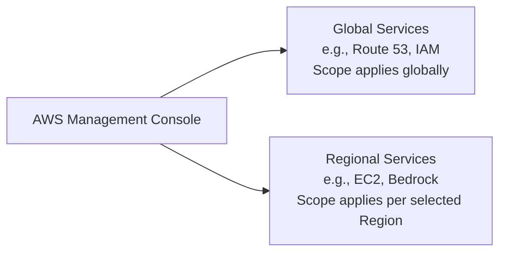

# Tour of the Console & Services in AWS

---

## Key Takeaways

The AWS Management Console is your web command center for managing cloud and AI services. Every action you take in the console is governed by your active **Region context**, with the exception of a few distinct **Global Services** like Route 53 and IAM.

Selecting the closest geographical region keeps network latency low. If a specific service or foundation model does not appear in your view, checking the **AWS Regional Services Table** ensures you switch to a region where that capability is actively deployed.

---

## Hands-On Workflow: Console & Service Navigation

1. **Select Your Optimal Working Region:**
   Locate the **Region Selector** in the top-right corner of the AWS Management Console navigation bar.
   - Review the available regions (such as `us-east-1` for N. Virginia or `ap-southeast-2` for Sydney).
   - Choose a region that is geographically closest to your physical location to ensure minimal latency during practice labs.
   - Keep this chosen region consistent across subsequent labs so provisioned resources remain visible.
2. **Explore the Console Home Dashboard:**
   Review the widgets on the console home page:
   - **Recently Visited:** Displays quick links to services you have recently accessed.
   - **AWS Health:** Alerts you to service degradations or maintenance events.
   - **Cost and Usage:** Provides high-level visibility into active account expenditure.
3. **Search and Filter AWS Services:**
   Use the unified search bar at the top of the console:
   - Search for any service name (e.g., type `Route 53`).
   - Notice that search results categorize matches by services, specific sub-features (like hosted zones or domain registration), and AWS technical documentation.
4. **Inspect Global Scoped Services:**
   Open the **Route 53** or **IAM** console from the search results.
   - Look at the top-right region selector. Notice that it automatically switches to display **Global**.
   - Global services do not require picking a specific geographical region because their configurations apply across the entire worldwide AWS infrastructure.
5. **Inspect Regional Scoped Services:**
   Navigate to a regional service console such as **Amazon EC2** or **Amazon Bedrock**.
   - Observe that the top-right selector displays your specific selected region name.
   - Switching regions from the dropdown changes your resource view entirely, as regional services only show assets provisioned within that specific geographic location.
6. **Verify Service Regional Availability:**
   If an AI capability or service discussed in a tutorial is missing in your current region:
   - Open the official **AWS Regional Services List**.
   - Cross-reference the service against AWS regions to confirm where it is currently supported, then switch the console region selector accordingly.

---

## Exam Guide

### Exam Tips

- **Global vs. Regional Resource Visibility:** The exam tests your understanding of resource scoping. If an administrator creates an EC2 instance or SageMaker notebook in `us-east-1` and cannot find it later, the first troubleshooting step is checking whether the console is set to another region like `eu-west-1`.
- **Global Console Behaviors:** Services like **IAM**, **Amazon Route 53**, and **Amazon CloudFront** manage global configurations and display **Global** in the region selector instead of a specific region code.
- **Latency Optimization:** While you can access any public AWS region from anywhere in the world, deploying workloads in the region closest to your end users remains the primary architectural rule for minimizing network latency.

---

### Practice Test

#### Question 1

A developer deploys an AI inference endpoint using Amazon SageMaker in the `us-east-1` (N. Virginia) region. Later, another engineer logs into the AWS Management Console and cannot see the endpoint in the SageMaker dashboard. What is the most likely cause?

- [ ] A. The second engineer is accessing a global service dashboard
- [ ] B. The second engineer has their console region selector set to a different AWS Region
- [ ] C. SageMaker endpoints are strictly visible via the AWS CLI only
- [ ] D. IAM permissions prevent viewing resources outside the root user account

Correct Answer

- [x] B. The second engineer has their console region selector set to a different AWS Region
  - **Explanation:** Amazon SageMaker is a **region-scoped service**. Resources provisioned in one region (such as `us-east-1`) are only visible in the console when that specific region is selected in the navigation bar.

---

#### Question 2

Which of the following AWS services automatically changes the region selector in the AWS Management Console to "Global" because its configuration applies worldwide?

- [ ] A. Amazon Elastic Compute Cloud (Amazon EC2)
- [ ] B. Amazon Bedrock
- [ ] C. Amazon Route 53
- [ ] D. Amazon Relational Database Service (Amazon RDS)

Correct Answer

- [x] C. Amazon Route 53
  - **Explanation:** **Amazon Route 53** (along with AWS IAM and CloudFront) is a **Global Service**. Its configurations apply globally rather than being restricted to a single geographical region, which is reflected as "Global" in the console region header.

---
