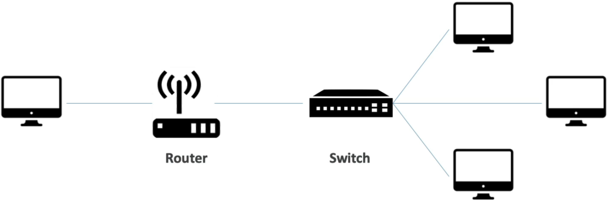
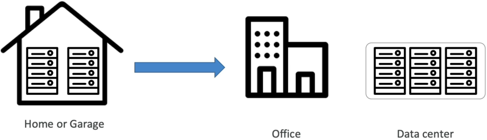

# Traditional IT - Overview

## Key Takeaways

Traditional IT relies on physical hardware—servers, networking gear, cooling, and power—managed directly in an on-premises data center or office garage.

```
[ Client Request ] ---> ( Router ) ---> [ Switch ] ---> [ Physical Server ]
                                                           |-- CPU (Compute)
                                                           |-- RAM (Memory)
                                                           |-- Disk (Storage)
```

While on-prem setups served early tech growth, they introduce heavy operational burdens: high capital expenditure (CapEx), high physical maintenance, static capacity, and single points of failure during power outages or natural disasters.

---

## Main Discussion

### The Anatomy of a Physical Server

Every computer server comprises foundational components that mirror fundamental compute abstractions used in cloud environments:

- **CPU (Central Processing Unit):** Performs calculations and executes instructions (the _computation engine_).
- **RAM (Random Access Memory):** Provides high-speed, temporary volatile memory for fast data retrieval.
- **Storage (HDD/SSD):** Holds persistent files, application data, and long-term logs.
- **Database Layer:** Formats stored data into structured schemas for rapid querying.

$$\text{Compute Hardware} = \text{CPU (Brain/Logic)} + \text{RAM (Short-Term Memory)} + \text{Disk Storage (Long-Term Memory)}$$

### Data Packet Routing Architecture

When a client browser requests a web page, network devices route traffic via IP addressing:



1. **Client Request:** Initiates traffic targeting a specific server IP address.
2. **Router:** Intermediary device that forwards data packets across external networks/internet segments to the destination network.
3. **Switch:** Local network device that receives packets from the router and delivers them directly to the targeted physical server host.

### Conceptual Architectural Diagram: On-Premises Data Center Constraints



```
+-----------------------------------------------------------------------+
|                      ON-PREMISES DATA CENTER                          |
|                                                                       |
|  [ Power Grid & Backup ] ---> [ Cooling Systems (HVAC) ]              |
|                                      |                                |
|                                      v                                |
|  [ Server Rack 1 ] ---------> [ Server Rack 2 ] --------> [ Rack N ]  |
|         |                            |                       |        |
|         v                            v                       v        |
|    (Manual HW                   (Manual HW              (Rack Space   |
|   Maintenance)                 Replacement)              Depleted)    |
|                                                                       |
|  -------------------------------------------------------------------  |
|  Risks: Fire / Power Outage / Slow Provisioning (Weeks) / Fixed Cap   |
+-----------------------------------------------------------------------+
```

### Challenges of Traditional On-Premises IT

- **High Capital & Maintenance Expenditure:** Continuous expenses for real estate rent, high power supply, enterprise HVAC cooling, and physical hardware upkeep.
- **Prohibitive Provisioning Times:** Ordering, racking, cabling, and configuring new servers takes weeks or months.
- **Rigid Scaling Limits:** Hardware capacity is bounded by physical floor space and budget constraints; unexpected traffic surges crush capacity.
- **Overhead Staffing Requirements:** Demands 24/7 dedicated site reliability and infrastructure operations teams on location.
- **Disaster Vulnerability:** Highly susceptible to localized power loss, fires, floods, and natural hardware failures without redundant secondary data centers.

---

## Exam Guide

### Exam Tips

- **CapEx vs. OpEx Tradeoff:** The AWS exam frequently contrasts traditional IT **Capital Expenditure (CapEx)**—buying physical hardware upfront—with Cloud **Operational Expenditure (OpEx)**—paying on-demand for compute resources as consumed.
- **Hardware Abstraction:** Understand that cloud services like Amazon EC2 directly replace these traditional physical servers (CPU, RAM, Storage, Networking) with virtualized software equivalents.
- **Disaster Recovery Baselines:** Traditional IT lacks built-in multi-region fault tolerance; cloud computing solves this via isolated Availability Zones (AZs).

---

### Practice Test

#### Question 1

A startup currently runs its customer portal on physical servers located in an office data closet. The team is struggling with long procurement delays whenever they need to upgrade server CPU and RAM. Which cloud computing advantage directly addresses this operational bottleneck?

- [ ] A. High physical security management
- [ ] B. On-demand resource provisioning and agility
- [ ] C. Fixed monthly capital expenditure
- [ ] D. Automatic physical disk replacement by internal staff

<details>
<summary>Correct Answer</summary>

- [x] B. On-demand resource provisioning and agility
  - **Explanation:** Cloud computing replaces long hardware procurement cycles with **on-demand resource provisioning**, allowing teams to scale compute capacity (CPU, RAM) in minutes rather than waiting weeks for physical hardware shipments.

</details>

---

#### Question 2

In traditional networking architecture, which device is primarily responsible for directing data packets across different networks toward their correct destination IP address?

- [ ] A. Database Server
- [ ] B. Switch
- [ ] C. Router
- [ ] D. RAM Module

<details>
<summary>Correct Answer</summary>

- [x] C. Router
  - **Explanation:** A **router** forwards data packets between disparate networks by inspecting destination IP addresses, whereas a **switch** directs packets to specific host devices within the same local network segment.

</details>

---
