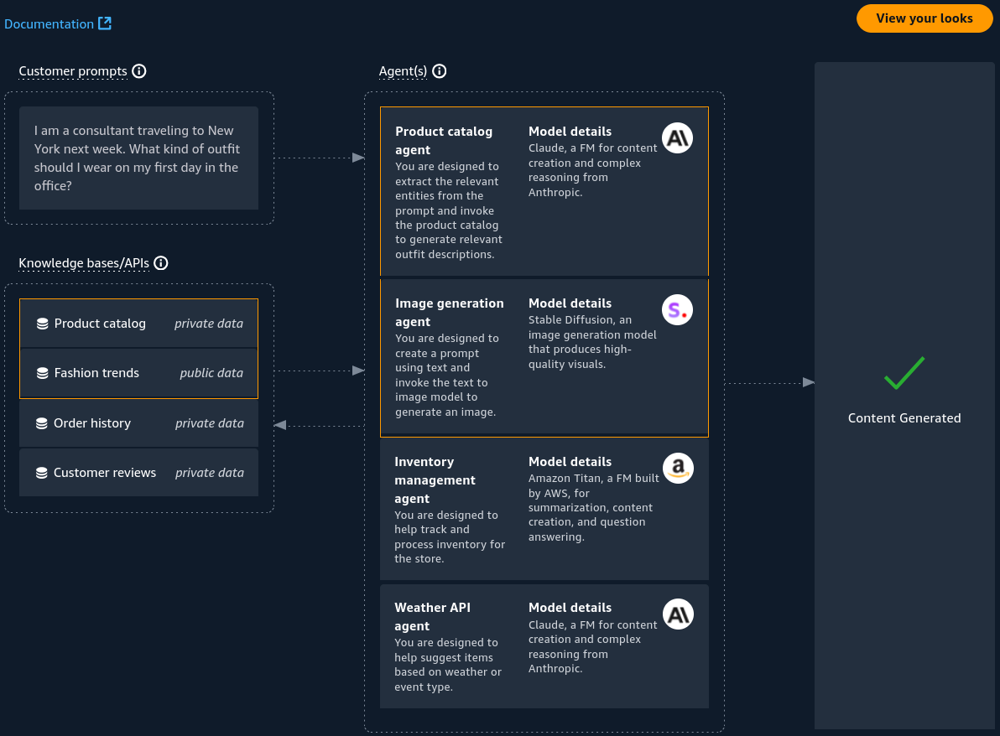

# AI Stylist - Hands On

---

## Key Takeaways

The [**AWS AI Stylist**](https://aistylist.awsplayer.com/) demonstrates how standalone Amazon Bedrock features converge into an enterprise application. Rather than executing manual prompts in a console playground, production workloads use **Bedrock APIs/SDKs** to orchestrate foundation models, autonomous agents, and multi-source knowledge bases into a seamless user experience.



The system combines **Multimodal Image Generation** (visualizing outfits), **RAG via Knowledge Bases** (grounding recommendations across catalog items and customer reviews), and **Autonomous Task Execution via Agents & Action Groups** (sizing lookups, cart modifications, order finalization).

---

## Main Discussion

### Multi-Source Knowledge Base Architecture

The AI Stylist partitions enterprise knowledge into distinct Knowledge Bases stored across private Amazon S3 buckets and public feeds:

```
+----------------------------------------------------------------------------------------------------+
|                               AI STYLIST KNOWLEDGE BASE LANDSCAPE                                  |
+--------------------------+--------------------+----------------------------------------------------+
| Knowledge Base           | Data Access Level  | Role in Generative Pipeline                        |
+--------------------------+--------------------+----------------------------------------------------+
| Product Catalog          | Private Enterprise | SKU matching, apparel dimensions, stock inventory  |
| Fashion Trends           | Public Industry    | Style alignment (Business Formal vs. Casual)       |
| Customer Reviews         | Private Enterprise | Summarizing feedback (fabric, comfort, fit)        |
| Customer Order History   | Private Enterprise | Personalized size recommendations (e.g., Size M)   |
+--------------------------+--------------------+----------------------------------------------------+
```

$$\text{Style Recommendation Context} = \text{User Prompt} + \text{Catalog Embeddings} + \text{Trend Vectors} + \text{Past Order History}$$

---

### Step-by-Step Production Interaction Pipeline

```
+---------------------------------------------------------------------------------------+
| END-TO-END WORKFLOW: PROMPT TO CHECKOUT                                               |
|                                                                                       |
|  1. INTENT & STYLE SYNTHESIS:                                                         |
|     * User Prompt: "Consultant traveling to NY next week... outfit for first day"     |
|     * Agent queries Product Catalog & Fashion Trends via RAG                          |
|     * Invokes Image Generation FM to synthesize visual looks (Formal vs. Casual)       |
|                                                                                       |
|  2. REVIEW ANALYSIS & GROUNDED Q&A:                                                   |
|     * User queries customer feedback on business formal jackets                       |
|     * Agent retrieves 325 review chunks from Customer Review Knowledge Base           |
|     * Text LLM generates a concise synthesis: "High quality, color, and fabric"       |
|                                                                                       |
|  3. PERSONALIZED SIZING & INFERENCE:                                                  |
|     * User asks: "What size should I wear?"                                           |
|     * Agent queries Customer Order History and recommends Size M based on past fit    |
|                                                                                       |
|  4. ACTION GROUP INVOCATION & API EXECUTION:                                          |
|     * User requests: "Please add it to my cart"                                       |
|     * Agent triggers Action Group (AWS Lambda) to update the backend shopping cart    |
|                                                                                       |
|  5. CROSS-SELLING & ORDER FINALIZATION:                                               |
|     * External Weather API data triggers accessory suggestions for New York           |
|     * Agent executes checkout and order confirmation via backend ERP APIs             |
+---------------------------------------------------------------------------------------+
```

---

### Console Playgrounds vs. Production API Integration

In enterprise production architectures, developers do not use the AWS Management Console; they integrate via AWS SDKs (e.g., `boto3`, Node.js SDK, LangChain):

```
+-------------------------------------------------------------------------+
| CONSOLE PLAYGROUND VS. PRODUCTION APPLICATION ARCHITECTURE              |
+------------------------------------+------------------------------------+
| Console Playgrounds (Prototype)    | Production Applications (Bedrock)  |
+------------------------------------+------------------------------------+
| Manual prompt entry via UI         | Automated SDK/API calls (`boto3`)  |
| Static single-turn evaluations     | Stateful multi-turn agent sessions |
| Manual model parameter tweaks      | Dynamic programmatic tuning        |
| Isolated test documents            | Automated S3 sync & Vector DB RAG  |
+------------------------------------+------------------------------------+

```

---

## Exam Guide

### Exam Tips

- **End-to-End Architectural Patterns:** Expect exam questions presenting comprehensive retail or enterprise scenarios. Remember how the pieces connect:
  - **Knowledge Bases (RAG):** Retrieve static or dynamic document context (catalogs, reviews, policies).
  - **Agents & Action Groups:** Execute transactional backend actions (updating shopping carts, processing payments, looking up database history).
  - **Multimodal FMs:** Generate images or parse visual inputs.
- **Public vs. Private Data Isolation:** Even when agents query multiple knowledge sources (both public trend datasets and confidential order histories), all customer data remains isolated within your AWS account boundary.
- **Review Summarization Pattern:** Using RAG to condense hundreds of unstructured customer reviews into a 3-bullet summary is a classic Bedrock text-generation pattern for reducing cognitive load and token overhead.

---

### Practice Test

#### Question 1

An online retail platform wants to build an automated styling application. The assistant needs to read historical user orders from an Amazon S3 bucket to recommend apparel sizes, retrieve product specifications from an internal vector database, and execute backend database mutations to add selected items to a customer's shopping cart. Which architectural pattern on AWS fulfills this entire workflow?

- [ ] A. Train an Amazon SageMaker XGBoost tabular model on Amazon EC2
- [ ] B. Deploy an Amazon Bedrock Agent with Knowledge Bases for order and catalog data, and an Action Group backed by AWS Lambda for cart management
- [ ] C. Use Amazon Polly connected to Amazon DynamoDB Streams
- [ ] D. Configure an Amazon Bedrock Guardrail with Denied Topics and PII masking only

<details>
<summary>Correct Answer</summary>

- [x] B. Deploy an Amazon Bedrock Agent with Knowledge Bases for order and catalog data, and an Action Group backed by AWS Lambda for cart management
  - **Explanation:** An **Amazon Bedrock Agent** orchestrates multi-step workflows by using **Knowledge Bases** to retrieve context from unstructured data sources (order history and catalog data) and **Action Groups** (via **AWS Lambda**) to execute backend business logic like updating shopping cart records.

</details>

---

#### Question 2

In the AWS AI Stylist architecture, when an AI Agent needs to generate a visual mockup of a suggested clothing outfit from a text description, which Bedrock capability is invoked?

- [ ] A. Amazon Titan Text Embeddings V2
- [ ] B. An Image Generation Foundation Model (e.g., Amazon Nova Canvas or Stable Diffusion)
- [ ] C. Amazon Bedrock Model Distillation
- [ ] D. AWS CloudWatch Invocation Logging

<details>
<summary>Correct Answer</summary>

- [x] B. An Image Generation Foundation Model (e.g., Amazon Nova Canvas or Stable Diffusion)
  - **Explanation:** Synthesizing visual mockups from text prompts requires an **Image Generation Foundation Model** (such as Amazon Nova Canvas or Stability AI Stable Diffusion). Embeddings models only produce numerical vectors, and distillation is a model optimization technique.

</details>

---
