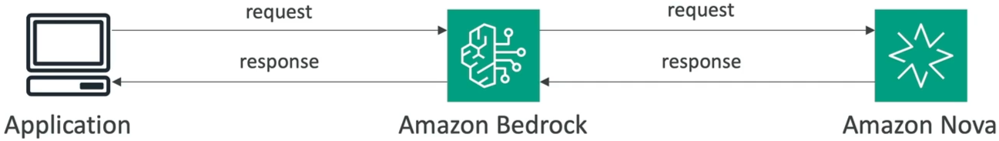
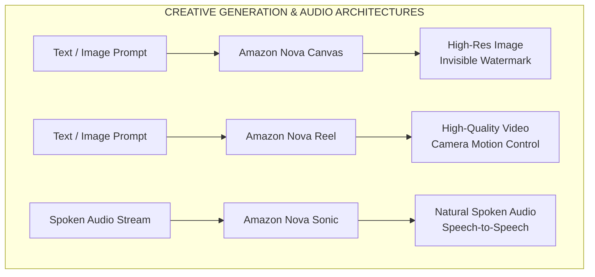

# Amazon Nova

---

## Key Takeaways

**Amazon Nova** is AWS's proprietary, state-of-the-art family of Foundation Models (FMs) natively integrated into **Amazon Bedrock**. Engineered for enterprise-grade price-performance, Nova provides up to 75% cost savings over comparable models while offering broad coverage across text, multimodal understanding, image synthesis, video generation, and speech.

### Amazon Nova Model Ecosystem

#### Understanding Models (Text & Multimodal Ingestion)
- **Nova Premier:** Flagship frontier model; top reasoning & teacher for distillation
- **Nova Pro:** High-accuracy multimodal workhorse (Text, Image, Video, Docs)
- **Nova Lite:** Low-cost, lightning-fast multimodal processing
- **Nova Micro:** Text-only model; ultra-low latency & rock-bottom cost

#### Creative & Speech Generation Models
- **Nova Canvas:** State-of-the-art text-to-image synthesis & editing (Watermarking)
- **Nova Reel:** Short video generation from text & image prompts
- **Nova Sonic:** Multi-lingual conversational speech understanding & generation

#### Nova 2 & Multimodal Unification
- **Nova 2 Omni:** All-in-one unified multimodal reasoning & image synthesis
- **Nova 2 Lite:** Fast reasoning model with up to 1M token context window
- **Nova Embeddings:** Multimodal vector embeddings for advanced RAG

---

## Main Discussion

### The Nova Understanding Hierarchy: Premier to Micro

The understanding series balances reasoning capacity, supported modalities, and cost per token:

### Nova Understanding Model Tiers

| Model Tier | Modality Support | Latency & Cost | Primary Workload Target |
| :--- | :--- | :--- | :--- |
| Nova Premier | Multimodal (Text, Images, Video, Docs) | Flagship Compute (Premium) | Complex multi-step reasoning, Teacher model for distillation |
| Nova Pro | Multimodal (Text, Images, Video, Docs) | Balanced (Fast & Accurate) | General enterprise workflows, Q&A, Agentic workflows, video analytics |
| Nova Lite | Multimodal (Text, Images, Video, Docs) | Very Low Cost (Lightning Fast) | High-volume image/video tagging, interactive customer apps |
| Nova Micro | Text-Only (Zero Vision/Video) | Lowest Cost (Lowest Latency) | Real-time chatbots, translation, text summarization, code assist |

$$\text{Latency \& Token Cost: } \text{Nova Micro} < \text{Nova Lite} < \text{Nova Pro} < \text{Nova Premier}$$

$$\text{Reasoning Capacity: } \text{Nova Micro} < \text{Nova Lite} < \text{Nova Pro} < \text{Nova Premier}$$

---

### Creative, Video & Speech Generation Models

When an application requires generating non-text assets, Amazon Nova provides specialized generation architectures:

- **Amazon Nova Canvas:** Professional-grade text-to-image synthesis, inpainting, background removal, and style adjustments. Includes built-in invisible watermarking for provenance and safety tracking.
- **Amazon Nova Reel:** Generates high-definition video assets from natural language prompts and image inputs with control over camera motion and pacing.
- **Amazon Nova Sonic:** Real-time conversational speech-to-speech engine supporting direct multilingual speech understanding and expressive audio output generation without external TTS/STT pipelines.

---

### The Nova 2 Generation & Unified Multimodal Reasoning

The next-generation Nova models expand context windows up to **1,000,000 tokens** and converge multimodal understanding and creative generation into single unified checkpoints:

### Next-Gen Nova Architectures

| Model Name | Architectural Capabilities & Role |
| :--- | :--- |
| Nova 2 Omni | Unified multimodal foundation model executing both deep cross-modal reasoning and direct image generation |
| Nova 2 Lite | Cost-effective everyday reasoning engine with extended 1M token context window and agent tool calling |
| Nova 2 Multimodal Embeddings | Dense vector embedding generation across text, images, and documents to power multimodal RAG architectures |

---

## Exam Guide

### Exam Tips

- **Model Name Matching Rules:**
  - **Nova Micro:** The **only text-only** understanding model in the Nova lineup; choose this when optimizing for ultra-low latency and minimum cost for simple NLP tasks.
  - **Nova Canvas:** Choose for **Image Generation**, editing, and invisible watermarking.
  - **Nova Reel:** Choose for **Video Generation** from text or images.
  - **Nova Sonic:** Choose for direct **Speech-to-Speech** and conversational audio generation.
  - **Nova Premier:** Choose when the scenario asks for a flagship foundation model or a **Teacher Model** to train smaller student models via Bedrock **Model Distillation**.
- **Multimodal Capability vs. Text-Only:** If a question involves analyzing uploaded product images, diagrams, or video footage, you must select **Nova Lite**, **Nova Pro**, or **Nova Premier**—**Nova Micro will fail** because it does not support visual inputs.
- **Context Capacity:** Nova understanding models support large context lengths (up to 300K+ in Nova 1 and 1M tokens in Nova 2), enabling ingestion of extensive documentation and multi-minute video streams in a single prompt.

---

### Sample AIF-C01 Questions

#### Question 1

A media production company wants to generate short promotional video clips from storyboard text prompts and existing graphic assets. The solution must run as a managed service on Amazon Bedrock without managing underlying GPU clusters. Which model in the Amazon Nova family is designed for this workload?

- [ ] A. Amazon Nova Canvas
- [ ] B. Amazon Nova Reel
- [ ] C. Amazon Nova Micro
- [ ] D. Amazon Nova Sonic

Correct Answer

- [x] B. Amazon Nova Reel
  - **Explanation:** **Amazon Nova Reel** is AWS's dedicated generative video foundation model built for synthesizing high-quality video content from text and image prompts with camera motion controls.

---

#### Question 2

An AI developer is building a high-volume, real-time translation and customer sentiment chatbot. The application processes text queries exclusively, requires the lowest possible response latency, and must minimize token costs. Which Amazon Nova foundation model best fits these requirements?

- A. Amazon Nova Premier
- B. Amazon Nova Pro
- C. Amazon Nova Micro
- D. Amazon Nova Canvas

Correct Answer

- [x] C. Amazon Nova Micro
  - **Explanation:** **Amazon Nova Micro** is a text-only foundation model engineered specifically for ultra-low latency and minimal cost per token, making it the ideal choice for text-only real-time tasks like chat, translation, and classification.

---
