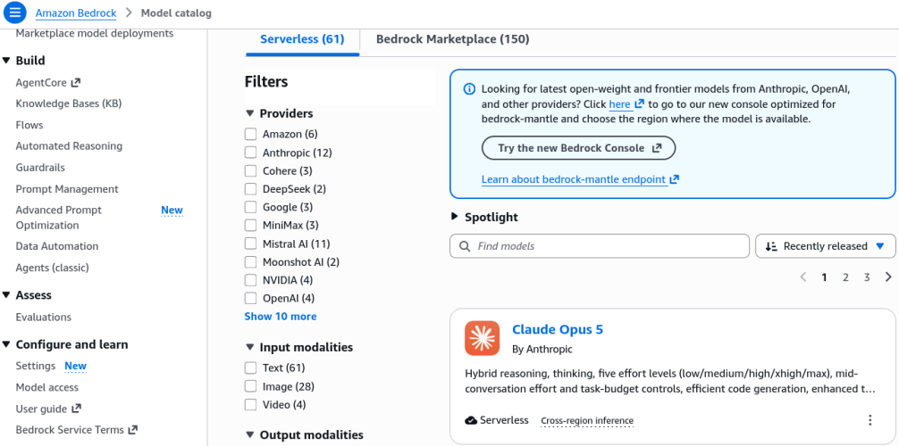
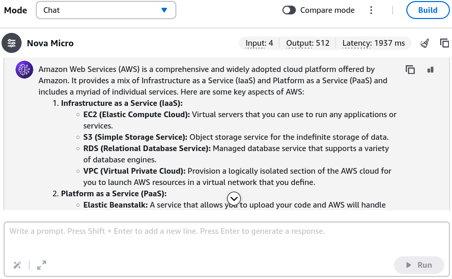
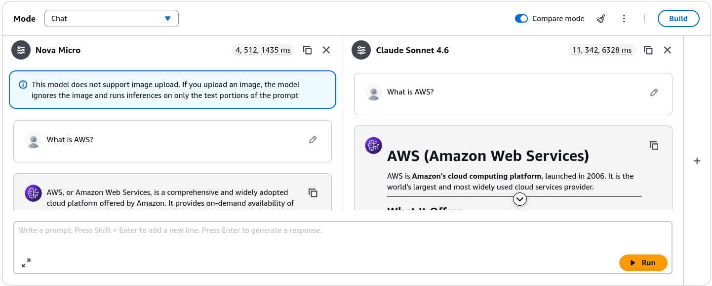

# Amazon Bedrock - Hands On

---

## Key Takeaways

Amazon Bedrock provides a centralized graphical playground to discover, test, and benchmark foundation models without writing a single line of application code.

```
[ Bedrock Console ]
       |
       +---> Model Catalog (Browse & filter by Provider, Modality, or Use Case)
       |
       +---> Chat / Text Playground (Single Prompt vs. Multi-turn Chat, Token Metrics, Latency)
       |
       +---> Image & Video Playground (Prompt-to-Image Generation, Size, Palette, Count)
```

Through the **Model Catalog**, you can filter across providers (Amazon, Anthropic, DeepSeek,Moonshot AI, Qwen). Inside the **Playgrounds**, Bedrock provides real-time telemetry—**Input Tokens**, **Output Tokens**, and **Latency**—which directly drive pricing and model selection strategy for production workloads.

---

## Hands-On Workflow: Model Exploration & Testing

1. **Explore the Model Catalog:**
   Navigate to the **Amazon Bedrock Console** and select **Model Catalog** from the left-hand navigation pane.
   - **Filter by Provider:** Filter models by creator (e.g., _Amazon_, _Anthropic_, _Meta_, _Stability AI_).
   - **Filter by Modality:** Filter by output capability (e.g., _Text_, _Multimodal_, _Image_, _Video_).
   - **Inspect Model Details:** Click on a specific model card (or provider overview) to review input/output modalities, supported features, context window limits, and token pricing dimensions.  
     
2. **Test Text Models in the Chat / Single-Prompt Playground:**
   Under the **Playgrounds** section in the left navigation, select **Chat** (or toggle to **Single Prompt** mode).
   - Click **Select Model** and choose an entry-tier model (e.g., **Amazon Nova Micro** for low-latency, cost-optimized text generation).
   - Enter a baseline prompt: `What is AWS?` and click **Run**.
   - Observe the response output alongside the execution metrics:
     - **Input Tokens:** Number of processed tokens in the prompt.
     - **Output Tokens:** Number of newly generated completion tokens.
     - **Latency:** Total turnaround time (in milliseconds/seconds) to complete generation.  
       
3. **Benchmark Across Model Providers & Capabilities:**
   Toggle the compare mode in the playground to evaluate different performance profiles:
   - Compare the current model to an advanced reasoning or multimodal model (e.g., **Anthropic Claude Sonnet 4.6**).
   - Submit the identical prompt: `What is AWS?` and click **Run**.
   - Compare output depth, formatting style (e.g., structured markdown, headers), token consumption differences, and response latency.
   - **Multimodal Attachments:** Note that models supporting multimodal capabilities allow uploading documents or image attachments directly into the prompt context for analysis.  
     
4. **Generate Visuals in the Image & Video Playground:**
   Navigate to the **Image / Video Playground** on the left-hand menu.
   - Select an image generation foundation model (e.g., **Amazon Nova Canvas** or **Stability AI SDXL**).
   - Adjust generation parameters:
     - **Image Dimensions / Aspect Ratio** (e.g., 1024x1024, 16:9).
     - **Number of Images** to generate per batch.
     - **Color Palette / Style Presets** (optional seed image guidance).
   - Enter a descriptive generation prompt: `Show me a person wearing an AWS backpack` and click **Run**.
   - Evaluate the generated image variations for prompt adherence and visual fidelity.

---

## Exam Guide

### Exam Tips

- **Cost & Performance Benchmarking Metrics:** The exam tests your ability to choose the right model tier for a business requirement. Know what the playground telemetry tells you:
  - **Input Tokens vs. Output Tokens:** AWS Bedrock bills on-demand inference separately for input tokens and output tokens (output tokens typically cost more per thousand/million tokens).
  - **Latency Trade-offs:** Smaller, specialized text models (like _Amazon Nova Micro_) deliver ultra-fast latency at rock-bottom cost, whereas high-parameter reasoning models (like _Claude Sonnet_ or _Nova Pro_) trade higher latency and cost for complex multi-step reasoning.
- **Multimodal Model Support:** When a scenario requires analyzing an image, PDF invoice, or video file alongside a prompt, you must select a **Multimodal** foundation model rather than a pure text-only LLM.
- **Amazon Nova Model Family Lineup:**
  - **Nova Micro:** Text-only, ultra-low latency, lowest cost.
  - **Nova Lite / Nova Pro:** Multimodal (text, image, video understanding) with varying reasoning depth.
  - **Nova Canvas:** Dedicated text-to-image synthesis with editing and watermarking features.
  - **Nova Reel:** Video generation from text/image prompts.

---

### Practice Test

#### Question 1

A retail company wants to build an automated product catalog assistant. The application must process customer photos of clothing items and generate descriptive marketing text. Which model selection strategy in Amazon Bedrock meets this requirement?

- [ ] A. A text-only model like Amazon Nova Micro
- [ ] B. A multimodal foundation model that supports image input and text output
- [ ] C. An image-only generation model like Amazon Nova Canvas configured for text responses
- [ ] D. A rule-based expert system running inside Amazon EC2

<details>
<summary>Correct Answer</summary>

- [x] B. A multimodal foundation model that supports image input and text output
  - **Explanation:** Ingesting an image and returning natural language descriptions requires a **multimodal foundation model** (such as _Amazon Nova Lite/Pro_ or _Anthropic Claude_). Text-only models cannot parse visual pixel inputs, and image generation models synthesize images rather than text completions.

</details>

---

#### Question 2

An AI developer is testing two models in the Amazon Bedrock Chat Playground for a high-volume, cost-sensitive text summarization pipeline. Model A returns responses with 450 output tokens in 400ms at low cost, while Model B returns responses in 2,500ms at 5x the cost per token. Which factor should primary guide the selection for real-time high-throughput chat?

- [ ] A. Selecting Model B because higher token counts always yield better compliance
- [ ] B. Selecting Model A to optimize for low latency and minimal token consumption costs
- [ ] C. Enabling multi-region replication before testing playground tokens
- [ ] D. Switching from the unified API to single-tenant EC2 instances

<details>
<summary>Correct Answer</summary>

- [x] B. Selecting Model A to optimize for low latency and minimal token consumption costs
  - **Explanation:** For high-volume, real-time interactive workloads, selecting a lightweight, cost-optimized model (Model A) that minimizes **latency** and **token consumption** delivers the optimal price-performance ratio.

</details>

---
