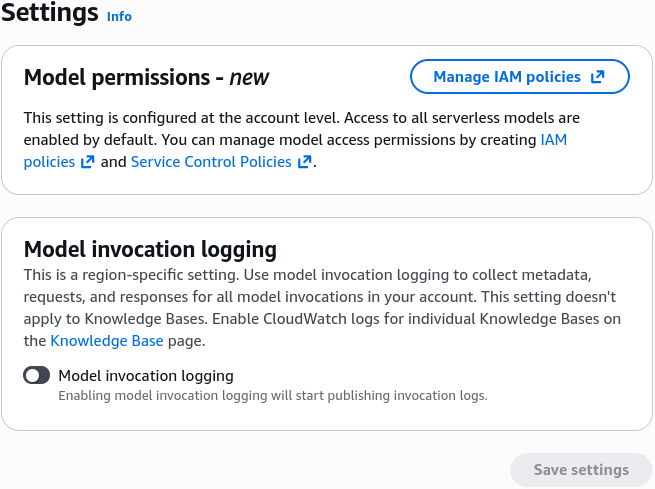
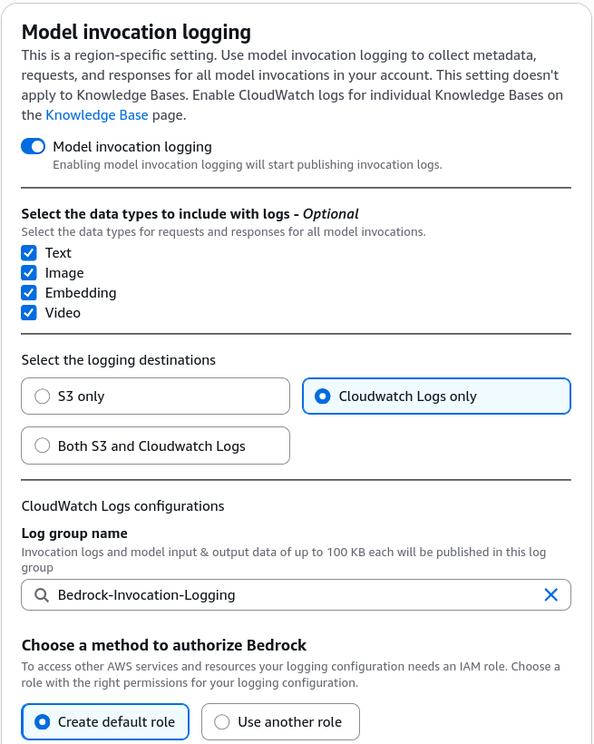
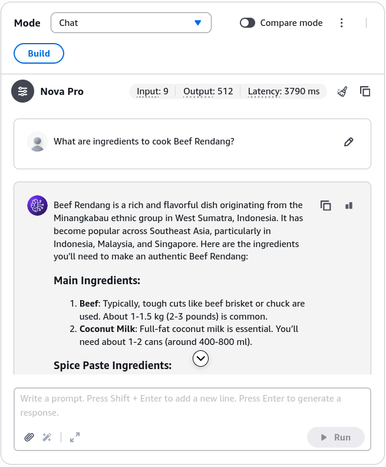
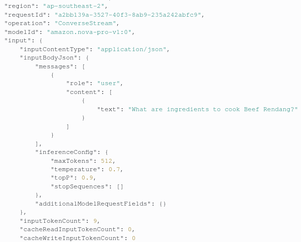
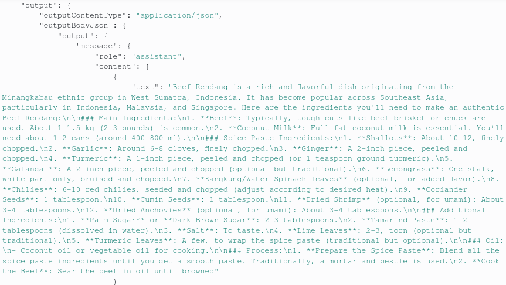
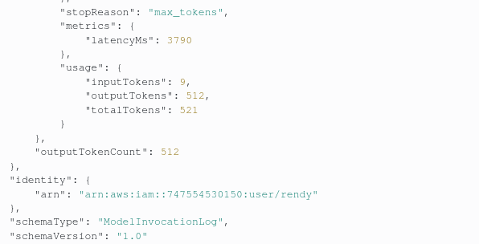
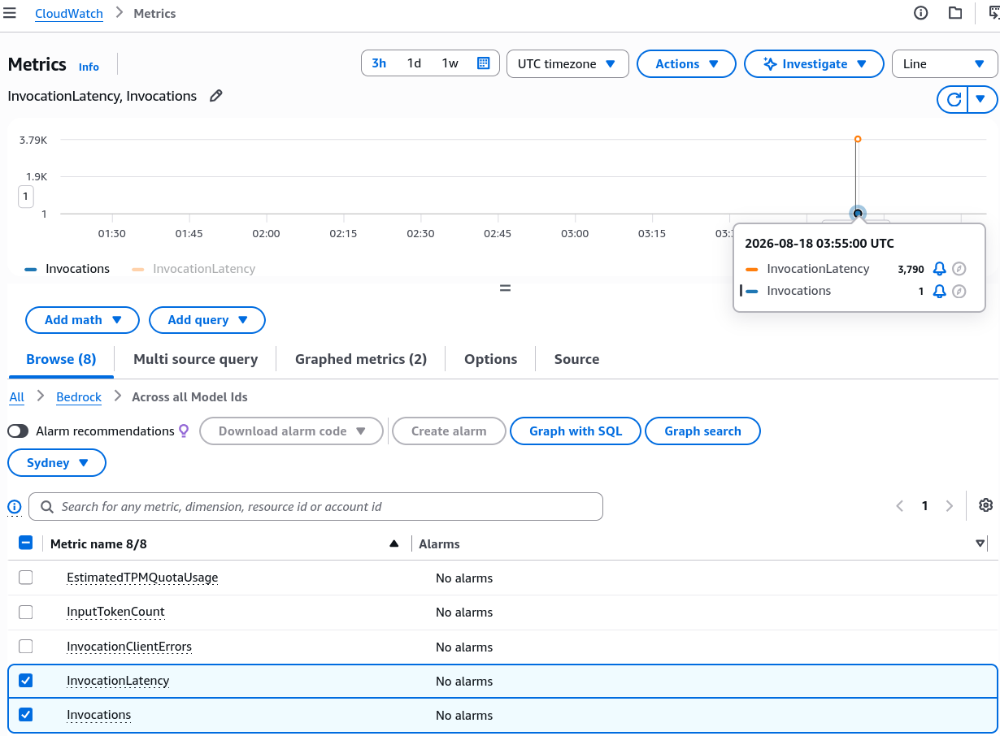

# CloudWatch Integration - Hands On

---

## Key Takeaways

Enabling **Model Invocation Logging** in Amazon Bedrock bridges generative AI execution with enterprise monitoring in **Amazon CloudWatch Logs**.

```
[ Bedrock Console Settings ] ---> ( Create IAM Service Role + CloudWatch Log Group )
                                                |
[ Chat Playground / API Query ] ---> [ Bedrock Model Invocation ]
                                                |
                                                +---> [ CloudWatch Log Stream (Full Payload JSON) ]
                                                |       |-- Model ID, Region, Timestamp
                                                |       |-- User Input Text & Configuration
                                                |       |-- Assistant Output Message & Tokens
                                                |       +-- Invocation Latency (ms)
                                                |
                                                +---> [ CloudWatch Metrics Dashboard ]
                                                        |-- `InvocationLatency`
                                                        +-- `Invocations`
```

Every invocation stream captures rich JSON telemetry: **model IDs**, **user messages**, **assistant completions**, **token counts** (input and output), and exact **latency in milliseconds**. Furthermore, CloudWatch Metrics automatically tracks time-series performance data per model ID, enabling automated alerting when latency exceeds operational thresholds.

---

## Hands-On Workflow: Configuring Invocation Logs & Metric Exploration

1. **Navigate to Amazon Bedrock Settings:**
   - Open the **Amazon Bedrock Console**.
   - In the bottom-left navigation menu, select **Settings**.
   - Locate the **Model invocation logging** section and toggle the switch to **Enable**.  
     
2. **Select Data Modalities & Delivery Target:**
   - Configure the payload data you want to capture:
   - **Data Types:** Check **Text**, **Images**, and **Embeddings**.
   - **Destination:** Choose **CloudWatch Logs only** (or Amazon S3 / Both).
   - **Log Group Name:** Specify a target log group name (e.g., `Bedrock-Invocation-Logging`).
   - **Service Role:** Choose to create a new IAM role (e.g., `BedrockInvocationLoggingRole`) allowing Bedrock to publish log streams into CloudWatch.
   - _(Optional)_ Leave large payload delivery (>100 KB) unchecked for basic testing.  
     
3. **Provision CloudWatch Log Group (Prerequisite Handling):**
   - If Bedrock returns an error stating the log group does not exist:
   - Open a new tab and navigate to **Amazon CloudWatch > Logs > Log Management > Log groups**.
   - Click **Create log group** and paste the exact name: `Bedrock-Invocation-Logging`.
   - Click **Create**.
   - Return to the Amazon Bedrock Settings page, select **Use an existing service role**, choose your newly generated role, and click **Save settings**.
4. **Trigger a Test Invocations in the Playground:**
   - Navigate to **Playgrounds > Chat / Text**.
   - Select a foundation model (e.g., **Amazon Nova Pro**).
   - Enter a prompt and click **Run** to generate a response.  
     
5. **Inspect Log Streams & JSON Payload Telemetry:**
   - Navigate to **Amazon CloudWatch > Logs > Log groups > Bedrock-Invocation-Logging**.
   - Open the newly generated log stream (e.g., `aws/bedrock/modelinvocations/...`).
   - Expand the log event JSON object and inspect the captured telemetry:
   - **`modelId`:** The exact model used (`amazon.nova-pro-v1:0`).
   - **`messages` (User & Assistant):** Full input prompt text and generated assistant response.  
     
   - **`inputTokenCount` & `outputTokenCount`:** Exact tokens processed and returned.  
     
   - **`invocationLatency`:** Total processing turnaround time in milliseconds (e.g., `4038ms`).  
     
6. **Visualize Model Metrics in Amazon CloudWatch:**
   - Navigate to **Amazon CloudWatch > Metrics > Classic metrics**.
   - Select the **Bedrock** namespace.
   - Browse metrics categorized by **ModelId** or across all models.
   - Select metrics such as **`Invocations`** and **`InvocationLatency`** to graph performance curves over time.  
     
   - _(Operational Practice)_ You can configure a **CloudWatch Alarm** on `InvocationLatency` to alert engineering teams via Amazon SNS if latency spikes above SLAs.

---

## Exam Guide

### Exam Tips

- **Model Invocation Logging Destinations:** Bedrock supports two destinations for invocation logs: **Amazon CloudWatch Logs** (interactive real-time inspection/queries) and **Amazon S3** (cost-effective storage, compliance archiving, and large payload dumps >100 KB).
- **Role Prerequisite:** Bedrock requires an **IAM Service Role** with permissions (`logs:CreateLogStream`, `logs:PutLogEvents`) to write data into CloudWatch Log Groups.
- **Payload Components:** Invocation logs capture **both the prompt (user message)** and **the completion (assistant response)**, along with metadata (tokens, latency, model ID).
- **Real-time Performance Monitoring:** To track real-time SLA degradation or API throttling, look at **CloudWatch Metrics** under the `AWS/Bedrock` namespace rather than reading individual log lines manually.

---

### Practise Test

#### Question 1

A DevOps engineer needs to review the exact prompt inputs and completion outputs of an Amazon Titan model invocation to debug an unexpected response. Model invocation logging has already been enabled and sent to Amazon CloudWatch Logs. Where should the engineer look to find the conversation details?

- [ ] A. Under the CloudWatch Alarm state history
- [ ] B. Inside the CloudWatch Log Stream JSON event payload under the user and assistant message keys
- [ ] C. In the AWS CloudTrail management event history under `ListModels`
- [ ] D. Inside the Amazon S3 server access access-log bucket

<details>
<summary>Correct Answer</summary>

- [x] B. Inside the CloudWatch Log Stream JSON event payload under the user and assistant message keys
  - **Explanation:** When model invocation logging is enabled, Amazon Bedrock writes structured JSON events to **CloudWatch Log Streams**. These events contain full request and response payloads, including the user prompt, assistant response, token counts, and execution latency.

</details>

---

#### Question 2

An enterprise security team requires that all generative AI prompts submitted to Amazon Bedrock containing images or payloads larger than 100 KB are archived for 7 years to meet compliance standards. Which invocation logging configuration on Amazon Bedrock satisfies this requirement?

- [ ] A. Configure Model Invocation Logging to deliver large payloads to an Amazon S3 bucket with an S3 Lifecycle archival policy
- [ ] B. Stream CloudWatch Metrics to an AWS Lambda function that writes to Amazon DynamoDB
- [ ] C. Enable AWS CloudTrail data events with an Amazon EBS volume attachment
- [ ] D. Rely on default Bedrock settings, as all prompts are permanently stored by AWS

<details>
<summary>Correct Answer</summary>

- [x] A. Configure Model Invocation Logging to deliver large payloads to an Amazon S3 bucket with an S3 Lifecycle archival policy
  - **Explanation:** In Amazon Bedrock Model Invocation Logging settings, users can designate an **Amazon S3 bucket** as an external destination for larger payloads (>100 KB) and images. Pairing S3 with S3 Lifecycle rules enables long-term compliance storage for up to 7 years cost-effectively.

</details>

---
