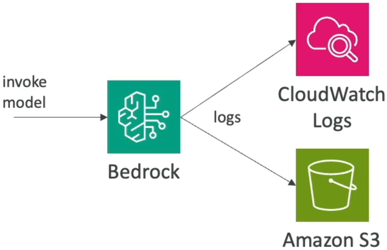
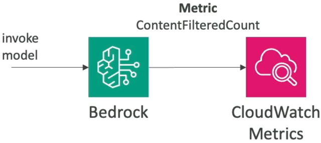
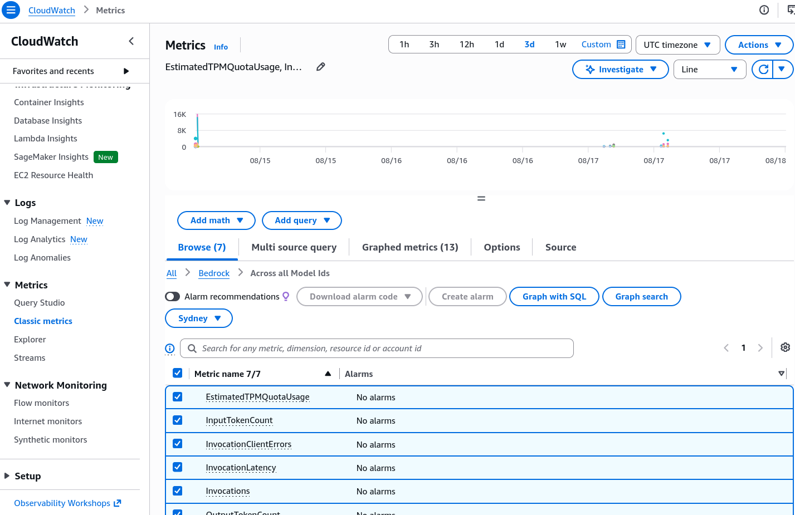

# CloudWatch Integration

---

## Key Takeaways

Amazon CloudWatch provides full-stack observability for Amazon Bedrock through **Model Invocation Logging**, **CloudWatch Metrics**, and **CloudWatch Alarms**. By default, model invocation logging is disabled to protect privacy; enabling it allows you to capture raw inference metadata, input prompts, model completions, images, and embeddings into **CloudWatch Logs** or **Amazon S3**.

```
[ User Prompt / Application ] ---> [ Amazon Bedrock Inference ] ---> [ Model Response ]
                                            |
                         +------------------+------------------+
                         | (Invocation Logging - Disabled by Default)
                         v                                     v
              [ CloudWatch Logs ]                       [ Amazon S3 ]
         (Real-time queries / Insights)          (Long-term compliance & large payloads)
                         |
                         v (Metric Filters & Published Metrics)
             [ CloudWatch Metrics & Alarms ] ---> [ SNS Alert / Automated Action ]
             (e.g., ContentFilteredCount > Threshold)
```

Pairing invocation logs with **CloudWatch Logs Insights** enables real-time querying across prompt histories and token usage, while **CloudWatch Metrics** (such as `ContentFilteredCount`, `InvocationLatency`, and `Invocations`) power automated alerting when guardrails trigger or error thresholds spike.

---

## Main Discussion

### The Dual Pillars of Bedrock Observability

CloudWatch monitors Amazon Bedrock across two foundational data streams:

```
+----------------------------------------------------------------------------------------------------+
|                               BEDROCK OBSERVABILITY DATA STREAMS                                   |
+--------------------------+-----------------------------------+-------------------------------------+
| Telemetry Stream         | Destination / Service             | Operational Utility                 |
+--------------------------+-----------------------------------+-------------------------------------+
| Model Invocation Logging | CloudWatch Logs / Amazon S3       | Full audit trail: raw prompts,      |
| (Disabled by default)    | (Configured in Bedrock Settings)  | completions, images, & embeddings   |
+--------------------------+-----------------------------------+-------------------------------------+
| Bedrock Runtime Metrics  | Amazon CloudWatch Metrics         | Numerical time-series monitoring:   |
| (Enabled by default)     | (Namespace: AWS/Bedrock)          | latency, token count, errors, filters|
+--------------------------+-----------------------------------+-------------------------------------+
```

---

### Model Invocation Logging Architecture

Model invocation logging records the transactional request-response payload for auditability and compliance.

$$\text{Logged Invocation Record} = \text{Metadata} + \text{Input Modality (Text/Image)} + \text{Output Completion} + \text{Embeddings Array}$$



```
+---------------------------------------------------------------------------------------+
| MODEL INVOCATION LOGGING FLOW                                                         |
|                                                                                       |
|  [ Client Application ] ---> Invokes Foundation Model via `InvokeModel` API           |
|                                     |                                                 |
|                                     v                                                 |
|  +---------------------------------------------------------------------------------+  |
|  |                            AMAZON BEDROCK ENGINE                                |  |
|  |  * Evaluates Guardrails                                                         |  |
|  |  * Generates Completion Tokens                                                  |  |
|  |  * Dispatches Async Invocation Record (Zero impact on inference latency)        |  |
|  +---------------------------------------------------------------------------------+  |
|                                     |                                                 |
|                     +---------------+---------------+                                 |
|                     |                               |                                 |
|                     v                               v                                 |
|  [ CloudWatch Logs (/aws/bedrock/...) ]      [ Amazon S3 Bucket (s3://...) ]          |
|  * 7 to 30 day operational retention         * Long-term compliance archive           |
|  * Interactive CloudWatch Logs Insights      * Large multimodal/image storage payloads|
+---------------------------------------------------------------------------------------+
```

- **Storage Targets:** You can send logs to **CloudWatch Logs** (for fast interactive querying), **Amazon S3** (for cost-effective, long-term regulatory retention), or both simultaneously.
- **Modality Selection:** Administrators can selectively toggle whether to capture text, image files, or vector embeddings within the logged payload.
- **Security & Privacy:** Because invocation logs capture raw user queries, access to destination S3 buckets and CloudWatch Log Groups must be restricted using least-privilege IAM policies and encrypted at rest with **AWS KMS**.

---

### Real-Time Querying with CloudWatch Logs Insights

Once invocation logs flow into CloudWatch Logs, you can run structured, SQL-like queries using **CloudWatch Logs Insights** to investigate prompt trends, token consumption, and model latency distributions.

```
+-------------------------------------------------------------------------------+
| LOGS INSIGHTS QUERY EXAMPLE: ANALYZING INPUT & OUTPUT TOKEN VOLUMES           |
+-------------------------------------------------------------------------------+
| fields @timestamp, modelId, input.inputTokenCount, output.outputTokenCount    |
| | filter ispresent(input.inputTokenCount)                                     |
| | stats sum(input.inputTokenCount) as TotalIn,                                |
|         sum(output.outputTokenCount) as TotalOut,                             |
|         avg(output.outputTokenCount) as AvgOutTokens by modelId               |
| | sort TotalOut desc                                                          |
+-------------------------------------------------------------------------------+
```

---

### CloudWatch Metrics & Automated Alarm Architecture

Amazon Bedrock automatically emits aggregate time-series metrics under the `AWS/Bedrock` namespace without requiring manual logging configuration:





```
+-----------------------------------------------------------------------------------+
| CORE AMAZON BEDROCK RUNTIME METRICS                                               |
+--------------------------+-------------+------------------------------------------+
| Metric Name              | Unit        | Description & Operational Focus          |
+--------------------------+-------------+------------------------------------------+
| `Invocations`            | Count       | Total successful model inference calls   |
| `InvocationLatency`      | Milliseconds| Turnaround duration to generate response |
| `InputTokenCount`        | Count       | Volume of prompt tokens ingested         |
| `OutputTokenCount`       | Count       | Volume of completion tokens returned     |
| `ContentFilteredCount`   | Count       | Invocations blocked by Bedrock Guardrails|
| `InvocationClientErrors` | Count       | 4xx caller errors (bad syntax, auth)     |
| `InvocationServerErrors` | Count       | 5xx AWS service-side infrastructure error|
| `InvocationThrottles`    | Count       | Invocations rejected due to quota limits |
+--------------------------+-------------+------------------------------------------+
```

$$\text{Alarm Condition: } \text{Metric}(\text{ContentFilteredCount}) \ge \text{Threshold} \xrightarrow{\text{CloudWatch Alarm}} \text{SNS Topic} \longrightarrow \text{Security Operations Email/Pager}$$

```
+---------------------------------------------------------------------------------+
| AUTOMATED GUARDRAIL MONITORING & ALERTING                                       |
|                                                                                 |
|  [ User Invocations ] ---> [ Amazon Bedrock + Guardrails ]                      |
|                                     |                                           |
|                                     v (Emits `ContentFilteredCount`)            |
|                           [ CloudWatch Metrics ]                                |
|                                     |                                           |
|                                     v (Evaluates Metric Threshold)              |
|                           [ CloudWatch Alarm ]                                  |
|                                     | (State: ALARM)                            |
|                                     v                                           |
|                           [ Amazon SNS Topic ] ---> Security Admin Alert / Pager|
+---------------------------------------------------------------------------------+
```

---

## Exam Guide

### Exam Tips

- **Default Logging State:** Remember for the exam that **Model Invocation Logging is DISABLED by default** in Amazon Bedrock. You must explicitly navigate to Bedrock Settings, select data types (text, images, embeddings), and assign an IAM role pointing to a CloudWatch Log Group or S3 bucket to enable it.
- **Auditability vs. Performance:** Enabling invocation logging happens asynchronously; it does **not** add latency to the client API response.
- **Tracking Guardrail Interventions:** When an exam question asks how to monitor and get notified whenever user queries trigger a safety filter or denied topic in Bedrock Guardrails, the solution is creating a **CloudWatch Alarm** on the **`ContentFilteredCount`** metric.
- **Log Analytics Tooling:** The primary AWS native tool for running interactive queries and statistical breakdowns over Bedrock invocation logs is **CloudWatch Logs Insights**.

---

### Practice Test

#### Question 1

A financial services company using Amazon Bedrock wants to maintain a complete compliance audit trail of all prompts submitted by employees and the corresponding responses generated by foundation models. The solution must capture text prompts, images, and token counts. What must the security engineer do to fulfill this requirement?

- [ ] A. Enable VPC Flow Logs on the Amazon Bedrock managed subnets
- [ ] B. Enable Model Invocation Logging in Amazon Bedrock settings and configure the destination to Amazon S3 and CloudWatch Logs
- [ ] C. Create an AWS CloudTrail trail to log foundation model weight updates
- [ ] D. Deploy an Amazon EC2 proxy instance to intercept Bedrock API payloads

<details>
<summary>Correct Answer</summary>

- [x] B. Enable Model Invocation Logging in Amazon Bedrock settings and configure the destination to Amazon S3 and CloudWatch Logs
  - **Explanation:** **Model Invocation Logging** in Amazon Bedrock captures the full request and response payloads—including text, images, and embeddings—and routes them to **CloudWatch Logs** for operational search or **Amazon S3** for long-term audit storage. It is disabled by default and must be explicitly enabled.

</details>

---

#### Question 2

An AI security administrator has configured Amazon Bedrock Guardrails to block toxic user queries and mask PII. The administrator wants to receive an immediate email notification whenever the number of blocked requests exceeds 20 events within a 5-minute window. Which architecture provides this capability?

- [ ] A. Write an AWS Glue ETL job to parse S3 billing files every 24 hours
- [ ] B. Create an Amazon CloudWatch Alarm tracking the `ContentFilteredCount` metric under the `AWS/Bedrock` namespace connected to an Amazon SNS topic
- [ ] C. Query AWS CloudTrail events using Amazon Athena and generate weekly PDF reports
- [ ] D. Configure a Denied Topic in Bedrock Guardrails with an automatic email forwarder

<details>
<summary>Correct Answer</summary>

- [x] B. Create an Amazon CloudWatch Alarm tracking the `ContentFilteredCount` metric under the `AWS/Bedrock` namespace connected to an Amazon SNS topic
  - **Explanation:** When Bedrock Guardrails intercepts and filters content, it increments the **`ContentFilteredCount`** metric in CloudWatch. Setting a **CloudWatch Alarm** on this metric connected to an **Amazon SNS topic** triggers real-time email notifications when the threshold is breached.

</details>

---
