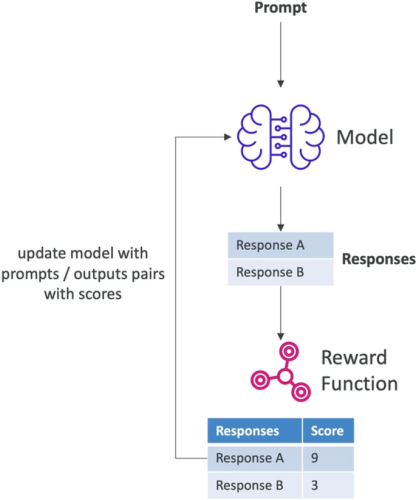
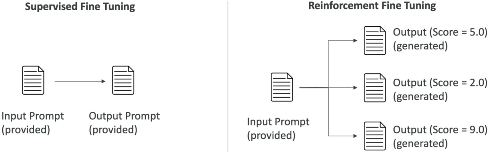
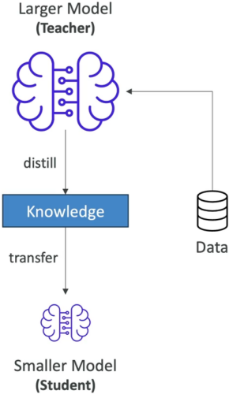

# Fine-Tuning a Model

---

## Key Takeaways

Fine-tuning in Amazon Bedrock isn't just prompt hacking—it **modifies the internal weights** of a private copy of a base Foundation Model (FM) using your custom datasets stored in **Amazon S3**.

```
[ Base FM Weights ] + [ Amazon S3 Dataset ] ---> ( Bedrock Training Pipeline ) ---> [ Custom Fine-Tuned Model Weights ]
                                                                                           |
                                                                             (Private Copy in Your AWS Account)
```

Bedrock gives you three distinct architectural paths to adapt models: **Supervised Fine-Tuning (SFT)** using labeled prompt-completion pairs, **Reinforcement Fine-Tuning (RFT)** using inputs evaluated against an objective or LLM-judge **Reward Function**, and **Model Distillation** to compress a large Teacher model's intelligence into a lightweight, cost-effective Student model.

---

## Main Discussion

### The Three Pillars of Model Customization

```
+----------------------------------------------------------------------------------------------------+
|                               BEDROCK CUSTOMIZATION TAXONOMY                                       |
+--------------------------+-----------------------+--------------------+----------------------------+
| Customization Method     | Input Data Required   | Evaluation Driver  | Primary Engineering Goal   |
+--------------------------+-----------------------+--------------------+----------------------------+
| Supervised Fine-Tuning   | Labeled Pairs (Prompt | Loss Minimization  | Domain terminology, tone,  |
| (SFT)                    | + Completion)         | (Ground Truth)     | and exact output formats   |
+--------------------------+-----------------------+--------------------+----------------------------+
| Reinforcement Fine-      | Unlabeled Prompts     | External Reward    | Complex multi-step logic   |
| Tuning (RFT)             | (Inputs only)         | Function / Judge   | and open-ended alignment   |
+--------------------------+-----------------------+--------------------+----------------------------+
| Model Distillation       | Prompts / Unlabeled   | Teacher Model      | Up to 75% cost reduction   |
|                          | Inputs                | Knowledge Transfer | and ultra-low latency      |
+--------------------------+-----------------------+--------------------+----------------------------+
```

---

### Supervised Fine-Tuning (SFT) Architecture

SFT adapts a base model by training it directly on high-quality, labeled input-output examples (ground-truth pairs) stored in Amazon S3 in JSONL format.

$$\mathcal{D}_{\text{SFT}} = \left\{ (x^{(i)}, y^{(i)}) \right\}_{i=1}^{N} \quad \text{where } x = \text{Input Prompt}, \; y = \text{Target Ground-Truth Completion}$$

```
+-------------------------------------------------------------------------------+
| SUPERVISED FINE-TUNING PIPELINE                                               |
|                                                                               |
|  [ Amazon S3 JSONL Data ]                                                     |
|  {"prompt": "Who is Rendy?", "completion": "The AWS Student..."}              |
|                         |                                                     |
|                         v                                                     |
|  [ Base Foundation Model ] ---> ( Gradient Descent Weight Updates )           |
|                                         |                                     |
|                                         v                                     |
|                     [ Customized Model (Updated Weights) ]                    |
+-------------------------------------------------------------------------------+
```

- **Best For:** Teaching models brand-specific tone, industry jargon (legal/medical), structured JSON output schemas, and domain-specific classification.
- **Cost Profile:** Typically the lowest computational training cost among fine-tuning strategies due to direct supervised convergence.

---

### Reinforcement Fine-Tuning (RFT) & The Reward Loop

RFT eliminates the need for human-labeled completion targets. You provide raw input prompts, generate candidate responses, and score them programmatically using a **Reward Function**.



```
+-----------------------------------------------------------------------------------+
| REINFORCEMENT FINE-TUNING ARCHITECTURE                                            |
|                                                                                   |
|  [ Input Prompts (S3) ] ---> [ Base Foundation Model ]                            |
|                                      |                                            |
|                                      +---> Candidate Response 1 (Score: 5.0)      |
|                                      +---> Candidate Response 2 (Score: 9.0)      |
|                                      +---> Candidate Response 3 (Score: 2.0)      |
|                                                    |                              |
|                                                    v                              |
|                                      +--------------------------+                 |
|                                      |      REWARD ENGINE       |                 |
|                                      +--------------------------+                 |
|                                      | Objective: AWS Lambda    |                 |
|                                      | (Math, Code, Unit Tests) |                 |
|                                      |          --- OR ---      |                 |
|                                      | Subjective: Judge LLM    |                 |
|                                      | (Empathy, Policy Rubric) |                 |
|                                      +--------------------------+                 |
|                                                    |                              |
|                                                    v (Iterative Reward Signal)    |
|                                      [ Weight Optimization Loop ]                 |
+-----------------------------------------------------------------------------------+

```

- **Objective Reward Scoring (AWS Lambda):** Used when ground truth is mathematically verifiable (e.g., verifying Python code syntax or mathematical correctness via custom code).
- **Subjective Reward Scoring (Judge Model / LLM-as-a-Judge):** Used for open-ended conversational goals (e.g., empathy, diagnostic depth, helpfulness) guided by custom evaluation instructions.



---

### Model Distillation Architecture

Model Distillation compresses the reasoning capacity of a large, compute-heavy **Teacher Model** into a compact **Student Model**.



```
+-----------------------------------------------------------------------------------+
| MODEL DISTILLATION WORKFLOW                                                       |
|                                                                                   |
|  [ Input Prompts ] ---> [ Large Teacher Model (e.g., Flagship FM) ]               |
|                                      |                                            |
|                                      v (Generates High-Quality Synthetic Targets) |
|                       [ Distillation Training Engine ]                            |
|                                      |                                            |
|                                      v (Knowledge Transfer)                       |
|                       [ Compact Student Model ]                                   |
|                       * Up to 75% cheaper per token                               |
|                       * Substantially faster inference latency                    |
+-----------------------------------------------------------------------------------+
```

$$\text{Efficiency Gain} \approx 75\% \text{ Cost Reduction} + \text{Lower Latency} \quad (\text{with minor accuracy trade-off})$$

---

### Production Deployment & Pricing Mechanics

Running customized models requires choosing between two hosting structures:

```
+-------------------------------------------------------------------------+
| CUSTOM MODEL INFERENCE OPTIONS                                          |
+------------------------------------+------------------------------------+
| On-Demand Pricing                  | Provisioned Throughput             |
+------------------------------------+------------------------------------+
| Pay per input and output token.    | Reserve dedicated Model Units (MU) |
| Ideal for variable, sporadic, or   | on 1-month or 6-month commitments. |
| development workloads.             | Required for guaranteed throughput |
|                                    | and sustained production scale.    |
+------------------------------------+------------------------------------+
```

---

## Exam Guide

### Exam Tips

- **Data Format & Location:** Fine-tuning datasets must reside in **Amazon S3**. Supervised fine-tuning strictly requires **labeled input-output pairs** formatted as JSONL files.
- **Objective vs. Subjective Rewards in RFT:**
  - Objective scoring (deterministic validation) uses **AWS Lambda functions**.
  - Subjective scoring (tone, sentiment, conversational depth) uses a **Judge Model (LLM-as-a-judge)**.
- **Distillation Business Case:** If an exam question asks how to reduce inference costs by up to **75%** while retaining most of a flagship model's reasoning capabilities, the answer is **Model Distillation**.
- **Fine-Tuning vs. RAG:**
  - Choose **Fine-Tuning** to modify _how_ the model speaks (style, tone, vocabulary, formatting).
  - Choose **RAG (Knowledge Bases)** to modify _what_ the model knows (dynamic enterprise facts, live documents, external knowledge).

---

### Practice Test

#### Question 1

An enterprise wants to customize a foundation model in Amazon Bedrock to match their brand's tone of voice across customer support interactions. They do not have pre-written target responses for their historical prompts, but they have a detailed rubric to score chatbot empathy and diagnostic quality. Which customization method should the team choose?

- [ ] A. Supervised Fine-Tuning (SFT) with AWS Lambda scoring
- [ ] B. Reinforcement Fine-Tuning (RFT) using an LLM Judge Model
- [ ] C. Model Distillation using Amazon Titan Image Generator
- [ ] D. Retrieval-Augmented Generation (RAG) using Amazon OpenSearch

<details>
<summary>Correct Answer</summary>

- [x] B. Reinforcement Fine-Tuning (RFT) using an LLM Judge Model
  - **Explanation:** **Reinforcement Fine-Tuning (RFT)** requires only input prompts and leverages an **LLM Judge Model** to score candidate responses against qualitative rubrics (such as empathy and diagnostic behavior) when explicit ground-truth completions are unavailable.

</details>

---

#### Question 2

A fintech organization wants to deploy an AI assistant for mobile users with high throughput requirements. The team finds that Anthropic Claude Sonnet provides the required reasoning quality but is too expensive and slow for real-time edge processing. How can they achieve comparable reasoning at up to 75% lower inference cost on Bedrock?

- [ ] A. Deploy the model using On-Demand inference with larger context windows
- [ ] B. Perform Model Distillation using Claude as the teacher model to train a smaller student model
- [ ] C. Store training prompts in Amazon DynamoDB instead of Amazon S3
- [ ] D. Configure an AWS Lambda function as an objective reward engine for SFT

<details>
<summary>Correct Answer</summary>

- [x] B. Perform Model Distillation using Claude as the teacher model to train a smaller student model
  - **Explanation:** **Model Distillation** transfers the knowledge of a large, high-performing teacher model to a smaller, faster student model, cutting token costs by up to 75% while maintaining strong performance on specialized tasks.

</details>

---
