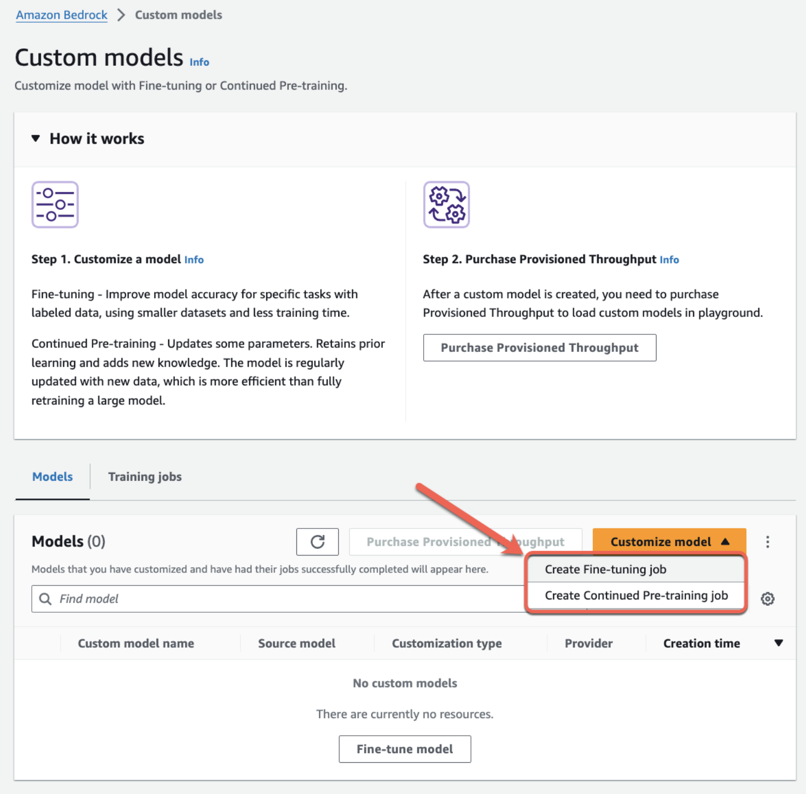
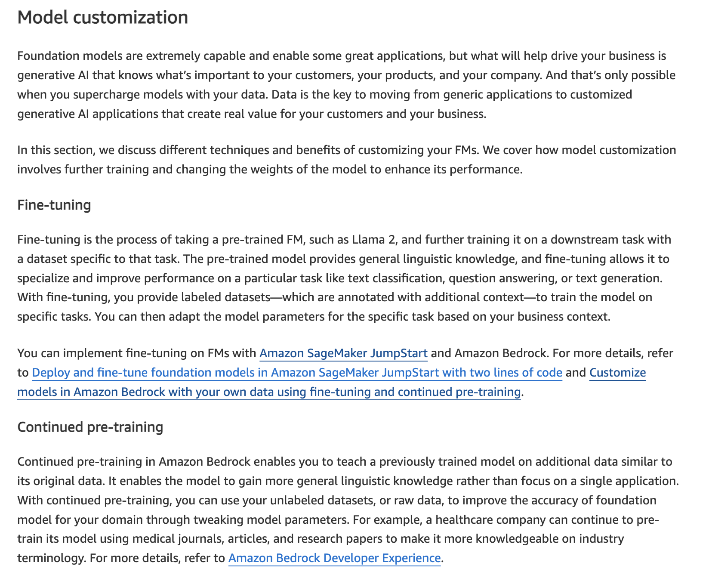
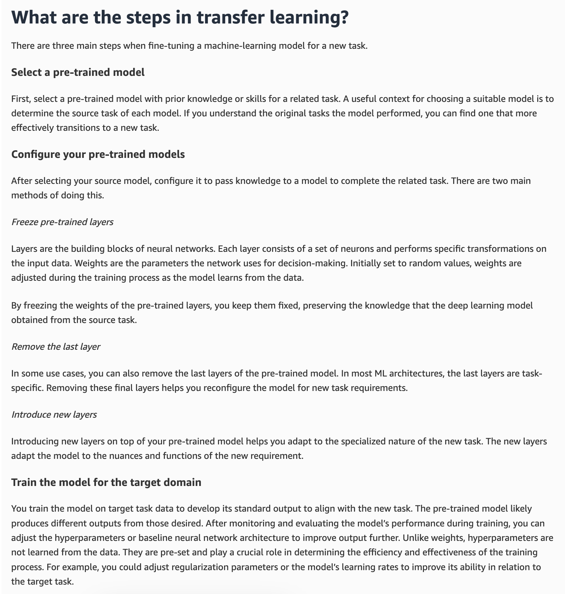

# Fine-Tuning a Model

---

## Key Takeaways

Fine-tuning in Amazon Bedrock isn't just prompt hacking—it **modifies the internal weights** of a private copy of a base Foundation Model (FM) using your custom datasets stored in **Amazon S3**.

```
[ Base FM Weights ] + [ Amazon S3 Dataset ] ---> ( Bedrock Training Pipeline ) ---> [ Custom Fine-Tuned Model Weights ]
                                                                                           |
                                                                             (Private Copy in Your AWS Account)
```

Bedrock gives you three distinct architectural paths to adapt models: **Supervised Fine-Tuning (SFT)** using labeled prompt-completion pairs, **Reinforcement Fine-Tuning (RFT)** using inputs evaluated against an objective or LLM-judge **Reward Function**, and **Model Distillation** to compress a large Teacher model's intelligence into a lightweight, cost-effective Student model.

---

## Main Discussion

### The Three Pillars of Model Customization

```
+----------------------------------------------------------------------------------------------------+
|                               BEDROCK CUSTOMIZATION TAXONOMY                                       |
+--------------------------+-----------------------+--------------------+----------------------------+
| Customization Method     | Input Data Required   | Evaluation Driver  | Primary Engineering Goal   |
+--------------------------+-----------------------+--------------------+----------------------------+
| Supervised Fine-Tuning   | Labeled Pairs (Prompt | Loss Minimization  | Domain terminology, tone,  |
| (SFT)                    | + Completion)         | (Ground Truth)     | and exact output formats   |
+--------------------------+-----------------------+--------------------+----------------------------+
| Reinforcement Fine-      | Unlabeled Prompts     | External Reward    | Complex multi-step logic   |
| Tuning (RFT)             | (Inputs only)         | Function / Judge   | and open-ended alignment   |
+--------------------------+-----------------------+--------------------+----------------------------+
| Model Distillation       | Prompts / Unlabeled   | Teacher Model      | Up to 75% cost reduction   |
|                          | Inputs                | Knowledge Transfer | and ultra-low latency      |
+--------------------------+-----------------------+--------------------+----------------------------+
```

---

### Supervised Fine-Tuning (SFT) Architecture

SFT adapts a base model by training it directly on high-quality, labeled input-output examples (ground-truth pairs) stored in Amazon S3 in JSONL format.

$$\mathcal{D}_{\text{SFT}} = \left\{ (x^{(i)}, y^{(i)}) \right\}_{i=1}^{N} \quad \text{where } x = \text{Input Prompt}, \; y = \text{Target Ground-Truth Completion}$$

```
+-------------------------------------------------------------------------------+
| SUPERVISED FINE-TUNING PIPELINE                                               |
|                                                                               |
|  [ Amazon S3 JSONL Data ]                                                     |
|  {"prompt": "Who is Rendy?", "completion": "The AWS Student..."}              |
|                         |                                                     |
|                         v                                                     |
|  [ Base Foundation Model ] ---> ( Gradient Descent Weight Updates )           |
|                                         |                                     |
|                                         v                                     |
|                     [ Customized Model (Updated Weights) ]                    |
+-------------------------------------------------------------------------------+
```

- **Best For:** Teaching models brand-specific tone, industry jargon (legal/medical), structured JSON output schemas, and domain-specific classification.
- **Cost Profile:** Typically the lowest computational training cost among fine-tuning strategies due to direct supervised convergence.

---

### Reinforcement Fine-Tuning (RFT) & The Reward Loop

RFT eliminates the need for human-labeled completion targets. You provide raw input prompts, generate candidate responses, and score them programmatically using a **Reward Function**.


```
+-----------------------------------------------------------------------------------+
| REINFORCEMENT FINE-TUNING ARCHITECTURE                                            |
|                                                                                   |
|  [ Input Prompts (S3) ] ---> [ Base Foundation Model ]                            |
|                                      |                                            |
|                                      +---> Candidate Response 1 (Score: 5.0)      |
|                                      +---> Candidate Response 2 (Score: 9.0)      |
|                                      +---> Candidate Response 3 (Score: 2.0)      |
|                                                    |                              |
|                                                    v                              |
|                                      +--------------------------+                 |
|                                      |      REWARD ENGINE       |                 |
|                                      +--------------------------+                 |
|                                      | Objective: AWS Lambda    |                 |
|                                      | (Math, Code, Unit Tests) |                 |
|                                      |          --- OR ---      |                 |
|                                      | Subjective: Judge LLM    |                 |
|                                      | (Empathy, Policy Rubric) |                 |
|                                      +--------------------------+                 |
|                                                    |                              |
|                                                    v (Iterative Reward Signal)    |
|                                      [ Weight Optimization Loop ]                 |
+-----------------------------------------------------------------------------------+

```

- **Objective Reward Scoring (AWS Lambda):** Used when ground truth is mathematically verifiable (e.g., verifying Python code syntax or mathematical correctness via custom code).
- **Subjective Reward Scoring (Judge Model / LLM-as-a-Judge):** Used for open-ended conversational goals (e.g., empathy, diagnostic depth, helpfulness) guided by custom evaluation instructions.


---

### Model Distillation Architecture

Model Distillation compresses the reasoning capacity of a large, compute-heavy **Teacher Model** into a compact **Student Model**.


```
+-----------------------------------------------------------------------------------+
| MODEL DISTILLATION WORKFLOW                                                       |
|                                                                                   |
|  [ Input Prompts ] ---> [ Large Teacher Model (e.g., Flagship FM) ]               |
|                                      |                                            |
|                                      v (Generates High-Quality Synthetic Targets) |
|                       [ Distillation Training Engine ]                            |
|                                      |                                            |
|                                      v (Knowledge Transfer)                       |
|                       [ Compact Student Model ]                                   |
|                       * Up to 75% cheaper per token                               |
|                       * Substantially faster inference latency                    |
+-----------------------------------------------------------------------------------+
```

$$\text{Efficiency Gain} \approx 75\% \text{ Cost Reduction} + \text{Lower Latency} \quad (\text{with minor accuracy trade-off})$$

---

### Production Deployment & Pricing Mechanics

Running customized models requires choosing between two hosting structures:

```
+-------------------------------------------------------------------------+
| CUSTOM MODEL INFERENCE OPTIONS                                          |
+------------------------------------+------------------------------------+
| On-Demand Pricing                  | Provisioned Throughput             |
+------------------------------------+------------------------------------+
| Pay per input and output token.    | Reserve dedicated Model Units (MU) |
| Ideal for variable, sporadic, or   | on 1-month or 6-month commitments. |
| development workloads.             | Required for guaranteed throughput |
|                                    | and sustained production scale.    |
+------------------------------------+------------------------------------+
```

---

## Exam Guide

### Exam Tips

- **Data Format & Location:** Fine-tuning datasets must reside in **Amazon S3**. Supervised fine-tuning strictly requires **labeled input-output pairs** formatted as JSONL files.
- **Objective vs. Subjective Rewards in RFT:**
  - Objective scoring (deterministic validation) uses **AWS Lambda functions**.
  - Subjective scoring (tone, sentiment, conversational depth) uses a **Judge Model (LLM-as-a-judge)**.
- **Distillation Business Case:** If an exam question asks how to reduce inference costs by up to **75%** while retaining most of a flagship model's reasoning capabilities, the answer is **Model Distillation**.
- **Fine-Tuning vs. RAG:**
  - Choose **Fine-Tuning** to modify _how_ the model speaks (style, tone, vocabulary, formatting).
  - Choose **RAG (Knowledge Bases)** to modify _what_ the model knows (dynamic enterprise facts, live documents, external knowledge).

---

### Practice Test

#### Question 1

An enterprise wants to customize a foundation model in Amazon Bedrock to match their brand's tone of voice across customer support interactions. They do not have pre-written target responses for their historical prompts, but they have a detailed rubric to score chatbot empathy and diagnostic quality. Which customization method should the team choose?

- [ ] A. Supervised Fine-Tuning (SFT) with AWS Lambda scoring
- [ ] B. Reinforcement Fine-Tuning (RFT) using an LLM Judge Model
- [ ] C. Model Distillation using Amazon Titan Image Generator
- [ ] D. Retrieval-Augmented Generation (RAG) using Amazon OpenSearch

<details>
<summary>Correct Answer</summary>

- [x] B. Reinforcement Fine-Tuning (RFT) using an LLM Judge Model
  - **Explanation:** **Reinforcement Fine-Tuning (RFT)** requires only input prompts and leverages an **LLM Judge Model** to score candidate responses against qualitative rubrics (such as empathy and diagnostic behavior) when explicit ground-truth completions are unavailable.

</details>

---

#### Question 2

A fintech organization wants to deploy an AI assistant for mobile users with high throughput requirements. The team finds that Anthropic Claude Sonnet provides the required reasoning quality but is too expensive and slow for real-time edge processing. How can they achieve comparable reasoning at up to 75% lower inference cost on Bedrock?

- [ ] A. Deploy the model using On-Demand inference with larger context windows
- [ ] B. Perform Model Distillation using Claude as the teacher model to train a smaller student model
- [ ] C. Store training prompts in Amazon DynamoDB instead of Amazon S3
- [ ] D. Configure an AWS Lambda function as an objective reward engine for SFT

<details>
<summary>Correct Answer</summary>

- [x] B. Perform Model Distillation using Claude as the teacher model to train a smaller student model
  - **Explanation:** **Model Distillation** transfers the knowledge of a large, high-performing teacher model to a smaller, faster student model, cutting token costs by up to 75% while maintaining strong performance on specialized tasks.

</details>

---

#### Question 3

A financial services company is exploring the use of generative AI to automate report generation and enhance customer insights. As part of this effort, the team is evaluating different AI models and technologies, including Foundation Models (FMs), to understand their capabilities and how they can be applied to improve efficiency. The team needs to clarify key characteristics and features of Foundation Models to determine if they align with the company's objectives.

Which of the following statements is correct regarding Foundation Models (FMs) in the context of generative AI?

- [ ] A. FMs use self-supervised learning to create labels from input data, however, fine-tuning an FM is a supervised learning process
- [ ] B. FMs use supervised learning to create labels from input data, however, fine-tuning an FM is a self-supervised learning process
- [ ] C. FMs use self-supervised learning to create labels from input data and fine-tuning an FM is a self-supervised learning process as well
- [ ] D. FMs use supervised learning to create labels from input data and fine-tuning an FM is a supervised learning process as well

<details>
<summary>Correct Answer</summary>

- [x] A. FMs use self-supervised learning to create labels from input data, however, fine-tuning an FM is a supervised learning process
  - **Explanation:** In supervised learning, you train the model with a set of input data and a corresponding set of paired labeled output data. Unsupervised machine learning is when you give the algorithm input data without any labeled output data. Then, on its own, the algorithm identifies patterns and relationships in and between the data. Self-supervised learning is a machine learning approach that applies unsupervised learning methods to tasks usually requiring supervised learning. Instead of using labeled datasets for guidance, self-supervised models create implicit labels from unstructured data.

    Foundation models use self-supervised learning to create labels from input data. This means no one has instructed or trained the model with labeled training data sets.

    Fine-tuning a pre-trained foundation model is an affordable way to take advantage of their broad capabilities while customizing a model on your own small, corpus. Fine-tuning involves further training a pre-trained language model on a specific task or domain-specific dataset, allowing it to address business requirements. Fine-tuning is a customization method that does change the weights of your model.

    Fine-tuning an FM is a supervised learning process.

References:

- https://aws.amazon.com/what-is/foundation-models/
- https://docs.aws.amazon.com/sagemaker/latest/dg/jumpstart-foundation-models-fine-tuning.html
- https://aws.amazon.com/compare/the-difference-between-machine-learning-supervised-and-unsupervised/

</details>

---

#### Question 4

A healthcare analytics company aims to enhance its AI capabilities by fine-tuning a foundation model (FM) in Amazon Bedrock to specialize in medical text analysis. To achieve this, the company plans to use its own task-specific labeled dataset, consisting of annotated clinical notes and medical records, to fine-tune the model for greater accuracy in extracting relevant information.

Given these requirements, which approach would be most suitable?

- [ ] A. The company should use On-Demand mode, which provides flexibility by charging only for the resources consumed
- [ ] B. The company should leverage batch inference to facilitate fine-tuning of the model
- [ ] C. The company should leverage Amazon Bedrock playground to facilitate fine-tuning of the model
- [ ] D. The company should use Provisioned Throughput mode, which allows the company to reserve a specific amount of capacity in advance

<details>
<summary>Correct Answer</summary>

- [x] D. The company should use Provisioned Throughput mode, which allows the company to reserve a specific amount of capacity in advance
  - **Explanation:** With fine-tuning, you can increase model accuracy by providing your own task-specific labeled training dataset and further specialize your FMs. With continued pre-training, you can train models using your own unlabeled data in a secure and managed environment with customer managed keys. Continued pre-training helps models become more domain-specific by accumulating more robust knowledge and adaptability—beyond their original training.

    Once the fine-tuning job is complete, you receive a unique model ID for your custom model. Your fine-tuned model is stored securely by Amazon Bedrock. To test and deploy your model, you need to purchase Provisioned Throughput. This mode is designed for situations where there is a predictable, continuous workload, such as the intensive compute required during the fine-tuning phase.  
     
    :::warning
    **Exam Alert:** For testing and deploy customized models for Amazon Bedrock (via fine-tuning or continued pre-training), it is mandatory to use Provisioned Throughput.
    :::

<details>
<summary>Incorrect Answers</summary>
- [ ] A. The company should use On-Demand mode, which provides flexibility by charging only for the resources consumed
  - **Explanation:** While On-Demand mode offers flexibility and scalability by charging based on actual usage, it does not support model customization for Amazon Bedrock via fine-tuning or continued pre-training.
- [ ] B. The company should leverage batch inference to facilitate fine-tuning of the model
  - **Explanation:**  With batch inference, you can run multiple inference requests asynchronously to process a large number of requests efficiently by running inference on data that is stored in an S3 bucket. You can use batch inference to improve the performance of model inference on large datasets. You cannot use batch inference to facilitate fine-tuning of the model. This option acts as a distractor.
- [ ] C. The company should leverage Amazon Bedrock playground to facilitate fine-tuning of the model
  - **Explanation:** The Amazon Bedrock playgrounds provide you a console environment to experiment with running inference on different models and with different configurations, before deciding to use them in an application. There are playgrounds for text, chat, and image models. Within each playground you can enter prompts and experiment with inference parameters. Prompts are usually one or more sentences of text that set up a scenario, question, or task for a model. You cannot use Amazon Bedrock playground to facilitate fine-tuning of the model. This option acts as a distractor.

</details>

References:

- https://aws.amazon.com/blogs/aws/customize-models-in-amazon-bedrock-with-your-own-data-using-fine-tuning-and-continued-pre-training/
- https://docs.aws.amazon.com/bedrock/latest/userguide/batch-inference.html

</details>

---

#### Question 5

A healthcare technology company is exploring Amazon Bedrock to develop AI-driven solutions for personalized patient care and predictive diagnostics. The team is particularly interested in customizing Foundation Models (FMs) to align with their proprietary medical data and specific use cases. To make an informed decision, they need to understand the available methods for customizing models within Amazon Bedrock to meet their unique requirements.

Which of the following statements is correct regarding the model customization methods for Amazon Bedrock?

- [ ] A. Continued pre-training uses `labeled` data to pre-train a model, whereas, fine-tuning uses `unlabeled` data to train a model
- [ ] B. Continued pre-training uses `labeled` data to pre-train a model and fine-tuning also uses `labeled` data to train a model
- [ ] C. Continued pre-training uses `unlabeled` data to pre-train a model and fine-tuning also uses `unlabeled` data to train a model
- [ ] D. Continued pre-training uses `unlabeled` data to pre-train a model, whereas, fine-tuning uses `labeled` data to train a model

<details>
<summary>Correct Answer</summary>

- [x] D. Continued pre-training uses `unlabeled` data to pre-train a model, whereas, fine-tuning uses `labeled` data to train a model
  - **Explanation:** Model customization involves further training and changing the weights of the model to enhance its performance. You can use continued pre-training or fine-tuning for model customization in Amazon Bedrock.

    In the continued pre-training process, you provide unlabeled data to pre-train a model by familiarizing it with certain types of inputs. You can provide data from specific topics to expose a model to those areas. The Continued Pre-training process will tweak the model parameters to accommodate the input data and improve its domain knowledge.

    For example, you can train a model with private data, such as business documents, that are not publicly available for training large language models. Additionally, you can continue to improve the model by retraining the model with more unlabeled data as it becomes available.

    While fine-tuning a model, you provide labeled data to train a model to improve performance on specific tasks. By providing a training dataset of labeled examples, the model learns to associate what types of outputs should be generated for certain types of inputs. The model parameters are adjusted in the process and the model's performance is improved for the tasks represented by the training dataset.  
     

References:

- https://docs.aws.amazon.com/bedrock/latest/userguide/custom-models.html
- https://aws.amazon.com/blogs/machine-learning/best-practices-to-build-generative-ai-applications-on-aws/

</details>

---

#### Question 6

A technology company is utilizing multiple machine learning models across different departments, such as marketing, customer support, and product development, to address various business needs. To enhance overall performance, the company wants these models to learn from each other by sharing the latest data insights and patterns discovered by each model. The goal is to optimize the models' accuracy and efficiency by effectively using the most up-to-date information available from all sources.

Given this objective, which approach would be the most suitable for achieving cross-model optimization?

- [ ] A. The company should use transfer learning, a method where a model pre-trained on one task is adapted to improve performance on a different but related task by leveraging knowledge from the original task
- [ ] B. The company should use reinforcement learning, a strategy where an agent learns to make decisions by interacting with an environment and receiving rewards or penalties based on its actions
- [ ] C. The company should use incremental training, an approach that allows models to be updated incrementally with new data without needing a complete retraining from scratch
- [ ] D. The company should use self-supervised learning, a technique where the model learns patterns and representations from unlabeled data without relying on explicit supervision or labeled datasets

<details>
<summary>Correct Answer</summary>

- [x] A. The company should use transfer learning, a method where a model pre-trained on one task is adapted to improve performance on a different but related task by leveraging knowledge from the original task
  - **Explanation:** Transfer learning is the most suitable approach in this scenario. It allows a model to utilize the knowledge learned from one task or dataset to improve its performance on a new, but related task. For a company using multiple models for different use cases, transfer learning can help optimize performance by adapting insights from the latest data generated by other models. This approach reduces the need for extensive data and computational resources while ensuring that the models benefit from shared knowledge across related domains or tasks.  
    

<details>
<summary>Incorrect Answers</summary>
- [ ] B. The company should use reinforcement learning, a strategy where an agent learns to make decisions by interacting with an environment and receiving rewards or penalties based on its actions
  - **Explanation:** Reinforcement learning is designed for scenarios where a model needs to learn a sequence of actions to achieve a specific goal by maximizing cumulative rewards. It is primarily used in decision-making problems, such as game playing or robotic control. It is not well-suited for optimizing multiple models by learning from the latest data of other models, as it does not involve leveraging cross-model data or knowledge sharing.
- [ ] C. The company should use incremental training, an approach that allows models to be updated incrementally with new data without needing a complete retraining from scratch
  - **Explanation:** While incremental training is useful for updating a model with new data continuously, it focuses on enhancing a single model's performance with its own data rather than learning from the data of other models. This approach is not designed for optimizing multiple models by leveraging knowledge across different use cases, making it less suitable for the company’s objective.
- [ ] D. The company should use self-supervised learning, a technique where the model learns patterns and representations from unlabeled data without relying on explicit supervision or labeled datasets
  - **Explanation:** Self-supervised learning is effective for tasks where labeled data is scarce or unavailable, as it allows models to learn useful representations from large amounts of unlabeled data. However, it does not directly address the need to optimize multiple models using the latest data from other models. This approach is more suitable for foundational training rather than model optimization across different use cases.

</details>

References:

- https://aws.amazon.com/what-is/transfer-learning/
- https://aws.amazon.com/what-is/machine-learning/

</details>

---
