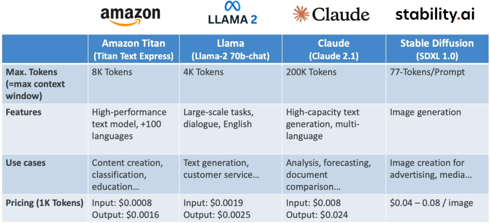

# Amazon Bedrock - Foundation Model (FM)

---

## Key Takeaways

Choosing a Foundation Model (FM) on Amazon Bedrock isn't about finding a single "best" model; it is about balancing trade-offs between **task modality**, **context window capacity**, **inference latency**, and **cost per token**.



Smaller models give you lightning-fast inference at fraction-of-a-cent pricing, while heavyweights like Claude unlock massive context windows capable of processing entire codebases and books in a single pass.

---

## Main Discussion

### The Multi-Dimensional Model Evaluation Framework

When selecting a base foundation model for an enterprise workload, evaluate across five core operational dimensions:

- **Modality Support:** Determines whether the model handles text, code, audio, images, or multimodal inputs (e.g., analyzing an image and generating explanatory text simultaneously).
- **Context Window Capacity:** The total token budget the model can accept as prompt context plus generated output in a single session.
- **Inference Latency:** Time-to-first-token and total completion time for user-facing interactions.
- **Customizability:** The capability to perform supervised fine-tuning or continued pre-training using private data in Amazon S3.
- **Unit Economics (Token Pricing):** Cost calculated per 1,000 or 1,000,000 input and output tokens.

$$\text{Model Suitability Score} = f(\text{Modality}, \text{Context Size}, \frac{1}{\text{Latency}}, \frac{1}{\text{Cost per Token}})$$

---

### Architectural Landscape: Bedrock Foundation Model Comparison

```
+-------------------------------------------------------------------------------+
|                      AMAZON BEDROCK MODEL CATALOG LANDSCAPE                   |
|                                                                               |
|  +---------------------------+       +-------------------------------------+  |
|  |     Amazon Titan Family   |       |          Anthropic Claude           |  |
|  | * Text Express / Lite     |       | * Claude 3 / 3.5 / 4.5 Sonnet       |  |
|  | * Multimodal Embeddings   |       | * 200K Token Context Window         |  |
|  | * High efficiency, 8K ctx |       | * Complex logic & multi-doc analysis|  |
|  +---------------------------+       +-------------------------------------+  |
|               |                                         |                     |
|               v                                         v                     |
|       +---------------------------------------------------------+             |
|       |               Unified Bedrock API Layer                 |             |
|       |       (Standardized Input/Output Payload Format)        |             |
|       +---------------------------------------------------------+             |
|               ^                                         ^                     |
|               |                                         |                     |
|  +---------------------------+       +-------------------------------------+  |
|  |        Meta Llama         |       |      Stability AI / Nova Canvas     |  |
|  | * Llama 2 / Llama 3       |       | * Stable Diffusion / Nova Canvas    |  |
|  | * Open-weights dialogue   |       | * Pure image synthesis & editing    |  |
|  | * General NLP tasks       |       | * Text-to-Image / Inpainting        |  |
|  +---------------------------+       +-------------------------------------+  |
+-------------------------------------------------------------------------------+
```

### Context Window & Operational Economics

The context window directly dictates what architectural patterns you can run. A model with an 8K limit requires aggressive chunking and vector retrieval (RAG), whereas a 200K window can ingest hundreds of pages of documentation directly inside the prompt context.

$$\text{Total Prompt Token Load} = \text{System Prompt} + \text{Few-Shot Examples} + \text{Retrieved RAG Context} + \text{User Query}$$

$$\text{Constraint: } \text{Total Prompt Token Load} + \text{Max Generation Tokens} \le \text{Model Context Window}$$

```
Context Window Comparison (Tokens):
Titan Text:  [ 8K Tokens ] (~6,000 words)
Llama 2:     [ 4K Tokens ] (~3,000 words)
Claude 3.x:  [================================================== 200K Tokens ] (~150,000 words)
```

- **Amazon Titan (AWS Native):** Built specifically by AWS for high-efficiency enterprise text generation, classification, summarization, and vector embeddings. Offers support for over 100 languages with full fine-tuning compatibility.
- **Anthropic Claude:** Specialized for heavy analytical reasoning, multi-document comparison, coding assistance, and large-context document ingestion.
- **Meta Llama:** Well-suited for open conversational dialogue, synthetic data generation, and standard natural language tasks.
- **Stability AI (Stable Diffusion):** Dedicated visual foundation model designed for text-to-image synthesis, image modification, and marketing asset generation.

---

## Exam Guide

### Exam Tips

- **Context Window Truncation Scenarios:** If an exam scenario describes an application failing when processing lengthy legal contracts or comprehensive code repositories, look for context window limits as the root cause, with **Anthropic Claude (200K context)** as the standard architectural remediation.
- **Cost Optimization Strategy:** Always pick the smallest, cheapest model that fulfills the basic requirement. Use **Amazon Titan Text** or **Nova Micro** for simple text classification or high-volume short-prompt tasks before reaching for heavy-weight reasoning models.
- **Modality Identification:** If a question asks to generate photorealistic marketing images from a text prompt, immediately rule out text-only models (like Llama or Titan Text) and select **Stable Diffusion** or **Amazon Titan Image Generator / Nova Canvas**.

---

### Practice Test

#### Question 1

A financial analyst needs to build a document comparison tool on AWS that intakes two quarterly earnings reports totaling 120,000 tokens in a single request and extracts discrepancies between them. Which foundation model available in Amazon Bedrock is best suited for this task?

- [ ] A. Meta Llama 2 (4K context window)
- [ ] B. Amazon Titan Text Express (8K context window)
- [ ] C. Anthropic Claude (200K context window)
- [ ] D. Stability AI Stable Diffusion

<details>
<summary>Correct Answer</summary>

- [x] C. Anthropic Claude (200K context window)
  - **Explanation:** Ingesting 120,000 tokens in a single prompt requires a model with a massive context window. **Anthropic Claude** supports up to 200K tokens, allowing entire multi-document sets to be analyzed directly in context without exceeding token limits.

</details>

---

#### Question 2

A developer is tasked with classifying incoming customer support emails into five predefined categories. The workload processes 500,000 short requests per day, and the team needs to minimize inference cost while maintaining adequate accuracy. What is the most cost-effective architectural choice on Amazon Bedrock?

- [ ] A. Deploy a large reasoning model with a 200K context window
- [ ] B. Use a lightweight, cost-optimized model such as Amazon Titan Text
- [ ] C. Provision a dedicated GPU cluster running Stable Diffusion
- [ ] D. Re-train a base foundation model from scratch using custom EC2 instances

<details>
<summary>Correct Answer</summary>

- [x] B. Use a lightweight, cost-optimized model such as Amazon Titan Text - **Explanation:** Short text classification tasks do not require massive context windows or deep multi-step reasoning models. Using a lightweight, cost-optimized model like **Amazon Titan Text** provides the lowest cost per token while easily handling standard NLP classification.

</details>

---
