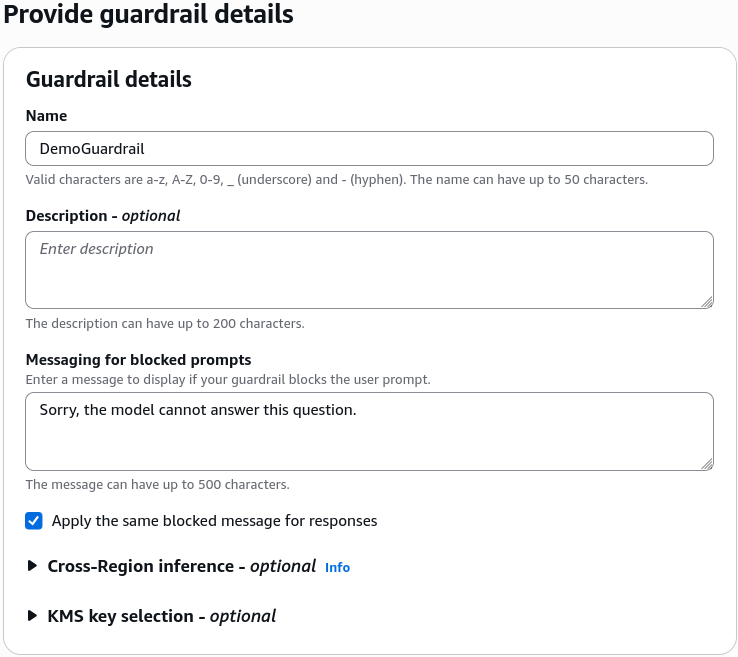
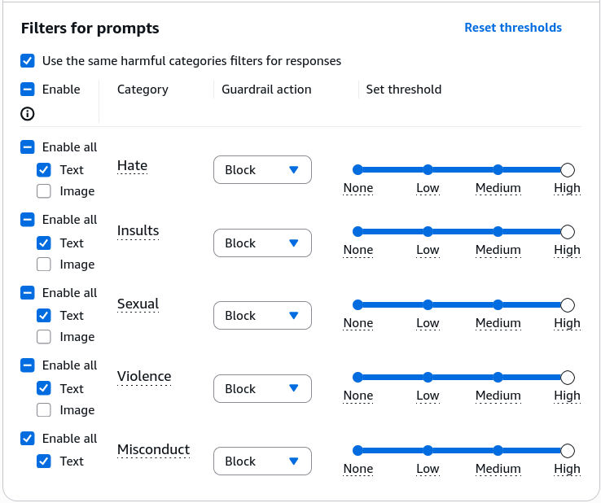
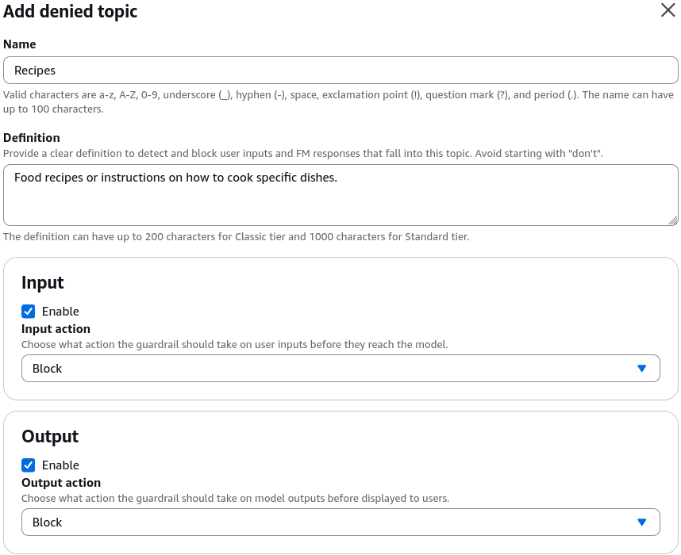
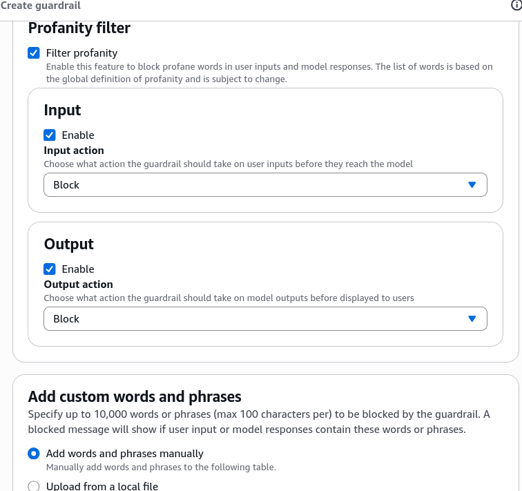
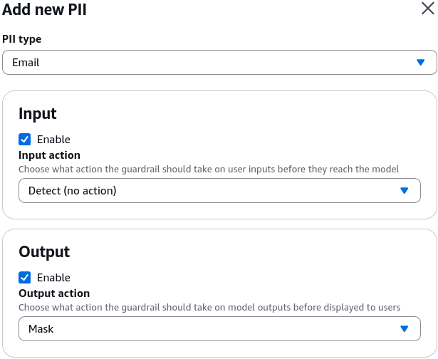
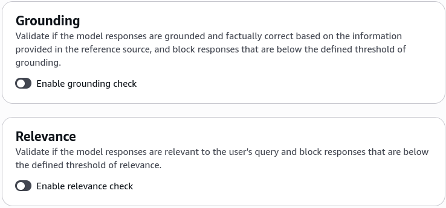
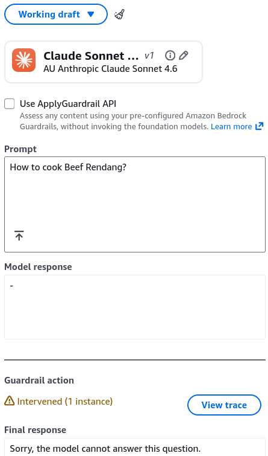
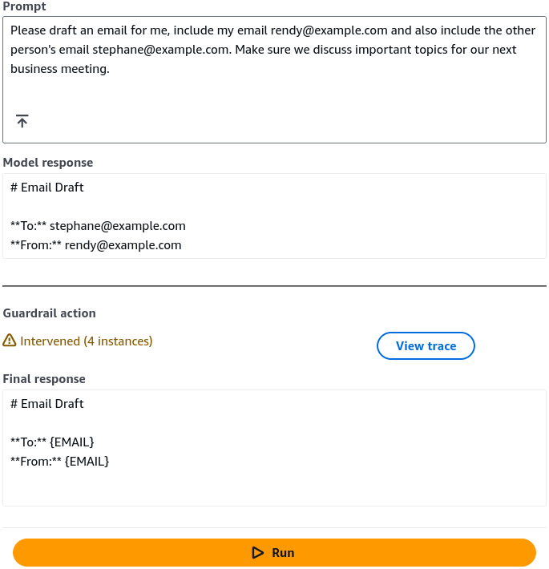
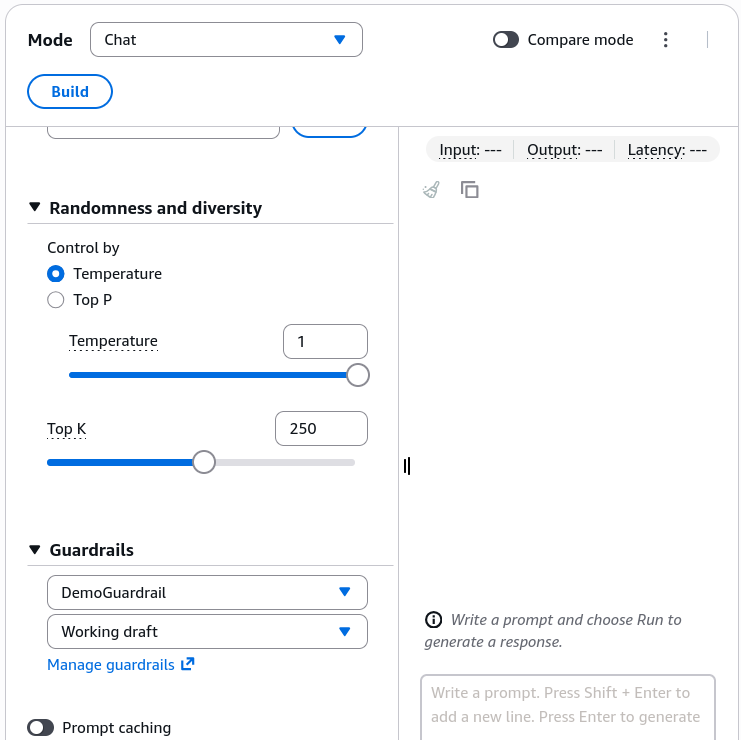

# GuardRails - Hands On

---

## Key Takeaways

Amazon Bedrock Guardrails provides a unified safety, privacy, and compliance layer that intercepts both **User Prompts** (input) and **Foundation Model Completions** (output).

```
[ User Input ] ---> [ Guardrail Input Filters ] ---> [ Foundation Model ] ---> [ Guardrail Output Filters ] ---> [ Sanitized Output ]
                          |                                                           |
                          +---> Blocked (Topic / Toxic / PII)                         +---> Masked (PII) / Blocked
```

Guardrails lets you enforce custom fallback messages, filter harmful content categories (Hate, Insults, Sexual, Violence, Misconduct), establish **Denied Topics** using natural language definitions, mask sensitive **Personally Identifiable Information (PII)** like email addresses, and apply multiple stacked guardrails directly within the Bedrock Playgrounds at zero idle cost.

---

## Hands-On Workflow: Guardrail Provisioning & Interception Testing

1. **Initialize Guardrail & Define Fallback Messaging:**
   - Navigate to the **Amazon Bedrock Console** and select **Guardrails** under Safeguards.
   - Click **Create guardrail**.
   - Specify a **Guardrail name** (e.g., `DemoGuardrail`).
   - Define custom fallback messages for blocked prompts and blocked responses (e.g., `Sorry, the model cannot answer this question.`).
   - Click **Next**.  
     
2. **Configure Harmful Content Filters:**
   - Adjust the filter sensitivity across core harm dimensions:
   - Set filter strengths (None, Low, Medium, High) for **Hate**, **Insults**, **Sexual**, **Violence**, and **Misconduct**.
   - Higher filter strength increases the probability of catching and blocking nuanced, borderline toxic or adversarial inputs.
   - Click **Next**.  
     
3. **Define Natural Language Denied Topics:**
   - Add specific domain topics that the model is strictly forbidden from discussing:
   - **Topic Name:** `Recipes`
   - **Definition of Topic:** `Food recipes or instructions on how to cook specific dishes.`
   - _(Optional)_ Add sample input phrases to fine-tune the classifier boundary.
   - Confirm the denied topic and click **Next**.  
     
4. **Configure Word Filters & PII Anonymization / Masking:**
   - Set up keyword and privacy controls:
   - **Profanity Filter & Custom Blocked Words:** Add specific words, phrases, or uploaded CSV files to block competitor mentions or offensive terms.  
     
   - **Sensitive Information Filters (PII):** Select predefined entity types (e.g., _Email_) and set the behavior to **Mask** (replaces raw emails with `[EMAIL]`) or **Block**.  
     
   - **Regex Patterns:** Define custom regular expressions to detect proprietary enterprise identifiers (e.g., internal customer numbers).
   - Review **Contextual Grounding** settings (Grounding & Relevance thresholds to halt hallucinations) and click **Create guardrail**.  
     
5. **Test Denied Topic Interception:**
   - In the Guardrail Test interface, select an active model (e.g., **Anthropic Claude Sonnet 4.6**).
   - Submit a blocked-topic prompt: `How to cook Beef Rendang.`
   - Click **Run**.
   - Observe that the system intercepts the request before generation and returns the exact configured blocked message: `Sorry, the model cannot answer this question.`  
     
6. **Test PII Redaction & Dynamic Masking:**
   - Submit a prompt containing email address.
   - Click **Run**.
   - Inspect the generated completion: the foundation model generates the email draft, but Bedrock Guardrails dynamically masks both email addresses before delivering the response.  
     
7. **Stack Multiple Guardrails in the Chat Playground:**
   - Navigate to **Playgrounds > Chat / Text**.
   - Select your foundation model.
   - In the configuration drawer at the bottom, attach `DemoGuardrail`.
   - Note that you can select and **stack multiple guardrails simultaneously** to enforce layered security policies across different departments or regulatory regimes.  
     

---

## Exam Guide

### Exam Tips

- **Cost Behavior:** Creating and storing Amazon Bedrock Guardrails incurs **no idle hourly capacity fees**. Billing applies on a pay-per-use basis only when prompts and completions are actively evaluated against the guardrail filters.
- **Block vs. Mask Action:**
  - **Block:** Immediately terminates generation and returns the pre-defined generic fallback string (e.g., for Denied Topics or high Toxicity).
  - **Mask:** Allows the model to complete the generation, but replaces detected PII tokens (e.g., SSN, Email, Phone Number) with anonymized replacement tags like `[EMAIL]`.
- **Guardrail Stacking:** Enterprise architectures can attach **multiple guardrails** to a single model invocation, allowing global company-wide safety rules (e.g., zero toxicity) to combine with business-unit specific rules (e.g., financial advice restrictions).
- **Cross-Model Application:** Guardrails is decoupled from model architecture; the exact same Guardrail configuration can be attached to **Amazon Titan**, **Anthropic Claude**, **Meta Llama**, or external models via the standalone `ApplyGuardrail` API.

---

### Practice Test

#### Question 1

A corporate customer service chatbot built with Amazon Bedrock needs to ensure that when customers provide email addresses and phone numbers during support interactions, those details are never displayed in the generated output text. However, the conversation should continue smoothly without terminating the session. Which Amazon Bedrock Guardrails configuration meets this requirement?

- [ ] A. Configure a Denied Topic for customer contact info with a Block action
- [ ] B. Configure Sensitive Information Filters for Email and Phone Number with a Mask action
- [ ] C. Enable Contextual Grounding Checks with a threshold of 0.99
- [ ] D. Apply a high-strength Profanity Filter to input prompts

<details>
<summary>Correct Answer</summary>

- [x] B. Configure Sensitive Information Filters for Email and Phone Number with a Mask action
  - **Explanation:** The **Mask** action in Amazon Bedrock Guardrails Sensitive Information Filters automatically replaces identified PII (such as emails and phone numbers) with placeholder tags, allowing the completion to be returned safely without blocking the entire interaction.

</details>

---

#### Question 2

An AI security team needs to prevent an internal generative AI application from answering questions related to legal advice. They want to define this restriction in plain English without writing custom code or retraining the foundation model. Which feature of Amazon Bedrock Guardrails should be configured?

- [ ] A. Custom Word Filters with CSV uploads
- [ ] B. Denied Topics with a topic definition and optional sample phrases
- [ ] C. Contextual Grounding Relevance Checks
- [ ] D. Amazon SageMaker Clarify Pre-training Bias Metrics

<details>
<summary>Correct Answer</summary>

- [x] B. Denied Topics with a topic definition and optional sample phrases
  - **Explanation:** **Denied Topics** in Amazon Bedrock Guardrails allows administrators to define restricted conversation boundaries using natural language definitions (and optional sample phrases) so the guardrail can detect and block matching user queries.

</details>

---
