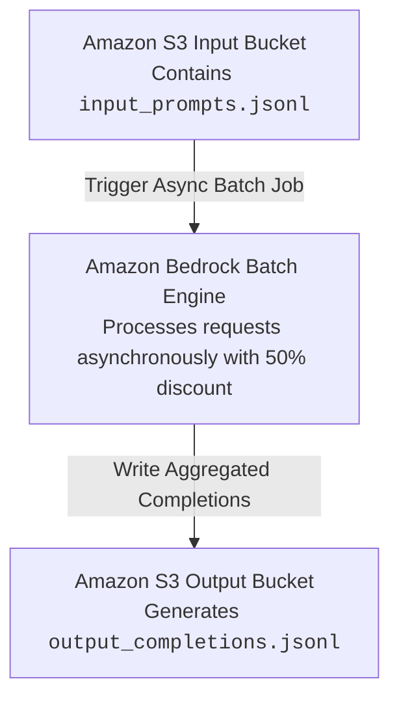

# Pricing

---

## Key Takeaways

Amazon Bedrock provides three core pricing and purchasing options for foundation model inference: **On-Demand** (pay-as-you-go per token/image), **Batch Mode** (asynchronous processing via Amazon S3 with a **50% cost discount**), and **Provisioned Throughput** (reserving dedicated Model Units for consistent throughput).

```
+---------------------------------------------------------------------------------------+
|                      AMAZON BEDROCK PRICING & INFERENCE MODES                         |
+---------------------------------------------------------------------------------------+
|                                                                                       |
|   1. ON-DEMAND (Pay-As-You-Go)                                                        |
|      * Billed per 1,000 / 1,000,000 Input & Output tokens (or per generated image)    |
|      * Zero upfront commitment; ideal for bursty, unpredictable, or dev workloads     |
|                                                                                       |
|   2. BATCH MODE (50% Cost Savings)                                                    |
|      * Asynchronous bulk processing: S3 Input File ---> Bedrock ---> S3 Output File   |
|      * 50% discount vs. on-demand; ideal for non-real-time offline jobs               |
|                                                                                       |
|   3. PROVISIONED THROUGHPUT (Reserved Capacity)                                       |
|      * Purchases dedicated Model Units (MUs) on 1-month or 6-month commitments        |
|      * Guarantees max tokens/min throughput and zero throttling                       |
|      * MANDATORY requirement to run Custom / Fine-Tuned / Imported Models             |
+---------------------------------------------------------------------------------------+
```

When optimizing costs, note that **inference parameters like Temperature, Top-K, and Top-P do not affect pricing**—the primary cost driver is **total input and output token volume**.

---

## Main Discussion

### The Three Bedrock Inference Pricing Modes

| Inference Mode | Billing Unit | Commitment Terms | Primary Architectural Fit |
| :--- | :--- | :--- | :--- |
| On-Demand | Per Input/Output Token & Image Gen | None (Pay-as-you-go) | Interactive web chatbots, prototyping, variable load |
| Batch Inference | 50% of On-Demand Token Rates | None (Job-based) | Offline document analysis, nightly report summaries |
| Provisioned Throughput | Hourly rate per Model Unit (MU) committed | 1-month or 6-month (or no-commit 1 MU) | Production SLAs, high QPS, custom/fine-tuned models |



- **On-Demand Pricing:** Billed independently for input tokens and output tokens. Output tokens generally carry a higher price per token due to the computational cost of sequential autoregressive token generation.
- **Batch Mode:** You supply a JSONL file in Amazon S3 containing bulk prompts. Bedrock processes them asynchronously, outputs a single result file back to S3, and applies a flat **50% discount** compared to standard on-demand token rates.
- **Provisioned Throughput:** Designed for guaranteed capacity and strict latency SLAs. **Crucial Rule:** To run inference on **custom fine-tuned models**, you cannot use on-demand billing; you must purchase Provisioned Throughput.

---

### The Cost Spectrum of Model Customization & Adaptation

Adapting foundation models to business use cases follows a progressive cost and compute curve:

$$\text{Engineering Cost: } \text{Prompt Engineering} \ll \text{RAG} < \text{Instruction Fine-Tuning} \ll \text{Domain Adaptation (Continued Pre-training)}$$

```mermaid
flowchart BT
    Prompt[Prompt Engineering & System Instructions<br/>$ Zero Training Compute]
    RAG[Retrieval-Augmented Generation RAG<br/>$$ Vector DB & Storage Costs]
    FineTune[Instruction-Based Supervised Fine-Tuning<br/>$$$ Moderate GPU & Labeled]
    Domain[Domain Adaptation / Continued Pre-training<br/>$$$$$ High Compute & Unlabeled]

    Prompt --> RAG
    RAG --> FineTune
    FineTune --> Domain
```

- **Prompt Engineering ($):** Zero additional model training, storage, or infrastructure overhead. You pay only standard inference token charges for prompt optimization.
- **Retrieval-Augmented Generation / RAG ($$):** Base model weights remain untouched. Adds operational costs for document storage in Amazon S3, embeddings generation, and vector database capacity (such as Amazon OpenSearch Serverless OCUs).
- **Instruction-Based Fine-Tuning ($$$):** Modifies model weights using labeled input-output pairs. Incurs one-time GPU training costs plus mandatory Provisioned Throughput for inference hosting.
- **Domain Adaptation / Continued Pre-training ($$$$$):** Massive pre-training over large volumes of unlabeled raw domain text to expand foundational vocabulary and domain reasoning. Highest computational and financial expense.

---

### Cost Optimization Levers & Token Management

```
+-------------------------------------------------------------------------------+
| BEDROCK COST OPTIMIZATION LEVERS                                              |
|                                                                               |
|  1. INPUT TOKEN PRUNING:                                                      |
|     * Strip redundant boilerplate and irrelevant conversational history       |
|                                                                               |
|  2. OUTPUT LENGTH CONSTRAINTS (`max_tokens`):                                 |
|     * Cap maximum completion tokens and enforce concise generation formats    |
|                                                                               |
|  3. RIGHT-SIZING FOUNDATION MODELS:                                           |
|     * Route short NLP/classification tasks to lightweight models (e.g., Nova  |
|       Micro/Lite or Titan Text) instead of expensive flagship reasoning models|
|                                                                               |
|  4. LEVERAGING BATCH MODE:                                                    |
|     * Shift non-urgent, offline bulk jobs to batch inference for 50% savings  |
+-------------------------------------------------------------------------------+

```

- **Inference Parameters vs. Cost:** Adjusting **Temperature**, **Top-P**, or **Top-K** alters model creativity and token selection distributions, but has **zero direct impact on pricing**.
- **Token Volume is the Pricing Driver:** The most effective lever for reducing Bedrock expenses is minimizing unnecessary input prompt tokens and capping generated output tokens.

---

## Exam Guide

### Exam Tips

- **Batch Mode Discount:** Remember the exact savings figure: **Batch inference provides a 50% discount** compared to on-demand pricing for non-real-time workloads processed via Amazon S3.
- **Provisioned Throughput Mandate:** If an exam question mentions deploying a **customized, fine-tuned, or imported model** for inference, you must select **Provisioned Throughput** (on-demand mode is not supported for custom models).
- **Provisioned Throughput is NOT a Default Cost Saver:** Provisioned Throughput is designed for **guaranteed capacity, rate-limit avoidance, and predictable SLAs**, not general cost reduction. If utilized below capacity, it can be more expensive than on-demand.
- **Hyperparameters vs. Billing:** Parameters like **Temperature**, **Top-K**, and **Top-P** do **not** change token pricing. Only total tokens consumed and model tier dictate cost.

---

### Practice Test

#### Question 1

A media company needs to generate text summaries for 100,000 archived news articles every weekend. The summarization process is not time-sensitive, and results can be delivered within 24 hours. The engineering team wants to minimize inference costs on Amazon Bedrock. Which approach provides the highest cost savings?

- A. Provision a dedicated Provisioned Throughput Model Unit with a 6-month commitment
- B. Submit the documents as an asynchronous Batch Inference job reading and writing to Amazon S3
- C. Increase the Temperature and Top-P inference parameters on an On-Demand endpoint
- D. Perform supervised fine-tuning on an Amazon Titan model using labeled summaries

<details>
<summary>Correct Answer</summary>

- [x] B. Submit the documents as an asynchronous Batch Inference job reading and writing to Amazon S3
  - **Explanation:** **Batch Inference** on Amazon Bedrock processes non-real-time bulk workloads asynchronously via Amazon S3 at a **50% discount** compared to standard on-demand pricing, making it the most cost-effective solution for non-urgent tasks.

</details>

---

#### Question 2

A machine learning engineer has completed a supervised fine-tuning job on Amazon Bedrock to adapt an Amazon Nova model for medical billing classification. The engineer now needs to deploy the custom fine-tuned model for production inference. Which purchasing option is required?

- [ ] A. On-Demand pricing per 1,000 tokens
- [ ] B. Provisioned Throughput
- [ ] C. Spot Model Units with automatic scale-in
- [ ] D. AWS Free Tier on-demand allocation

<details>
<summary>Correct Answer</summary>

- [x] B. Provisioned Throughput
  - **Explanation:** Amazon Bedrock requires **Provisioned Throughput** to host and serve inference requests for **custom, fine-tuned, or imported models**. On-demand pay-as-you-go inference is supported only for base foundation models.

</details>

---
