# RAG & Knowledge Base - Complete Setup - Hands On

---

## Key Takeaways

Setting up a complete, production-grade Retrieval-Augmented Generation (RAG) system on Amazon Bedrock requires orchestrating multiple AWS components: **IAM administrative credentials**, an **Amazon S3 document storage bucket**, an **Embeddings Model** (e.g., Titan Text Embeddings V2), and an underlying **Vector Database** (e.g., Amazon OpenSearch Serverless).

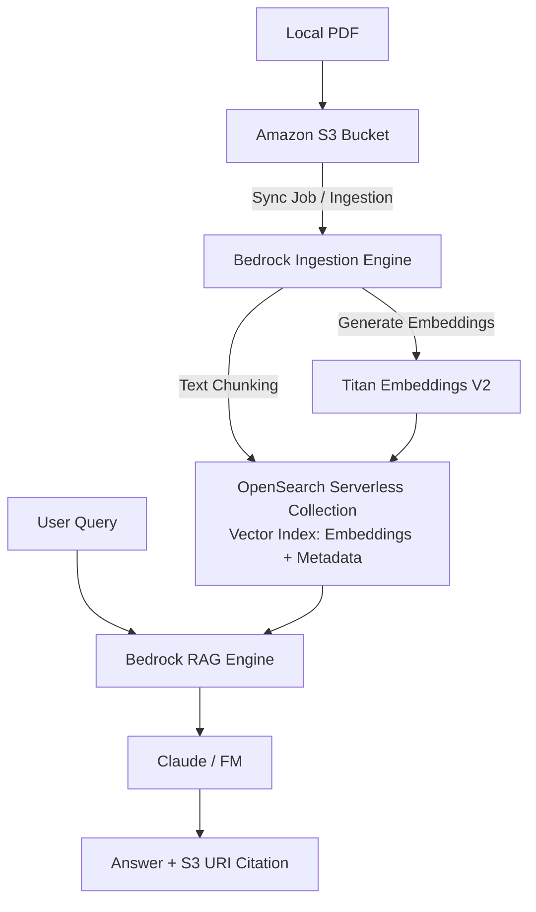

:::warning
Crucial billing and lifecycle rule: **Deleting an Amazon Bedrock Knowledge Base does not automatically delete its underlying Amazon OpenSearch Serverless collection**. Because OpenSearch Serverless carries active OpenSearch Compute Unit (OCU) baseline costs (~$0.24/OCU-hour), you must delete the OpenSearch collection independently to prevent ongoing charges.
:::

---

## Hands-On Workflow: Complete Bedrock RAG Setup

1. **Establish an IAM Administrative User:**
   - Navigate to the **AWS IAM Console** (never build production assets as the root user).
   - Under **Access Management > Users**, click **Create user**.
   - Define a username (e.g., `Rendy-Admin`) and enable **AWS Management Console access**.
   - Set a custom password and attach the **AdministratorAccess** policy directly.
   - Sign out of the root user account and sign in using the unique IAM console sign-in URL with your new IAM user credentials.
2. **Provision S3 Data Bucket & Upload Source Documents:**
   - Navigate to the **Amazon S3 Console** in your target region (e.g., `us-east-1`).
   - Click **Create bucket**.
   - Enter a **globally unique bucket name** (e.g., `demo-kb-bedrock-[your-unique-suffix]`).
   - Keep default general-purpose settings and click **Create bucket**.
   - Open your new bucket, click **Upload**, select your reference document (e.g., [Evolution of the Internet Detailed.pdf](./assets/Evolution_of_the_Internet_Detailed.pdf), and confirm the upload.
3. **Configure Amazon Bedrock Knowledge Base & S3 Data Source:**
   - Navigate to the **Amazon Bedrock Console** and select **Knowledge Bases** under Builder tools.
   - Click **Create Unstructured Vector Store KB**.  
     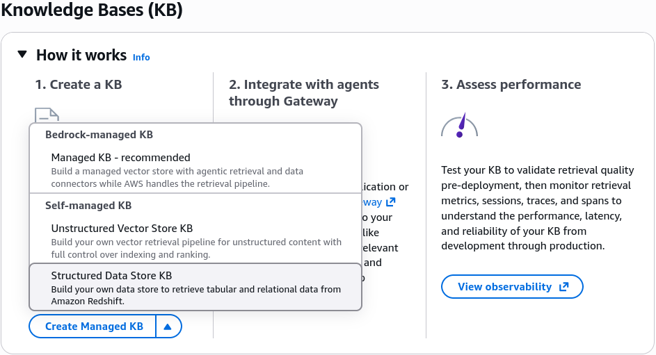
   - **IAM Permissions:** Select _Create and use a new service role_ (Bedrock automatically configures the required IAM trust and access policies).
   - **Data Source:** Select **Amazon S3**.  
     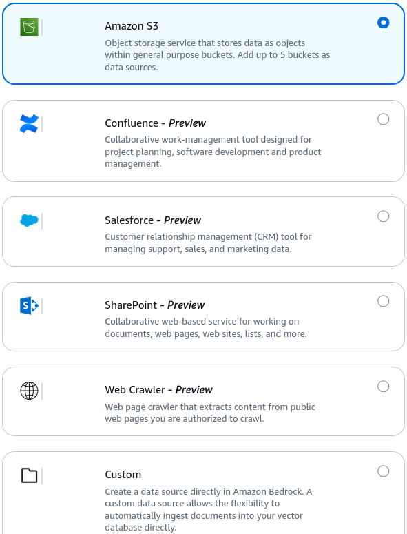
   - Point the data source configuration to your newly created S3 bucket URI.
4. **Select Embeddings Model & Vector Database:**
   - Choose the vector conversion and storage configuration:
   - **Embeddings Model:** Select **Amazon Titan Text Embeddings V2** (keep the default vector dimension settings).  
     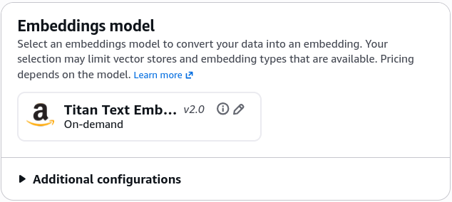
   - **Vector Store Configuration:** Select **Quick create a new vector store** (Amazon OpenSearch Serverless).  
     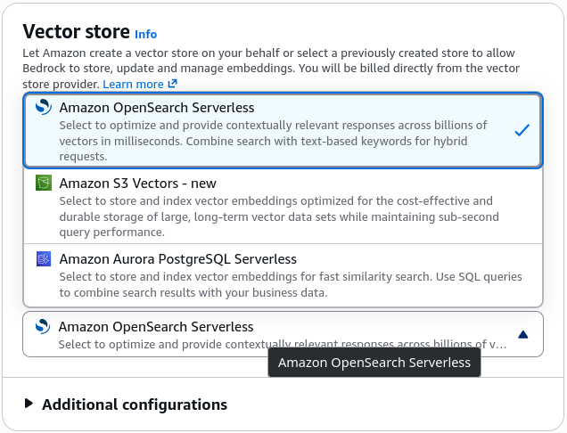
   - Review the provisioning summary and click **Create knowledge base**. Bedrock automatically deploys the OpenSearch Serverless collection, security policies, and vector index.
5. **Trigger Ingestion Sync & Inspect OpenSearch Vectors:**
   - Once provisioning finishes:
   - Navigate to the **Data sources** tab and click **Sync** to initiate document parsing, chunking, and embedding generation.  
     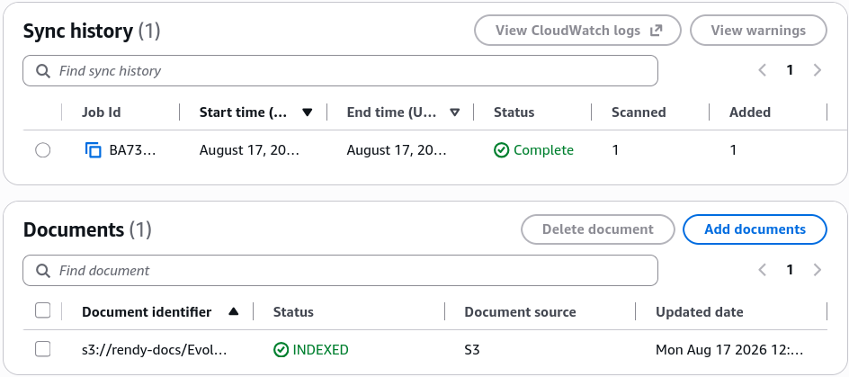
   - Open the **Amazon OpenSearch Service Console** and select **Collections** under Serverless.  
     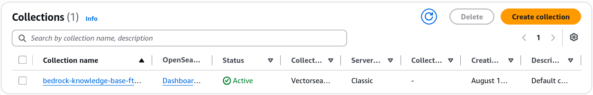
   - Notice the generated vector index containing the document chunks and multi-dimensional vector arrays created by the Titan Embeddings model.
6. **Explore OpenSearch Dashboards & Visualize Vector Embeddings**
   - Open the **Amazon OpenSearch Service Console** and select **Collections** under Serverless.
   - Click on your Bedrock-generated collection to view the collection endpoint and index overview (confirming the vector index and document chunks).
   - Click on the **OpenSearch Dashboards URL** to open the visualization UI.
   - In OpenSearch Dashboards, navigate to the left-hand menu and select **Discover**.
   - Click Create index pattern, paste the exact index name from your collection, click Next step, and select **Create index pattern**.  
     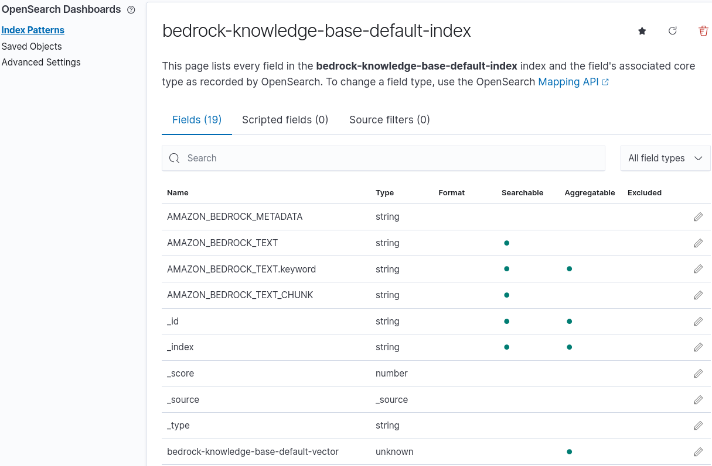
   - Return to **Discover** to inspect the ingested data:
     - Text Chunks **(AMAZON_BEDROCK_TEXT)**: The raw text passages extracted from your PDF.
     - Vector Embeddings (**bedrock-knowledge-base-default-vector**): The actual high-dimensional numerical arrays generated by the Titan Embeddings model for semantic similarity search.  
       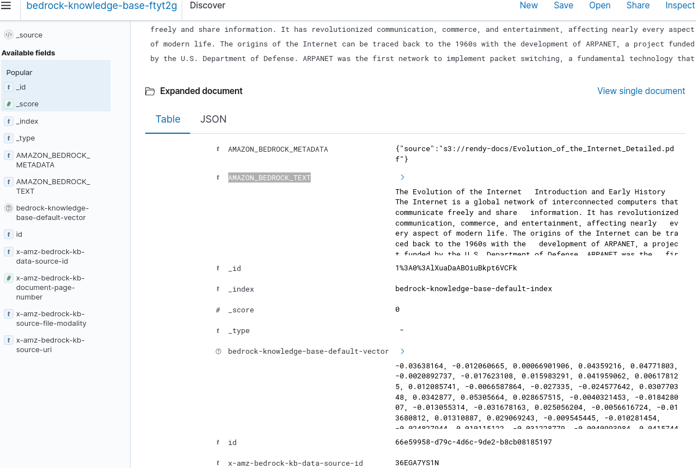
7. **Test Dynamic Inferences & Validate S3 Citations:**
   - Return to the **Bedrock Knowledge Base Test Panel**:
   - Select a generator model (e.g., **Anthropic Claude 3.5 Sonnet** or **Amazon Nova**).
   - Run a grounded query: `Who and when invented the World Wide Web?`  
     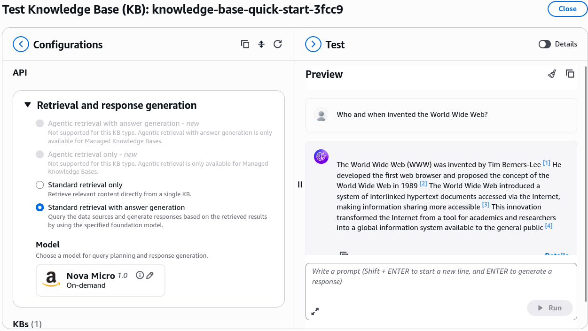
   - Verify that the response contains accurate data grounded in the PDF and displays a direct, clickable hyperlink citation leading to the specific object in your Amazon S3 bucket.  
     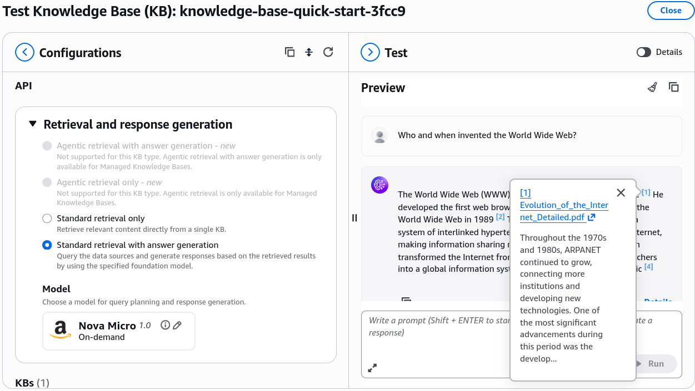
8. **Execute Resource Cleanup & Prevent Idle Costs:**
   - To avoid ongoing baseline charges from OpenSearch Compute Units (OCUs):
     - In Bedrock, select your Knowledge Base and click **Delete**.  
       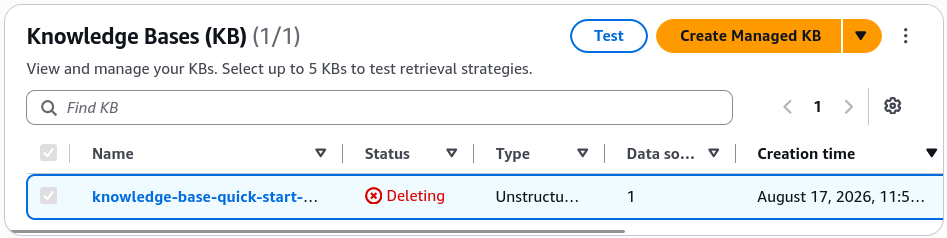
     - **CRITICAL SECOND STEP:** Navigate to **Amazon OpenSearch Service > Serverless > Collections**.
     - Select the Bedrock-generated collection and click **Delete** to terminate the underlying search and indexing compute units.  
       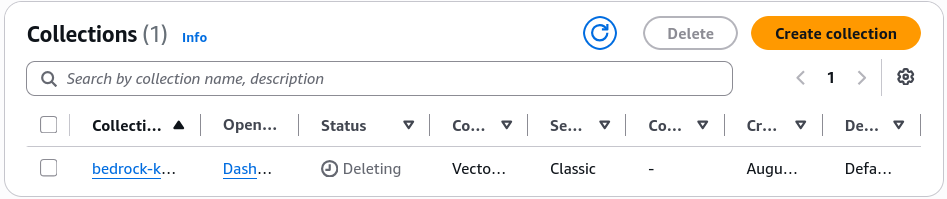
     - (Optional) The Amazon S3 bucket can remain without incurring compute fees, as storage costs for small test PDFs are negligible.

---

## Exam Guide

### Exam Tips

- **Root vs. IAM Best Practice:** Always remember for the exam that daily administrative, development, and AI engineering tasks must be conducted using **IAM users/roles** with the principle of least privilege, rather than the AWS account Root User.
- **S3 Global Uniqueness:** Amazon S3 bucket names are **globally unique** across all AWS accounts worldwide, even though buckets are created within a specific regional scope.
- **Bedrock Service Role Automation:** When creating a Knowledge Base, selecting _Create a new service role_ automatically constructs the IAM policy granting Bedrock permissions to invoke `s3:GetObject` on the data bucket and execute vector read/writes against OpenSearch Serverless.
- **OpenSearch Serverless Lifecycle Decoupling:** Be mindful of the architectural boundary: deleting a Bedrock Knowledge Base removes the high-level orchestration layer, but **the underlying vector storage (OpenSearch Serverless collection) persists independently** until manually removed.

---

### Practice Test

#### Question 1

A cloud engineer creates an Amazon Bedrock Knowledge Base using the "Quick create a new vector store" option with Amazon OpenSearch Serverless. After running a prototype evaluation, the engineer deletes the Knowledge Base from the Amazon Bedrock console. At the end of the billing cycle, the company continues to receive charges for OpenSearch Compute Units (OCUs). What is the root cause of these ongoing charges?

- [ ] A. Amazon Bedrock retains a hidden backup copy of the S3 bucket indefinitely
- [ ] B. The Amazon OpenSearch Serverless collection remains active and must be deleted separately in the OpenSearch console
- [ ] C. Embeddings models continue to charge token processing fees after the Knowledge Base is removed
- [ ] D. AWS IAM service roles incur hourly fees when tied to deleted AI resources

Correct Answer

- [x] B. The Amazon OpenSearch Serverless collection remains active and must be deleted separately in the OpenSearch console.
  - **Explanation:** Deleting a Knowledge Base in Amazon Bedrock does **not** automatically delete the underlying Amazon OpenSearch Serverless vector collection. Because OpenSearch Serverless charges for provisioned OpenSearch Compute Units (OCUs) while active, the collection must be deleted manually from the OpenSearch Service console to halt billing.

---

#### Question 2

An AI developer is configuring an Amazon Bedrock Knowledge Base to ingest technical manuals from an Amazon S3 bucket. Which sequence of operations correctly reflects the ingestion and vectorization workflow when the "Sync" action is triggered?

- [ ] A. The LLM updates its internal weights directly $\rightarrow$ S3 documents are deleted $\rightarrow$ The Knowledge Base closes
- [ ] B. Documents are chunked $\rightarrow$ An embeddings model (e.g., Titan Text Embeddings) converts chunks into vectors $\rightarrow$ Vectors and metadata are stored in the vector database
- [ ] C. OpenSearch creates SQL tables $\rightarrow$ Documents are converted into JPEG images $\rightarrow$ Bedrock Guardrails indexes the text
- [ ] D. The user query is generated $\rightarrow$ The base foundation model is fine-tuned on S3 $\rightarrow$ The S3 URI is deleted

Correct Answer

- [x] B. Documents are chunked $\rightarrow$ An embeddings model (e.g., Titan Text Embeddings) converts chunks into vectors $\rightarrow$ Vectors and metadata are stored in the vector database.
  - **Explanation:** During the Bedrock Knowledge Base sync pipeline, raw documents from Amazon S3 are parsed and split into chunks, processed by a text embeddings model to create numerical vector representations, and written into the vector store (such as OpenSearch Serverless) along with text metadata for runtime similarity matching.

---

#### Question 3

A tech company is developing an AI-powered customer support solution using Retrieval-Augmented Generation (RAG) with Amazon Bedrock to provide more accurate and context-aware responses. To achieve this, the company needs a database that can handle fast index lookups and similarity searches to quickly retrieve the most relevant documents or information from a large dataset. The ideal database solution should efficiently support search queries and rank results based on their relevance to the input provided by the user.

Given these requirements, which database solution would be most appropriate for the company to use?

- [ ] A. The company should use Amazon OpenSearch Service, which is designed to provide fast search capabilities and supports full-text search, indexing, and similarity scoring
- [ ] B. The company should use Amazon Aurora, a managed relational database service that is optimized for high-performance transactional workloads that can be useful for search operations
- [ ] C. The company should use Amazon DocumentDB (with MongoDB compatibility), a managed NoSQL document database service designed for storing semi-structured data to facilitate search capabilities
- [ ] D. The company should use Amazon DynamoDB, a fully managed NoSQL database service that offers low-latency data retrieval to handle fast index lookups as well as search operations

Correct Answer

- [x] A. The company should use Amazon OpenSearch Service, which is designed to provide fast search capabilities and supports full-text search, indexing, and similarity scoring.
  - **Explanation:** Amazon OpenSearch Service is the most suitable choice because it is specifically built to handle search and analytics workloads, including fast index lookups and similarity scoring. OpenSearch supports full-text search, vector search, and advanced data indexing, which are essential for the Retrieval-Augmented Generation (RAG) framework. It enables the chatbot or model to quickly find and rank relevant documents based on their similarity to the query, making it highly effective for applications that require rapid data retrieval and relevance ranking.  
    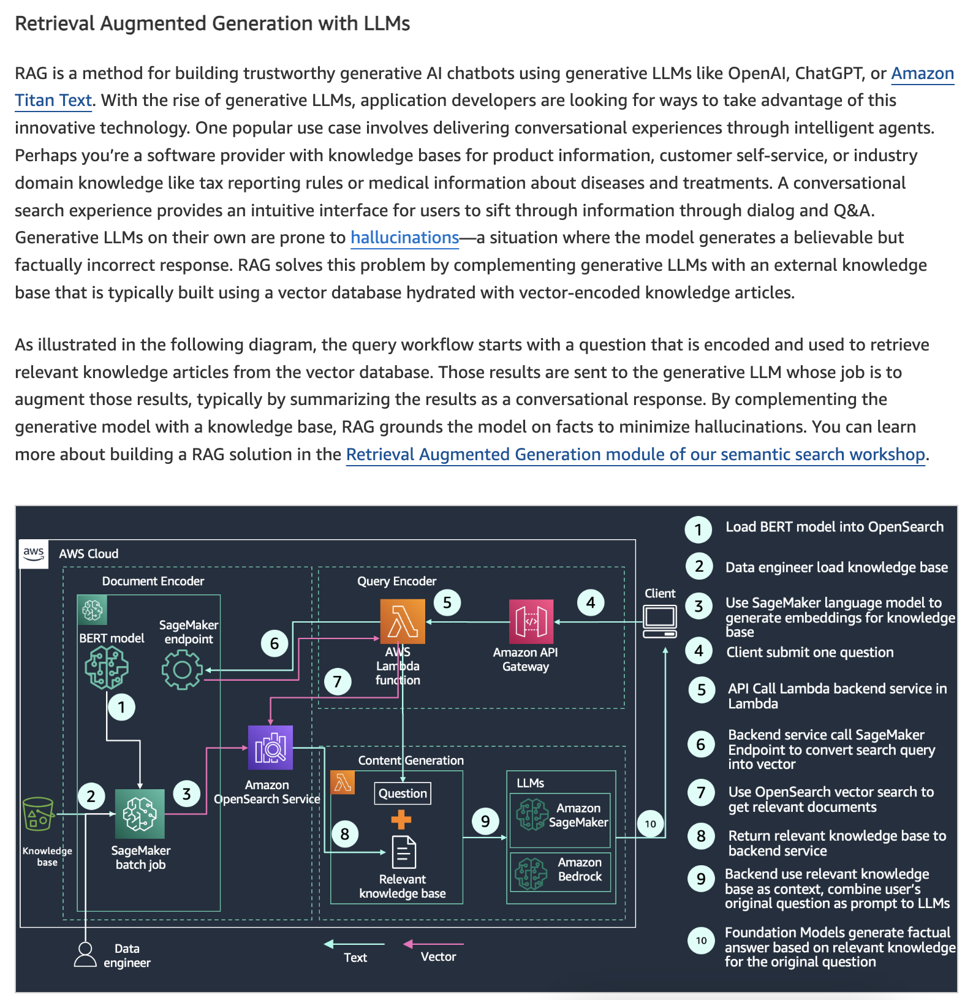
    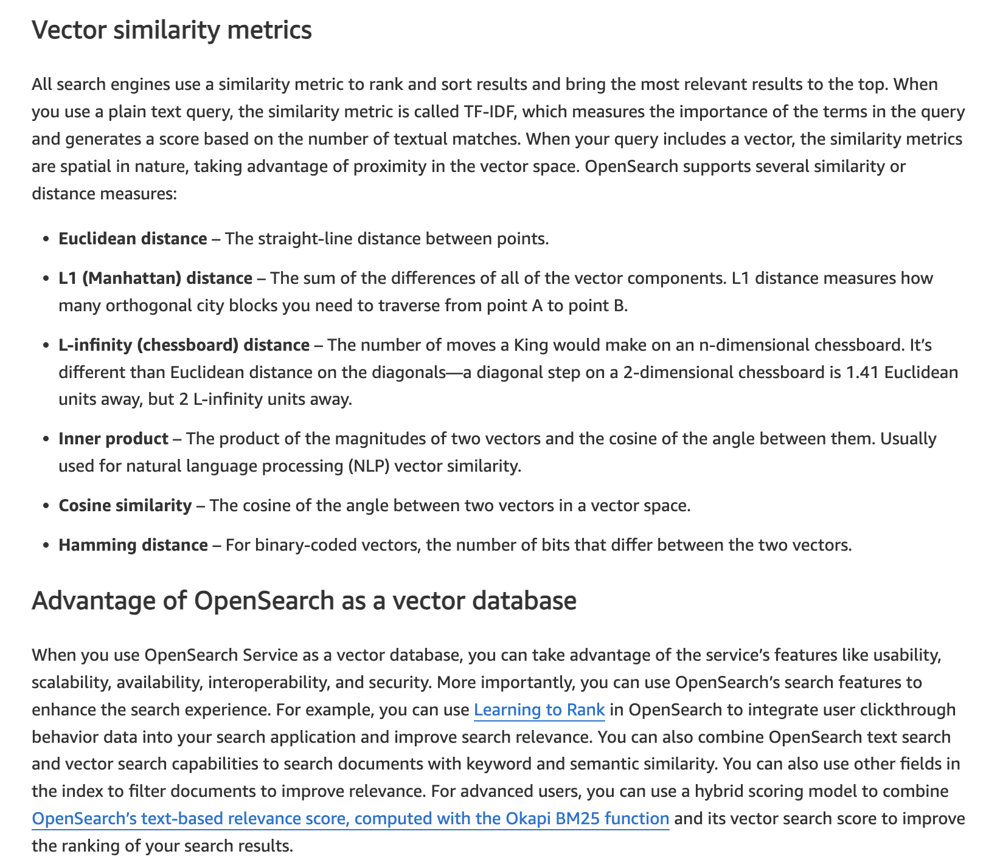
    Knowledge Bases for Amazon Bedrock takes care of the entire ingestion workflow of converting your documents into embeddings (vector) and storing the embeddings in a specialized vector database. Knowledge Bases for Amazon Bedrock supports popular databases for vector storage, including vector engine for Amazon OpenSearch Serverless, Pinecone, Redis Enterprise Cloud, Amazon Aurora (coming soon), and MongoDB (coming soon). If you do not have an existing vector database, Amazon Bedrock creates an OpenSearch Serverless vector store for you.

Incorrect Answers

- [ ] B. The company should use Amazon Aurora, a managed relational database service that is optimized for high-performance transactional workloads that can be useful for search operations
  - Amazon Aurora is a high-performance relational database service that is excellent for OLTP (Online Transaction Processing) workloads. While it provides advanced indexing features for relational data, it is not optimized for full-text search, fast similarity lookups, or the types of search capabilities required for RAG applications. Aurora’s primary strengths lie in transactional integrity and scalability for relational datasets, not in search and retrieval tasks.
- [ ] C. The company should use Amazon DocumentDB (with MongoDB compatibility), a managed NoSQL document database service designed for storing semi-structured data to facilitate search capabilities
  - Amazon DocumentDB is primarily designed for storing and querying semi-structured JSON data. While it provides scalability and managed support for document-based workloads, it is not optimized for full-text search or similarity searches. DocumentDB lacks the native capabilities for efficient indexing and retrieval needed for RAG, making it a less suitable choice.
- [ ] D. The company should use Amazon DynamoDB, a fully managed NoSQL database service that offers low-latency data retrieval to handle fast index lookups as well as search operations
  - Amazon DynamoDB is a key-value and document database designed for fast and predictable performance with low latency, suitable for high-throughput transactional workloads. However, it does not natively support advanced search capabilities or similarity scoring needed for RAG applications. Its primary focus is on rapid data retrieval based on primary keys, not on the complex search and retrieval functions required for this scenario.

References:

- https://aws.amazon.com/blogs/big-data/amazon-opensearch-services-vector-database-capabilities-explained/
- https://aws.amazon.com/bedrock/knowledge-bases/

---
