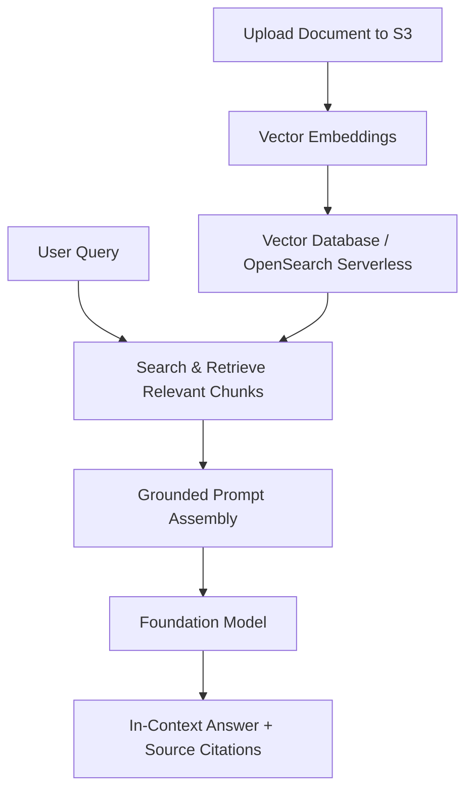
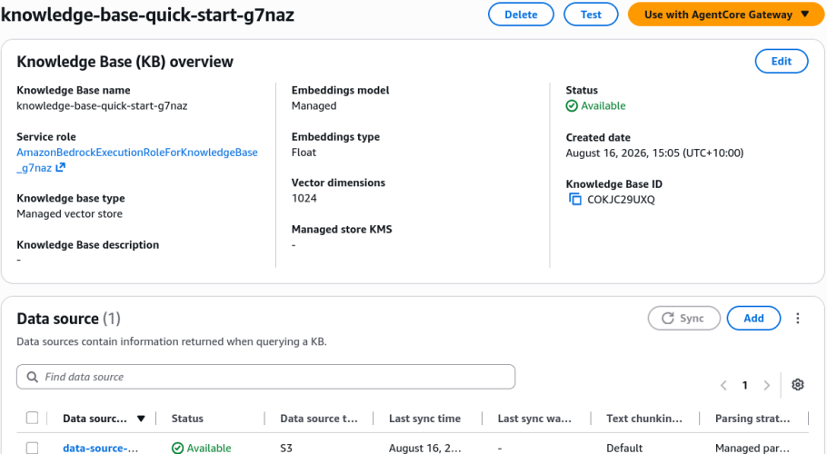
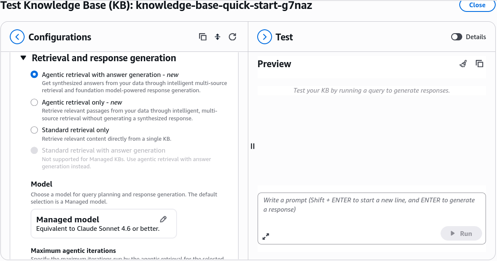
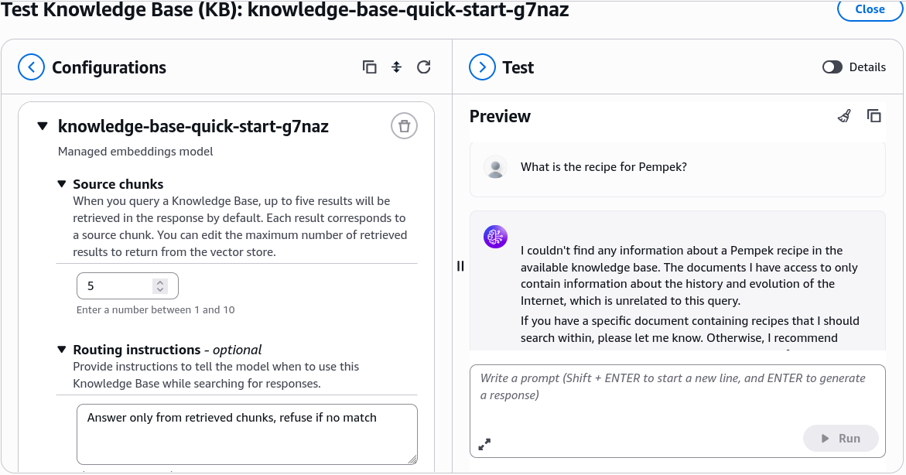
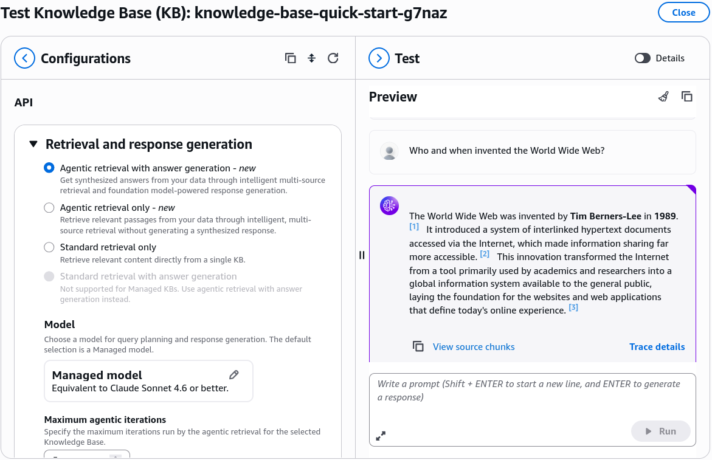
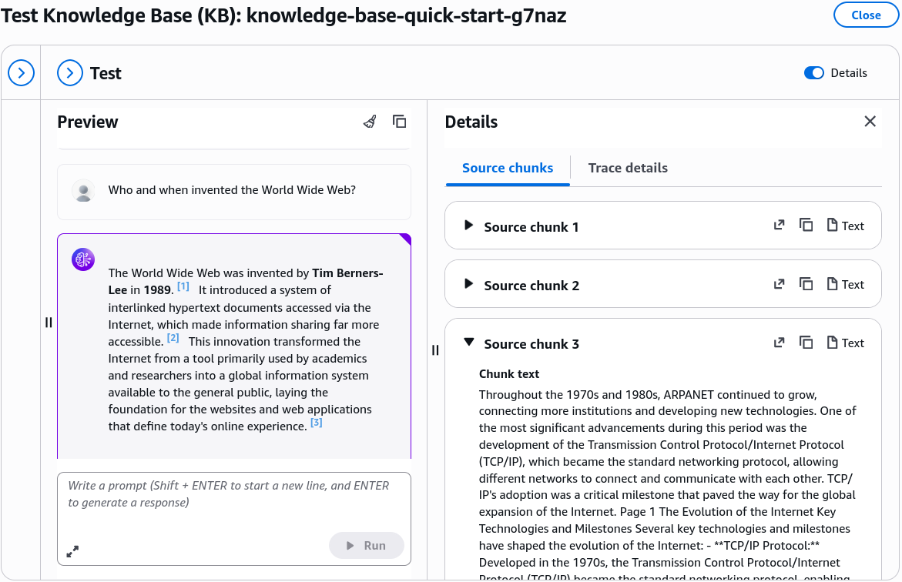

# RAG & Knowledge Base - Hands On

---

## Key Takeaways

Amazon Bedrock provides a easy-setup testing playground within Knowledge Bases. This allows you to evaluate Retrieval-Augmented Generation (RAG) mechanics immediately without spending a lot of time pre-provisioning vector stores, chunking strategies, or ingestion pipelines.

The underlying mechanism uses a structured **system prompt template** instructing the model to rely _only_ on retrieved search chunks. If a question falls outside the document's scope (e.g., asking for a guacamole recipe from an internet history document), the model strictly refuses to answer rather than hallucinating.

---

## Hands-On Workflow: Testing RAG with Bedrock Knowledge Bases

1. **Create an S3 Bucket & Upload a Document:**
   - Create a new **Amazon S3 bucket** in your AWS account.
   - Upload a reference document (e.g., [Evolution of the Internet Detailed](./assets/Evolution_of_the_Internet_Detailed.pdf)) to the bucket.
2. **Navigate to Bedrock Knowledge Bases:**
   - Open the **Amazon Bedrock Console**. In the left-hand navigation pane select **Knowledge Bases**.
   - Click **Create Managed KB**
   - Select **Amazon S3** as the data source and enter your S3 bucket URI
   - Leave everything else at default and click **Create Knowledge Base**.
3. **Testing the Knowledge Base:**
   - Once the Knowledge Base is created and the ingestion process is complete, click **Test**.
     
   - In **Retrieval and response generation** configuration, leave the default **Agentic retrieval with answer generation** and default model selection  
     
   - In the **KB** configuration, notice that you can specify how many chunks to retrieve (e.g., 5) and routing instructions for the model to follow (e.g., "Answer only from retrieved chunks, refuse if no match").  
     
4. **Execute Contextual RAG Queries & Inspect Citations:**
   - In the chat interface, enter an in-scope question `Who and when invented the World Wide Web?`.
   - Review the response generated by the foundation model.  
     
   - Click **Show details / View sources** next to the output.
   - Inspect the retrieved text snippets (**Source Chunk 1**, **Source Chunk 2**) to see the exact raw text extracted from the document that grounded the model's answer.  
     

5. **Test Negative Constraints & Hallucination Resistance:**
   - Submit an out-of-domain prompt completely unrelated to the uploaded document: `How to make Pempek?`
   - Observe that the system searches the document, finds zero relevant chunks, and returns a polite refusal stating it cannot find the answer in the provided search results.
   - This confirms that system prompt constraints and retrieval thresholds prevent hallucinations.

---

## Exam Guide

### Exam Tips

- **Zero-Setup RAG Exploration:** The **"Chat with your document"** feature in Bedrock Knowledge Bases is designed for quick prototyping and ad-hoc analysis on single documents without setting up Amazon OpenSearch Serverless or permanent S3 sync pipelines.
- **Hallucination Prevention Mechanics:** Grounding LLMs via RAG relies on two synchronized mechanisms:
  1. Semantic retrieval of top-$k$ relevant chunks from vector stores or document parsers.
  2. System prompt boundary conditions instructing the model to answer _exclusively_ from retrieved search results and state inability to answer when no match exists.
- **Source Citations & Verifiability:** A key architectural requirement in enterprise AI questions is **auditability**. Bedrock Knowledge Bases includes direct chunk-level references and document metadata citations in the response payload to satisfy compliance standards.

---

### Practice Test

#### Question 1

A compliance team requires an internal AI assistant to answer queries regarding legal contracts. To satisfy audit requirements, the system must return answers along with direct references and citations to the specific clauses in the source PDF files. When the requested information is absent from the contracts, the assistant must explicitly decline to answer rather than generating generic knowledge. Which architecture achieves this with minimal development effort?

- [ ] A. Train a custom foundation model from scratch using Amazon SageMaker
- [ ] B. Use Amazon Bedrock Knowledge Bases with RAG and a system prompt template that restricts answers to retrieved chunks
- [ ] C. Deploy a fine-tuned Amazon Titan model with high Temperature and Top-P settings
- [ ] D. Write a rule-based regular expression parser hosted on AWS Lambda

Correct Answer

- [x] B. Use Amazon Bedrock Knowledge Bases with RAG and a system prompt template that restricts answers to retrieved chunks
  - **Explanation:** **Amazon Bedrock Knowledge Bases** provides managed RAG that natively surfaces source citations and chunk references. Combined with system prompt boundaries instructing the model to rely solely on search results, it ensures auditability and prevents hallucinations.

---

#### Question 2

An AI practitioner wants to test whether a new policy document can effectively answer employee onboarding questions using Anthropic Claude 3.5 Sonnet on Amazon Bedrock. The practitioner wants to validate the responses immediately without provisioning an Amazon OpenSearch Serverless collection or creating permanent S3 data sync jobs. Which feature should be used?

- [ ] A. Amazon SageMaker Clarify
- [ ] B. Bedrock Knowledge Bases "Chat with your document"
- [ ] C. Supervised Model Fine-Tuning
- [ ] D. Amazon Bedrock Custom Model Import

Correct Answer

- [x] B. Bedrock Knowledge Bases "Chat with your document"
  - **Explanation:** The **"Chat with your document"** feature in Amazon Bedrock Knowledge Bases allows practitioners to upload a document directly and test conversational RAG retrieval and generation with zero infrastructure setup.

---
