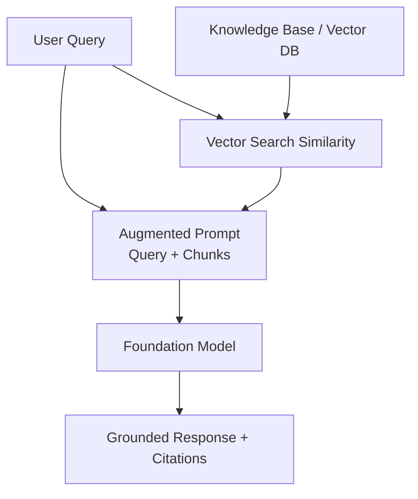
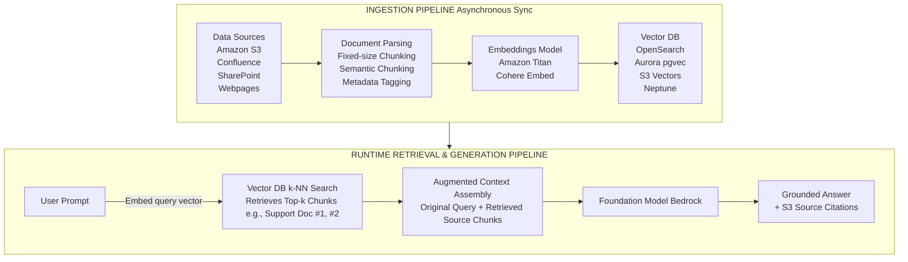
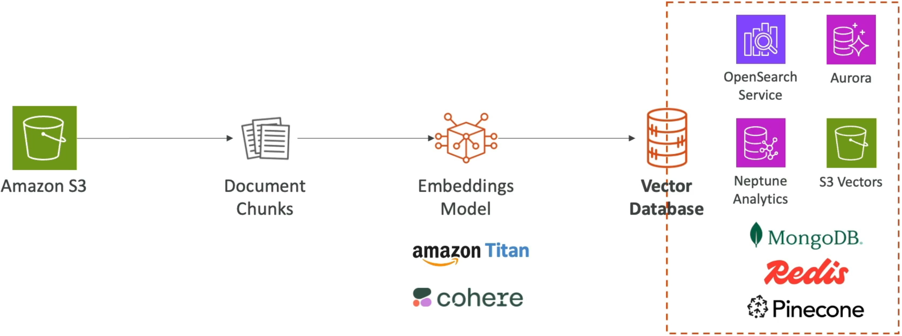
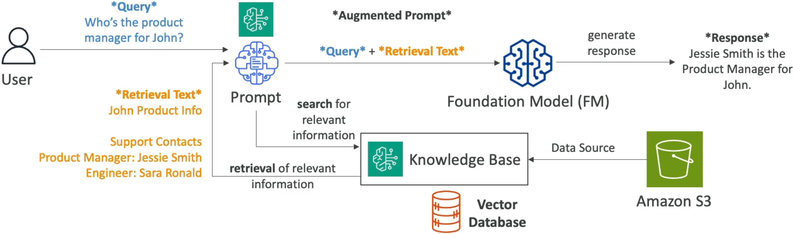

# RAG & Knowledge Base

---

## Key Takeaways

Retrieval-Augmented Generation (RAG) lets your Foundation Model (FM) reference dynamic, private, or real-time external data **without altering model weights or paying for expensive fine-tuning**.

On AWS, **Amazon Bedrock Knowledge Bases** provides a fully managed, end-to-end RAG architecture: it ingests documents from sources like **Amazon S3**, chunks the text, computes vector embeddings via models like **Amazon Titan Embeddings**, indexes them into a **Vector Database** (such as Amazon OpenSearch Serverless, Aurora PostgreSQL, Neptune Analytics, or S3 Vectors), and injects the retrieved context directly into the prompt alongside source citations.

---

## Main Discussion

### The Two-Phase Mechanics of Managed RAG

Amazon Bedrock Knowledge Bases decouples RAG into an **Ingestion Pipeline** (data preparation) and a **Retrieval/Generation Pipeline** (runtime inference).

1. **Ingestion & Sync:** Documents are parsed from raw formats (PDFs, Markdown, text, HTML), split into chunks, converted into multi-dimensional numerical representations (**Vector Embeddings**), and stored in an index.  
   
2. **Retrieval & Augmentation:** When a user queries the application, Bedrock converts the user query into a vector, runs a similarity search (like k-Nearest Neighbors / cosine similarity) against the vector database, and packages the matching document chunks into the prompt context.  
   

---

### The Mathematical Blueprint of Vector Embeddings & Similarity

Text chunks are transformed into continuous vector spaces $\mathbb{R}^d$. The relevance between a user prompt $q$ and stored document chunk $d_i$ is computed using **Cosine Similarity**:

$$\text{Similarity}(q, d_i) = \cos(\theta) = \frac{\mathbf{v}_q \cdot \mathbf{v}_{d_i}}{\Vert{}\mathbf{v}_q\Vert{} \Vert{}\mathbf{v}_{d_i}\Vert{}} = \frac{\sum_{j=1}^{d} v_{q,j} v_{d_i,j}}{\sqrt{\sum_{j=1}^{d} (v_{q,j})^2} \sqrt{\sum_{j=1}^{d} (v_{d_i,j})^2}}$$

$$\text{Augmented Prompt Payload } \mathcal{P}_{\text{final}} = \text{System Prompt} \;\Vert{}\; \text{Top-}k\left(\{d_i \mid \arg\max \text{Similarity}(q, d_i)\}\right) \;\Vert{}\; \text{User Query } q$$

---

### Vector Database Options in AWS: Architectural Selection Matrix

Amazon Bedrock Knowledge Bases connects with multiple native and third-party vector store backends depending on workload requirements:

| Vector Database Engine | Latency Profile | Ideal Workload Archetype |
| :--- | :--- | :--- |
| Amazon OpenSearch Serverless / Managed | Sub-10ms | Production RAG default; high QPS, hybrid keyword + k-NN search |
| Amazon Aurora PostgreSQL (with pgvector extension) | 10-100ms | Hybrid SQL relational transactional data stored alongside vectors |
| Amazon Neptune Analytics | Sub-second | GraphRAG; relationship traversal & multi-hop entity reasoning |
| Amazon S3 Vectors | Sub-100ms | Cost-optimized cold/warm tier; zero idle capacity charges |
| Third-Party Managed (Pinecone, Redis, Mongo) | Variable | Multi-cloud ecosystems (Pinecone, MongoDB Atlas, Redis Enterprise) |

- **Amazon OpenSearch Serverless:** The default managed vector engine for Bedrock Knowledge Bases. Automatically provisions compute units (OCUs) and indexes high-volume vector embeddings.
- **Amazon Aurora PostgreSQL (`pgvector`):** Combines standard structured relational queries and ACID transactions with vector similarity searches within the same database engine.
- **Amazon Neptune Analytics (GraphRAG):** Combines knowledge graph entity relationships with vector search to resolve multi-hop relational dependencies.
- **Amazon S3 Vectors:** Serverless object-storage vector indexing designed for cost-sensitive RAG without baseline idle hourly cluster fees.

---

### Data Connectors & Enterprise Implementation Patterns

Bedrock Knowledge Bases supports direct synchronization from native and enterprise SaaS data sources:

### Supported Data Source Connectors

- Amazon S3 (PDF, CSV, JSON, TXT, DOCX, HTML)
- Confluence Cloud
- Microsoft SharePoint Online
- Salesforce CRM Knowledge / Objects
- Web Crawlers (Public URLs & Documentation Feeds)

#### Real-World Implementation Archetypes

- **Customer Service Troubleshooting:** Ingests product manuals, return policies, and warranty PDFs from Amazon S3 to answer user inquiries with verified page citations.
- **Regulatory Compliance & Legal Research:** Syncs changing statutory documentation, court rulings, and internal policy wikis via SharePoint to generate legally grounded summaries.
- **Clinical Healthcare Decision Support:** Connects research papers, treatment guidelines, and diagnostic protocols to generate evidence-backed clinical references.

---

## Exam Guide

### Exam Tips

- **RAG vs. Fine-Tuning Decision Rules:**
- Choose **RAG (Knowledge Bases)** when you need to prevent hallucinations, incorporate real-time or private dynamic documentation, and provide traceable source citations without changing model weights.
- Choose **Fine-Tuning** when you need to teach the model a specific tone, style, specialized vocabulary, or deterministic output schema using labeled examples.
- **Component Roles in RAG:**
  - **Embeddings Models (e.g., Amazon Titan Text Embeddings):** Convert text chunks into numerical vectors. They do **not** generate conversational answers.
  - **Vector Database (e.g., OpenSearch Serverless):** Stores vectors and performs nearest-neighbor search.
  - **Generative Foundation Model (e.g., Claude, Titan Text):** Takes the augmented prompt (retrieved text + query) and generates the final natural language completion.
- **Traceability & Hallucination Reduction:** RAG provides **citations and direct references** back to the source S3 objects, making responses auditable and verifiable.

---

### Practice Test

#### Question 1

A financial institution wants to build an internal generative AI chatbot that answers employee questions about company-specific HR benefit policies stored in Amazon S3. The policies change monthly, and answers must cite the exact source document. The solution must not require retraining or modifying foundation model weights. Which architecture on AWS best satisfies these requirements?

- [ ] A. Train a custom foundation model from scratch using Amazon SageMaker JumpStart
- [ ] B. Perform supervised fine-tuning on an Amazon Titan model using policy question-answer pairs
- [ ] C. Configure an Amazon Bedrock Knowledge Base connected to the Amazon S3 bucket with OpenSearch Serverless
- [ ] D. Deploy an Amazon Neptune Graph database with hardcoded rule-based expert matching

Correct Answer

- [x] C. Configure an Amazon Bedrock Knowledge Base connected to the Amazon S3 bucket with OpenSearch Serverless
  - **Explanation:** **Amazon Bedrock Knowledge Bases** implements a managed RAG architecture that connects foundation models to external data sources (like Amazon S3) via vector stores (like OpenSearch Serverless). It allows dynamic updates as policies change without retraining model weights and provides verifiable document citations.

---

#### Question 2

In an Amazon Bedrock Knowledge Base RAG pipeline, which component is responsible for converting ingested document chunks into multi-dimensional numerical arrays for similarity indexing?

- A. Bedrock Guardrails
- B. Text Generation Foundation Model (e.g., Anthropic Claude)
- C. Text Embeddings Model (e.g., Amazon Titan Embeddings)
- D. AWS IAM Service Role

Correct Answer

- [x] C. Text Embeddings Model (e.g., Amazon Titan Embeddings)
  - **Explanation:** **Text Embeddings Models** (such as Amazon Titan Embeddings or Cohere Embed) convert text chunks and user queries into dense mathematical vector representations (embeddings) that are indexed and matched inside vector databases.

---
