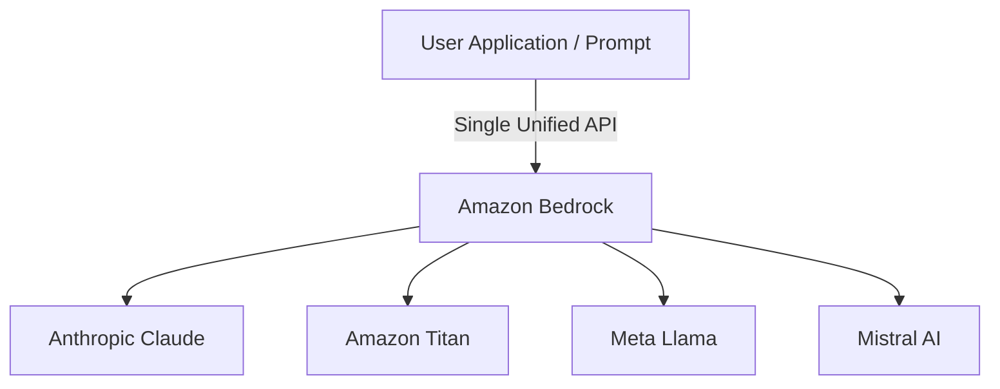
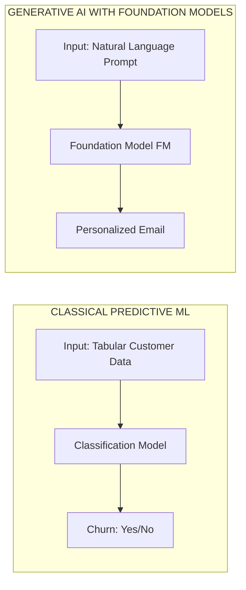
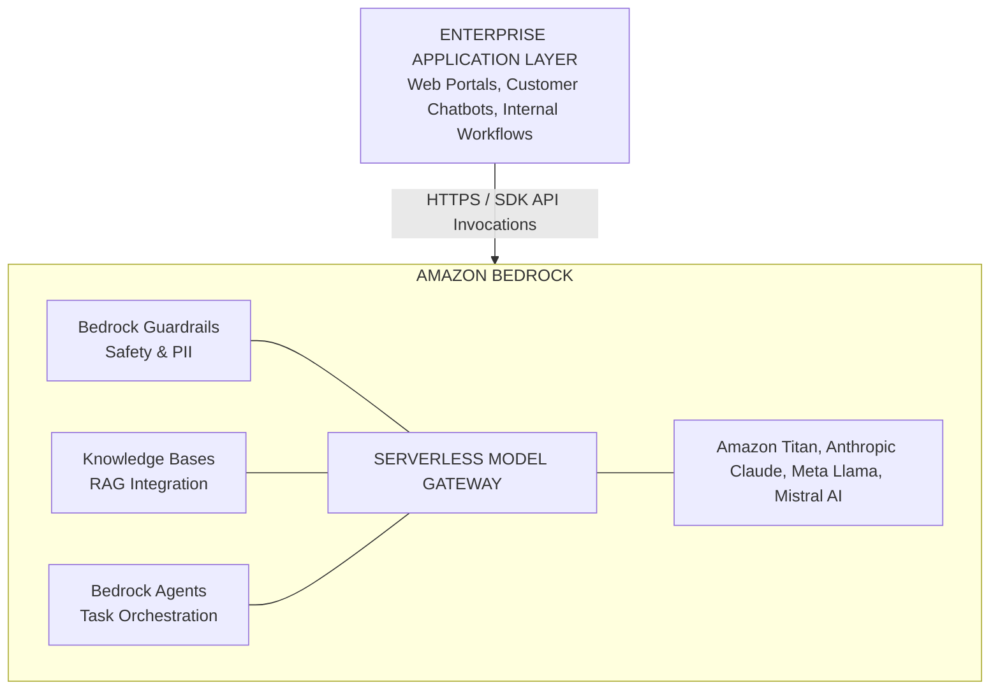

# Section Introduction

---

## Key Takeaways

Generative AI (GenAI) is the subset of deep learning that creates novel, original content (text, code, images, audio) using massive Foundation Models (FMs). While the public largely equates AI with conversational chatbots like ChatGPT, GenAI powers a much broader enterprise landscape.

On AWS, **Amazon Bedrock** is the flagship serverless, fully managed service for building GenAI applications. It exposes industry-leading Foundation Models via a single unified API without requiring infrastructure provisioning or GPU management.

---

## Main Discussion

### The Strategic Shift from Classical ML to Generative AI

Classical machine learning focuses on analyzing, classifying, or predicting numerical/categorical outcomes from structured data. Generative AI leverages pre-trained multi-billion parameter neural networks to generate unstructured artifacts dynamically:

- **Foundation Models (FMs):** Massive models trained on broad internet-scale data across billions of parameters.
- **Zero-Shot & Few-Shot Generalization:** Capable of performing downstream tasks (summarization, reasoning, translation, creative generation) without task-specific model retraining.

---

### Conceptual Architecture: The Amazon Bedrock Ecosystem

Amazon Bedrock acts as the serverless abstraction layer between enterprise applications and third-party foundation models:

$$\text{Bedrock Value Proposition} = \text{Multi-Model Choice} + \text{Serverless API} + \text{Enterprise Data Privacy} + \text{Built-in RAG/Agents}$$

- **Serverless Model Access:** Access models from multiple leading AI providers (e.g., Anthropic Claude, Meta Llama, Mistral, Amazon Titan) through one standardized API endpoint.
- **Zero Infrastructure Overhead:** No EC2 instances to launch, GPU capacity to allocate, or host operating systems to patch.
- **Enterprise Security & Privacy:** Customer prompt data and proprietary data used for RAG or fine-tuning remain strictly isolated within the customer's AWS account and are never used to train the base models.

---

### Amazon Bedrock Core Feature Map

To tailor foundation models to enterprise workflows, Bedrock incorporates specialized platform tools:

### Core Bedrock Capabilities

| Feature | Technical Purpose |
| :--- | :--- |
| Model Invocations | Query text, image, and multimodal models via SDK/API |
| Knowledge Bases | Managed Retrieval-Augmented Generation (RAG) using S3 data |
| Bedrock Agents | Multi-step execution planning & API calling (ReAct logic) |
| Bedrock Guardrails | Content filtering, safety guardrails, and PII masking |
| Model Customization | Fine-tuning and Continued Pre-training on proprietary data |

---

## Exam Guide

### Exam Tips

- **Primary Weighting on AIF-C01:** Generative AI and Foundation Model applications make up over **50% of the scored exam content** (Domains 2 & 3). Amazon Bedrock is the most heavily tested service on the exam.
- **Bedrock vs. SageMaker Distinction:**
  - Use **Amazon Bedrock** when you want to consume pre-built Foundation Models via serverless APIs with minimal operational overhead.
  - Use **Amazon SageMaker** when you need deep customization, full control over custom training scripts, specialized GPU infrastructure, or hosting custom open-source models on dedicated endpoints.
- **Data Privacy Default:** Prompts and responses sent through Amazon Bedrock are **not** shared with third-party model providers and are **never** used to train the underlying base foundation models.

---

### Practice Test

#### Question 1

A marketing firm wants to build an automated product copy generator. The development team needs to experiment with foundation models from multiple AI vendors (such as Anthropic and Meta) using a unified serverless API, without provisioning EC2 instances or managing GPUs. Which AWS service should they choose?

- A. Amazon SageMaker JumpStart with dedicated EC2 instances
- B. AWS Elastic Beanstalk with custom PyTorch models
- C. Amazon Bedrock
- D. Amazon Rekognition

Correct Answer

- [x] C. Amazon Bedrock
  - **Explanation:** **Amazon Bedrock** provides fully managed, serverless access to foundation models from multiple leading AI providers (including Anthropic, Meta, and Amazon) through a single unified API without requiring server management or infrastructure provisioning.

---

#### Question 2

An enterprise security architect wants to ensure that internal customer service prompts processed by a generative AI model do not leak into the public domain or train third-party foundation models. How does Amazon Bedrock maintain customer data privacy?

- A. Customer data is automatically uploaded to public leaderboards for accuracy scoring
- B. Bedrock does not use customer prompts or completions to train base foundation models
- C. Bedrock requires all prompts to be sent via public internet gateways without encryption
- D. Base foundation models are dynamically updated in real-time with each customer invocation

Correct Answer

- [x] B. Bedrock does not use customer prompts or completions to train base foundation models - **Explanation:** Amazon Bedrock guarantees enterprise-grade data privacy: customer prompts, responses, and fine-tuning datasets are never used to train the underlying base foundation models and remain isolated within the customer's AWS environment.

---
