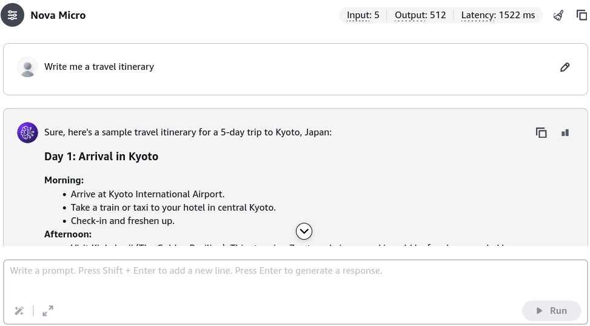
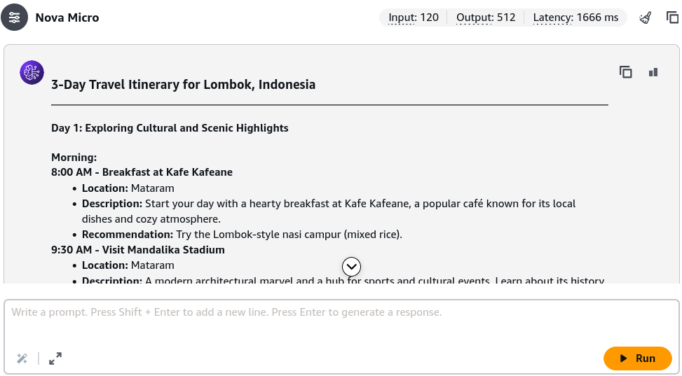

# Prompt Engineering - Hands On

---

## Key Takeaways

Naive prompts (e.g., _"Write me a travel itinerary"_) leave generation open to wide model interpretation, often resulting in generic or misaligned completions. High-precision outputs require applying the **Structured Prompting Framework**:

```
+---------------------------------------------------------------------------------------+
|                       THE STRUCTURED PROMPTING FRAMEWORK                              |
+---------------------------------------------------------------------------------------+
|  1. INSTRUCTIONS     ---> Task goals (e.g., 3-day balanced itinerary with meals)      |
|  2. CONTEXT          ---> User background (e.g., first-time visitor, hidden gems)     |
|  3. INPUT DATA       ---> Scope parameters (e.g., Lombok destination, news articles)  |
|  4. OUTPUT INDICATOR ---> Structural schema (e.g., timestamps, restaurant names)      |
+---------------------------------------------------------------------------------------+
                                           |
                                           v
+---------------------------------------------------------------------------------------+
| NEGATIVE PROMPTING (Exclusion Rules):                                                 |
| * "Do not include non-kids/family-friendly activities."                               |
| * "Avoid overly touristy restaurants."                                                |
| * "Do not recommend more than 3 activities per day."                                  |
+---------------------------------------------------------------------------------------+
```

Layering **Negative Constraints** directly suppresses unwanted tokens and bounds day-to-day activity density without modifying model parameters or incurring retraining costs.

---

## Hands-On Workflow: Iterative Prompt Refinement

1. **Execute a Naive Baseline Prompt:**
   - Open the **Amazon Bedrock Console** and navigate to **Playgrounds > Chat**.
   - Select an active text model (e.g., **Anthropic Claude 3 Haiku** or **Amazon Nova Micro**).
   - Enter an unconstrained baseline prompt: `Write me a travel itinerary`.
   - Click **Run**.
   - Observe the output: the model makes broad assumptions, selecting an arbitrary location (e.g., Japan), duration (e.g., 5 days), and pacing that may not match your goals.  
     
2. **Apply the Four-Block Structured Framework:**
   - Replace the naive query with a structured prompt combining **Instructions**, **Context**, **Input Data**, and an **Output Indicator**:

   ```text
   [INSTRUCTIONS]
   Create a detailed 3-day travel itinerary for Lombok, Indonesia. Include visits to historical landmarks, scenic spots, beaches,and popular local restaurants. Ensure a balanced schedule with suggestions for breakfast, lunch, and dinner.

   [CONTEXT]
   The travelers have never visited Lombok before and want to experience both iconic landmarks and authentic hidden gems.

   [INPUT DATA]
   Destination: Lombok, Indonesia. Duration: 3 Days.

   [OUTPUT INDICATOR]
   Format the itinerary day-by-day with specific time slots, location names, brief historical descriptions, and dining recommendations.
   ```

   - Click **Run** and evaluate the resulting completion: the response is tailored, structured by day and meal, and aligned with first-time visitors.  
     

3. **Layer Negative Prompting for Tone & Audience Filtering:**
   Append explicit negative constraints to eliminate unwanted activity categories:

   ```text
   [NEGATIVE CONSTRAINTS]
   - Do not include activities that are non-kid/family friendly.
   - Avoid overly touristy chain restaurants.
   - Avoid nightlife or adult entertainment venues.
   ```

- Click **Run**.
- Verify that the model now produces a family-friendly itinerary with a maximum of 3 activities per day, excluding tourist traps and chain restaurants.

4. **Enforce Structural & Density Constraints:**
   - Refine the negative constraints to limit schedule density:

   ```text
   [NEGATIVE CONSTRAINTS]
   - Do not include lengthy conversational introductions or conclusions.
   - Do not recommend more than 3 activities per day.
   ```

   - Click **Run**.
   - Notice how the model condenses the schedule to 3 focused activities per day, creating a cleaner, more realistic itinerary.

---

## Exam Guide

### Exam Tips

- **Iterative Prompting Lifecycle:** Prompt engineering is an empirical, iterative discipline:
  1. Start with clear **task instructions and role/context**.
  2. Provide structured **input data and explicit output formatting indicators**.
  3. Apply **negative prompting** to prune unwanted categories or behaviors.
- **Negative Prompting Mechanics:** Negative prompting instructs the LLM on what to **exclude or avoid**. Use it to eliminate verbose intros, filter out off-target audience recommendations, or enforce formatting restrictions without changing decoding hyperparameters.
- **Cost & Latency Implications:** While adding context and instructions increases input token counts slightly, constraining output length with precise output indicators and negative prompts **reduces output token generation**, which is the primary driver of both inference latency and API cost.

---

### Practice Test

#### Question 1

A corporate travel coordinator uses a foundation model on Amazon Bedrock to generate travel briefing documents for executive employees. The initial prompt produces descriptions that frequently recommend theme parks, family attractions, and budget hostels. Which prompt engineering technique should the coordinator apply to directly eliminate these unwanted suggestions?

- [ ] A. Decrease the model context window
- [ ] B. Incorporate negative prompting specifying categories and venue types to exclude
- [ ] C. Switch to an image embeddings model
- [ ] D. Perform continual pre-training on public travel blogs

<details>
<summary>Correct Answer</summary>

- [x] B. Incorporate negative prompting specifying categories and venue types to exclude
  - **Explanation:** **Negative prompting** explicitly instructs the model on what content, themes, or structures to avoid (such as family attractions or budget hostels), steering the output toward the desired executive focus.

</details>

---

#### Question 2

An AI practitioner is refining a prompt for Amazon Bedrock to summarize quarterly earnings reports. The prompt specifies the task instructions, the source financial report text, and background information on the target investor audience, but the model outputs an unpredictable mix of long essays and bullet points across runs. Which element of the prompt framework is missing?

- [ ] A. Input Data
- [ ] B. Output Indicator
- [ ] C. Embeddings Matrix
- [ ] D. AWS KMS CMK ARN

<details>
<summary>Correct Answer</summary>

- [x] B. Output Indicator
  - **Explanation:** An **Output Indicator** explicitly defines the format, schema, style, and length constraints of the output (e.g., _"Format as a 3-bullet summary under 100 words"_). Without it, the model chooses its own structural layout non-deterministically.. Without it, the model defaults to its own interpretation, resulting in inconsistent output formats.

</details>

---
