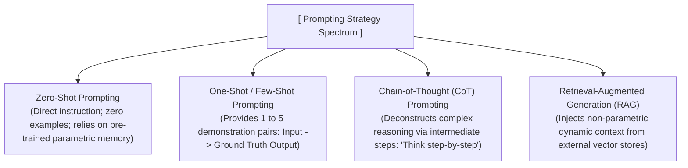
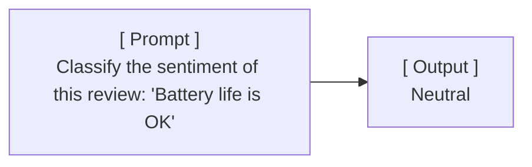
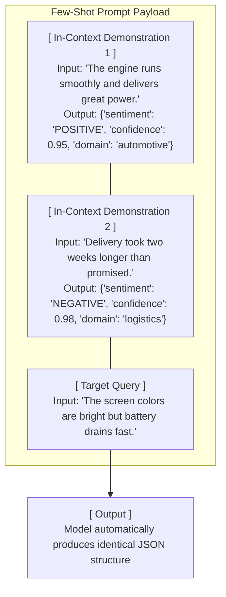
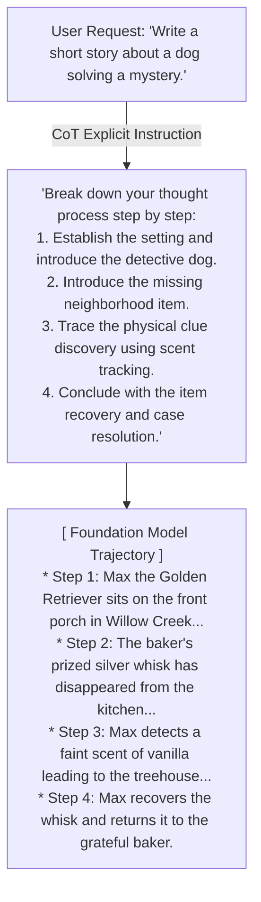
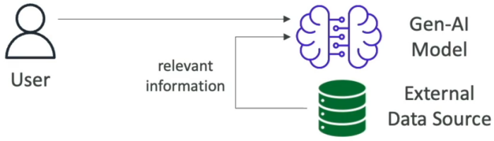
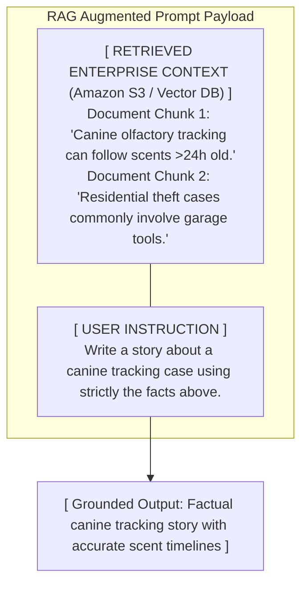

# Prompt Engineering Techniques

---

## Key Takeaways

Prompt engineering strategies provide explicit scaffolding to guide Foundation Models toward accurate, structured, and factually grounded completions. Rather than treating an LLM as a black box, selecting the appropriate prompting pattern controls both reasoning depth and output formatting:

Combining these techniques (such as **Few-Shot CoT** or **RAG with Step-by-Step reasoning**) allows models to solve multi-step analytical problems while eliminating formatting errors and hallucinations.

---

## Main Discussion

### The Strategic Prompting Taxonomy

| Prompting Strategy | In-Context Examples | Core Mechanism | Primary Architectural Fit |
| :--- | :--- | :--- | :--- |
| **Zero-Shot Prompting** | 0 Examples | Direct task instruction | Simple Q&A, sentiment classification, drafts |
| **One-Shot / Few-Shot Prompting** | 1 to 5 Input-Output demonstrations | In-context pattern matching | Precise JSON/XML schemas, domain-specific formatting |
| **Chain-of-Thought (CoT) Prompting** | Step-by-step breakdown instructions | Sequential latent reasoning steps | Multi-step logic, math, planning, complex Q&A |
| **Retrieval-Augmented Generation (RAG)** | External dynamic document chunks | Non-parametric context injection | Dynamic enterprise facts, citation-backed research |

---

### Zero-Shot vs. Few-Shot Prompting Mechanics

#### 1. Zero-Shot Prompting

Submits a direct natural language instruction without providing demonstration pairs. The model relies entirely on weights learned during pre-training and reinforcement learning (RLHF).

#### 2. Few-Shot (In-Context Learning) Prompting

Injects 1 to 5 input-output demonstration pairs inside the prompt payload. This teaches the model the exact stylistic pattern, tone, and syntactic structure expected without running model fine-tuning jobs.

$$\text{Few-Shot Prompt Payload} = \sum_{i=1}^{k} \left( \text{Example Input}_i + \text{Example Output}_i \right) + \text{Target Input}$$

---

### Chain-of-Thought (CoT) Prompting: Deconstructing Complex Logic

Standard autoregressive generation can produce logic errors on complex math, planning, or reasoning tasks when forced to jump directly from question to final answer. **Chain-of-Thought (CoT)** prompting introduces intermediate reasoning tokens to construct a step-by-step trajectory.

$$\text{Standard Prompt: } P(\text{Answer} \mid \text{Question}) \quad \Big\vert{} \quad \text{CoT Prompt: } P(\text{Steps} \mid \text{Question}) \times P(\text{Answer} \mid \text{Steps}, \text{Question})$$

- **Trigger Phrases:** Adding explicit steering phrases such as _"Let's think step by step"_ or providing explicit numbered milestones prevents the model from generating premature or disjointed conclusions.

---

### Retrieval-Augmented Generation (RAG) Prompt Integration

RAG enriches the prompt by injecting external, non-parametric knowledge retrieved from databases (e.g., Amazon S3 / OpenSearch Serverless) directly into the context window before execution.

---

## Exam Guide

### Exam Tips

- **Strategy Recognition Rules:**
  - **Zero-Shot:** Direct instruction; **no examples** provided in the prompt.
  - **One-Shot / Few-Shot:** Prompt includes **one or a few demonstration input-output pairs** to enforce formatting, structure, or tone.
  - **Chain-of-Thought (CoT):** Guides the model to solve complex multi-step reasoning by explicitly prompting it to **break the problem down step by step**.
  - **RAG:** Injects **external context retrieved from a database/document store** into the prompt to provide real-time facts and reduce hallucinations.
- **Few-Shot vs. Fine-Tuning:**
  - Use **Few-Shot Prompting** for lightweight in-context demonstration of formats without training costs or weight modifications.
  - Use **Supervised Fine-Tuning** when hundreds or thousands of examples are required and you want to reduce prompt token consumption across millions of requests.
- **Combining Patterns:** Exam scenarios frequently combine techniques (e.g., using **Few-Shot Chain-of-Thought** to provide 2 examples showing step-by-step mathematical reasoning).

---

### Practice Test

#### Question 1

A developer wants an Amazon Bedrock foundation model to extract customer sentiment from feedback emails and output the results strictly as a standardized JSON schema. The developer adds three complete examples of raw email text paired with their corresponding target JSON structures directly into the prompt before the user query. Which prompt engineering technique is being utilized?

- [ ] A. Zero-Shot Prompting
- [ ] B. Few-Shot Prompting
- [ ] C. Model Distillation
- [ ] D. Continued Pre-training

Correct Answer

- [x] B. Few-Shot Prompting
  - **Explanation:** **Few-Shot Prompting** involves providing a small number of concrete input-output demonstration pairs within the prompt context to guide the model on formatting, schema structure, and task execution.

---

#### Question 2

An AI system needs to solve multi-step word math problems and financial risk calculations. When queried directly, the foundation model frequently returns incorrect final numerical values due to skipped calculation steps. Which prompt engineering technique should the engineer apply to improve reasoning accuracy?

- [ ] A. Zero-Shot Prompting with maximum Temperature
- [ ] B. Chain-of-Thought (CoT) Prompting instructing the model to think step-by-step
- [ ] C. Increasing Top-K to 500
- [ ] D. Applying a PII masking filter in Bedrock Guardrails

Correct Answer

- [x] B. Chain-of-Thought (CoT) Prompting instructing the model to think step-by-step
  - **Explanation:** **Chain-of-Thought (CoT) Prompting** prompts the model to generate intermediate reasoning steps before arriving at a final answer (e.g., _"Let's think step by step"_), significantly improving accuracy on multi-step logical, mathematical, and reasoning tasks.

---
