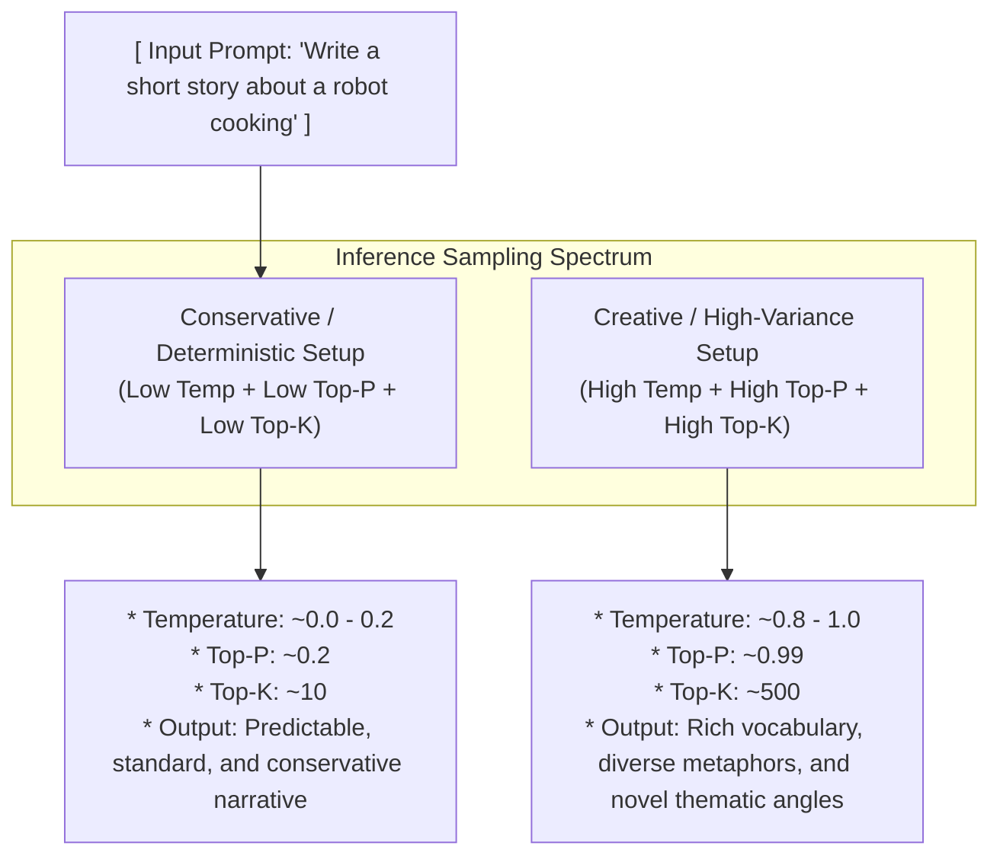
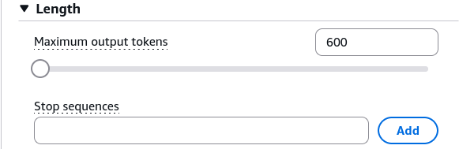
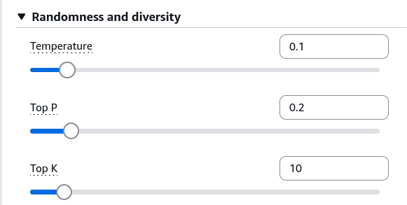
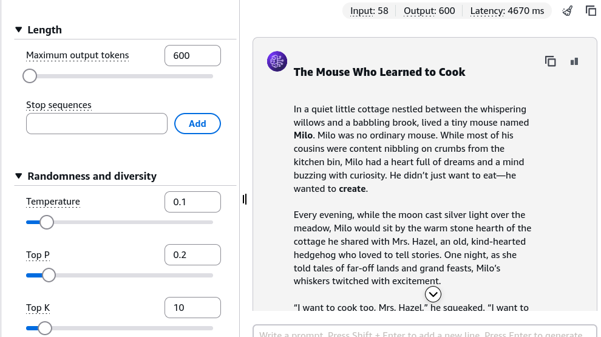
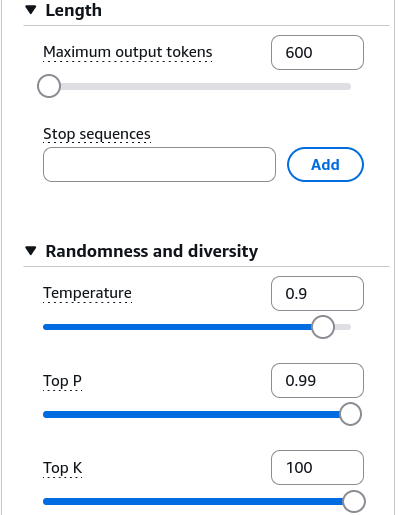
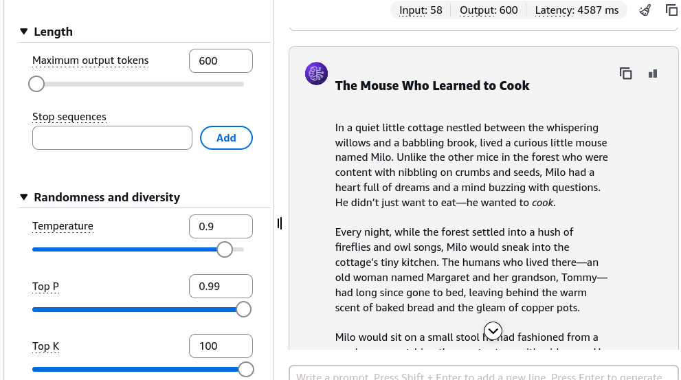

# Prompt Performance Optimization - Hands On

---

## Key Takeaways

Adjusting inference decoding hyperparameters in Amazon Bedrock directly reshapes the probability distribution and candidate token pool during text generation.



Controlling **Max Length** sets a hard upper bound on output token generation, preventing runaways and managing token costs. Modulating **Temperature**, **Top-P**, and **Top-K** alters the qualitative tone and variety of the completion without affecting inference latency or token billing rates.

---

## Hands-On Workflow: Benchmarking Decoding Hyperparameters

1. **Select Foundation Model & Set Length Constraints:**
   - Navigate to the **Amazon Bedrock Console** and open **Playgrounds > Chat / Text**.
   - Select an advanced reasoning text model (e.g., **Nova 2 Lite**).
   - In the configuration drawer, locate **Response length** / **Max generation length**.
   - Set the limit to **600 tokens** to bound completion size and manage execution costs.  
     
2. **Configure Conservative Sampling Parameters:**
   - Under the **Randomness and diversity** parameter panel, set conservative values:
   - **Temperature:** `0.1` - `0.2` (flattens probability distribution toward the single most likely token).
   - **Top-P (Nucleus Sampling):** `0.2` (restricts candidate token selection to the top 20% cumulative probability mass).
   - **Top-K:** `10` (limits sampling strictly to the top 10 most probable next tokens).  
     

3. **Run Baseline Generation & Evaluate Output Style:**
   - Submit a creative writing prompt:

   ```text
   Please write a short story about a mouse learning how to cook.
   ```

   - Click **Run**.
   - Review the completion: the story uses straightforward, predictable vocabulary (e.g., basic kitchen descriptions, standard chef-apprentice dialogue) and follows conventional narrative structures.  
     

4. **Configure High-Variance Creative Parameters:**
   - Modify the sampling parameters to maximize randomness and vocabulary diversity:
   - **Temperature:** `0.9` - `1.0` (softens logits, giving lower-probability tokens a higher chance of selection).
   - **Top-P:** `0.99` (broadens the candidate pool to 99% of total cumulative probability mass).
   - **Top-K:** `600` (evaluates up to 600 candidate tokens per generation step).  
     

5. **Re-Run Generation & Compare Outputs:**
   - Submit the identical prompt without changing any wording:

   ```text
   Please write a short story about a mouse learning how to cook.
   ```

   - Click **Run**.
   - Compare the qualitative output: the completion features descriptive metaphors and a more vivid narrative style.  
     

---

## Exam Guide

### Exam Tips

- **Hyperparameter Dialing Matrix:**
  - **Low Temperature + Low Top-P / Top-K:** Use for **code generation, mathematical proofs, factual extraction, and compliance tasks** where hallucination and variance must be minimized.
  - **High Temperature + High Top-P / Top-K:** Use for **creative writing, brainstorming, marketing copy, and synthetic data generation** where diversity and varied vocabulary are required.
- **Top-P vs. Top-K Parameter Definitions:**
  - **Top-P (Nucleus Sampling):** Dynamic threshold based on **cumulative probability percentile** (e.g., 0.9 = top 90% probability mass).
  - **Top-K:** Fixed cutoff based on the **integer count of candidate tokens** (e.g., top 50 tokens).
- **Length Constraints:** The **Max Length** parameter truncates output generation at a specified token count, capping latency and protecting your budget from unbounded responses.

---

### Practice Test

#### Question 1

A marketing team is using Amazon Bedrock to generate diverse slogans and engaging social media ad copy. The team feels the generated suggestions are too repetitive and generic across runs. Which combination of parameter adjustments will encourage more diverse and creative outputs?

- [ ] A. Set Temperature to 0.0, Top-P to 0.1, and Top-K to 5
- [ ] B. Set Temperature to 0.9, Top-P to 0.95, and Top-K to 250
- [ ] C. Decrease the Max Generation Length to 50 tokens
- [ ] D. Lower the foundation model context window

<details>
<summary>Correct Answer</summary>

- [x] B. Set Temperature to 0.9, Top-P to 0.95, and Top-K to 250
  - **Explanation:** Increasing **Temperature** (e.g., to 0.9), **Top-P** (to 0.95), and **Top-K** (to 250) expands the candidate token pool and flattens probability differences, resulting in higher vocabulary diversity and creative variety.

</details>

---

#### Question 2

An AI practitioner wants to limit the candidate vocabulary strictly to the top 20 most probable words during each token prediction step, regardless of their cumulative probability mass. Which inference parameter should be adjusted?

- [ ] A. Temperature
- [ ] B. Top-P
- [ ] C. Top-K
- [ ] D. Stop Sequence

<details>
<summary>Correct Answer</summary>

- [x] C. Top-K
  - **Explanation:** **Top-K** sets a hard numerical limit on the count of top candidate tokens considered during sampling (in this case, $K = 20$). Top-P filters based on cumulative probability mass rather than a fixed integer count.

</details>

---
