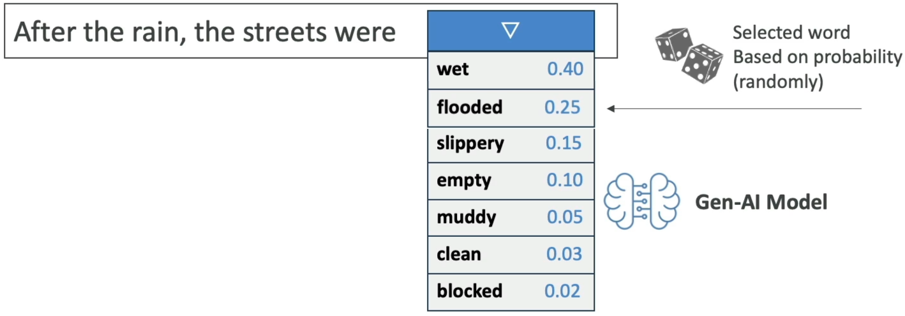
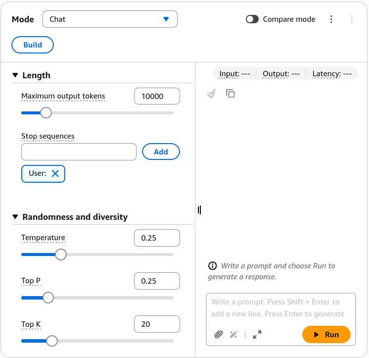

# Prompt Performance Optimization

---

## Key Takeaways

Foundation models generate completions sequentially by calculating probability distributions over candidate vocabulary tokens. You can control this token sampling process using inference decoding hyperparameters: **System Prompts**, **Temperature**, **Top-P (Nucleus Sampling)**, **Top-K**, **Max Generation Length**, and **Stop Sequences**.



```
Candidate Next Tokens: ["wet" (0.40), "flooded" (0.25), "slippery" (0.15), "empty" (0.10), "muddy" (0.10)]
                                           |
    +--------------------------------------+--------------------------------------+
    |                                      |                                      |
    v (Reshape Probabilities)              v (Cumulative Cutoff)                  v (Count Cutoff)
[ Temperature: e^(z_i / T) ]          [ Top-P: Sum(P) <= Threshold ]         [ Top-K: Top N Tokens ]
* Low (0.0-0.2) -> Conservative/Math  * Low (0.25) -> Top 25% prob mass      * Low (K=10) -> Top 10 words
* High (0.8-1.0) -> Creative/Diverse  * High (0.99) -> 99% broad pool        * High (K=500) -> Top 500 words
```

Critical architectural principle: **Decoding parameters (Temperature, Top-P, Top-K) do not affect inference latency or API token pricing**. Latency is driven by **model parameter scale**, **model family architecture**, **input prompt token size**, and **total output tokens generated**.

---

## Main Discussion

### Inference Hyperparameters: Mechanisms & Behavior



```
+----------------------------------------------------------------------------------------------------+
|                               INFERENCE HYPERPARAMETER MATRIX                                      |
+-------------------+-----------------------+--------------------+-----------------------------------+
| Parameter         | Range / Type          | Low Value Behavior | High Value Behavior               |
+-------------------+-----------------------+--------------------+-----------------------------------+
| System Prompt     | Natural language text | N/A                | Sets persona, behavioral rules,   |
|                   |                       |                    | tone, and domain expertise        |
+-------------------+-----------------------+--------------------+-----------------------------------+
| Temperature       | 0.0 to 1.0 (or >1.0)  | Deterministic,     | Creative, diverse,                |
|                   |                       | factual, focused   | exploratory, less predictable     |
+-------------------+-----------------------+--------------------+-----------------------------------+
| Top-P             | 0.0 to 1.0            | Restricts pool to  | Expands candidate pool across     |
| (Nucleus Sampling)|                       |top probability mass| 90%+ cumulative probability mass  |
+-------------------+-----------------------+--------------------+-----------------------------------+
| Top-K             | Integer (e.g. 1-500)  | Considers only the | Considers up to $K$ candidate     |
|                   |                       | top $K$ tokens     | tokens for higher variety         |
+-------------------+-----------------------+--------------------+-----------------------------------+
| Max Length        | Integer token count   | Truncates output   | Permits longer multi-turn or      |
|                   |                       | early              | long-form responses               |
+-------------------+-----------------------+--------------------+-----------------------------------+
| Stop Sequences    | String / Token array  | N/A                | Halts generation immediately upon |
|                   | (e.g. "\n\n", "User:")|                    | emitting the specified sequence   |
+-------------------+-----------------------+--------------------+-----------------------------------+
```

---

### Temperature vs. Top-P vs. Top-K: The Mathematical Difference

```
+-------------------------------------------------------------------------------+
| PROBABILITY DISTRIBUTIONS UNDER SAMPLING PARAMETERS                            |
|                                                                               |
| 1. TEMPERATURE (Modulates Logit Curve Softness):                              |
|    Softmax Logit Transformation: P(w_i) = exp(z_i / T) / Sum(exp(z_j / T))    |
|    * T -> 0.0: Sharp spike on the highest-probability token (Greedy search).  |
|    * T -> 1.0: Flattens logits, giving lower-ranked tokens higher selection odds.
|                                                                               |
| 2. TOP-P / NUCLEUS SAMPLING (Dynamically Adapts by Mass):                     |
|    Selects the smallest subset of tokens V^(P) such that:                     |
|         Sum_{w in V^(P)} P(w) >= P                                            |
|    * Dynamically expands when predictions are uncertain (flat distribution)   |
|    * Shrinks to 1-2 tokens when the model is confident (sharp distribution)   |
|                                                                               |
| 3. TOP-K SAMPLING (Static Count Cutoff):                                      |
|    Selects strictly the top K tokens with highest probabilities:              |
|         |V^(K)| = K                                                           |
+-------------------------------------------------------------------------------+
```

$$\text{Temperature Controls: } \textbf{How adventurous the choice is} \quad \Big\vert{} \quad \text{Top-P / Top-K Controls: } \textbf{What options are on the table}$$

---

### Factors Dictating Model Inference Latency

When optimizing generative AI response times, isolate true architectural bottlenecks from sampling settings:

```
+-----------------------------------------------------------------------------------+
| INFERENCE LATENCY DRIVER BREAKDOWN                                                |
+------------------------------------+----------------------------------------------+
| Latency Drivers (Direct Impact)    | Non-Latency Factors (Zero Impact)            |
+------------------------------------+----------------------------------------------+
| * Foundation Model Parameter Scale | * Temperature changes (0.0 vs 1.0)           |
| * Model Architecture (Nova Micro   | * Top-P probability threshold tweaks         |
|   vs. Claude Sonnet)               | * Top-K pool limits                          |
| * Input Prompt Token Length        | * System prompt tone (unless it forces       |
| * Output Generated Token Volume    |   longer output length)                      |
+------------------------------------+----------------------------------------------+
```

$$\text{Total Generation Latency} \approx \text{Time to First Token (TTFT)} + \left( \text{Output Token Count} \times \text{Inter-Token Latency} \right)$$

- **Input Token Overhead:** Ingesting 100,000 tokens of RAG context increases pre-fill computation before the first token is emitted.
- **Output Token Overhead:** Because autoregressive LLMs generate text token-by-token sequentially, producing 1,000 tokens takes significantly longer than producing 50 tokens.
- **Optimization Levers:** Use smaller/distilled models (e.g., _Nova Micro_ or _Nova Lite_), prune input prompt tokens, and enforce strict `max_tokens` limits.

---

## Exam Guide

### Exam Tips

- **Parameter Selection Rules:**
  - **Factual Q&A, Code Generation, Math, Extraction:** Set **Low Temperature (0.0–0.2)** and **Low Top-P (0.1–0.5)** to force deterministic, accurate outputs.
  - **Brainstorming, Marketing Copy, Creative Writing:** Set **High Temperature (0.7–1.0)** and **High Top-P (0.9–1.0)** to introduce variety and creative word choice.
- **Top-P vs. Top-K Distinction:**
  - **Top-P (Nucleus Sampling):** Chooses tokens based on **cumulative probability percentage mass** (e.g., top 90% sum).
  - **Top-K:** Chooses tokens based on a **fixed numerical integer count** (e.g., top 50 tokens).
- **Latency Misconceptions:** An exam question may try to trick you by suggesting that lowering Temperature or Top-P speeds up inference. **Temperature, Top-P, and Top-K have zero effect on latency or billing**. Latency is optimized by selecting smaller models or reducing token volume.
- **Stop Sequences:** Stop sequences (like `\n\n`, `###`, or `Human:`) tell the model to halt token generation immediately when encountered, saving output tokens and latency.

---

### Practice Test

#### Question 1

A financial institution is deploying an Amazon Bedrock foundation model to extract exact accounting figures from balance sheets into a structured JSON table. The team notices that the output occasionally introduces creative paraphrasing instead of adhering strictly to the facts in the text. Which hyperparameter adjustment will make the model responses more deterministic and factual?

- [ ] A. Increase Temperature to 1.0 and increase Top-K to 500
- [ ] B. Decrease Temperature toward 0.0 and reduce Top-P
- [ ] C. Increase the Maximum Generation Length
- [ ] D. Remove the System Prompt

<details>
<summary>Correct Answer</summary>

- [x] B. Decrease Temperature toward 0.0 and reduce Top-P
  - **Explanation:** Lowering **Temperature** (toward 0.0) and reducing **Top-P** makes token selection greedy and deterministic, prioritizing the highest-probability factual tokens and suppressing random or creative token sampling.

</details>

---

#### Question 2

An AI engineer wants to reduce the response latency of an interactive customer service chatbot built on Amazon Bedrock. Which change will directly reduce latency?

- [ ] A. Reducing the Top-P value from 0.95 to 0.2
- [ ] B. Lowering the Temperature from 0.7 to 0.0
- [ ] C. Switching from a heavy reasoning foundation model to Amazon Nova Micro and capping the maximum output token length
- [ ] D. Adding a custom word filter inside Bedrock Guardrails

<details>
<summary>Correct Answer</summary>

- [x] C. Switching from a heavy reasoning foundation model to Amazon Nova Micro and capping the maximum output token length
  - **Explanation:** Inference latency is directly driven by the **model architecture/size** and the **number of generated output tokens**. Switching to a lightweight model like **Amazon Nova Micro** and capping generation length significantly reduces response times. Adjusting Temperature or Top-P changes probability distributions but has no impact on processing latency.

</details>

---
