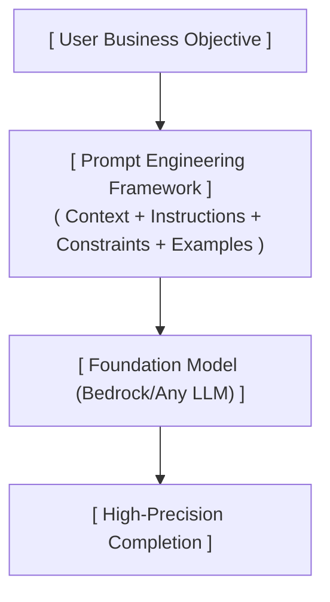

# Section Introduction

---

## Key Takeaways

Prompt engineering is the practice of designing, structuring, and optimizing natural language inputs (**Prompts**) to steer Foundation Models (FMs) and Large Language Models (LLMs) toward accurate, deterministic, and safe completions.

Mastering prompt engineering provides immediate benefits across all generative AI models (Anthropic Claude, Amazon Titan, Amazon Nova, Meta Llama, OpenAI ChatGPT) without requiring expensive GPU compute, model retraining, or fine-tuning pipelines.

---

## Main Discussion

### The Strategic Value of Prompt Engineering

Prompt engineering represents the most cost-effective tier in the Generative AI customization spectrum. Modifying prompt architecture costs zero additional training compute while providing direct control over model outputs:

| Approach | Resource Requirements | Primary Benefit |
| :--- | :--- | :--- |
| **Prompt Engineering** | Lowest (Zero Training) | Instant iteration, portable |
| **Retrieval-Augmented Gen** | Moderate (Vector DB) | Dynamic & private grounding |
| **Supervised Fine-Tuning** | High (Labeled Data) | Style, syntax, custom tone |
| **Continued Pre-training** | Highest (GPU Compute) | New domain vocabulary |

$$\text{Prompt ROI} = \frac{\text{Accuracy \& Determinism Gains}}{\text{Zero Additional Training Cost}}$$

---

### Core Building Blocks of an Enterprise Prompt

An enterprise-grade prompt goes beyond casual chat questions. It organizes input context into distinct structural sections:

*   **1. SYSTEM PERSONA / ROLE:**
    *   "You are an expert AWS Solutions Architect specializing in serverless..."
*   **2. TASK INSTRUCTION:**
    *   "Analyze the provided architecture and identify single points of failure."
*   **3. CONTEXT & REFERENCE DATA:**
    *   "`<context>` EC2 single-AZ deployment with standalone MySQL RDS `</context>`"
*   **4. CONSTRAINTS & NEGATIVE PROMPTING:**
    *   "Do not recommend multi-region deployments. Keep solutions cost-effective."
*   **5. OUTPUT FORMAT SCHEMA:**
    *   "Format your response as a valid JSON object matching: \{ 'risks': [] \}"

---

### Key Prompting Techniques Covered in this Section

Throughout this section, we explore standard techniques tested on the AIF-C01 exam:

| Technique | Conceptual Focus |
| :--- | :--- |
| **Zero-Shot Prompting** | Direct task request with zero reference examples |
| **Few-Shot Prompting** | Providing 1-5 input-output demonstration pairs in context |
| **Chain-of-Thought (CoT)** | Guiding the model to break complex logic step-by-step |
| **System vs. User Prompts** | Setting persistent behavioral boundaries vs. user inputs |
| **Parameter Controls** | Tuning Temperature, Top-P, and Top-K for variance control |

---

## Exam Guide

### Exam Tips

- **High-Yield Exam Focus (Domains 2 & 3):** Prompt engineering and foundation model tuning represent a core portion of the **AWS Certified AI Practitioner (AIF-C01)** exam.
- **Prompt Engineering vs. Fine-Tuning:** Always remember the decision rule:
  - Choose **Prompt Engineering** first when seeking to improve accuracy, guide formatting, or set personas with minimal cost and zero infrastructure overhead.
  - Choose **Fine-Tuning** only when prompt engineering and RAG fail to achieve required consistency on specialized schemas or domain-specific language.
- **Model Agnostic Portability:** Techniques like clear delineation (`###` or XML tags), step-by-step reasoning, and few-shot formatting apply uniformly across all foundation models hosted on **Amazon Bedrock**.

---

### Practice Test

#### Question 1

A software engineering team is developing a document summarization assistant on Amazon Bedrock. The model occasionally produces conversational filler and fails to follow the required JSON output schema. What is the most cost-effective initial step to resolve this issue?

- [ ] A. Perform continued pre-training on an Amazon Titan model using raw company documentation
- [ ] B. Apply prompt engineering techniques by providing explicit system instructions, output constraints, and few-shot JSON examples
- [ ] C. Purchase dedicated Provisioned Throughput model units for 6 months
- [ ] D. Deploy an Amazon SageMaker training job to train a transformer model from scratch

Correct Answer

- [x] B. Apply prompt engineering techniques by providing explicit system instructions, output constraints, and few-shot JSON examples -
      **Explanation:** **Prompt engineering** (including clear system constraints, few-shot demonstration examples, and schema specifications) is the most immediate, cost-effective method to improve formatting adherence without incurring model training or infrastructure costs.

---

#### Question 2

Under the AWS Certified AI Practitioner framework, which of the following is considered a key advantage of prompt engineering over model fine-tuning?

- [ ] A. It permanently changes the underlying mathematical weights of the foundation model
- [ ] B. It allows rapid iteration and immediate testing across multiple foundation models with zero computational training costs
- [ ] C. It eliminates the need to configure IAM security roles in AWS
- [ ] D. It automatically provisions an Amazon OpenSearch Serverless vector index

Correct Answer

- [x] B. It allows rapid iteration and immediate testing across multiple foundation models with zero computational training costs -
      **Explanation:** Prompt engineering requires no training datasets, GPU capacity, or weight updates. It allows developers to refine prompts and evaluate outputs across different foundation models instantly with zero training overhead.

---
