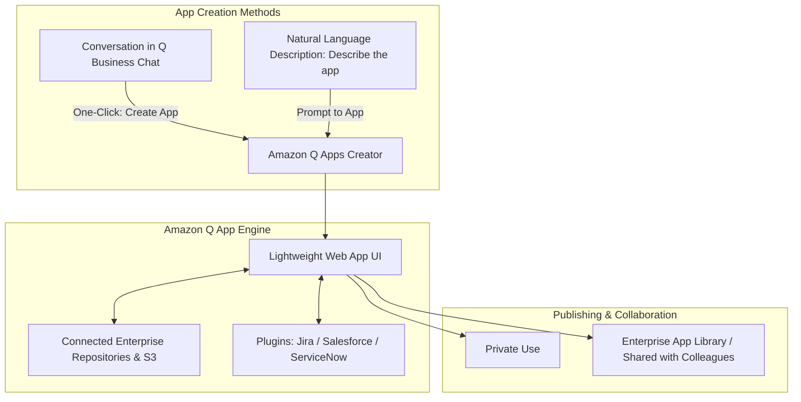
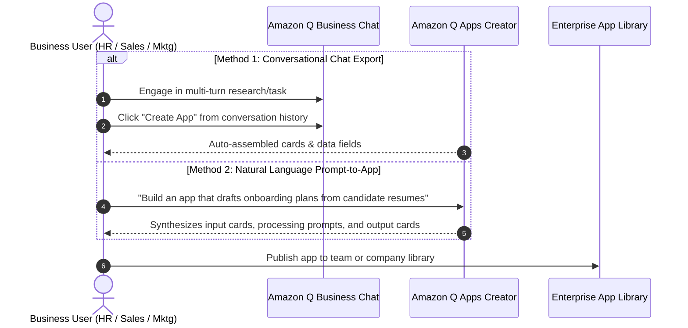
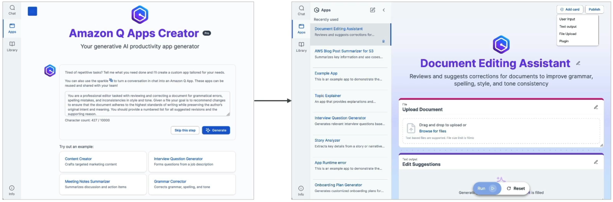
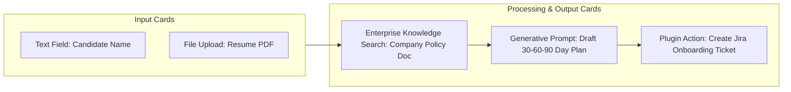

# Amazon Q Apps & No-Code Generative App Creation

---

## Key Takeaways

**Amazon Q Apps** is a lightweight, no-code application builder built directly into **Amazon Q Business**. It enables non-technical employees to turn ideas into purpose-built, generative AI web applications in seconds using natural language prompts or existing conversational chat sessions.

Q Apps automatically chains prompts, inputs (file uploads, text inputs), enterprise data retrieval, and plugin actions into customizable cards. Users can publish apps to an organization-wide **App Library** without writing a single line of frontend code, backend logic, or machine learning infrastructure.

---

## Main Discussion

### How Q Apps Are Created

Employees can generate custom workplace applications using two direct pathways:

---

### Card-Based Architecture: The Building Blocks of a Q App

Every Amazon Q App is constructed from modular **Cards** that process information sequentially:

| Card Type                | Purpose                                                             | Example                                                    |
| ------------------------ | ------------------------------------------------------------------- | ---------------------------------------------------------- |
| **Input Card**           | Collects text, numbers, or document uploads from the user           | Job title field, PDF resume upload                         |
| **Prompt Card**          | Executes generative tasks or queries connected knowledge bases      | "Summarize candidate strengths against company guidelines" |
| **Plugin / Action Card** | Calls external business APIs to create or update enterprise records | Create an issue in Jira or log a lead in Salesforce        |

---

### Enterprise Sharing & Governance

Amazon Q Apps operates under enterprise access controls:

| Feature                    | Scope & Capability                                                                                   |
| -------------------------- | ---------------------------------------------------------------------------------------------------- |
| **Private Workspace**      | Personal apps accessible only by the creator for ad-hoc daily productivity                           |
| **Enterprise App Library** | Central catalog where employees discover, run, duplicate, and customize team apps                    |
| **Permission Inheritance** | Q Apps respects underlying document permissions; users only see output from data they have access to |
| **No-Code Editing**        | Users can inspect and tweak underlying card prompts or add new steps via visual drag-and-drop        |

---

## Exam Guide

### Exam Tips

- **Definition Rule:** If an exam scenario describes business users or non-technical employees creating **custom generative AI applications without writing code or involving software engineers**, the correct answer is **Amazon Q Apps** (within Amazon Q Business).
- **Creation Mechanisms:** Q Apps can be created either by **describing requirements in plain English** in the Q Apps Creator or by clicking **Create App** directly from an active Amazon Q Business conversation.
- **Security Scope:** Q Apps inherits enterprise security from **Amazon Q Business** and **IAM Identity Center**. An app cannot bypass source Access Control Lists (ACLs) to expose data to unauthorized employees.
- **Q Apps vs. Bedrock Agents:**
  - **Amazon Q Apps:** Non-technical, no-code web UI tool for business employees within Q Business.
  - **Amazon Bedrock Agents:** Developer-centric orchestrator requiring OpenAPI 3.0 schemas, AWS Lambda code, and IAM policies.

---

### Practice Test

#### Question 1

A marketing manager wants to build a standardized tool for their team that accepts campaign themes, searches internal brand guidelines in Amazon S3, and drafts email copy. The manager has no programming experience and wants to share this tool with colleagues through an internal catalog. Which AWS solution provides this capability with zero coding?

- [ ] A. Amazon SageMaker Model Registry
- [ ] B. Amazon Q Apps in Amazon Q Business
- [ ] C. Amazon Bedrock Custom Model Import
- [ ] D. AWS Step Functions with Amazon Polly

Correct Answer

- [x] B. Amazon Q Apps in Amazon Q Business
  - **Explanation:** **Amazon Q Apps** allows non-technical business employees to build, customize, and share generative AI applications using plain language prompts and enterprise data sources without writing code.

---

#### Question 2

How does Amazon Q Apps determine what corporate data a user can view when executing a shared application created by another employee?

- [ ] A. It shares all output publicly across the entire AWS account
- [ ] B. It inherits the user's specific access permissions and ACLs configured through IAM Identity Center
- [ ] C. It requires the app creator to provide administrative root credentials
- [ ] D. It converts all enterprise data to public S3 buckets

Correct Answer

- [x] B. It inherits the user's specific access permissions and ACLs configured through IAM Identity Center
  - **Explanation:** Amazon Q Apps inherits the governance model of Amazon Q Business and **IAM Identity Center**, ensuring that when a user runs a shared app, the system strictly respects that specific user's document access permissions and ACLs.

---
