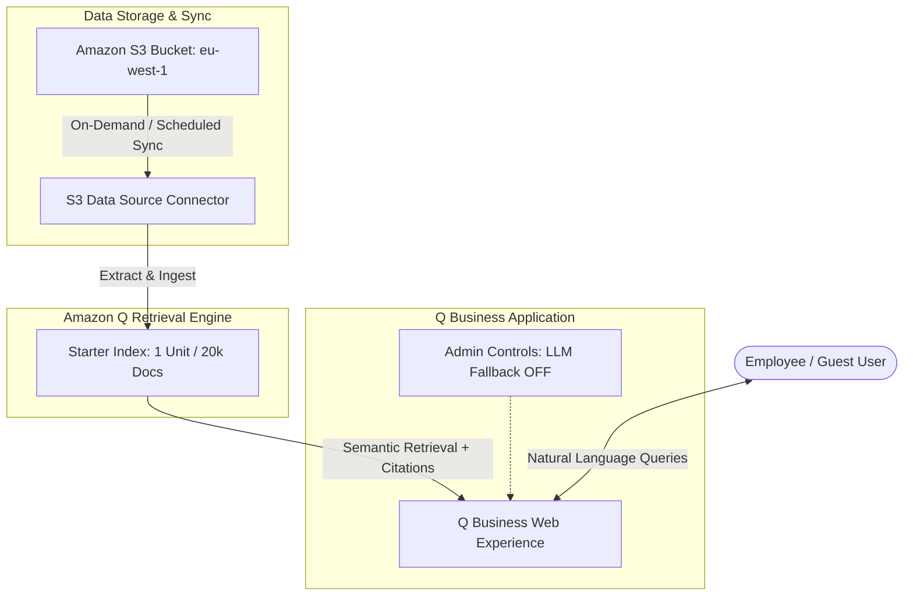
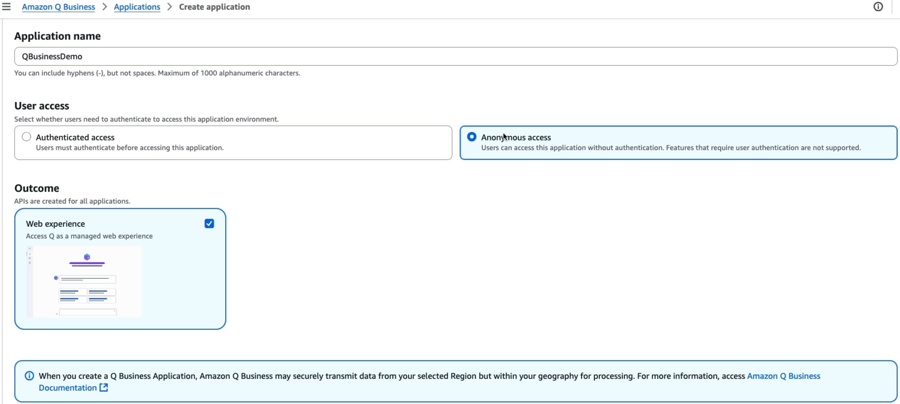
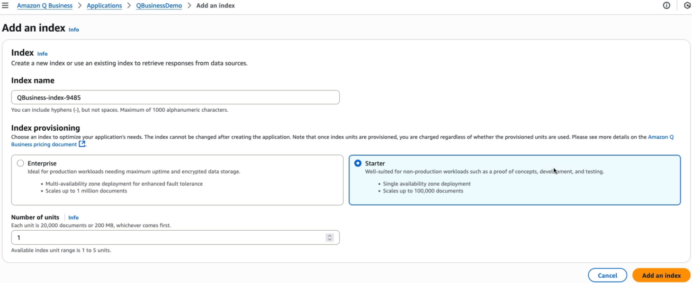
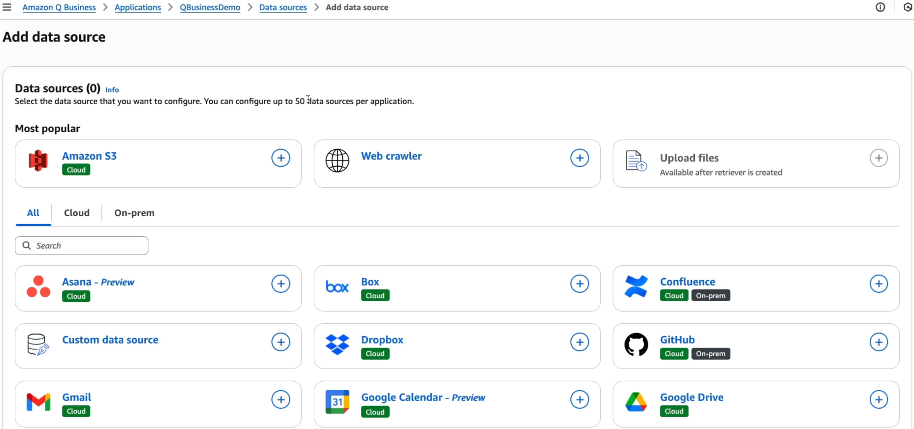
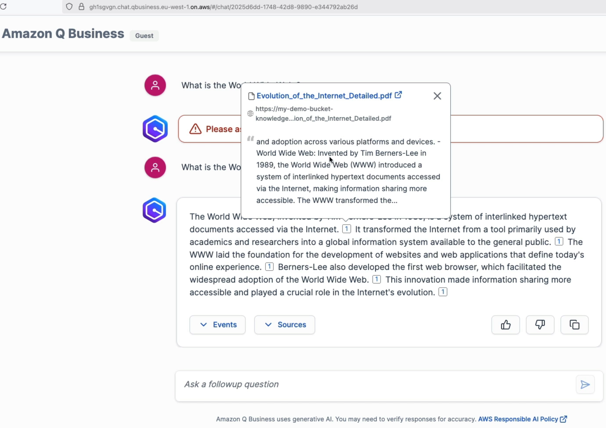
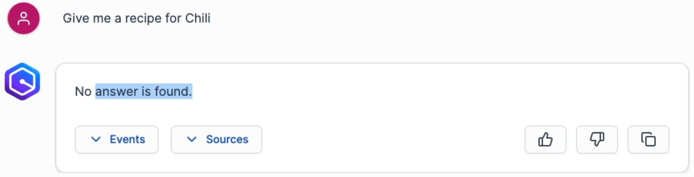
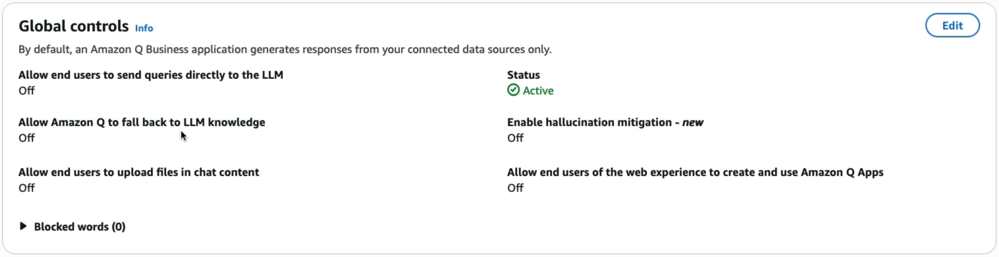

# Hands-On Lab: Amazon Q Business Application Deployment & S3 Ingestion

---

## Key Takeaways

Amazon Q Business delivers a turnkey enterprise generative AI assistant that indexes company data without requiring manual vector database coding or prompt scaffolding.

A complete deployment consists of an **Application**, an **Index** (Starter vs. Enterprise tier), and one or more **Data Sources** (such as Amazon S3). By default, fallback to general foundation model knowledge is **disabled**, ensuring the assistant answers _exclusively_ from verified internal documents and declines out-of-scope queries (like cooking recipes).

---

## Hands-On Workflow: End-to-End Q Business Setup

1. **Create the Amazon Q Business Application:**
   - Open the **Amazon Q Business Console** in a supported region (e.g., `ap-southeast-2` Sydney).
   - Click **Get started** and select **Create application**.
   - **Application name:** `QBusinessDemo`.
   - **User Access:** Select _Anonymous access_ (for rapid demonstration/PoC testing without full IAM Identity Center user provisioning).  
     :::warning
     Q Business Anonymous Access costs $200/month
     :::
   - Click **Create** to deploy the base application environment.  
     
2. **Provision the Document Index:**
   - Navigate to **Data sources > Index** within the newly created application:
   - Click **Add index**.
   - **Index Tier:** Select **Starter index** (optimized for PoCs and developer workloads).
   - **Capacity Units:** Select **1 unit** (supports up to 20,000 documents or 200 MB of extracted text, plus 100 hours of connector runtime per month).
   - Click **Create index** (provisioning takes several minutes).  
     
3. **Configure Amazon S3 Data Source Connector:**
   - In the target region (`ap-southeast-2`), create an S3 bucket (e.g., `my-qbusiness-kb-ap-southeast-2`) and upload the sample reference file (`Evolution of the Internet Detailed.pdf`).
   - Return to Amazon Q Business and select **Add data source > Amazon S3**.
   - **Data source name:** `MyS3KnowledgeBase`.
   - **IAM Role:** Select _Create and use a new service role_.
   - **Sync Scope:** Browse and select your S3 bucket URI.
   - **Sync Mode & Schedule:** Select **Full sync** on an **On-demand** schedule.
   - Click **Add data source**.  
     
4. **Execute Document Synchronization & Ingestion:**
   - Open the newly provisioned data source:
   - Click **Sync now** to crawl the S3 bucket, extract text, chunk content, and generate index entries.
   - Wait for the sync status to transition from _Syncing_ to _Idle_ (verifying `1 item scanned and indexed`).
5. **Validate Conversational Retrieval & Source Citations:**
   - Open the **Preview web experience** chat window:
   - Submit an in-scope question:`What is the World Wide Web?`
   - Review the generated answer (identifying Tim Berners-Lee in 1989).
   - Expand **Sources** to view the exact linked PDF object in Amazon S3, along with the precise excerpt and timeline events.  
     
6. **Test Admin Controls & Domain Grounding:**
   - Submit an out-of-domain query: `Give me a recipe for Mi Goreng?`
   - Verify that Amazon Q Business explicitly states no relevant answer was found in the internal knowledge base.
   - Confirm that with **LLM Knowledge Fallback turned OFF**, the assistant refuses to hallucinate external internet answers.  
     
7. **Perform Critical Teardown & Resource Deletion:**
   - To avoid ongoing hourly index and consumption charges:
   - In Amazon Q Business, delete the **Data Source Connector**.
   - Delete the **Starter Index** and the **Q Business Application**.
   - (Optional) Empty and delete the regional Amazon S3 bucket.

---

## Pricing & Architectural Comparison

| Dimension                  | Starter Index                        | Enterprise Index                        |
| -------------------------- | ------------------------------------ | --------------------------------------- |
| **Target Workload**        | Proof-of-Concept (PoC) & Development | Enterprise Production Workloads         |
| **Availability**           | Single Availability Zone (1 AZ)      | Multi-AZ High Availability (3 AZs)      |
| **Base Capacity per Unit** | 20,000 documents or 200 MB text      | 20,000 documents or 200 MB text         |
| **Connector Allowance**    | 100 connector hours/month            | 100 connector hours/month               |
| **Encryption Support**     | AWS-managed default keys             | AWS KMS Customer Managed Keys (CMK)     |
| **Capacity Limit**         | Up to 5 units per application        | Scalable enterprise multi-unit capacity |

### User Access / Tier Pricing

| Access / Tier Type   | Pricing Model                      | Key Features & Constraints                                 |
| -------------------- | ---------------------------------- | ---------------------------------------------------------- |
| **Anonymous Access** | Consumption ($200/month flat base) | Quick evaluation without user directories; non-production  |
| **Q Business Lite**  | $3 / user / month                  | Basic permission-aware Q&A, chat web app, S3/SaaS RAG      |
| **Q Business Pro**   | $20 / user / month                 | Full suite: Q Apps builder, QuickSight Reader Pro, plugins |

---

## Exam Guide

### Exam Tips

- **Grounding & Fallback Behavior:** By default, Amazon Q Business restricts its answers **strictly to ingested data sources**. To allow general web/LLM Q&A alongside private documents, administrators must explicitly toggle **Fallback to LLM knowledge** to ON in Admin Controls.  
  
- **Starter vs. Enterprise Index:**
  - **Starter Index:** Single AZ deployment; best for testing and development.
  - **Enterprise Index:** Deployed across **3 Availability Zones**; supports **KMS Customer Managed Keys (CMK)** for production compliance.
- **Sync Modes:**
  - **Full Sync:** Re-scans and re-indexes all documents in the source repository.
  - **New, Modified, or Deleted (Delta Sync):** Cost- and compute-optimized mode that syncs only incremental file changes on an automated schedule (e.g., hourly/daily).
- **Source Attribution:** Every response generated from connected data sources includes **interactive source citations and event traces** linking directly back to the original file in Amazon S3 or SaaS repositories.

---

### Practice Test

#### Question 1

A proof-of-concept team wants to deploy Amazon Q Business to test indexing 15,000 PDF documents stored in Amazon S3. The solution is for testing only, does not require multi-AZ redundancy or customer-managed KMS encryption, and must minimize hourly index capacity charges. Which index configuration should the team select?

- [ ] A. Enterprise Index with 5 units
- [ ] B. Starter Index with 1 unit
- [ ] C. Amazon OpenSearch Service Managed Cluster
- [ ] D. Amazon Bedrock Provisioned Throughput

Correct Answer

- [x] B. Starter Index with 1 unit
  - **Explanation:** A **Starter Index** is deployed in a single AZ, is designed for PoCs and developer testing, and 1 unit provides capacity for up to 20,000 documents or 200 MB of extracted text at the lowest base index cost.

---

#### Question 2

An enterprise security policy requires that an internal AI assistant must never answer questions using public internet information or unverified external foundation model pre-training knowledge. The assistant should strictly state that no answer was found if the query cannot be answered from corporate documents. Which configuration enforces this requirement in Amazon Q Business?

- [ ] A. Set the Foundation Model Temperature to 1.0
- [ ] B. Disable the "Fallback to LLM knowledge" setting in Amazon Q Business Admin Controls
- [ ] C. Configure an AWS Lambda Action Group with an OpenAPI schema
- [ ] D. Enable Amazon Rekognition Custom Labels

Correct Answer

- [x] B. Disable the "Fallback to LLM knowledge" setting in Amazon Q Business Admin Controls
  - **Explanation:** Turning off **Fallback to LLM knowledge** in Amazon Q Business Admin Controls ensures the model generates answers derived strictly from connected enterprise data sources and returns a "no answer found" refusal when queried about external or out-of-scope topics.

---
