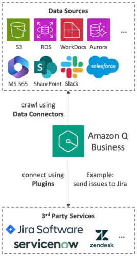
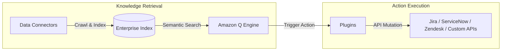
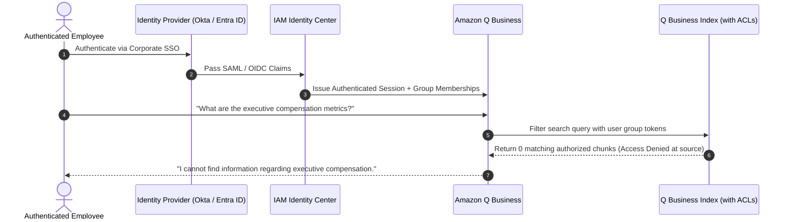
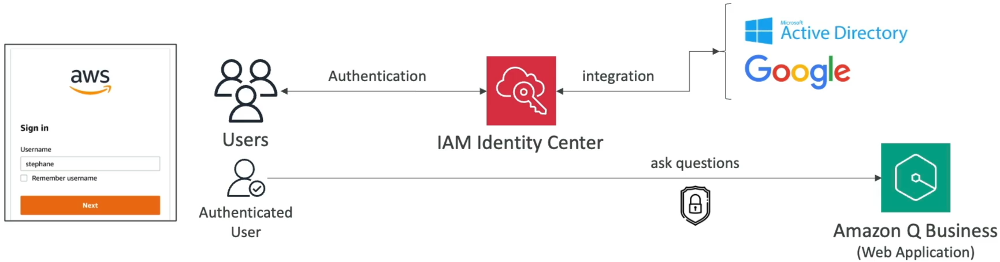
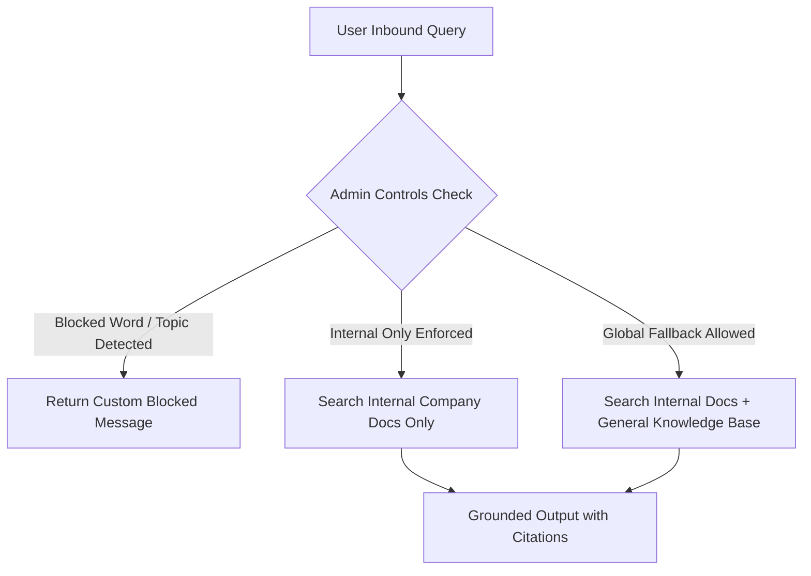
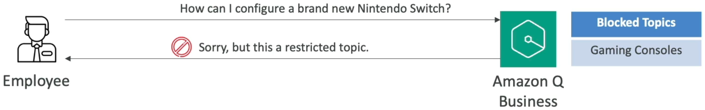

# Amazon Q Business Architecture, Connectors & Enterprise Security

---

## Key Takeaways

**Amazon Q Business** is a fully managed, generative AI assistant designed specifically for enterprise employees. Built on foundation models orchestrated via Amazon Bedrock, it indexes internal corporate data across 40+ connectors to answer questions, synthesize reports, and automate workplace tasks while strictly maintaining source document permissions.

Unlike low-level Bedrock APIs, Amazon Q Business is an **out-of-the-box application layer**. It abstracts embeddings, vector storage, and chunking into a turnkey workflow featuring **Data Connectors** (read-only RAG ingestion), **Plugins** (read/write action execution), and **IAM Identity Center** integration.

---

## Main Discussion

### The Two Interaction Engines: Data Connectors vs. Plugins

Amazon Q Business divides workplace integration into knowledge retrieval (connectors) and task execution (plugins):

#### CONNECTORS VS. PLUGINS MATRIX

| Feature                 | Data Connectors (Read / RAG)                             | Plugins (Action / Read-Write)                            |
| ----------------------- | -------------------------------------------------------- | -------------------------------------------------------- |
| **Primary Purpose**     | Indexes data to answer questions                         | Executes tasks and mutates state                         |
| **Supported Systems**   | Amazon S3, RDS, SharePoint, Confluence, Salesforce, M365 | Jira, ServiceNow, Zendesk, Salesforce, Custom REST APIs  |
| **Access Model**        | Crawls text, files, and ACLs                             | OAuth 2.0 / API Keys per user                            |
| **Typical Interaction** | "Summarize our health plan out-of-pocket maximum"        | "Create a high-priority Jira ticket for the login error" |

---

### Identity Federation & Access Control List (ACL) Inheritance

To prevent data leaks between departments (e.g., HR payroll vs. engineering roadmaps), Amazon Q Business enforces **User-Level Document Access Control**:

- **IAM Identity Center Integration:** Serves as the identity broker connecting Amazon Q Business to external identity providers (Microsoft Entra ID, Okta, Ping Identity, Google Workspace).  
  
- **ACL Crawling:** When crawling supported repositories (such as SharePoint or Google Drive), Q Business indexes document ACLs alongside file contents. A user only receives answers generated from documents they have direct permissions to read.

---

### Governance & Admin Controls

Amazon Q Business provides administrative safety controls equivalent to Bedrock Guardrails:

- **Denied Topics & Blocked Words:** Configure enterprise boundaries (e.g., blocking gaming discussions, non-work topics, or profanity) at the global application level or per-topic level.  
  
- **Internal Knowledge Restriction:** Toggle whether Amazon Q Business answers queries strictly using verified internal documents or supplements answers with the underlying foundation model's broader parametric knowledge.

---

## Exam Guide

### Exam Tips

- **Amazon Q Business vs. Amazon Q Developer:**
  - **Amazon Q Business:** For **business employees** querying enterprise repositories, synthesizing documents, and executing workplace workflows (Jira tickets, time-off requests).
  - **Amazon Q Developer:** For **developers and DevOps engineers** writing code, debugging applications, refactoring legacy runtimes, and troubleshooting AWS console errors.
- **Data Connectors vs. Plugins:**
  - Use **Data Connectors** when the objective is reading, indexing, and querying unstructured company data (Amazon S3, SharePoint, Confluence).
  - Use **Plugins** when the objective is **taking action or updating records** in third-party systems (creating Jira issues, updating ServiceNow tickets).
- **Security & Permission Model:** Amazon Q Business uses **AWS IAM Identity Center** to map corporate SSO identities and natively enforce source document **Access Control Lists (ACLs)**.
- **Underlying Engine:** Amazon Q Business runs on top of **Amazon Bedrock**, but AWS manages the model selection, orchestration, and embeddings under the hood.

---

### Practice Test

#### Question 1

An enterprise wants to deploy an AI-powered workplace assistant that allows customer service managers to query company knowledge bases in Confluence and automatically log service escalation tickets in ServiceNow from natural language prompts. Which configuration in Amazon Q Business supports these capabilities?

- [ ] A. Use Amazon SageMaker Canvas connected to AWS CloudTrail
- [ ] B. Configure a Confluence Data Connector for knowledge retrieval and a ServiceNow Plugin for ticket creation
- [ ] C. Deploy an Amazon Bedrock custom model import with an S3 Lifecycle rule
- [ ] D. Configure Amazon Rekognition Custom Labels with Amazon SNS alerts

Correct Answer

- [x] B. Configure a Confluence Data Connector for knowledge retrieval and a ServiceNow Plugin for ticket creation
  - **Explanation:** In Amazon Q Business, **Data Connectors** crawl and index unstructured document sources (like Confluence) for RAG querying, while **Plugins** enable the assistant to interact with external business applications (like ServiceNow) to perform actions like ticket creation.

---

#### Question 2

A human resources department is concerned that deploying Amazon Q Business across the organization will expose confidential salary spreadsheets stored in Microsoft SharePoint to unauthorized junior employees. How does Amazon Q Business prevent this data exposure?

- A. It automatically encrypts all documents with a single public KMS key
- B. It crawls and indexes source document Access Control Lists (ACLs) via IAM Identity Center, restricting search results to authorized users only
- C. It deletes all numerical spreadsheets during the ingestion sync job
- D. It forces all queries to run through Amazon SageMaker Clarify

Correct Answer

- [x] B. It crawls and indexes source document Access Control Lists (ACLs) via IAM Identity Center, restricting search results to authorized users only
  - **Explanation:** In Amazon Q Business, **Data Connectors** crawl and index unstructured document sources (like Confluence) for RAG querying, while **Plugins** enable the assistant to interact with external business applications (like ServiceNow) to perform actions like ticket creation.

---
