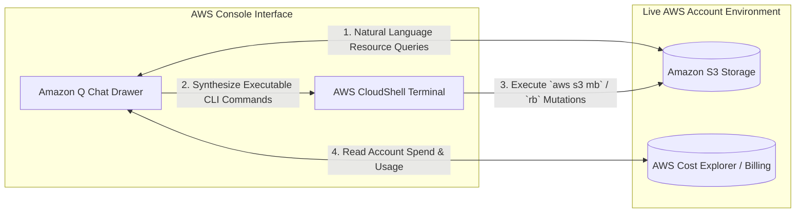
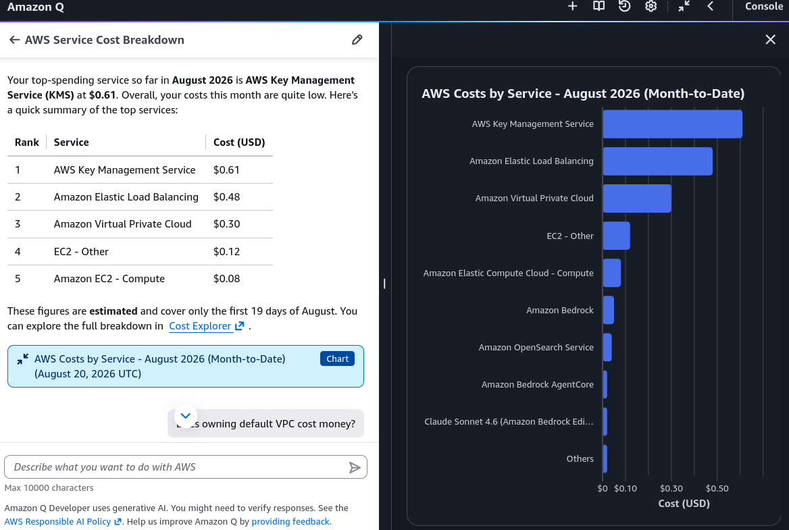

# Hands-On Lab: Amazon Q Console Experience & AWS CloudShell Automation

---

## Key Takeaways

Amazon Q is integrated directly into the **AWS Management Console navigation bar**, functioning as an interactive operational assistant. It introspects live resources across your AWS account, generates CLI syntax, and provides billing analysis without leaving the browser.

For safety and governance, Amazon Q Developer **does not execute destructive or state-mutating actions directly** (such as deleting an S3 bucket). Instead, it synthesizes the exact AWS CLI commands for you to review and run inside **AWS CloudShell**.

---

## Hands-On Workflow: Resource Introspection & CLI Synthesis

1. **Open Amazon Q in the AWS Management Console:**
   - In the AWS Management Console top-right navigation bar, click the **Amazon Q icon** to expand the chat panel.
   - Grant cross-region data access when prompted so the assistant can query resources across all AWS regions.
2. **Introspect Live Account Resources via Natural Language:**
   - In the chat drawer, run a resource discovery prompt: `What service cost me the most this month?`
   - Review the response: Amazon Q queries cost management API and analyzes the billing and cost management data to provide a report of top-spending services, total cost month-to-date, and generate a bar chart to visualize the spend distribution.  
     

---

## Tier Comparison: Free vs. Pro

| Dimension                 | Amazon Q Developer Free Tier         | Amazon Q Developer Pro Tier                                         |
| ------------------------- | ------------------------------------ | ------------------------------------------------------------------- |
| **Monthly Pricing**       | $0 / user / month                    | $19 / user / month                                                  |
| **Identity & Access**     | AWS Builder ID (Individual accounts) | IAM Identity Center (Enterprise SSO)                                |
| **Agentic Task Limits**   | 50 requests / user / month           | 1,000 requests / user / month                                       |
| **Code Transformations**  | Up to 1,000 lines of code / month    | 4,000 lines / month (pooled across account)                         |
| **Enterprise Governance** | Basic personal usage                 | IP indemnity, centralized policy management, codebase customization |
| **AWS Console Chat**      | Included (with standard limits)      | Included (higher capacity and priority)                             |

---

## Exam Guide

### Exam Tips

- **Console Access Model:** The Amazon Q icon in the AWS Management Console gives builders instant access to account resource inspection, architectural Q&A, and CLI generation without opening an IDE.
- **Non-Destructive Execution Guardrail:** Amazon Q Developer will **not** silently delete or modify production AWS infrastructure on its own; it provides verified **AWS CLI commands or AWS CloudFormation/CDK templates** for administrators to execute.
- **CloudShell Role:** AWS CloudShell is a browser-based, pre-authenticated shell environment that comes with the AWS CLI and credentials pre-configured, making it the fastest place to run CLI commands generated by Amazon Q.
- **Billing Intelligence:** Amazon Q Developer reads data from **AWS Cost Explorer** to answer questions about monthly spend, top-cost services, and unexpected bill increases.

---

### Practice Test

#### Question 1

A junior systems administrator is tasked with removing several empty development S3 buckets. The administrator is unfamiliar with the AWS CLI syntax. How can the administrator use native AWS tools to safely generate and execute the deletion commands?

- [ ] A. Ask Amazon Q Developer in the AWS Management Console to generate the `aws s3 rb` CLI commands, then execute them in AWS CloudShell after review
- [ ] B. Write a Python training script using Amazon SageMaker JumpStart
- [ ] C. Configure an Amazon Bedrock Knowledge Base connected to CloudTrail logs
- [ ] D. Deploy an Amazon Bedrock Agent with full administrative IAM privileges to execute batch deletions automatically

Correct Answer

- [x] A. Ask Amazon Q Developer in the AWS Management Console to generate the `aws s3 rb` CLI commands, then execute them in AWS CloudShell after review
  - **Explanation:** **Amazon Q Developer** in the AWS Console can synthesize precise AWS CLI commands from natural language requests. The administrator can review the commands for safety and run them directly in **AWS CloudShell**.

---

#### Question 2

An enterprise cloud team wants to adopt Amazon Q Developer across 200 software engineers. The company requires centralized Single Sign-On (SSO) integration, higher limits on automated Java code transformations, and intellectual property (IP) indemnity for generated code. Which tier should the organization subscribe to?

- [ ] A. Amazon Q Developer Free Tier
- [ ] B. Amazon Q Developer Pro Tier
- [ ] C. Amazon Q Business Lite
- [ ] D. Amazon Bedrock Provisioned Throughput

Correct Answer

- [x] B. Amazon Q Developer Pro Tier
  - **Explanation:** **Amazon Q Developer Pro** ($19/user/month) is the enterprise plan providing **IAM Identity Center (SSO)** integration, centralized policy management, increased code transformation allowances, and intellectual property indemnity.

---
