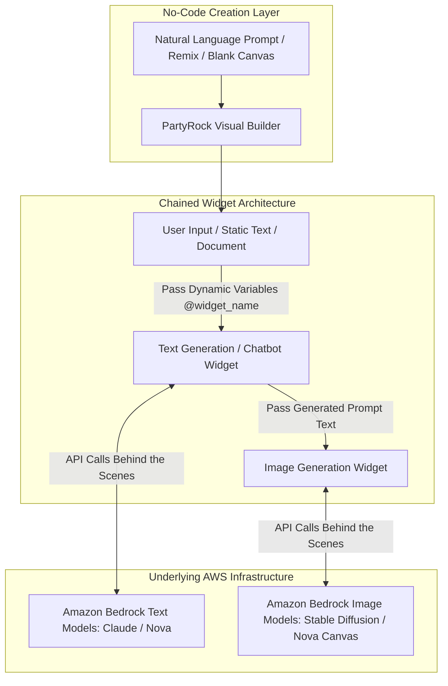
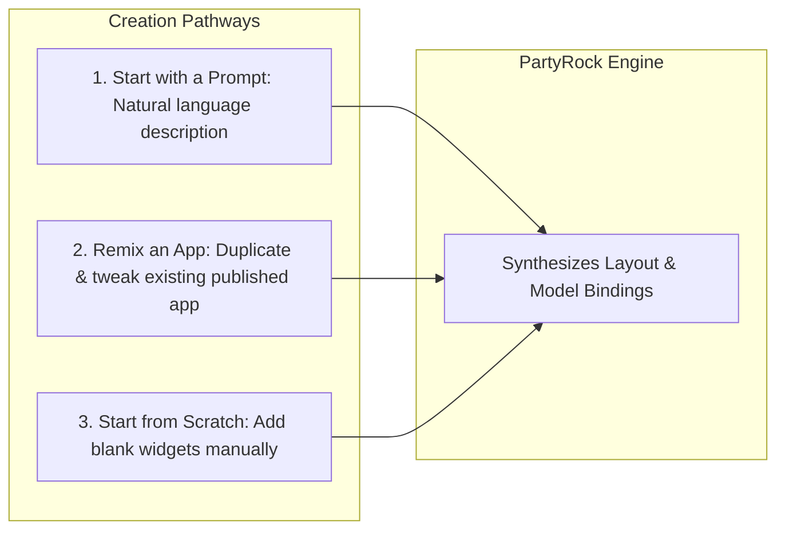
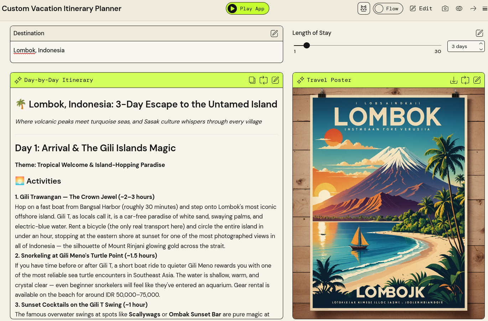
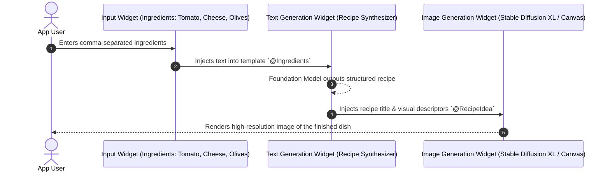

# PartyRock: The Amazon Bedrock Generative AI Playground

---

## 1. Key Takeaways

[**PartyRock**](https://partyrock.aws) is a standalone, web-based playground powered by **Amazon Bedrock** that lets users experiment with generative AI and build working applications with **zero coding, zero credit card setup, and no AWS account required**.

PartyRock demonstrates generative AI concepts—such as **prompt templates**, **variable referencing**, and **prompt chaining**—using modular UI widgets. While similar in visual workflow to **Amazon Q Apps**, PartyRock is public-facing and unauthenticated from corporate directories, whereas Amazon Q Apps connects natively to internal enterprise repositories and access control lists.

---

## Main Discussion

### The Three Methods of Creating a PartyRock App

1. **Prompt-to-App Generation:** Describe the desired application in natural language (e.g., _"An app that creates custom travel itineraries based on user travel destinations and length of stay. Create a matching travel poster."_). PartyRock synthesizes the necessary widgets, sets up default placeholder values, and links the prompt templates.
2. **Remixing:** Duplicate an existing community or sample app into your workspace to customize its prompts, widget pipeline, or underlying models.
3. **Empty Canvas:** Build the UI layout from scratch by adding and wiring individual widgets together manually.

[App Generated](https://partyrock.aws/u/rendyaws/JkjQ5CEYS/Custom-Vacation-Itinerary-Planner)

### Modular Widget Architecture & Prompt Chaining

PartyRock apps are assembled from interactive, linked widgets:

| Widget Type                | Role & Functionality                                                                                      | Underlying Mechanism                                                          |
| -------------------------- | --------------------------------------------------------------------------------------------------------- | ----------------------------------------------------------------------------- |
| **User Input**             | Text box collecting dynamic runtime inputs from the user (e.g., cuisine, destination, ingredients).       | Feeds variables into downstream prompt templates using `@WidgetName`.         |
| **Static Text / Document** | Static reference context or uploaded reference documentation.                                             | Injects baseline knowledge or task instructions into the prompt payload.      |
| **Text Generation**        | Calls foundation models (Anthropic Claude, Amazon Nova) to generate text, summaries, or structured lists. | Uses prompt templates containing `@Variable` references to upstream widgets.  |
| **Chatbot**                | Interactive multi-turn conversational interface.                                                          | Maintains conversational context history with the user.                       |
| **Image Generation**       | Generates visual assets using models like Stable Diffusion XL or Amazon Nova Canvas.                      | Takes generated text outputs or user prompts as image synthesis descriptions. |

---

### PartyRock vs. Amazon Q Apps vs. Amazon Bedrock Playgrounds

| Feature / Dimension        | PartyRock                                  | Amazon Q Apps                                        | Amazon Bedrock Playgrounds                       |
| -------------------------- | ------------------------------------------ | ---------------------------------------------------- | ------------------------------------------------ |
| **Target Audience**        | General public, students, AI experimenters | Enterprise employees, business teams                 | Developers, cloud architects, ML engineers       |
| **AWS Account Needed?**    | **No** (Social login: Google/Apple/Amazon) | **Yes** (Requires AWS account & IAM Identity Center) | **Yes** (Requires AWS Console IAM access)        |
| **Enterprise Data Access** | None (Public parametric knowledge only)    | Direct (40+ enterprise connectors + ACLs)            | Direct via Bedrock Knowledge Bases (RAG)         |
| **App Sharing**            | Public URL publishing & remixing           | Central enterprise internal App Library              | Export code/APIs only (`boto3`)                  |
| **Billing Model**          | Free usage credits                         | Included in Q Business Pro / user subscription       | Pay-as-you-go per token / Provisioned Throughput |

---

## Exam Guide

### Exam Tips

- **Core Definition:** **PartyRock is an Amazon Bedrock-powered playground** that allows anyone to build, experiment with, and share generative AI applications without writing code or creating an AWS account.
- **PartyRock vs. Amazon Q Apps Distinction:**
  - If a question mentions building no-code AI apps **without an AWS account** or for general experimentation/education, select **PartyRock**.
  - If a question mentions building no-code apps grounded in **confidential company data, SharePoint, Jira, or S3 using IAM Identity Center**, select **Amazon Q Apps** (within Amazon Q Business).
- **Prompt Chaining Mechanism:** PartyRock connects widgets by referencing upstream widget names as dynamic variables (e.g., `@Cuisine`, `@MealType`) inside prompt templates.
- **Underlying Engine:** PartyRock is not a standalone AWS cloud infrastructure service; it is a hosted frontend environment backed entirely by **Amazon Bedrock foundation model APIs**.

---

### Practice Test

#### Question 1

An educator wants to teach high school students the fundamentals of generative AI, prompt templates, and multi-model workflows. The school does not have an active AWS cloud account or cloud budget. Which tool allows students to build and test generative AI apps using Amazon Bedrock foundation models with zero code and no AWS account?

- [ ] A. Amazon SageMaker Studio
- [ ] B. PartyRock
- [ ] C. Amazon Q Business
- [ ] D. AWS Cloud9

Correct Answer

- [x] B. PartyRock
  - **Explanation:** **PartyRock** is a no-code, web-based playground powered by Amazon Bedrock that allows users to build generative AI apps using social logins without requiring an AWS account or credit card.

---

#### Question 2

A user is designing an application in PartyRock that recommends custom vacation itineraries and generates a travel poster image. How does PartyRock pass the destination selected in the User Input widget into the downstream Text and Image generation widgets?

- [ ] A. By configuring an Amazon Kinesis Data Stream
- [ ] B. By using dynamic variable references within prompt templates (e.g., `@Destination`)
- [ ] C. By running an AWS Glue ETL crawler
- [ ] D. By fine-tuning a custom Bedrock model

Correct Answer

- [x] B. By using dynamic variable references within prompt templates (e.g., `@Destination`)
  - **Explanation:** PartyRock uses **prompt templates with variable references** (such as `@Destination`) to pass text from input or text generation widgets into downstream prompt templates and image generators.

---
