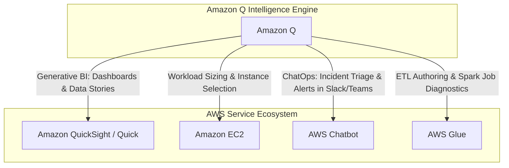
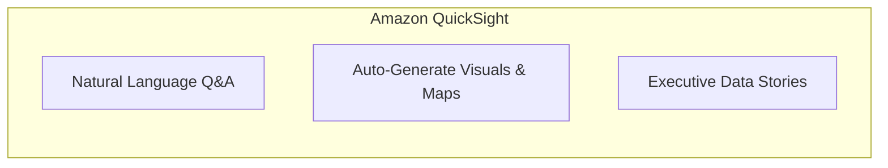
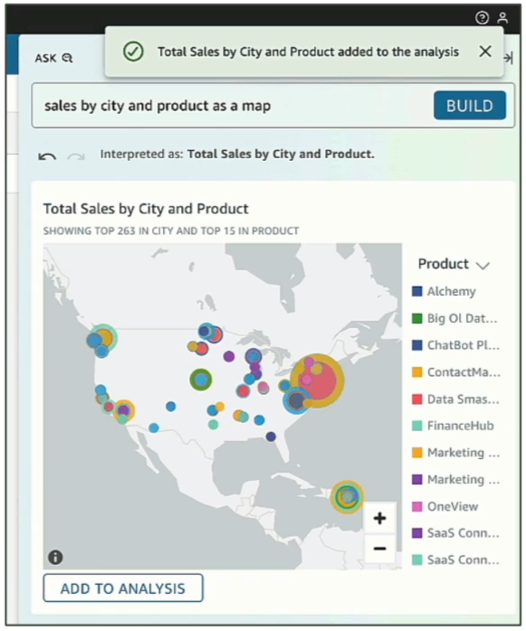
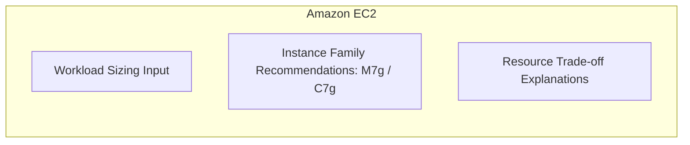
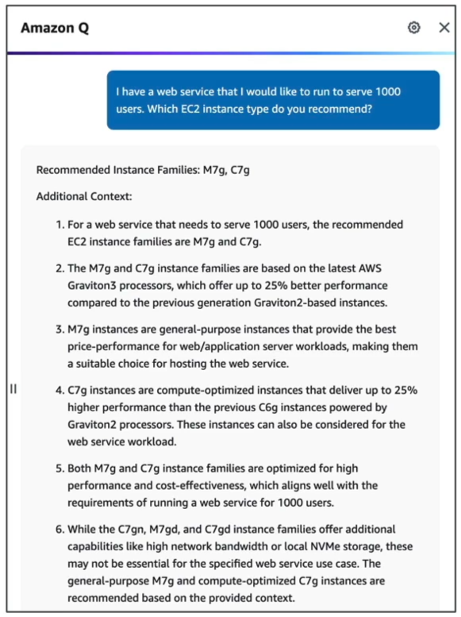
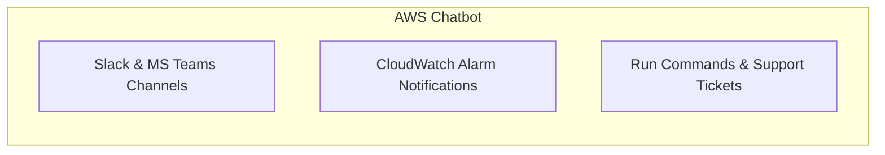
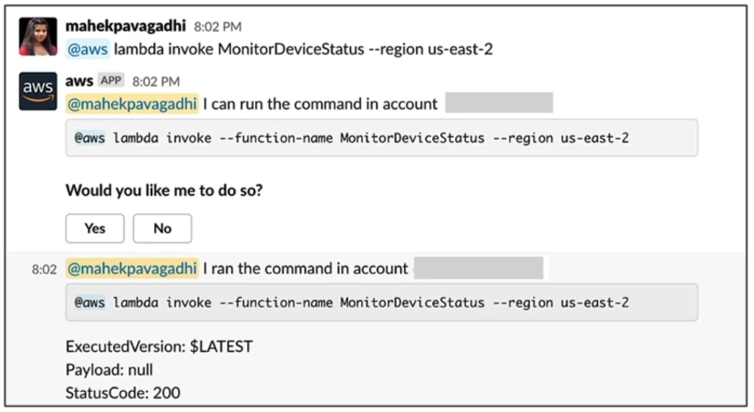
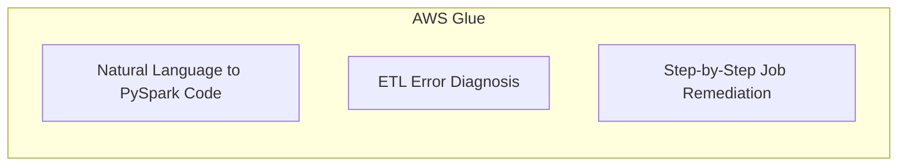
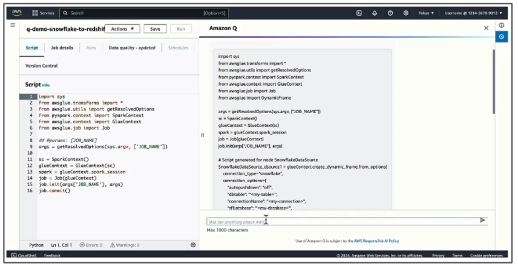
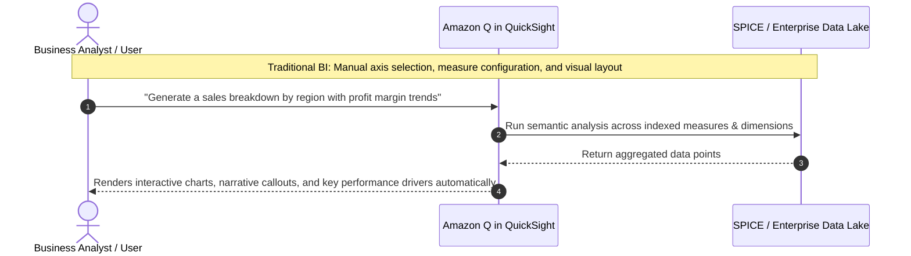

# Amazon Q Integration Across Core AWS Services

---

## Key Takeaways

Amazon Q serves as an embedded generative AI intelligence layer integrated across specialized AWS services. Rather than functioning solely as a standalone chat assistant, Amazon Q injects natural language querying, decision modeling, and automated troubleshooting directly into operational workflows:

Key integration domains include **Generative Business Intelligence in Amazon QuickSight** (natural language dashboard generation and executive data summaries), **Workload Sizing in Amazon EC2** (instance type and family recommendations), **ChatOps via AWS Chatbot** (troubleshooting incidents inside Slack and Microsoft Teams), and **Data Integration in AWS Glue** (generating ETL scripts and diagnosing Spark job execution errors).

---

## Main Discussion

### Service-by-Service Integration Breakdown

#### AWS QuickSight

#### Amazon EC2

#### AWS Chatbot

#### AWS Glue

---

### Deep Dive: Architectural Features & Use Cases

| AWS Service           | Amazon Q Capability                         | Technical Functionality & Value                                                                                                                             | Example Natural Language Prompt                                                                      |
| --------------------- | ------------------------------------------- | ----------------------------------------------------------------------------------------------------------------------------------------------------------- | ---------------------------------------------------------------------------------------------------- |
| **Amazon QuickSight** | Generative Business Intelligence (BI)       | Automatically generates visual dashboards, maps, and metric summaries from raw datasets; crafts narrative executive data stories.                           | _"Show sales by city and product as a map and write an executive summary of top drivers."_           |
| **Amazon EC2**        | Compute Workload Sizing & Discovery         | Analyzes application traffic, memory, and vCPU requirements to recommend optimal instance families (e.g., Graviton-based `M7g`, `C7g`).                     | _"Which EC2 instance type should I use to host a containerized web API serving 1,000 active users?"_ |
| **AWS Chatbot**       | Generative ChatOps & Collaboration          | Delivers interactive AWS troubleshooting, CloudWatch alarm analysis, and security finding remediation directly inside Slack or Microsoft Teams.             | _"@aws explain why CloudWatch alarm 'HighCPUUtilization' triggered and suggest mitigation steps."_   |
| **AWS Glue**          | Generative Data Integration & ETL Authoring | Translates English requirements into PySpark/Python data processing code; analyzes failed Glue ETL run logs to provide step-by-step root-cause diagnostics. | _"Help me write an AWS Glue job to read JSON from S3, join on customer_id, and write to Redshift."_  |

---

### QuickSight Generative BI: Classic vs. Amazon Q Experience

- **Interactive Natural Language Visuals:** Users do not need to manually configure visual encodings or write SQL/DAX formulas; Amazon Q chooses optimal chart types (e.g., geo-maps, bar charts, heatmaps) based on the query structure.
- **Executive Data Stories:** Generates structured, presentation-ready slide decks summarizing core business metrics, anomalies, and potential causes.

---

## Exam Guide

### Exam Tips

- **Identify Service-Specific Integration Roles:**
  - **QuickSight + Amazon Q:** Choose when the scenario asks for **building BI dashboards from natural language**, **generating executive data stories**, or **asking questions over structured business datasets**.
  - **EC2 + Amazon Q:** Choose when the scenario asks for **recommending the correct instance family (e.g., Graviton, compute-optimized, memory-optimized)** based on application constraints.
  - **AWS Chatbot + Amazon Q:** Choose when engineers want to **diagnose alarms, run AWS commands, or receive troubleshooting guidance inside Slack or Microsoft Teams without opening the AWS console**.
  - **AWS Glue + Amazon Q Developer:** Choose when data engineers need to **generate PySpark ETL scripts from plain English** or **debug and resolve failed Glue ETL pipeline runs**.
- **ChatOps Definition:** AWS Chatbot integrates AWS operational alerts and diagnostics into chat applications (Slack, MS Teams). Pairing it with Amazon Q enables direct conversational incident triage.

---

### Practice Test

#### Question 1

A business intelligence analyst wants to create interactive sales dashboards and summarized visual reports from an Amazon S3 data lake. The analyst does not want to write complex calculations or manually configure chart dimensions. Which AWS service and generative AI feature should the analyst use?

- [ ] A. Amazon SageMaker Clarify
- [ ] B. Amazon Q in Amazon QuickSight
- [ ] C. Amazon Comprehend Medical
- [ ] D. AWS Glue DataBrew with Amazon Rekognition

Correct Answer

- [x] B. Amazon Q in Amazon QuickSight
  - **Explanation:** **Amazon Q in QuickSight** enables Generative BI, allowing analysts and business users to create dashboards, generate maps and charts, and produce executive data summaries using natural language queries.

---

#### Question 2

A data engineering team maintains nightly AWS Glue ETL jobs that periodically fail due to schema mismatches and script timeout errors. The engineers want an AI assistant directly inside AWS Glue that diagnoses error logs and suggests step-by-step code remediations. Which tool provides this capability?

- [ ] A. Amazon Q Developer in AWS Glue
- [ ] B. Amazon Bedrock Custom Model Import
- [ ] C. Amazon Transcribe
- [ ] D. AWS Identity and Access Management (IAM) Access Analyzer

Correct Answer

- [x] A. Amazon Q Developer in AWS Glue
  - **Explanation:** **Amazon Q Developer** provides deep domain assistance for data integration, allowing engineers to generate ETL scripts and analyze failed Glue job run logs for automated error root-cause diagnostics and remediation.

---
