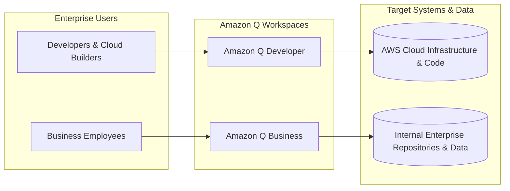
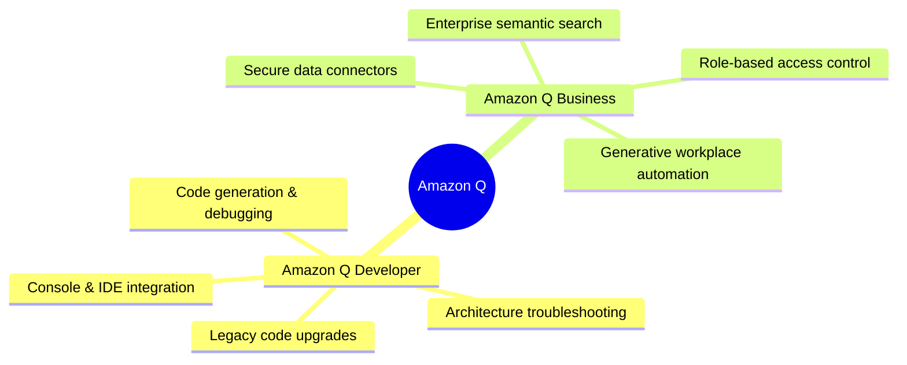
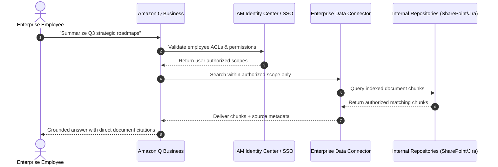

# Introduction to Amazon Q

---

## Key Takeaways

**Amazon Q** is AWS's fully managed, generative AI-powered assistant designed specifically for work. It bridges the gap between foundational AI models and real-world business tasks by connecting securely to your company's internal data, enterprise applications, and AWS infrastructure while honoring existing access permissions.

Amazon Q operates across two primary domains: accelerating cloud development and troubleshooting on AWS (**Amazon Q Developer**), and unlocking workplace productivity through natural-language search, summarization, and content generation over corporate repositories (**Amazon Q Business**).

---

## Main Discussion

### The Two Pillars of Amazon Q

Amazon Q streamlines tasks across technical operations and enterprise knowledge management:

- **Amazon Q Developer:** Built for software engineers, DevOps practitioners, and cloud architects. It integrates directly into IDEs (VS Code, JetBrains), the AWS Management Console, and the command line to generate code, refactor legacy applications (such as upgrading Java versions), and diagnose AWS architectural errors in real time.
- **Amazon Q Business:** Tailored for knowledge workers across HR, marketing, legal, and operations. It indexes internal wikis, documents, and business applications (e.g., Jira, Salesforce, SharePoint, Confluence) so employees can ask natural language questions, synthesize documents, and automate repetitive workflows.

---

### Enterprise Security & Permission Inheritance

A core design principle of Amazon Q is **native enterprise security**. Rather than giving all users blanket access to company documents, Amazon Q inherits and enforces existing access controls at query time:

1. **Access Control List (ACL) Preservation:** If an employee lacks read permissions for a specific confidential document in Salesforce or SharePoint, Amazon Q will not consider that document when formulating an answer for that user.
2. **Data Privacy Guarantee:** AWS does not use enterprise data ingested or queried through Amazon Q to train foundation models, protecting corporate IP and confidentiality.

---

## Exam Guide

### Exam Tips

- **Amazon Q vs. Amazon Bedrock:**
  - **Amazon Bedrock:** An infrastructure/platform service providing API access to foundation models, custom model fine-tuning, embeddings, and developer-built RAG pipelines.
  - **Amazon Q:** A **ready-to-use, fully managed generative AI application** out of the box. You do not manage vector databases, embeddings models, or chunking code manually.
- **Q Developer vs. Q Business Focus:**
  - Choose **Amazon Q Developer** when scenarios describe writing code, refactoring applications, troubleshooting AWS console errors, or generating infrastructure-as-code (IaC).
  - Choose **Amazon Q Business** when scenarios describe non-technical business employees querying internal enterprise documents, wikis, CRM records, or knowledge bases.
- **Identity Integration:** Amazon Q relies heavily on **AWS IAM Identity Center** to enforce corporate Single Sign-On (SSO) and map enterprise directory permissions directly to document access lists.

---

### Practice Test

#### Question 1

A corporate enterprise wants to provide employees with a generative AI assistant that answers questions based on internal policy documents stored across Confluence and Microsoft SharePoint. The solution must enforce existing document access permissions so users cannot see data they are not authorized to view, and it must require minimal machine learning infrastructure management. Which AWS service meets these requirements?

- [ ] A. Amazon SageMaker JumpStart
- [ ] B. Amazon Bedrock with a manually provisioned OpenSearch Serverless collection
- [ ] C. Amazon Q Business
- [ ] D. Amazon Rekognition

Correct Answer

- [x] C. Amazon Q Business
  - **Explanation:** **Amazon Q Business** is a fully managed enterprise generative AI assistant that connects out of the box to sources like Confluence and SharePoint, automatically enforcing source Access Control Lists (ACLs) to ensure users only receive answers based on data they have permission to view.

---

#### Question 2

A cloud developer wants an AI coding companion integrated inside Visual Studio Code to write unit tests, explain complex legacy functions, and assist in upgrading older Java runtimes. Which AWS service is designed for this task?

- [ ] A. Amazon Q Developer
- [ ] B. Amazon Bedrock Guardrails
- [ ] C. Amazon Polly
- [ ] D. Amazon Transcribe

Correct Answer

- [x] A. Amazon Q Developer
  - **Explanation:** **Amazon Q Developer** is the specialized assistant for developers and cloud builders, offering inline code generation, unit test writing, code refactoring/transformation, and architecture troubleshooting directly inside supported IDEs and the AWS console.

---
