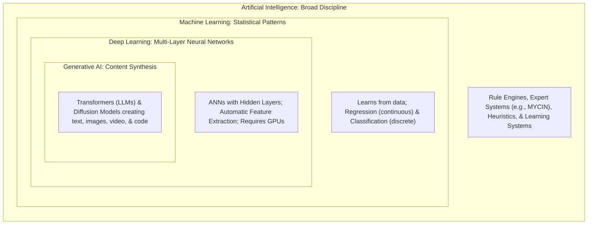
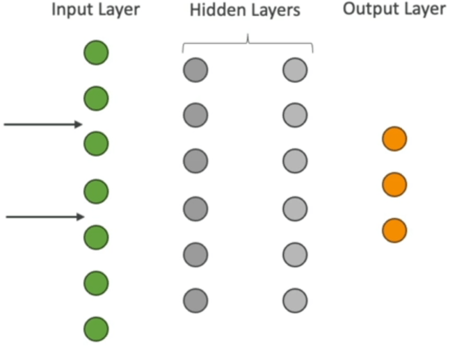
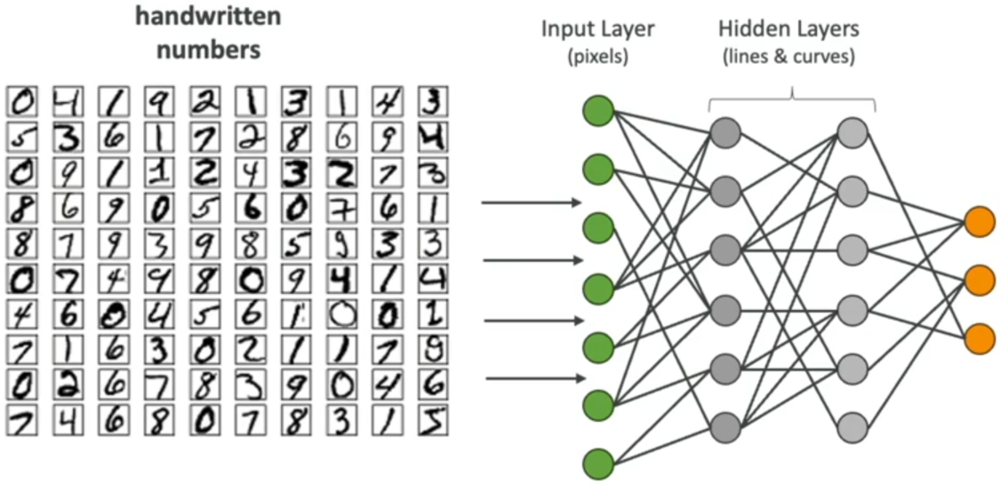
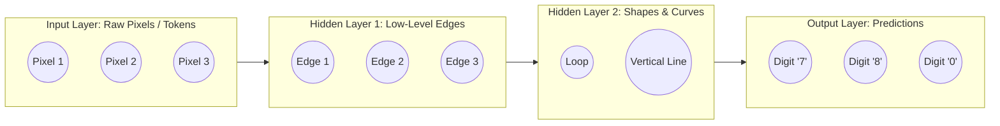
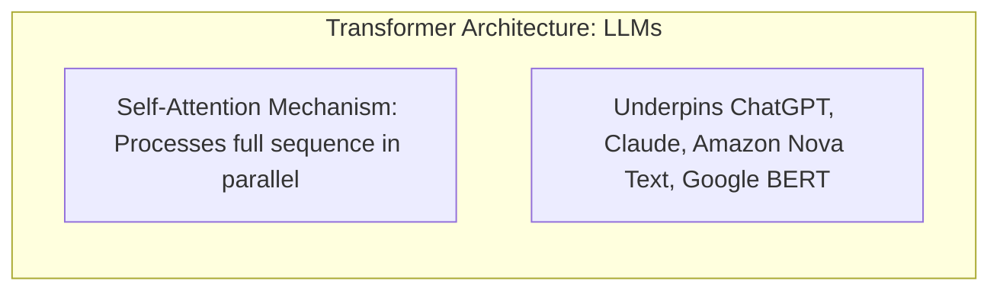
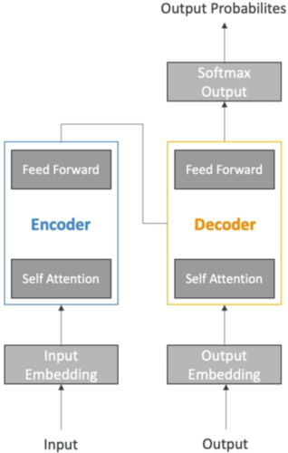
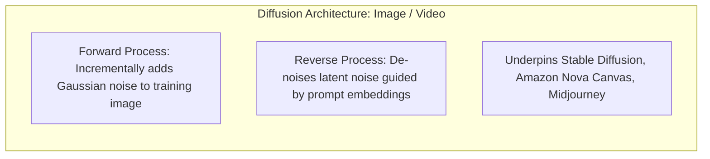
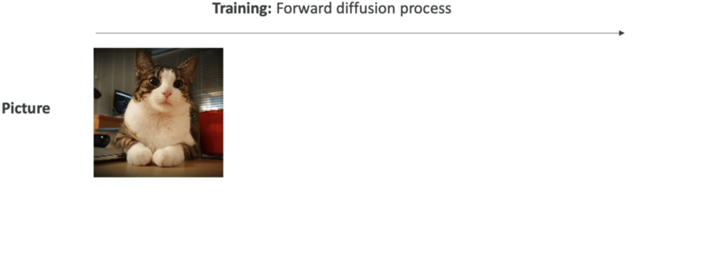
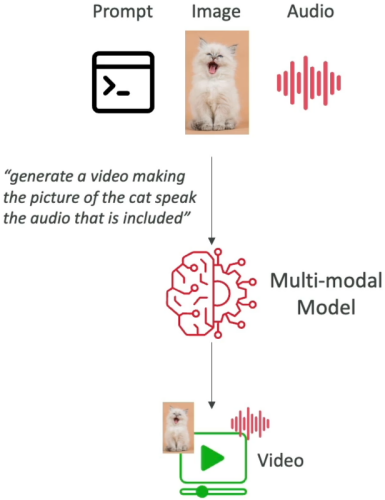

# Deep Dive: Artificial Intelligence, Machine Learning, Deep Learning & Generative AI

---

## Key Takeaways

Understanding the technical boundaries between **Artificial Intelligence (AI)**, **Machine Learning (ML)**, **Deep Learning (DL)**, and **Generative AI (GenAI)** is essential for selecting the correct AWS architectural pattern for any business workload.

Classical AI systems relied on explicit, hand-coded rules (e.g., the 1970s MYCIN diagnostic system). Modern machine learning replaces manual rules with **data-driven models**. Deep learning introduces **multi-layer artificial neural networks** to extract hierarchical features from complex unstructured data, and Generative AI leverages **transformer and diffusion architectures** to synthesize novel, multi-modal content.

---

## Main Discussion

### The Four Architectural Layers of an Enterprise AI System

Building and deploying enterprise AI solutions follows a structured four-layer pipeline:

| System Layer                       | Core Responsibility                                                                   | Key Components & Roles                                                 |
| ---------------------------------- | ------------------------------------------------------------------------------------- | ---------------------------------------------------------------------- |
| **1. Data Layer**                  | Ingestion, storage, validation, and curation of raw training and evaluation assets.   | Data engineers, Amazon S3 data lakes, AWS Glue, data cleansing.        |
| **2. Framework & Algorithm Layer** | Selection of machine learning frameworks and algorithmic approaches.                  | Data scientists, PyTorch, TensorFlow, XGBoost, Scikit-learn.           |
| **3. Model Layer**                 | Defining network topology, setting hyperparameters, loss functions, and optimization. | Model weights, loss functions, backpropagation, GPU training clusters. |
| **4. Application Layer**           | Exposing the trained model via APIs for real-time or batch inference consumption.     | Amazon Bedrock runtime APIs, Amazon SageMaker endpoints, REST/gRPC.    |

---

### Comparison: Traditional Rules vs. ML vs. DL vs. GenAI

| Paradigm          | How Logic is Formed                                                                          | Data Requirements                                               | Hardware Profile                                          | Representative Enterprise Use Case                        |
| ----------------- | -------------------------------------------------------------------------------------------- | --------------------------------------------------------------- | --------------------------------------------------------- | --------------------------------------------------------- |
| **Rule-Based AI** | Humans manually program static `if/then` logic.                                              | Minimal data; requires human domain expertise.                  | Standard CPU                                              | Tax compliance calculator, legacy diagnostic trees.       |
| **Classical ML**  | Statistical algorithms find patterns and decision boundaries from structured data.           | Moderate tabular historical data (labeled or unlabeled).        | Standard CPU / Light GPU                                  | House price regression, customer churn classification.    |
| **Deep Learning** | Artificial neural networks automatically extract hierarchical features across hidden layers. | Massive unstructured datasets (images, audio, video, raw text). | Heavy GPU compute (Nvidia Tensor Cores for parallel math) | Autonomous vehicle computer vision, speech transcription. |
| **Generative AI** | Pre-trained Foundation Models generate new probability-distributed content.                  | Billions to trillions of tokens across general/domain corpora.  | Massive distributed GPU/Trainium/Inferentia accelerators  | Context-aware document summarization, code generation.    |

---

### How Artificial Neural Networks (ANNs) Process Complex Patterns

Deep learning networks pass data through stacked layers of interconnected artificial neurons (nodes):

- **Automatic Feature Engineering:** Unlike traditional ML—where engineers had to manually calculate pixel gradients or extract edge metrics—deep neural networks learn hierarchical abstractions on their own (e.g., pixels $\rightarrow$ edges/lines $\rightarrow$ curves/shapes $\rightarrow$ object classes).
- **Parallel Computation on GPUs:** Calculating weight adjustments across millions of interconnected synapses involves intensive matrix multiplication, making **Graphics Processing Units (GPUs)** essential for practical training.

---

### Generative AI Architectures: Transformers, Diffusion & Multimodal Models

#### Transformer Model

$$\text{Transformer Advantage: } \text{Self-Attention computes contextual relationships across all words simultaneously, replacing slow word-by-word RNN processing.}$$

#### Diffusion Model

$$\text{Diffusion Mechanism: } \text{Target Output} \xleftarrow{\text{Reverse De-noising Step}} \text{Latent Noise Layer} \xleftarrow{\text{Forward Diffusion}} \text{Training Image}$$

#### Multimodal Foundation Model

---

## Exam Guide

### Exam Tips

- **Domain Classification (Domain 1 & Domain 2):**
  - If a problem asks to predict a continuous number (e.g., housing prices) $\rightarrow$ **Regression (Classical ML)**.
  - If a problem asks to categorize data into discrete buckets (e.g., spam vs. ham) $\rightarrow$ **Classification (Classical ML)**.
  - If a problem involves complex visual perception or audio spectrograms without manual feature extraction $\rightarrow$ **Deep Learning (Neural Networks)**.
  - If a problem requires creating new marketing copy, generating code, or synthesizing images $\rightarrow$ **Generative AI (Foundation Models)**.
- **Why Transformers Changed NLP:** Transformers process tokens **in parallel with self-attention mechanisms**, eliminating the sequential processing bottlenecks of legacy Recurrent Neural Networks (RNNs).
- **Hardware Sizing:** Deep learning model training requires specialized parallel matrix compute (**GPUs** or AWS custom silicon like **AWS Trainium**), whereas classical ML inference can frequently run on cost-effective CPU instances.
- **Multimodal Definition:** A single unified foundation model capable of accepting and/or generating across multiple data types (e.g., ingesting an image and audio recording to generate structured text or video).

---

### Practice Test

#### Question 1

A real estate analytics company wants to build a predictive pricing model for commercial office leases based on square footage, location coordinates, parking capacity, and historical lease rates. The team wants to use structured tabular data without generating synthetic text or images. Which technology approach best fits this workload?

- [ ] A. Diffusion Foundation Model
- [ ] B. Classical Machine Learning Regression
- [ ] C. Prompt Engineering on a Transformer LLM
- [ ] D. Rule-based Expert System

Correct Answer

- [x] B. Classical Machine Learning Regression
  - **Explanation:** Predicting a continuous numerical value (commercial lease rate) from structured tabular features is a classic **Machine Learning Regression** task. Generative foundation models and diffusion networks are unnecessary and inefficient for numerical tabular regression.

---

#### Question 2

How does Deep Learning fundamentally differ from classical Machine Learning when analyzing unstructured data such as audio recordings and medical imagery?

- [ ] A. Deep Learning relies exclusively on static human-coded `if/then` decision trees
- [ ] B. Deep Learning uses multi-layered artificial neural networks that automatically learn hierarchical feature representations from raw data without manual feature extraction
- [ ] C. Deep Learning can only run on single-core CPU instances without network connections
- [ ] D. Deep Learning requires zero training data to establish decision boundaries

Correct Answer

- [x] B. Deep Learning uses multi-layered artificial neural networks that automatically learn hierarchical feature representations from raw data without manual feature extraction
  - **Explanation:** **Deep Learning** utilizes multi-layer artificial neural networks (ANNs) that automatically discover and extract features from high-dimensional unstructured data (like images and audio), eliminating the need for manual feature engineering.

---
