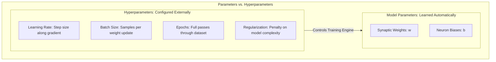
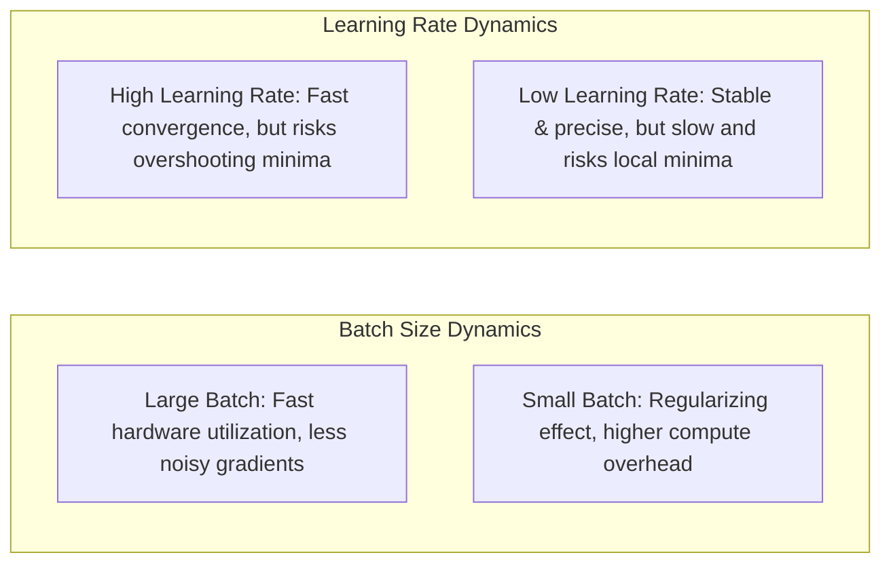
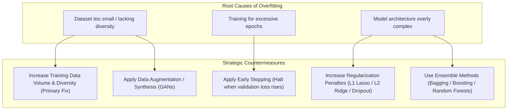

# Hyperparameters, Model Optimization & Overfitting Countermeasures

---

## Key Takeaways

**Hyperparameters** are external configuration settings that control the learning algorithm, model capacity, and training process. Unlike internal **model parameters** (weights and biases), which are learned automatically from data via backpropagation, hyperparameters are set **before training begins**.



Finding the optimal combination of hyperparameters is known as **Hyperparameter Optimization (HPO)** or **Automatic Model Tuning (AMT)**. It directly balances training speed against generalization performance, helping prevent both underfitting and overfitting.

---

## Main Discussion

### High-Impact Hyperparameters



| Hyperparameter                   | Definition & Operational Mechanism                                                                         | Risk of Too High / Too Many                                                                  | Risk of Too Low / Too Few                                                          |
| -------------------------------- | ---------------------------------------------------------------------------------------------------------- | -------------------------------------------------------------------------------------------- | ---------------------------------------------------------------------------------- |
| **Learning Rate** ($\alpha$)     | Determines the step size the optimizer takes along the loss gradient when updating internal weights.       | • Divergence or oscillating across the loss landscape<br/> • Overshooting the global minimum | • Extremely slow convergence<br/> • Stalling in poor local minima or saddle points |
| **Batch Size**                   | The number of training samples processed by the network before updating internal weights.                  | • Requires high GPU memory<br/> • May get trapped in sharper local minima                    | • High training runtime overhead<br/> • Noisier gradient updates                   |
| **Epochs**                       | The total number of complete passes the training algorithm makes through the entire training dataset.      | • **Overfitting** (memorizing sample-specific noise)                                         | • **Underfitting** (model terminates before learning patterns)                     |
| **Regularization** ($L_1 / L_2$) | Mathematical penalty added to the loss function to penalize overly large weights and constrain complexity. | • Over-simplification / Underfitting (model cannot capture signal)                           | • High variance / Overfitting (weights grow unrestricted)                          |

$$\text{Loss with } L_2 \text{ Regularization (Weight Decay): } \mathcal{L}_{\text{total}} = \mathcal{L}_{\text{data}} + \lambda \sum_{j} w_j^2$$

---

### Hyperparameter Search Strategies

To identify the optimal configuration without manual guesswork, data scientists use automated search strategies:

<div className="flex flex-col md:flex-row ">

    <div className="w-1/3">

    ```mermaid
    flowchart TD
        subgraph SearchAlgs [Automated Hyperparameter Search Methods]
            GS["1. Grid Search: Exhaustive evaluation across a fixed, predefined grid"]
            RS["2. Random Search: Randomly samples combinations within bounded ranges"]
            BO["3. Bayesian Optimization: Uses prior evaluation history to guide next trials"]
        end
    ```

    </div>

    <div className="w-2/3">

    - **Grid Search:** Evaluates every possible permutation in a fixed grid. Thorough, but computationally expensive and inefficient for high-dimensional parameter spaces.
    - **Random Search:** Randomly samples hyperparameter combinations across defined ranges. Often finds optimal values faster than grid search with lower compute overhead.
    - **Amazon SageMaker Automatic Model Tuning (AMT):** Uses **Bayesian Optimization** to treat hyperparameter tuning as a regression problem, predicting which candidate configurations will yield the highest validation score based on past training jobs.

    </div>

</div>

---

### Overfitting: Root Causes & Strategic Countermeasures

Overfitting occurs when a model achieves high accuracy on training data but fails on unseen validation/test data:



| Countermeasure              | Mechanism & Implementation                                                                                                                     | Impact on Model Fit                                                           |
| --------------------------- | ---------------------------------------------------------------------------------------------------------------------------------------------- | ----------------------------------------------------------------------------- |
| **Increase Training Data**  | Collect more labeled records or pull broader operational data pools.                                                                           | **Most effective resolution;** exposes the model to true population variance. |
| **Early Stopping**          | Monitor validation loss during training and automatically stop when validation error begins to climb, even if training loss continues to fall. | Prevents the model from training for too many epochs and memorizing noise.    |
| **Increase Regularization** | Increase the $\lambda$ penalty coefficient ($L_1$ Lasso or $L_2$ Ridge) or add Dropout layers in deep neural networks.                         | Constrains weight magnitudes, forcing simpler decision boundaries.            |
| **Data Augmentation**       | Synthesize new variations of existing training samples (e.g., image rotations, GAN-generated tabular rows).                                    | Expands effective dataset size without collecting new field data.             |
| **Ensemble Modeling**       | Combine predictions from multiple distinct models (e.g., Random Forests, XGBoost).                                                             | Reduces individual model variance and smooths idiosyncratic errors.           |

---

## Exam Guide

### Exam Tips

- **Parameter vs. Hyperparameter Disambiguation:**
  - **Model Parameters:** Internal weights ($w$) and biases ($b$) updated **automatically during training** by the optimization algorithm.
  - **Hyperparameters:** External settings (learning rate, batch size, epochs, regularization) configured **before training begins**.
- **Overfitting Remediation Hierarchy:**
  - If an exam question asks for the **best or most fundamental way** to fix overfitting, look for **increasing the training dataset size** or **data augmentation**.
  - If the question asks for **training-time configuration changes**, look for **early stopping** or **increasing regularization ($\lambda$)**.
- **Regularization Rule:** To reduce **overfitting**, you **increase** regularization. If a model is **underfitting**, you **decrease** regularization.
- **Epochs & Fit:**
  - Too **few** epochs $\rightarrow$ **Underfitting** (insufficient learning).
  - Too **many** epochs $\rightarrow$ **Overfitting** (memorization of training samples).
- **AWS Service Mapping:** Automated hyperparameter optimization on AWS is handled by **Amazon SageMaker Automatic Model Tuning (AMT)**.

---

### Practice Test

#### Question 1

A data scientist is training a deep neural network on Amazon SageMaker. During training, the training loss steadily decreases toward zero, but the validation loss begins increasing significantly after epoch 25. What is happening to the model, and which two actions can mitigate this issue? (Select TWO.)

- [ ] A. The model is underfitting due to a high learning rate
- [ ] B. The model is overfitting the training dataset
- [ ] C. Implement Early Stopping to halt training when validation loss begins to rise
- [ ] D. Decrease the amount of training data in the training set
- [ ] E. Increase the number of epochs to 200

<details>
<summary>Correct Answer</summary>

- [x] B. The model is overfitting the training dataset
- [x] C. Implement Early Stopping to halt training when validation loss begins to rise
  - **Explanation:** When training loss decreases while validation loss increases, the model is **overfitting** (memorizing training data noise). Implementing **Early Stopping** halts training at the point of optimal validation performance, preventing excessive epochs from degrading generalization.

</details>

---

#### Question 2

What is the fundamental difference between a model parameter and a hyperparameter in machine learning workflows?

- [ ] A. Model parameters are configured manually before training begins, whereas hyperparameters are learned automatically by the optimizer
- [ ] B. Model parameters represent internal weights learned from the data during training, whereas hyperparameters are external configuration settings established prior to training
- [ ] C. Model parameters are only used for unsupervised clustering, whereas hyperparameters are exclusive to generative transformers
- [ ] D. Model parameters are stored in AWS IAM Identity Center, whereas hyperparameters are stored in Amazon S3

<details>
<summary>Correct Answer</summary>

- [x] B. Model parameters represent internal weights learned from the data during training, whereas hyperparameters are external configuration settings established prior to training
  - **Explanation:** **Model parameters** (such as neural network weights and biases) are learned automatically from training data through optimization algorithms. **Hyperparameters** (such as learning rate, batch size, and regularization) are external configuration settings specified before training begins to guide the learning process.

</details>

---
