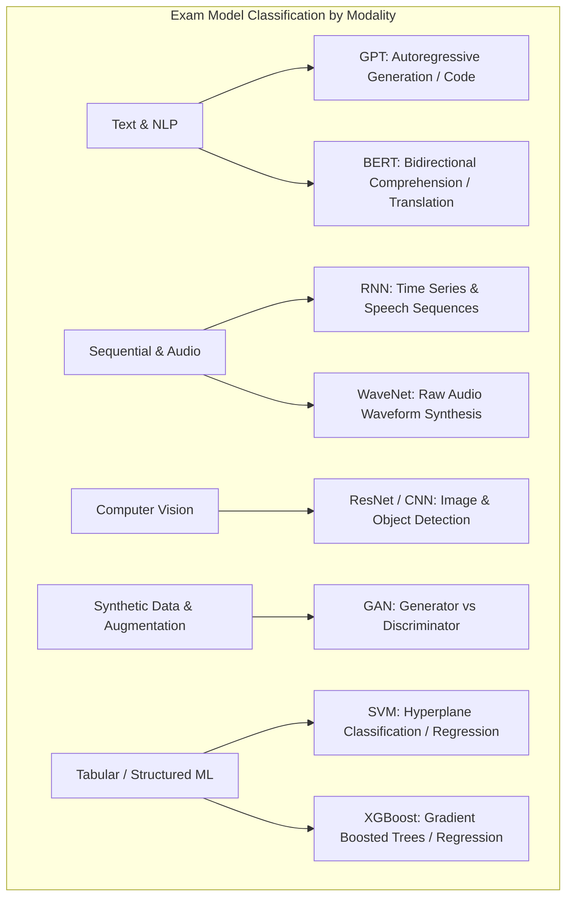
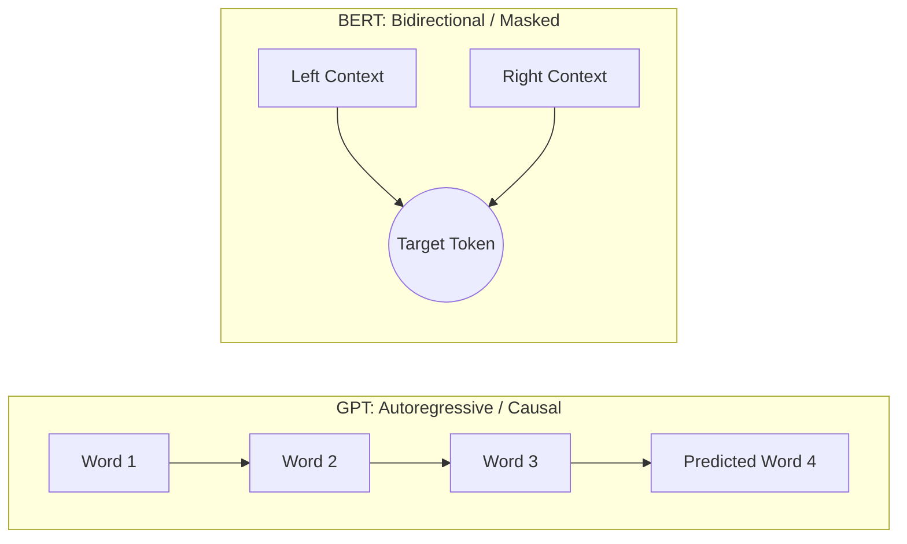
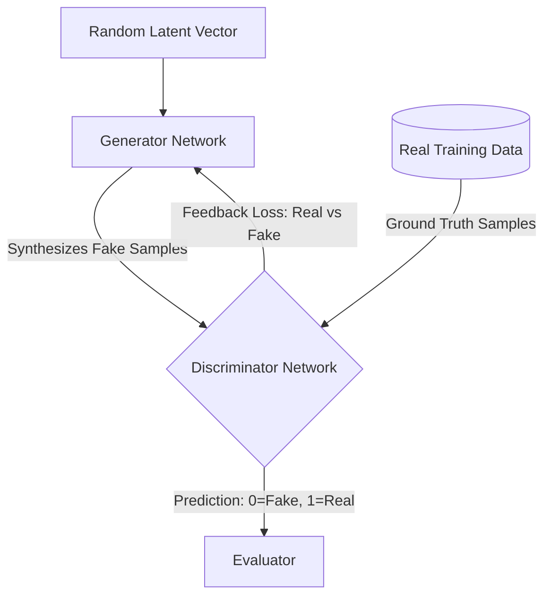

# High-Frequency Machine Learning & Deep Learning Terms for AIF-C01

---

## Key Takeaways

For the **AWS Certified AI Practitioner (AIF-C01)** exam, you do not need to implement complex neural network architectures from scratch or perform mathematical calculus derivations. Instead, the exam focuses on **rapid architectural mapping and process of elimination**: associating standard model abbreviations with their intended domain, data modality, and core business use case.

The core high-yield acronyms to master are **GPT** and **BERT** for language, **ResNet** for vision, **WaveNet** for raw audio, **GAN** for synthetic data generation and dataset rebalancing, and **XGBoost** for gradient-boosted tabular regression.

---

## Main Discussion

### High-Yield Model Terminology & Architecture Matrix

| Term / Acronym | Full Form & Architecture Family                                             | Core Mechanism & Data Modality                                                                              | Typical Exam Business Use Case                                                                            |
| -------------- | --------------------------------------------------------------------------- | ----------------------------------------------------------------------------------------------------------- | --------------------------------------------------------------------------------------------------------- |
| **GPT**        | **Generative Pre-trained Transformer** (Autoregressive Transformer)         | Reads left-to-right to predict subsequent tokens in a sequence; text and code modality.                     | Natural language generation, conversational assistants, code generation, summarization.                   |
| **BERT**       | **Bidirectional Encoder Representations from Transformers** (Encoder-only)  | Reads text bidirectionally (left-and-right context simultaneously); text modality.                          | Sentiment analysis, semantic search, entity recognition, machine translation.                             |
| **RNN**        | **Recurrent Neural Network** (Sequential Network)                           | Maintains internal hidden states to capture temporal dependencies over time.                                | Time-series forecasting, sequential speech recognition, sequential log analysis.                          |
| **ResNet**     | **Residual Network** (Deep Convolutional Neural Network / CNN)              | Uses skip (residual) connections to train deep vision models without vanishing gradients.                   | Image classification, facial recognition, industrial defect detection in images.                          |
| **SVM**        | **Support Vector Machine** (Classical ML Algorithm)                         | Identifies the optimal geometric hyperplane separating distinct data classes.                               | Binary tabular classification, structured fraud scoring, continuous numerical regression.                 |
| **WaveNet**    | **Deep Generative Model for Raw Audio** (Autoregressive Waveform Synthesis) | Generates raw, sample-by-sample audio waveforms directly rather than spectrograms.                          | High-fidelity text-to-speech (TTS) synthesis, natural sounding voice generation.                          |
| **GAN**        | **Generative Adversarial Network** (Adversarial DL Architecture)            | Pits two networks against each other: a **Generator** (fakes data) and a **Discriminator** (detects fakes). | **Synthetic data generation**, image-to-image translation, **data augmentation for imbalanced datasets**. |
| **XGBoost**    | **Extreme Gradient Boosting** (Ensemble Tree-based Algorithm)               | Builds an ensemble of sequential decision trees where each tree corrects errors of previous trees.          | Structured tabular regression, credit risk scoring, customer churn prediction.                            |

---

### Key Architectural Distinctions for Process of Elimination

#### 1. Language Architectures: GPT vs. BERT

- **GPT:** Autoregressive decoder; excels at generating long-form text and code forward in time.
- **BERT:** Bidirectional encoder; excels at understanding relationships and extracting context from complete sentences simultaneously.

---

#### 2. Generative Adversarial Networks (GANs) for Data Augmentation

In industrial ML, imbalanced datasets (e.g., rare medical anomalies or uncommon fraud patterns) degrade model accuracy. GANs address this through synthetic data generation:

$$\text{Data Augmentation Value: GANs generate realistic minority-class samples to eliminate training dataset imbalance without collecting new field data.}$$

---

## Exam Guide

### Exam Tips

- **Rapid Acronym Mapping Rules:**
  - **GPT:** Text / Code **generation** (Transformer decoder).
  - **BERT:** Bidirectional text **comprehension / translation** (Transformer encoder).
  - **ResNet:** **Image** recognition / computer vision (Deep CNN).
  - **WaveNet:** Raw **audio waveform** synthesis (Text-to-speech).
  - **GAN:** **Synthetic data generation & data augmentation** for imbalanced datasets.
  - **XGBoost:** High-performance **tabular regression & classification** (Gradient boosted trees).
  - **RNN:** **Sequential & time-series** data processing.
- **Elimination Strategy:** When faced with an image classification question, eliminate text-only options (GPT, BERT) and tabular algorithms (XGBoost) immediately. If the scenario asks for audio generation, target WaveNet. If it asks to balance an image dataset with synthetic examples, target GAN.
- **Scope Boundary:** You will not be asked to tune convolutional kernel strides, optimize backpropagation loss, or configure gradient clipping on the AIF-C01 exam.

---

### Practice Test

#### Question 1

A healthcare organization is training a computer vision model to detect rare skin lesions. The training dataset contains 50,000 images of healthy skin but only 120 images of malignant lesions. The data science team wants to synthetically generate realistic minority-class images to balance the dataset before final training. Which architecture is designed for this data augmentation task?

- [ ] A. BERT (Bidirectional Encoder Representations from Transformers)
- [ ] B. GAN (Generative Adversarial Network)
- [ ] C. WaveNet
- [ ] D. Linear Regression

Correct Answer

- [x] B. GAN (Generative Adversarial Network)
  - **Explanation:** A **Generative Adversarial Network (GAN)** uses a generator and discriminator network pair to synthesize realistic artificial samples (images, audio, or tabular records), making it a standard choice for **data augmentation** on imbalanced datasets.

---

#### Question 2

A financial technology company wants to build a predictive model to estimate loan default risk using structured tabular customer data, including credit scores, annual income, debt ratios, and employment duration. Which machine learning algorithm is commonly used for high-performance classification and regression on structured tabular datasets?

- [ ] A. ResNet
- [ ] B. WaveNet
- [ ] C. XGBoost (Extreme Gradient Boosting)
- [ ] D. BERT

Correct Answer

- [x] C. XGBoost (Extreme Gradient Boosting)
  - **Explanation:** **Explanation:** **XGBoost (Extreme Gradient Boosting)** is an ensemble decision-tree algorithm designed for regression and classification tasks on structured tabular data. ResNet is used for computer vision, WaveNet for raw audio, and BERT for natural language comprehension.

---
