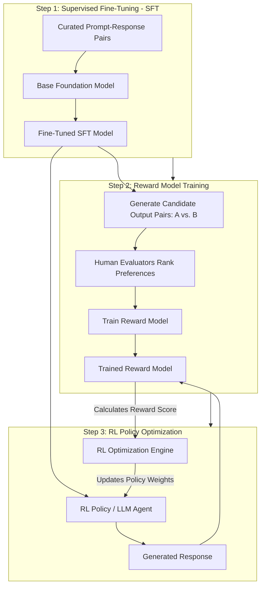
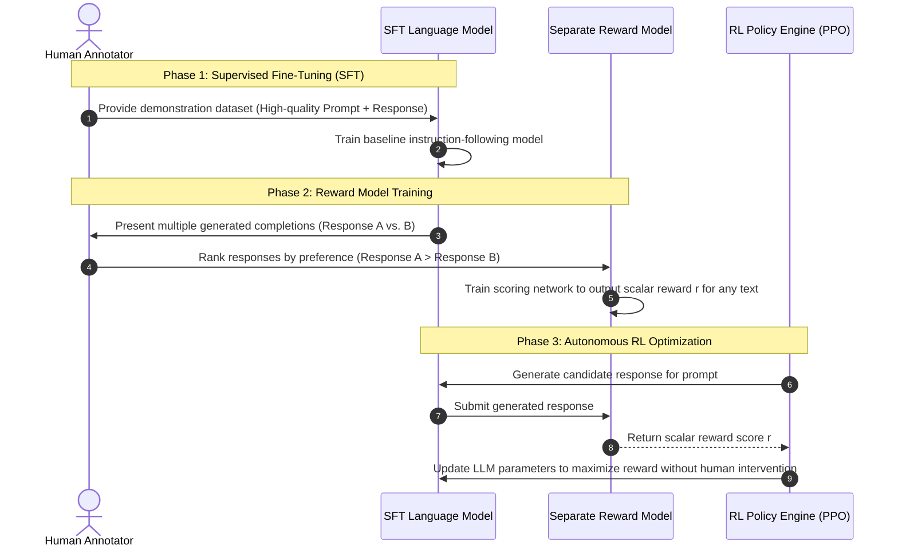
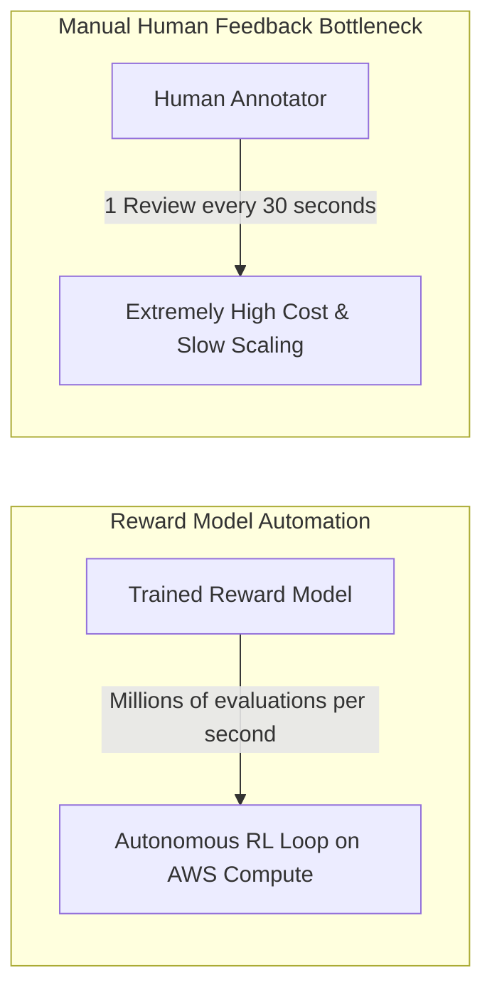
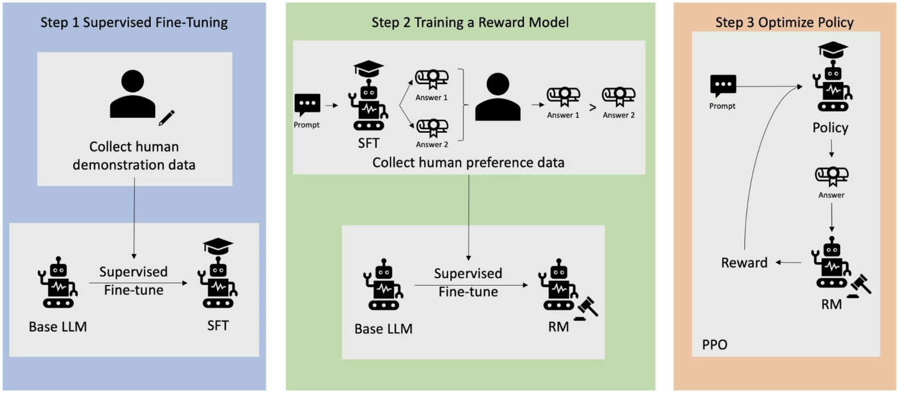

# Reinforcement Learning from Human Feedback (RLHF) & Model Alignment

---

## Key Takeaways

**Reinforcement Learning from Human Feedback (RLHF)** is an alignment and post-training methodology that optimizes pre-trained Foundation Models (LLMs) to follow instructions safely, accurately, and in accordance with human preferences.

Raw base models are primarily next-token predictors trained on internet text, which can lead to hallucinated, toxic, or unhelpful responses. RLHF bridges this gap by training a separate **Reward Model** on human comparative rankings ($A \succ B$) and using reinforcement learning optimization algorithms (such as Proximal Policy Optimization / PPO) to align the primary model's generation policy automatically.

---

## Main Discussion

### The Three-Phase RLHF Pipeline

---

### Step-by-Step Breakdown of the Alignment Phases

| Phase                                      | Core Mechanism                                                                                                                                                                      | Input Artifacts                                                  | Output Artifact                                                         |
| ------------------------------------------ | ----------------------------------------------------------------------------------------------------------------------------------------------------------------------------------- | ---------------------------------------------------------------- | ----------------------------------------------------------------------- |
| **1. Supervised Fine-Tuning (SFT)**        | Trains a raw pre-trained foundation model on curated, gold-standard prompt-response pairs to establish basic instruction-following behavior.                                        | Base Foundation Model + Labeled demonstration dataset            | Supervised Fine-Tuned (SFT) Model                                       |
| **2. Reward Model (RM) Training**          | Humans evaluate and rank multiple candidate completions produced by the SFT model for the same prompt. A separate neural network learns to predict human preference scores.         | SFT Model outputs + Human comparative rankings ($y_w \succ y_l$) | Dedicated Reward Model (outputs scalar reward score $r \in \mathbb{R}$) |
| **3. Reinforcement Learning Optimization** | The SFT model acts as an RL policy agent. It generates text, receives reward scores from the Reward Model, and updates parameters via RL algorithms (e.g., PPO) to maximize scores. | SFT Model + Trained Reward Model + Unlabeled prompts             | Aligned Production Foundation Model                                     |

$$\text{Reward Model Loss: } \mathcal{L}_{\text{RM}} = -\mathbb{E}_{(x, y_w, y_l)} \left[ \log \sigma \left( r_\theta(x, y_w) - r_\theta(x, y_l) \right) \right]$$

---

### Why Train a Separate Reward Model?

- **Scalability:** Having human annotators rate every completion generated during millions of RL training steps would be prohibitively slow and expensive.
- **Automation:** Training an independent mathematical **Reward Model** captures human judgment once, allowing the RL optimization loop to run millions of iterative parameter updates fully autonomously.

---

## Exam Guide

### Exam Tips

- **Core Purpose of RLHF:** Aligning foundation models to generate responses that are **helpful, honest, and harmless (aligned with human intent)** rather than just predicting statistically probable internet tokens.
- **Identify the 3/4 Core Steps:**
  1. Data collection & **Supervised Fine-Tuning (SFT)**.
  2. Generating multiple responses and collecting **human preference rankings**.
  3. Training a **dedicated Reward Model** to output scalar reward scores.
  4. Optimizing the language model policy using **Reinforcement Learning** guided by the Reward Model.
- **Reward Model Role:** The Reward Model acts as the automated proxy for human judgment in the RL feedback loop, eliminating the need for real-time human intervention during gradient updates.
- **AWS Integration Context:** Human-in-the-loop ranking data can be collected using **Amazon SageMaker Ground Truth**, and model alignment jobs run within **Amazon SageMaker** or **Amazon Bedrock Customization** pipelines.

---

### Practice Test

#### Question 1

An AI research team has pre-trained a large language model on raw web corpora. During initial testing, the model frequently generates grammatically fluent but unhelpful, verbose, and toxic responses. The team wants to align the model to prioritize user instructions and human stylistic preferences. Which post-training methodology should the team implement?

- [ ] A. Unsupervised Association Rule Mining
- [ ] B. Reinforcement Learning from Human Feedback (RLHF)
- [ ] C. Polynomial Feature Scaling
- [ ] D. Static Linear Regression

Correct Answer

- [x] B. Reinforcement Learning from Human Feedback (RLHF)
  - **Explanation:** **Reinforcement Learning from Human Feedback (RLHF)** is the standard post-training technique used to align foundation models with human preferences, safety standards, and instruction-following quality.

---

#### Question 2

What is the primary operational purpose of training a separate **Reward Model** during an RLHF alignment pipeline?

- [ ] A. To permanently replace the primary language model for end-user text generation
- [ ] B. To automate the scoring of model completions during reinforcement learning optimization, removing the bottleneck of real-time human grading
- [ ] C. To compress vector embeddings inside Amazon OpenSearch Serverless
- [ ] D. To generate synthetic image data for dataset augmentation

Correct Answer

- [x] B. To automate the scoring of model completions during reinforcement learning optimization, removing the bottleneck of real-time human grading
  - **Explanation:** The **Reward Model** learns to predict human preferences from an initial set of ranked outputs. Once trained, it acts as an automated scoring function in the RL training loop, allowing the policy model to optimize millions of tokens without requiring humans to grade every step.

---
