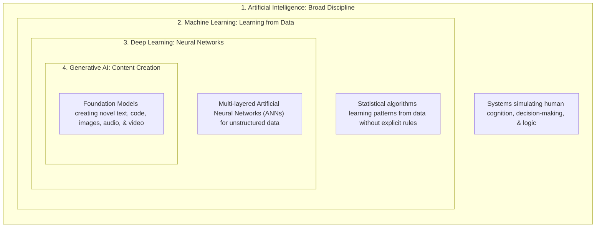
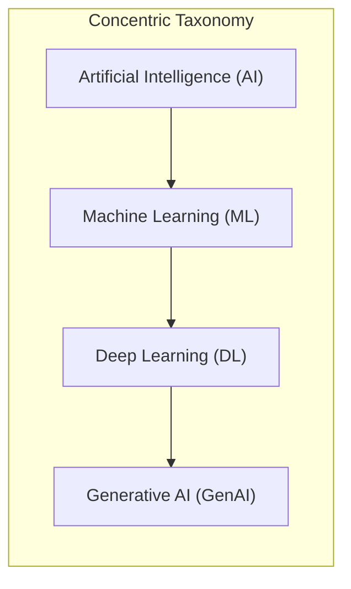
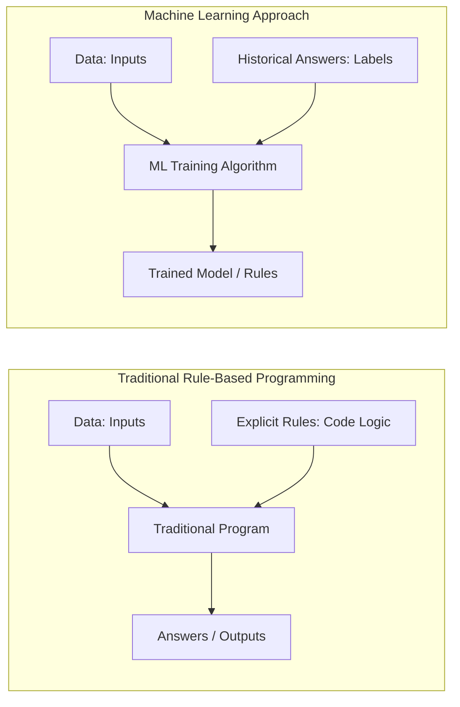
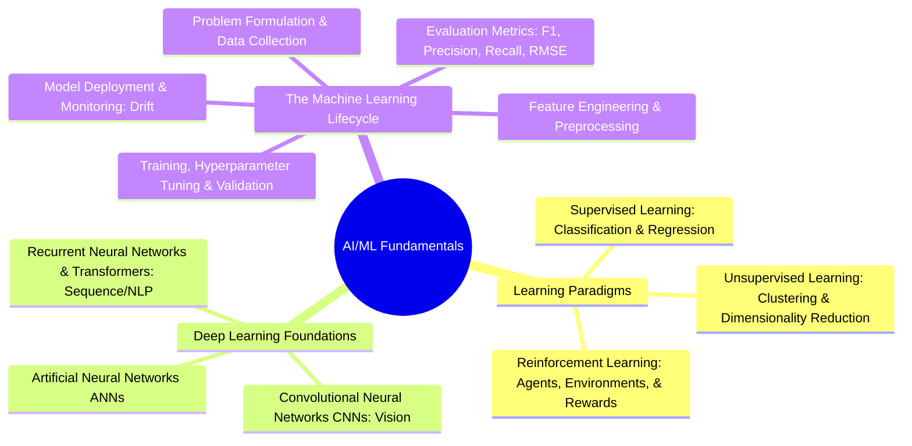

# Section Introduction: Fundamentals of AI, Machine Learning & Deep Learning

---

## Key Takeaways

This section transitions from service-specific implementations (Amazon Bedrock, Amazon Q) to the conceptual foundations underpinning **Domain 1: Fundamentals of AI and ML (20% of scored content)** in the **AWS Certified AI Practitioner (AIF-C01)** exam.

The primary objective is mastering the hierarchical nesting of technologies—from broad Artificial Intelligence down to Generative AI—and understanding when classical rules, machine learning algorithms, deep learning neural networks, or generative models should be applied to solve enterprise business problems.

---

## Main Discussion

### The Nested Hierarchy of Artificial Intelligence

The four tiers are concentric subsets, not isolated parallel disciplines:

| Tier                             | Core Concept                                                                                                                           | Distinguishing Characteristic                                                                                                             | Representative Business Example                                               |
| -------------------------------- | -------------------------------------------------------------------------------------------------------------------------------------- | ----------------------------------------------------------------------------------------------------------------------------------------- | ----------------------------------------------------------------------------- |
| **Artificial Intelligence (AI)** | Any software system or machine capable of performing tasks that typically require human cognitive intelligence.                        | Encompasses symbolic reasoning, deterministic rule engines, expert systems, heuristics, and learning algorithms.                          | Deterministic if-then tax calculation engine, automated chess engine.         |
| **Machine Learning (ML)**        | A subset of AI where systems extract statistical patterns from historical data to make predictions rather than being explicitly coded. | Algorithms adjust mathematical weights from datasets; performance improves automatically with more training observations.                 | Credit score prediction, customer churn modeling, tabular fraud risk scoring. |
| **Deep Learning (DL)**           | A specialized subset of ML based on multi-layered Artificial Neural Networks (ANNs) inspired by biological neural structures.          | Automatically performs feature extraction from massive, complex unstructured data (images, audio, video, raw text).                       | Facial recognition, autonomous vehicle computer vision, speech transcription. |
| **Generative AI (GenAI)**        | A subset of Deep Learning powered by large Foundation Models (FMs) and Transformer architectures.                                      | Focuses on **creating novel synthetic content** (text, synthetic data, images, code) rather than merely classifying or predicting labels. | Conversational AI assistants, document summarization, code generation.        |

---

### Traditional Programming vs. Machine Learning Paradigms

Classical computing relies on deterministic logic, while machine learning shifts the programming paradigm:

- **Traditional Programming:** A software engineer writes deterministic rules and conditionals (`if/else`) that evaluate input data to produce outputs.
- **Machine Learning:** An algorithm ingests historical input data alongside ground-truth target outputs to derive the underlying mathematical relationship (the **Trained Model**), which is subsequently used to evaluate unseen inputs.

---

### Upcoming Section Roadmap

This section covers the following core AIF-C01 syllabus areas:

---

## Exam Guide

### Exam Tips

- **Hierarchy Recognition Questions:** Exam questions often ask you to categorize a business requirement into its exact conceptual level. Remember:
  - **AI** is the outermost umbrella.
  - **ML** is learning patterns from data without explicit rule programming.
  - **DL** is learning from complex/unstructured data using multi-layered neural networks.
  - **Generative AI** is generating novel outputs using foundation models.
- **Scored Weighting:** Domain 1 constitutes **20% of the scored questions** on the exam. The exam focuses on **conceptual mapping and service selection**, not writing raw Python, PyTorch, or calculus equations.
- **Determinism vs. Probabilities:** Classical rule-based systems are deterministic (fixed rule outputs), whereas ML and DL systems are probabilistic (outputting predictions with associated confidence scores).

---

### Practice Test

#### Question 1

An enterprise architect is defining the organization's technology strategy and needs to explain the relationship between Deep Learning, Artificial Intelligence, Generative AI, and Machine Learning. Which of the following correctly describes their relationship from broadest domain to most specific subset?

- [ ] A. Machine Learning $\rightarrow$ Artificial Intelligence $\rightarrow$ Deep Learning $\rightarrow$ Generative AI
- [ ] B. Artificial Intelligence $\rightarrow$ Machine Learning $\rightarrow$ Deep Learning $\rightarrow$ Generative AI
- [ ] C. Deep Learning $\rightarrow$ Machine Learning $\rightarrow$ Generative AI $\rightarrow$ Artificial Intelligence
- [ ] D. Generative AI $\rightarrow$ Deep Learning $\rightarrow$ Machine Learning $\rightarrow$ Artificial Intelligence

Correct Answer

- [x] B. Artificial Intelligence $\rightarrow$ Machine Learning $\rightarrow$ Deep Learning $\rightarrow$ Generative AI
  - **Explanation:** **Artificial Intelligence** is the overarching field. **Machine Learning** is a subset of AI. **Deep Learning** is a subset of ML using deep neural networks. **Generative AI** is a specialized subset of Deep Learning focused on creating new content.

---

#### Question 2

A retail company wants to predict whether a customer will cancel their subscription in the next 30 days based on their last 2 years of browsing and purchasing records. Rather than writing thousands of complex manual `if/else` business rules, the engineering team wants a system that identifies patterns automatically from historical customer records. Which paradigm best describes this approach?

- [ ] A. Deterministic Rule-Based Programming
- [ ] B. Machine Learning
- [ ] C. Edge Computing
- [ ] D. Static Scripting

Correct Answer

- [x] B. Machine Learning
  - **Explanation:** **Machine Learning** systems train algorithms on historical data and outcomes to learn statistical patterns automatically, replacing manual deterministic rule-writing for complex predictive problems.

---
