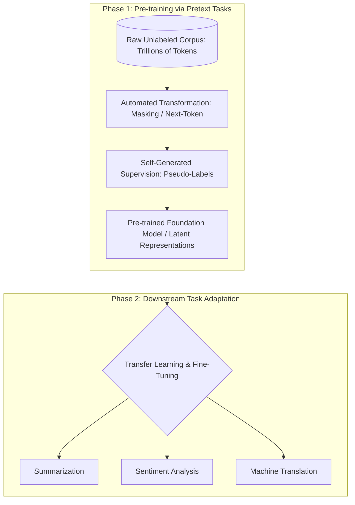
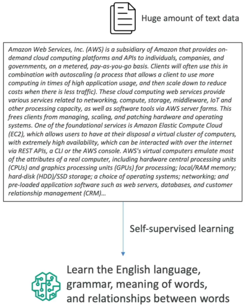
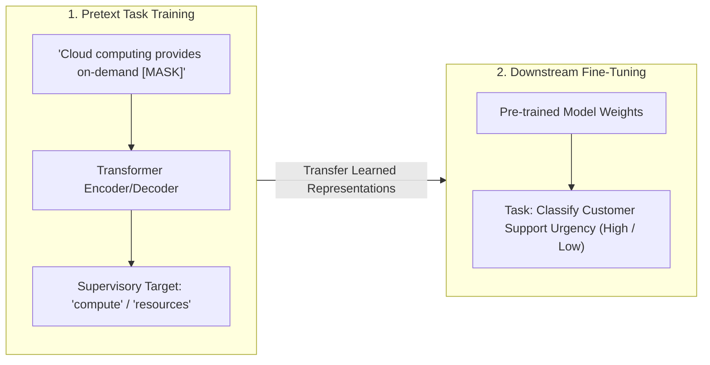
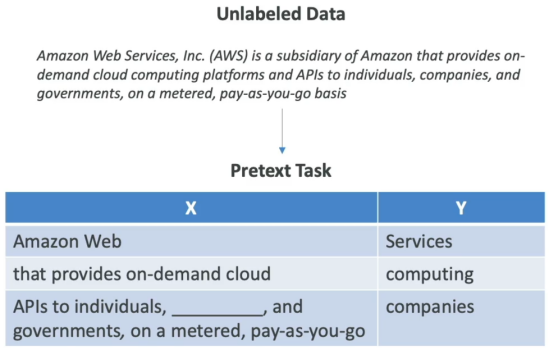

# Self-Supervised Learning, Pretext Tasks & Downstream Adaptation

---

## Key Takeaways

**Self-Supervised Learning (SSL)** is a machine learning paradigm where the training algorithm generates its own supervisory signals (**pseudo-labels**) directly from raw, **unlabeled data** without human annotators.

By formulating automated **pretext tasks** (such as predicting the next word or filling in masked blanks), the model learns deep contextual syntax, semantics, and world knowledge. These pre-trained representations are then transferred to solve specific **downstream tasks** (e.g., summarization, sentiment analysis, entity extraction) with minimal supervised data.

---

## Main Discussion

### The Self-Supervised Learning Lifecycle

Self-supervised learning decouples broad representation learning from narrow application tasks:

---

### Pretext Tasks vs. Downstream Tasks

| Component                                       | Mechanism & Scope                                                                                                                                                                               | Concrete Examples                                                                                                                                                                                                                                                                         |
| ----------------------------------------------- | ----------------------------------------------------------------------------------------------------------------------------------------------------------------------------------------------- | ----------------------------------------------------------------------------------------------------------------------------------------------------------------------------------------------------------------------------------------------------------------------------------------- |
| **Pretext Task** (Self-Supervised Pre-training) | The automated task designed to force the neural network to learn feature representations from unlabeled data. The labels ($y$) are programmatically extracted from the input data ($X$) itself. | • **Causal Next-Token Prediction (GPT):** Given _"Amazon Web"_, predict _"Services"_ • **Masked Language Modeling (BERT):** Given _"Provides APIs to [MASK] on pay-as-you-go"_, fill in _"companies"_ • **Visual Inpainting:** Predicting occluded or missing patches of an image |
| **Downstream Task** (Supervised Fine-Tuning)    | The practical target business application evaluated on labeled domain datasets. Reuses the pre-trained feature extractor to achieve high performance with limited training samples.             | • Text Summarization • Code Generation & Vulnerability Auditing • Medical Diagnosis / Image Classification                                                                                                                                                                        |

---

### Comparison: Semi-Supervised vs. Self-Supervised Learning

While both paradigms handle unlabeled datasets to avoid manual annotation bottlenecks, their training mechanics differ:

```mermaid
flowchart TD
    subgraph SemiSupervised [Semi-Supervised Learning]
        SS_Data[Requires Small Seed Labeled Dataset] --> SS_Model[Train Baseline Model]
        SS_Model --> SS_Pseudo[Generate Pseudo-Labels on Unlabeled Pool]
        SS_Pseudo --> SS_Retrain[Retrain on Combined Dataset]
    end

    subgraph SelfSupervised [Self-Supervised Learning]
        SSL_Data[100% Unlabeled Data Corpus] --> SSL_Task[Automated Pretext Task: Masking / Shift]
        SSL_Task --> SSL_Base[Foundational Feature Representation]
        SSL_Base --> SSL_Down[Fine-Tune for Target Downstream Task]
    end

```

| Dimension                | Semi-Supervised Learning                                                        | Self-Supervised Learning (SSL)                                                                              |
| ------------------------ | ------------------------------------------------------------------------------- | ----------------------------------------------------------------------------------------------------------- |
| **Initial Human Labels** | **Required:** Starts with a small seed of human-labeled data (e.g., 5% to 10%). | **Zero Required:** Ingests 100% raw unlabeled text, audio, or images.                                       |
| **Pseudo-Label Source**  | Inferred by a baseline model trained on the seed labeled set.                   | Extracted programmatically from the inherent structure of the data itself (e.g., subsequent tokens).        |
| **Primary Output**       | A single classifier retrained to predict the original task classes.             | A generalized **Foundation Model** (e.g., GPT, BERT, Claude) capable of powering multiple downstream tasks. |

---

## Exam Guide

### Exam Tips

- **Definition of Self-Supervised Learning:** Training on **unlabeled data** where the supervisory signal is derived **automatically from the input data itself** (pseudo-labels generated by the system, not humans).
- **Pretext vs. Downstream Terminology:**
  - **Pretext Task:** The synthetic task used to train the base model (e.g., next-token prediction, masked word fill-in, image patch prediction).  
    
  - **Downstream Task:** The real-world business objective (e.g., summarization, sentiment classification, translation).
- **Foundation of Modern LLMs:** Self-supervised pre-training on massive web corpora is the exact process used to build modern **Foundation Models (GPT-4, Claude, Amazon Nova, BERT)** before instruction tuning and RLHF are applied.

---

### Practice Test

#### Question 1

A research team wants to pre-train a large language model on 500 billion tokens of raw text extracted from web pages. The team cannot manually label this dataset due to time and budget limits. The training pipeline hides random words within sentences and trains the model to predict the missing words based on surrounding context. Which learning paradigm is being used?

- [ ] A. Supervised Multi-Label Classification
- [ ] B. Self-Supervised Learning via a Pretext Task
- [ ] C. Unsupervised Association Rule Learning
- [ ] D. Reinforcement Learning from Human Feedback (RLHF)

Correct Answer

- [x] B. Self-Supervised Learning via a Pretext Task
  - **Explanation:** In **Self-Supervised Learning**, the training system automatically creates its own supervisory signals (such as masking words and predicting the hidden tokens in a **pretext task**) directly from raw unlabeled text without human annotators.

---

#### Question 2

In the context of foundation model development, what is the primary relationship between a pretext task and a downstream task?

- [ ] A. Pretext tasks are human-annotated validation sets used exclusively to terminate training early
- [ ] B. Pretext tasks allow the model to learn general feature representations from unlabeled data, which are subsequently adapted to solve specific downstream business tasks
- [ ] C. Downstream tasks generate synthetic data to balance minority classes for the pretext task
- [ ] D. Pretext tasks configure AWS IAM Identity Center policies for downstream application access

Correct Answer

- [x] B. Pretext tasks allow the model to learn general feature representations from unlabeled data, which are subsequently adapted to solve specific downstream business tasks
  - **Explanation:** The model solves **pretext tasks** (like predicting the next token) during self-supervised pre-training to learn general language and contextual representations. These learned representations are then transferred and fine-tuned to solve specific **downstream tasks** (like question answering or summarization).

---
