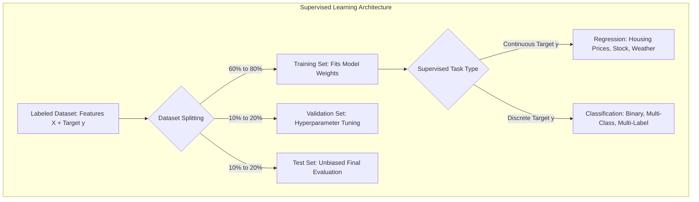
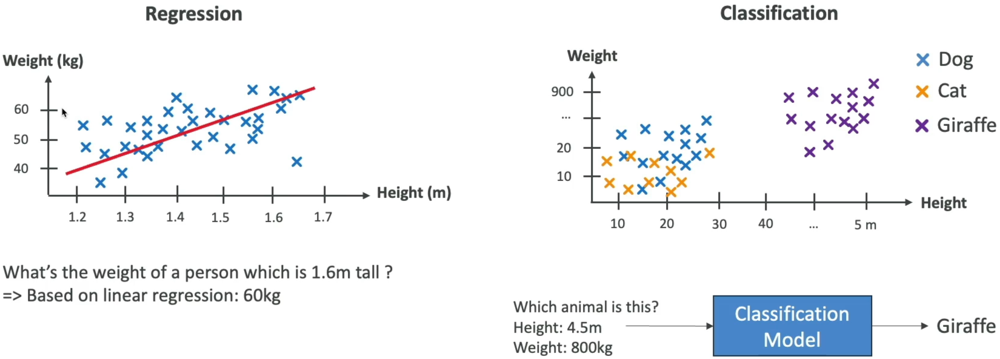
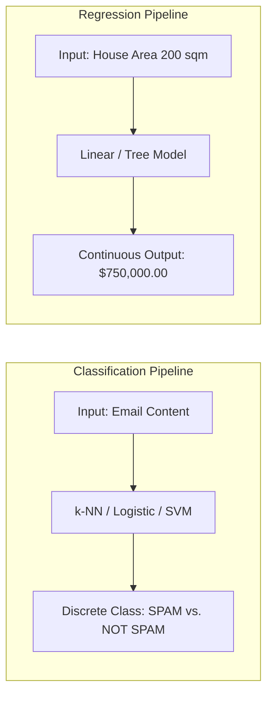
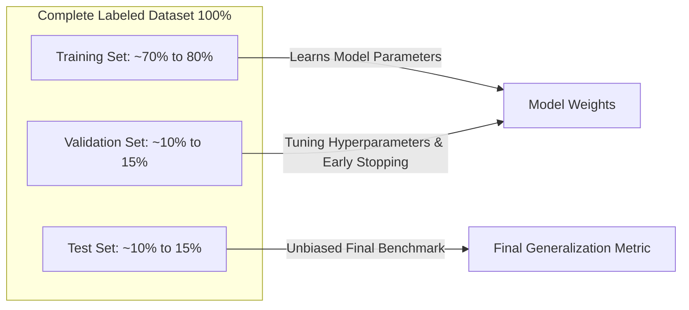
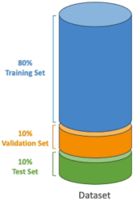
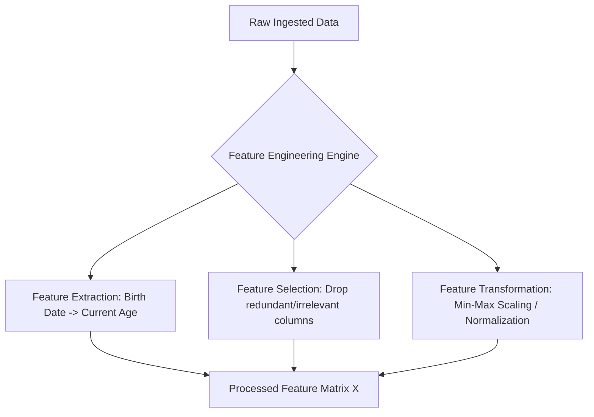
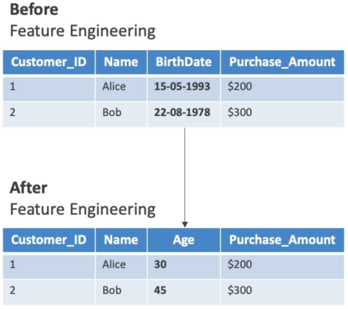

import ImageRow from "@site/src/components/ImageRow";
import RegressionExample from "./img/regression-example.png";
import ClassificationExample from "./img/classification-example.png";

# Supervised Learning, Dataset Splitting & Feature Engineering

---

## Key Takeaways

**Supervised Learning** trains machine learning algorithms on **labeled data** (input features $X$ mapped to ground-truth targets $y$) to learn a predictive function $f(X) \rightarrow y$ capable of evaluating new, unseen inputs.

The predictive task is split between **Regression** (predicting continuous numerical quantities) and **Classification** (predicting discrete categorical classes). To ensure generalizability and avoid data leakage, raw datasets are partitioned into **Train**, **Validation**, and **Test** sets and refined using **Feature Engineering** (extraction, selection, and transformation).

---

## Main Discussion

### Regression vs. Classification

| Dimension                   | Regression                                                                     | Classification                                                                                                                                                                                                        |
| --------------------------- | ------------------------------------------------------------------------------ | --------------------------------------------------------------------------------------------------------------------------------------------------------------------------------------------------------------------- |
| **Target Variable ($y$)**   | **Continuous** numerical value (infinite real numbers within a range).         | **Discrete** categorical class label (finite predefined categories).                                                                                                                                                  |
| **Mathematical Goal**       | Fit a trend line, curve, or continuous surface minimizing error (e.g., MSE).   | Construct decision boundaries that separate distinct classes.                                                                                                                                                         |
| **Classification Subtypes** | Simple Linear, Multi-variable, Polynomial Regression.                          | • **Binary:** 2 classes (Spam / Ham, Churn / Retain)  • **Multi-Class:** $>2$ mutually exclusive classes (Cat, Dog, Giraffe)  • **Multi-Label:** Non-exclusive labels (Movie tagged as _Action_ and _Comedy_) |
| **Representative Examples** | Real estate price estimation, temperature forecasting, stock price projection. | Credit card fraud detection, medical diagnosis categorization, document tagging.                                                                                                                                      |

<ImageRow>
  
  
</ImageRow>

---

### Dataset Partitioning: Training vs. Validation vs. Test Sets

Splitting data prevents overfitting and measures how well the model generalizes to real-world inputs:

| Dataset Partition  | Standard Proportion | Core Responsibility in ML Lifecycle                                                                                                         |
| ------------------ | ------------------- | ------------------------------------------------------------------------------------------------------------------------------------------- |
| **Training Set**   | 60% to 80%          | The primary dataset used directly by the algorithm to learn mathematical weights and parameters.                                            |
| **Validation Set** | 10% to 20%          | Used during the development cycle to tune **hyperparameters**, guide architectural choices, and detect overfitting before final deployment. |
| **Test Set**       | 10% to 20%          | Held-out data used **only once at the end** to compute an unbiased final performance evaluation on unseen samples.                          |

---

### Feature Engineering: Structured & Unstructured Data

Feature engineering transforms raw, noisy inputs into optimized numerical representations to improve algorithm convergence and predictive accuracy:

| Feature Engineering Method | Purpose & Mechanism                                                                | Concrete Example                                                                                                                                                                         |
| -------------------------- | ---------------------------------------------------------------------------------- | ---------------------------------------------------------------------------------------------------------------------------------------------------------------------------------------- |
| **Feature Extraction**     | Derives new high-signal mathematical variables from raw fields.                    | • Converting `Date_of_Birth` to numerical `Age`  • Calculating `Price_per_Square_Foot` from `Price` and `Area` • Extracting text weights via **TF-IDF** or image edges via CNNs |
| **Feature Selection**      | Identifies and retains only high-impact predictors while dropping redundant noise. | Keeping `Location` and `Square_Footage` while discarding `Listing_ID` and `Agent_Phone_Number`.                                                                                          |
| **Feature Transformation** | Scales, normalizes, or re-encodes variables into uniform numerical spaces.         | Scaling disparate ranges (e.g., Income $0–$500k and Age 18–90) into standard scales $[0, 1]$ or $[-1, 1]$.                                                                               |

---

## Exam Guide

### Exam Tips

- **Task Categorization Rules:**
  - If the model predicts a **real continuous number** (e.g., dollars, temperature, square meters, probability percentages) $\rightarrow$ **Regression**.
  - If the model predicts a **bucket, category, discrete label, or flag** $\rightarrow$ **Classification**.
- **Classification Variants:**
  - **Binary:** Exactly two possible classes (e.g., Fraud = Yes/No).
  - **Multi-Class:** Multiple classes where each record gets **exactly one label** (e.g., Mammal, Bird, or Reptile).
  - **Multi-Label:** A single record can receive **multiple active labels simultaneously** (e.g., a movie categorized under both _Sci-Fi_ and _Comedy_).
- **Dataset Roles:**
  - **Training Set:** Trains internal weights.
  - **Validation Set:** Evaluates hyperparameter configurations and detects overfitting during training.
  - **Test Set:** Evaluates the final trained model on unseen data.
- **Feature Engineering Purpose:** Feature engineering does not change model weights directly; it cleans, derives, and transforms input data before training so that algorithms converge faster and make more accurate predictions.

---

### Practice Test

#### Question 1

A retail logistics company is training a machine learning model to estimate the exact delivery time in minutes for packages based on transit distance, courier vehicle type, driver experience, and weather conditions. What type of machine learning task is this?

- [ ] A. Unsupervised Clustering
- [ ] B. Supervised Binary Classification
- [ ] C. Supervised Regression
- [ ] D. Reinforcement Learning

Correct Answer

- [x] C. Supervised Regression
  - **Explanation:** Estimating delivery time in minutes involves predicting a continuous numerical value using historical labeled training data, which defines a **Supervised Regression** task.

---

#### Question 2

A data scientist splits a historical customer dataset into three subsets. Subset A is used by the algorithm to adjust internal weights, Subset B is used to evaluate different model hyperparameters and prevent overfitting during development, and Subset C is reserved strictly for the final performance evaluation. What are Subsets A, B, and C?

- [ ] A. Subset A: Validation, Subset B: Training, Subset C: Test
- [ ] B. Subset A: Training, Subset B: Validation, Subset C: Test
- [ ] C. Subset A: Test, Subset B: Training, Subset C: Validation
- [ ] D. Subset A: Training, Subset B: Test, Subset C: Validation

Correct Answer

- [x] B. Subset A: Training, Subset B: Validation, Subset C: Test
  - **Explanation:** In standard machine learning workflows, **Subset A** is the **Training set** (fits model parameters), **Subset B** is the **Validation set** (tunes hyperparameters and monitors overfitting), and **Subset C** is the held-out **Test set** (provides the final unbiased evaluation).

---
