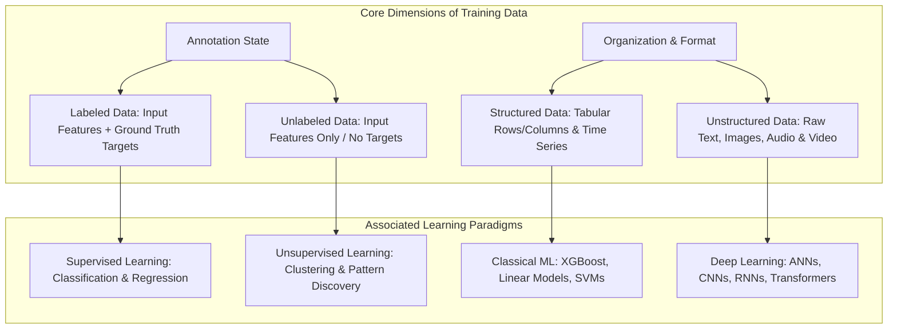
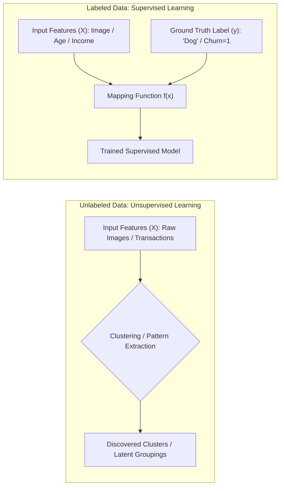
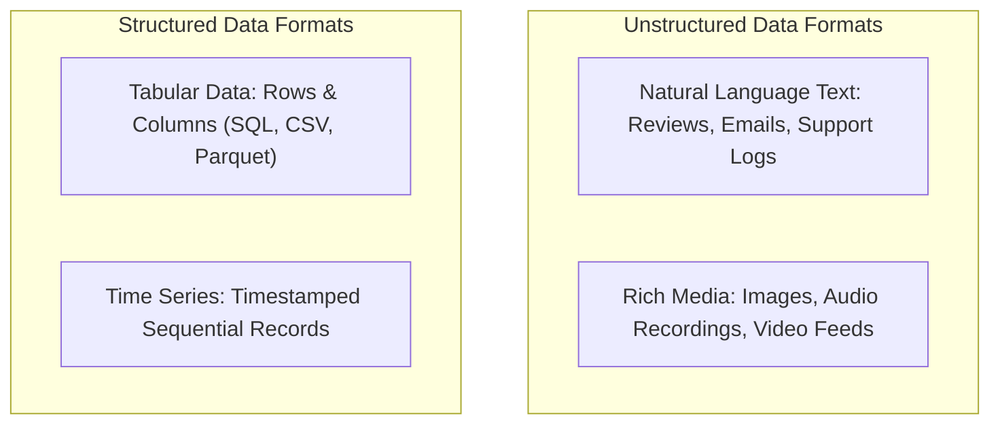
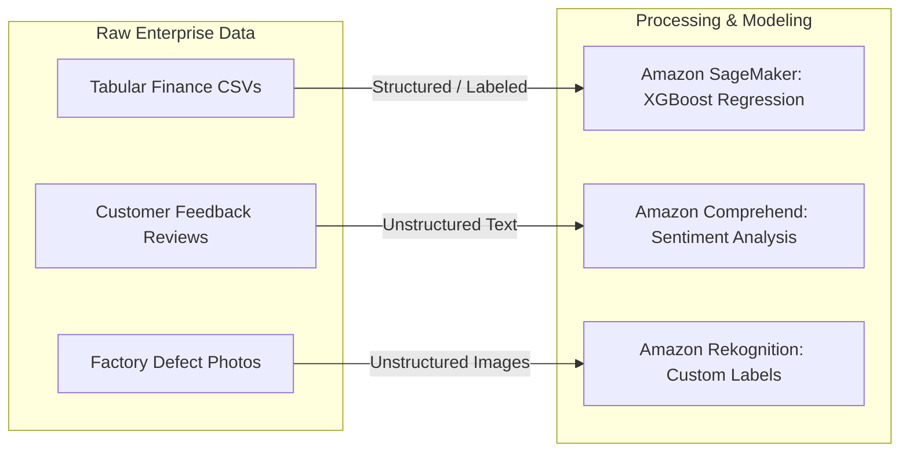

# Training Data Fundamentals: Labeled vs. Unlabeled & Structured vs. Unstructured

---

## Key Takeaways

High-quality training data is the foundation of effective machine learning models. The principle of **"Garbage In, Garbage Out" (GIGO)** dictates that even the most advanced model architectures fail if trained on noisy, incomplete, or poorly curated datasets.

Training data is categorized across two core dimensions: **Annotation status** (Labeled vs. Unlabeled, determining whether you use Supervised or Unsupervised learning) and **Structural organization** (Structured vs. Unstructured, dictating whether you use classical tabular algorithms or deep learning neural networks).

---

## Main Discussion

### Labeled vs. Unlabeled Data

| Dimension                  | Labeled Data                                                                                 | Unlabeled Data                                                                          |
| -------------------------- | -------------------------------------------------------------------------------------------- | --------------------------------------------------------------------------------------- |
| **Composition**            | Input features ($X$) paired with ground-truth target labels ($y$).                           | Input features ($X$) only; no target labels provided.                                   |
| **Learning Paradigm**      | **Supervised Learning** (Classification, Regression).                                        | **Unsupervised Learning** (Clustering, Anomaly Detection).                              |
| **Collection & Cost**      | High operational cost (requires manual human labeling, Amazon SageMaker Ground Truth).       | Low collection cost; widely available in large volumes across enterprise systems.       |
| **Model Objective**        | Learn a mathematical mapping function $f(X) \rightarrow y$ to predict labels on unseen data. | Discover inherent statistical distributions, clusters, or latent relationships in data. |
| **Representative Example** | Medical images labeled with "Malignant" vs. "Benign".                                        | Customer purchase histories grouped into behavioral buyer personas.                     |

$$\text{Supervised Optimization Objective: } \min_{\theta} \sum_{i=1}^{N} \mathcal{L}\Big(f_\theta(X_i), y_i\Big)$$

---

### Structured vs. Unstructured Data

| Dimension                | Structured Data                                                                                | Unstructured Data                                                                                                 |
| ------------------------ | ---------------------------------------------------------------------------------------------- | ----------------------------------------------------------------------------------------------------------------- |
| **Format & Schema**      | Rigid, predefined schema organized into rows and columns (tabular, CSV, relational databases). | Lacks a predefined conceptual data model; highly variable format and density.                                     |
| **Primary Types**        | Tabular customer records, accounting logs, sensor time-series data.                            | Unformatted plain text articles, audio waveforms, image pixels, video streams.                                    |
| **Storage Engines**      | Amazon RDS, Amazon Aurora, Amazon Redshift, structured S3 tables.                              | Amazon S3 object storage buckets, document stores, vector databases.                                              |
| **Primary Model Family** | Classical ML (Decision Trees, XGBoost, Linear Regression, Logistic Regression).                | Deep Learning & Generative AI (CNNs, ResNet, Transformers, BERT, GPT).                                            |
| **Feature Extraction**   | Straightforward column selection, mathematical scaling, and encoding.                          | Requires deep neural network layers or embeddings models to transform raw signals into numerical representations. |

---

### Data Type Mapping to AWS AI/ML Use Cases

- **Structured Tabular Forecasting:** Predicting financial churn or customer lifetime value from transactional databases uses tabular machine learning algorithms.
- **Unstructured Text Processing:** Extracting sentiment, entities, or summaries from customer reviews requires natural language processing (NLP) models (e.g., Amazon Comprehend or LLMs on Amazon Bedrock).
- **Unstructured Vision Analytics:** Classifying image pixels or identifying defective parts on an assembly line requires deep convolutional networks (e.g., Amazon Rekognition).

---

## Exam Guide

### Exam Tips

- **Garbage In, Garbage Out (GIGO):** The quality, cleanliness, and representativeness of training data constrain the maximum potential accuracy of any machine learning model.
- **Supervised vs. Unsupervised Categorization:**
  - If the dataset includes **target answers, ground-truth outcomes, or categorized labels**, the task is **Supervised Learning**.
  - If the dataset contains **only raw observations without labels** and the system must discover clusters or anomalous outliers, the task is **Unsupervised Learning**.
- **Data Labeling on AWS:** When an exam question involves converting large volumes of unstructured, unlabeled data into labeled datasets using human-in-the-loop workflows or automated ML labeling, the target AWS service is **Amazon SageMaker Ground Truth**.
- **Modality Matching:** Tabular/Time-Series $\rightarrow$ Structured; Text/Audio/Video/Images $\rightarrow$ Unstructured.

---

### Practice Test

#### Question 1

A data science team at an insurance firm is building a machine learning model to predict claims settlement costs. The team uses a historical database containing 500,000 completed claims records with columns for claimant age, policy type, incident severity rating, and the final payout amount. How should this dataset be classified?

- [ ] A. Unlabeled and Unstructured data
- [ ] B. Labeled and Structured data
- [ ] C. Unlabeled and Semi-structured data
- [ ] D. Labeled and Unstructured data

Correct Answer

- [x] B. Labeled and Structured data
  - **Explanation:** The dataset is organized in relational columns and rows (making it **Structured** data) and includes historical final payout amounts acting as the ground-truth target for model training (making it **Labeled** data).

---

#### Question 2

An e-commerce platform has collected 2,000,000 raw customer feedback comments submitted in plain text. The platform wants an algorithm to automatically group these comments into distinct customer sentiment themes without having human annotators manually assign predefined tags or categories beforehand. Which combination of data type and learning paradigm applies to this scenario?

- [ ] A. Structured data using Supervised Learning
- [ ] B. Unstructured data using Unsupervised Learning
- [ ] C. Structured data using Reinforcement Learning
- [ ] D. Unstructured data using Supervised Regression

Correct Answer

- [x] B. Unstructured data using Unsupervised Learning
  - **Explanation:** The raw customer feedback comments are unformatted text (making it **Unstructured** data). Because the comments lack pre-assigned target tags and the system must discover groupings automatically, this is an **Unsupervised Learning** (clustering/topic modeling) task.

---
