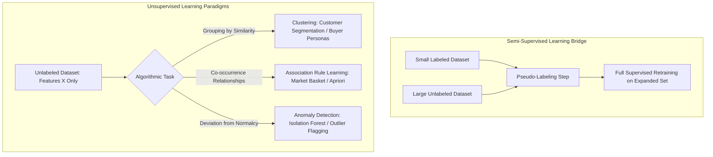
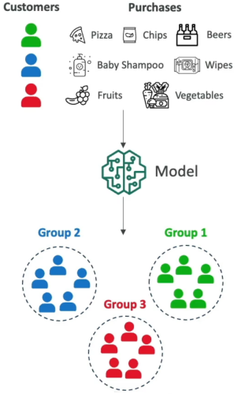
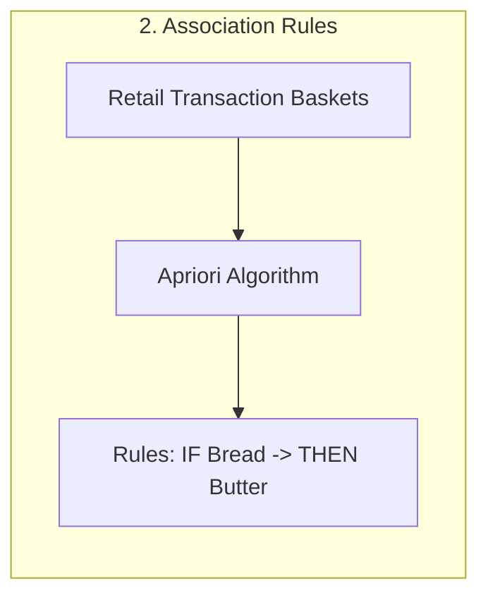
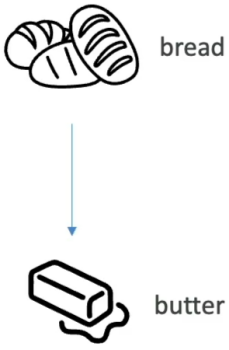
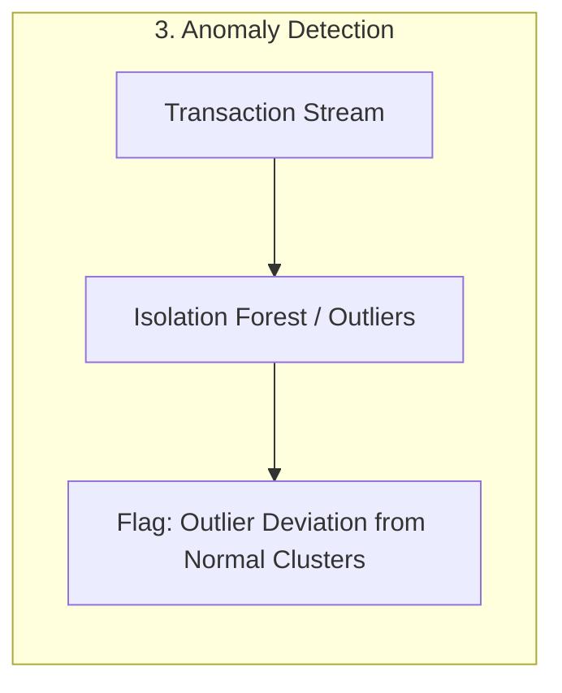
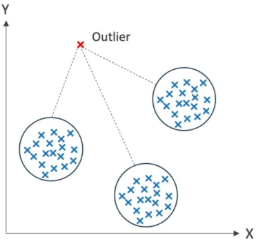
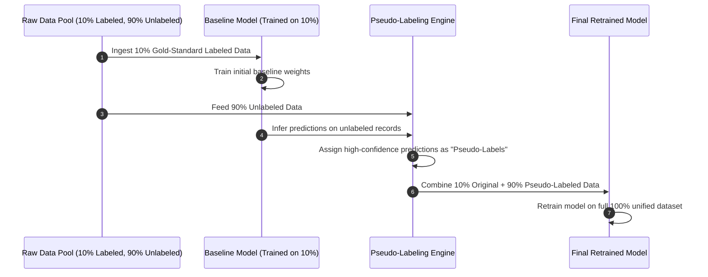
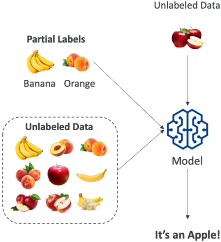

# Unsupervised Learning, Anomaly Detection & Semi-Supervised Workflows

---

## Key Takeaways

**Unsupervised Learning** extracts inherent patterns, groupings, and anomalous outliers from **unlabeled data** without relying on pre-assigned target answers ($y$).



The primary unsupervised techniques include **Clustering** (e.g., grouping customers into distinct behavioral segments), **Association Rule Learning** (e.g., discovering co-purchased items in market baskets), and **Anomaly Detection** (e.g., flagging statistical outliers for fraud or defect analysis).

When labeling costs are prohibitive, **Semi-Supervised Learning** bridges the gap through **pseudo-labeling**, training a baseline model on a small labeled subset to annotate a much larger unlabeled pool.

---

## Main Discussion

### Core Unsupervised Paradigms: Clustering, Association & Anomaly Detection

#### 1. Clustering

<div className="grid grid-cols-1 md:grid-cols-3">

<div className="col-span-2">
    ```mermaid
    flowchart LR
        subgraph ClusteringFlow [1. Clustering]
            direction TB
            C_Raw[Raw Purchasing Features] --> C_Model[k-Means / Clustering]
            C_Model --> C_Out[Discovered Personas: Students vs. Parents vs. Vegetarians]
        end
    ```
</div>



</div>

#### 2. Association Rule Learning

<div className="grid grid-cols-1 md:grid-cols-3">

<div className="col-span-2">

</div>



</div>

#### 3. Anomaly Detection

<div className="grid grid-cols-1 md:grid-cols-3">

<div className="col-span-2">

</div>



</div>

| Technique                     | Goal & Operating Mechanism                                                                                                    | Representative Algorithm                           | Enterprise Business Application                                                                                                   |
| ----------------------------- | ----------------------------------------------------------------------------------------------------------------------------- | -------------------------------------------------- | --------------------------------------------------------------------------------------------------------------------------------- |
| **Clustering**                | Partitions unlabeled observations into distinct clusters based on mathematical feature similarity (e.g., Euclidean distance). | $k$-Means, Hierarchical Clustering                 | **Customer Segmentation:** Grouping shoppers by spending patterns to launch tailored email campaigns.                             |
| **Association Rule Learning** | Discovers non-obvious co-occurrence relationships and correlations between items within transaction sets.                     | Apriori, FP-Growth                                 | **Market Basket Analysis:** Identifying products frequently bought together (e.g., bread and butter) to optimize shelf placement. |
| **Anomaly Detection**         | Identifies rare data points whose geometric or statistical distribution deviates significantly from typical clusters.         | Isolation Forest, One-Class SVM, Random Cut Forest | **Fraud Detection & Predictive Maintenance:** Flagging unusual credit card charges or abnormal turbine vibration logs.            |

---

### Semi-Supervised Learning & Pseudo-Labeling Pipeline

Semi-Supervised Learning provides a cost-effective compromise when manual human annotation via data labeling services is too expensive:



1. **Step 1:** Train an initial baseline model using a small, high-quality labeled dataset.
2. **Step 2:** Generate predictions over the large pool of unlabeled data.
3. **Step 3 (Pseudo-Labeling):** Convert high-confidence predictions into synthetic target labels.
4. **Step 4:** Retrain the final model on the combined dataset (original labeled + pseudo-labeled samples).



---

### Learning Paradigm Summary Matrix

| Learning Paradigm            | Dataset Composition                               | Primary Objective                                        | Key Strengths & Trade-offs                                                      |
| ---------------------------- | ------------------------------------------------- | -------------------------------------------------------- | ------------------------------------------------------------------------------- |
| **Supervised Learning**      | 100% Labeled ($X, y$)                             | Predict known discrete classes or continuous numbers.    | High accuracy and direct evaluation; high data labeling costs.                  |
| **Unsupervised Learning**    | 100% Unlabeled ($X$)                              | Discover hidden groupings, affinities, and anomalies.    | Zero labeling overhead; requires human interpretation of cluster meaning.       |
| **Semi-Supervised Learning** | $\approx 10\%$ Labeled + $\approx 90\%$ Unlabeled | Expand limited labeled ground truth via pseudo-labeling. | Minimizes annotation expense while maintaining high classification performance. |

---

## Exam Guide

### Exam Tips

- **Unlabeled Data Equals Unsupervised:** If an exam scenario explicitly states that the dataset **lacks target labels, outcomes, or historical classes**, immediately rule out supervised algorithms (Linear Regression, Logistic Regression, standard SVM) in favor of **Unsupervised Learning** (Clustering, Anomaly Detection).
- **Customer Segmentation = Clustering:** Whenever a scenario describes grouping customers, transaction logs, or users into behavioral buckets without predefined categories, the correct approach is **Clustering**.
- **Market Basket = Association Rules:** Scenarios describing co-purchasing affinities or layout optimizations in retail rely on **Association Rule Learning** (e.g., the _Apriori_ algorithm).
- **Outlier / Fraud Isolation:** Unsupervised anomaly detection algorithms (such as _Isolation Forest_ or _Random Cut Forest_) detect unusual patterns by measuring statistical distance from normal baseline clusters.
- **Semi-Supervised Workflow:** Remember the term **Pseudo-Labeling**—using a model trained on a small labeled subset to annotate a large unlabeled dataset before full retraining.

---

### Practice Test

#### Question 1

A national supermarket chain wants to analyze point-of-sale receipt data across 500 store locations to identify which grocery items are frequently purchased together in the same basket. The objective is to design paired promotional discounts and optimize aisle layouts. Which unsupervised machine learning technique should the analytics team apply?

- [ ] A. Supervised Linear Regression
- [ ] B. Association Rule Learning
- [ ] C. Semi-Supervised Pseudo-Labeling
- [ ] D. Convolutional Image Segmentation

<details>
<summary>Correct Answer</summary>

- [x] B. Association Rule Learning
  - **Explanation:** **Association Rule Learning** (using algorithms like Apriori) is specifically designed for market basket analysis to uncover affinity patterns and relationships between items purchased together.

</details>

---

#### Question 2

A fintech startup possesses 1,000,000 transaction records. Due to budget constraints, only 5,000 records have been labeled by human fraud compliance investigators. The engineering team wants to leverage all available data to train a fraud classification model without incurring the cost of manually labeling the remaining 995,000 records. Which machine learning approach fits this strategy?

- [ ] A. Unsupervised Anomaly Detection using Random Cut Forest exclusively
- [ ] B. Semi-Supervised Learning with Pseudo-Labeling
- [ ] C. Supervised Polynomial Regression
- [ ] D. Zero-Shot Prompting on an Image Foundation Model

<details>
<summary>Correct Answer</summary>

- [x] B. Semi-Supervised Learning with Pseudo-Labeling
  - **Explanation:** **Semi-Supervised Learning** is the standard methodology when dealing with a small labeled dataset alongside a large volume of unlabeled data. The team trains a baseline model on the labeled records, pseudo-labels the unlabeled pool, and retrains the complete system.

</details>

---
