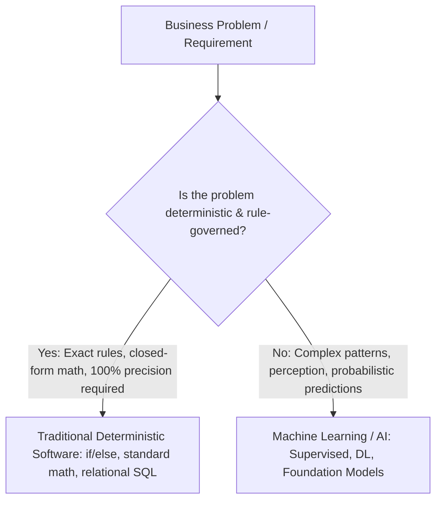

# When Machine Learning Is NOT Appropriate: Deterministic Logic vs. Statistical Approximation

---

## Key Takeaways

Machine learning is inherently **probabilistic and approximate**; it is designed to discover statistical relationships in noisy, high-dimensional, or unstructured data where explicit programming logic is impractical.



When a problem is **deterministic**, follows strict mathematical equations, requires **100% exact precision without approximation error**, or can be fully expressed via straightforward `if/then` logic, traditional rule-based programming is faster, cheaper, more explainable, and objectively superior to machine learning.

---

## Main Discussion

### Deterministic Systems vs. Probabilistic ML Systems

<div className="flex flex-row">

    ```mermaid
    flowchart LR
        subgraph Deterministic [Deterministic Rule-Based Code]
            In1[Input: 3 Blue / 10 Total Cards] --> Logic[Exact Math Function: 3 / 10] --> Out1[Exact Output: 0.30 / 100% Deterministic]
        end
    ```

    ```mermaid
    flowchart LR
        subgraph Probabilistic [Machine Learning Model]
            In2[Input: 3 Blue / 10 Total Cards] --> Model[Trained Statistical Weights] --> Out2[Approximation: ~0.298 with confidence score]
        end

````

</div>

| Dimension                         | Traditional Deterministic Software                                                                        | Machine Learning / Artificial Intelligence                                                                                               |
| --------------------------------- | --------------------------------------------------------------------------------------------------------- | ---------------------------------------------------------------------------------------------------------------------------------------- |
| **Underlying Nature**             | **Deterministic:** Given input $X$, output $Y$ is always identical, verifiable, and mathematically exact. | **Probabilistic / Statistical:** Predicts the most likely output $\hat{Y}$ with an associated probability distribution and error margin. |
| **Implementation**                | Explicit code logic, algorithmic formulas, standard conditional branches (`if/else`).                     | Model weights learned from historical training distributions or token probabilities.                                                     |
| **Error Tolerance**               | **Zero error tolerance** (exact mathematical equality required).                                          | Error is expected and managed (evaluated via RMSE, MAE, Recall, Precision).                                                              |
| **Computational Overhead**        | Minimal (runs on basic CPU compute with microseconds of latency).                                         | High (requires GPU/accelerator training, matrix multiplications, ongoing inference costs).                                               |
| **Explainability & Auditability** | 100% transparent and deterministic; step-by-step logic tracing.                                           | Often acts as an empirical "black box" requiring SHAP, LIME, or attention maps for post-hoc interpretation.                              |

---

### Criteria: When to Avoid Machine Learning

```mermaid
mindmap
  root((When to AVOID ML))
    Deterministic Math & Rules
      Tax calculation engines
      Physics / closed-form probability equations
      Fixed business logic tables
    100% Precision Mandates
      Accounting ledger balancing
      Safety-critical binary interlocks
    Data & Infrastructure Constraints
      Zero / highly noisy historical data
      Simple SQL query solves the problem
    Cost & Latency Constraints
      Simple cron script vs GPU training cluster
      Sub-millisecond static rule lookup

````

- **1. Closed-Form Mathematical & Probability Calculations:**
  - Calculating card draw probabilities, compound interest, or currency conversions follows strict formulas. Using an LLM or regression model introduces unnecessary approximation error and potential hallucinations.
- **2. Exact Rule-Governed Business Logic:**
  - Calculating state sales taxes based on fixed jurisdictional zip codes is best implemented with standard database lookups and deterministic `switch/case` logic.
- **3. Mission-Critical Systems Demanding Zero Error:**
  - Accounting ledger balances, banking transactional consistency (ACID compliance), and safety interlocks cannot tolerate probabilistic margins of error.
- **4. Lack of Quality Data:**
  - When no relevant historical data exists and simulating an environment is infeasible, ML models cannot learn meaningful representations (leading to severe GIGO).
- **5. Unjustified Cost and Complexity:**
  - If a problem can be solved with a 10-line Python script or a SQL query, deploying a SageMaker endpoint or invoking foundation model APIs adds unnecessary operational cost and architectural fragility.

---

## Exam Guide

### Exam Tips

- **Deterministic vs. Probabilistic Rule:**
  - If an exam scenario asks whether to build an ML model for a task that has **a well-defined mathematical formula, exact business rules, or requires 100% reproducible precision**, the correct answer is to **use traditional rule-based programming / standard software engineering, NOT machine learning**.
- **Approximation Awareness:** Machine learning models output **approximations**. If the business problem cannot accept any margin of error (e.g., exact payroll computations), ML is inappropriate.
- **Cost & Sustainability:** Choosing traditional deterministic algorithms over ML when appropriate aligns with the **Cost Optimization** and **Sustainability** pillars of the AWS Well-Architected Framework by avoiding unnecessary GPU compute cycles.

---

### Practice Test

#### Question 1

A financial services company needs to calculate the exact daily compound interest and final account balances for 100,000 savings accounts based on fixed interest rate tables published by the central bank. The compliance department mandates that all calculations must be 100% reproducible and have zero margin of error. Which solution should the engineering team implement?

- [ ] A. Train a supervised linear regression model on Amazon SageMaker
- [ ] B. Write deterministic, rule-based application code using the standard compound interest formula
- [ ] C. Prompt a large language model in Amazon Bedrock to calculate the daily balances
- [ ] D. Deploy an unsupervised clustering algorithm to group accounts by interest tiers

<details>
<summary>Correct Answer</summary>

- [x] B. Write deterministic, rule-based application code using the standard compound interest formula
  - **Explanation:** Compound interest calculation is a **deterministic mathematical problem** with a known, closed-form formula. It requires exact precision without approximation error, making standard rule-based software code the only correct and reliable solution.

</details>

---

#### Question 2

In which of the following scenarios is Machine Learning the MOST appropriate solution compared to traditional software programming?

- A. Converting temperatures from Fahrenheit to Celsius
- B. Calculating the total shipping cost based on fixed weight-bracket tables
- C. Detecting fraudulent credit card transactions in real time from dynamic, evolving behavioral spending patterns
- D. Verifying whether an employee's password meets a 12-character complexity policy

<details>
<summary>Correct Answer</summary>

- [x] C. Detecting fraudulent credit card transactions in real time from dynamic, evolving behavioral spending patterns
  - **Explanation:** Fraud patterns are dynamic, high-dimensional, complex, and constantly evolving, making them impossible to capture fully with static manual rules. Machine learning excels at detecting statistical patterns and anomalies in this type of data. The other options are simple deterministic tasks easily solved with basic code.

</details>

---
