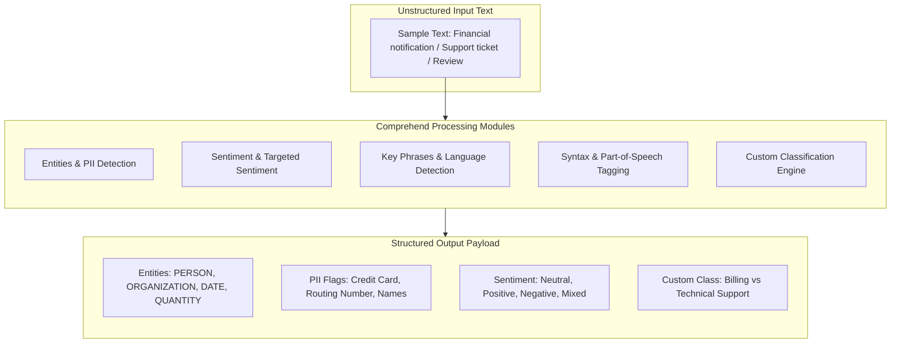
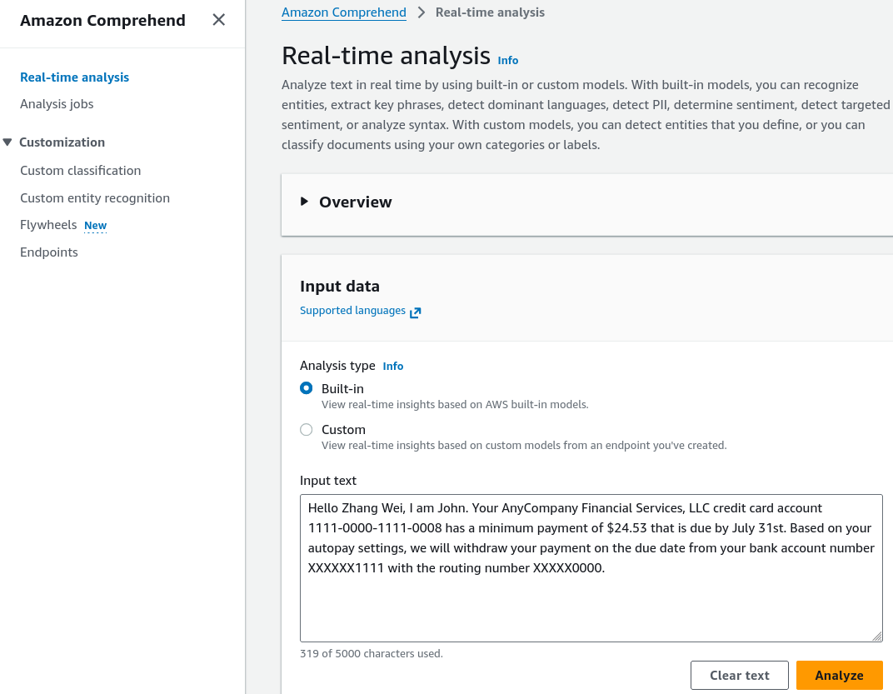
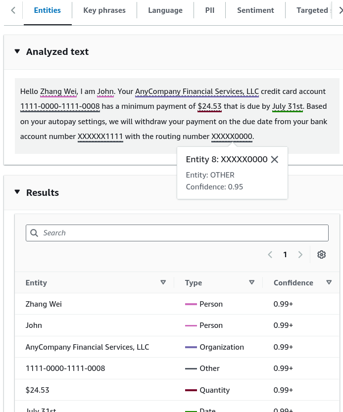
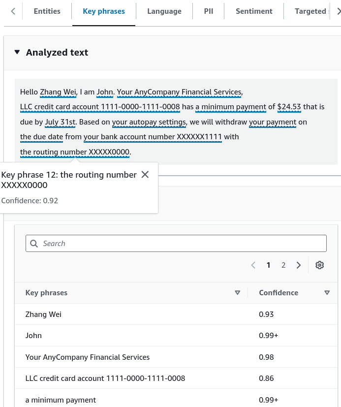
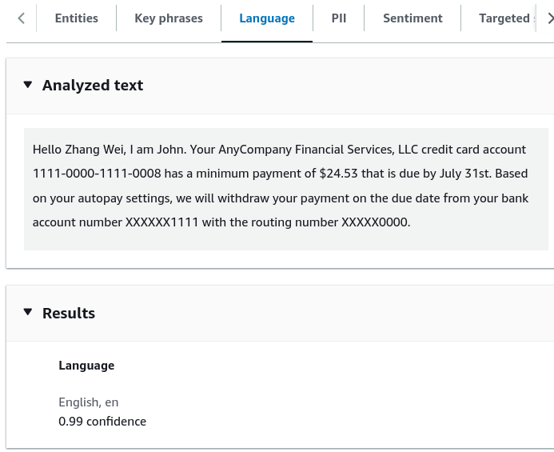
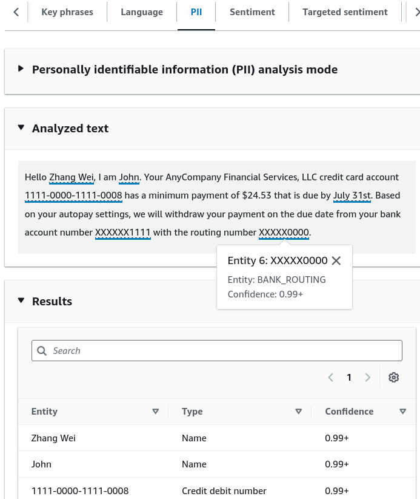
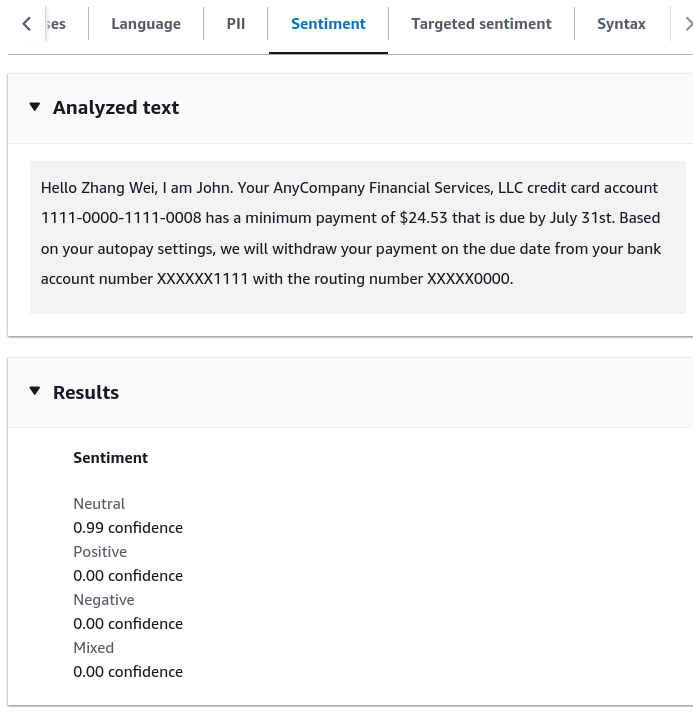
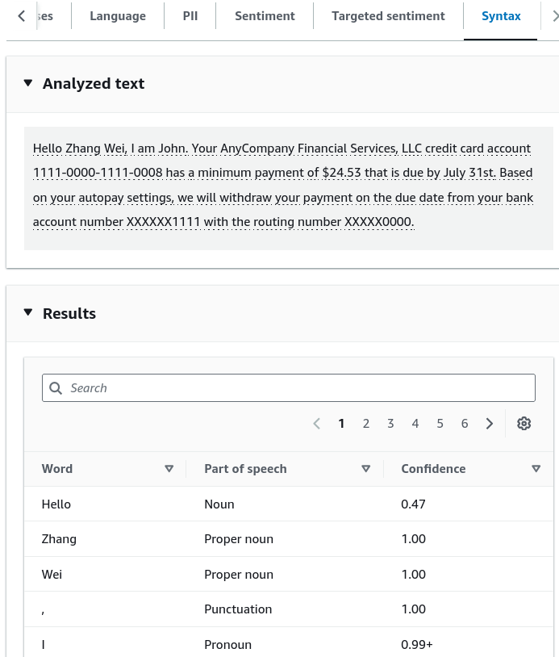
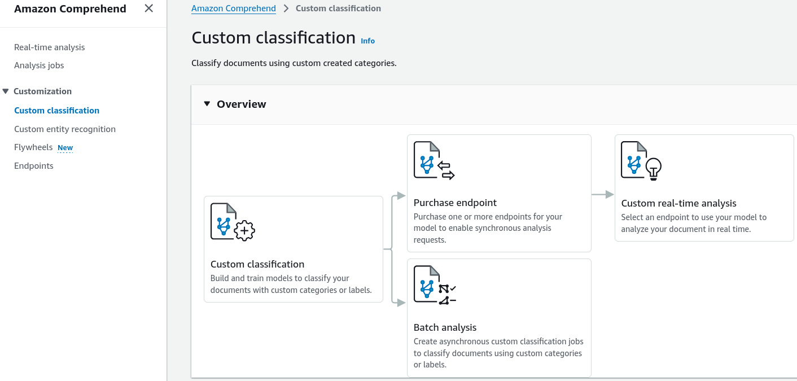
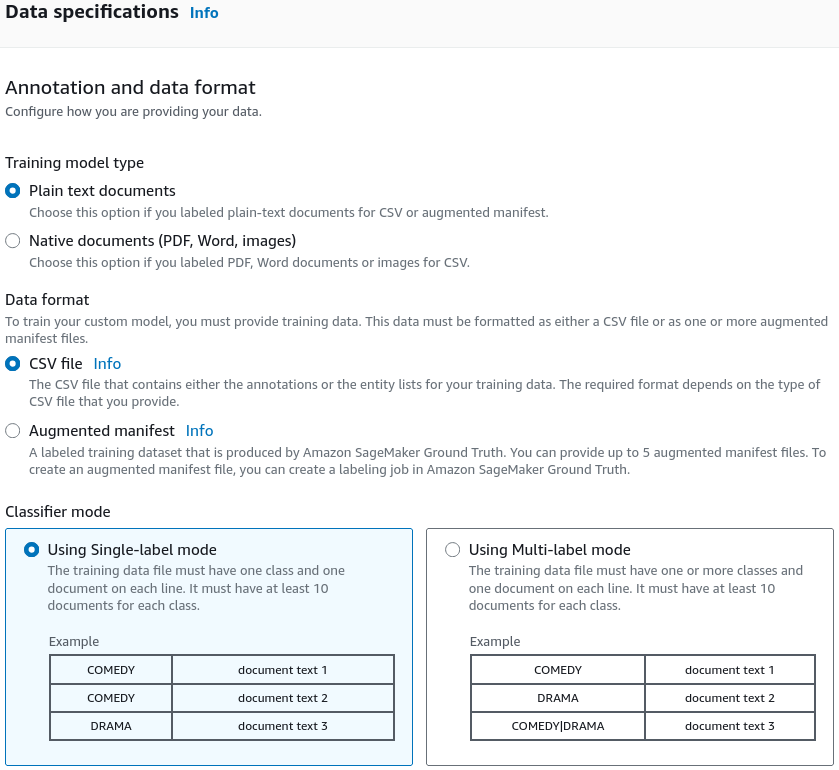

# Hands-On Lab: Amazon Comprehend Real-Time Analysis & Custom Classification

---

## Key Takeaways

**Amazon Comprehend** converts unstructured text into structured analytical insights using pre-trained machine learning APIs and trainable custom classifiers.

The real-time console interface exposes pre-trained NLP capabilities including **Named Entity Recognition (NER)**, **PII Detection & Redaction**, **Sentiment Analysis**, **Syntax Tagging**, and **Language Identification**. For domain-specific document routing, **Custom Classification** allows teams to train custom models using CSV training sets stored in Amazon S3 (requiring a minimum of 10 annotated documents per class) and deploy them to dedicated **Real-Time Endpoints**.

---

## Hands-On Workflow: Real-Time Console Analysis & Custom Classification

1. **Access the Amazon Comprehend Real-Time Console:**
   - Open the **Amazon Comprehend Console** in a supported AWS Region (e.g., `ap-southeast-2`).
   - Navigate to **Real-time analysis** in the left navigation pane.
   - In the **Input text** editor, paste a sample multi-dimensional message (e.g., a financial notification containing names, amounts, account numbers, and due dates).
   - Click **Analyze**.  
     
2. **Evaluate Entities, Key Phrases & Dominant Language:**
   - Review the structured analytical tabs generated by the analysis:
   - **Entities:** Verify extracted categories such as `PERSON` (e.g., _Zhang Wei_, _John_), `ORGANIZATION` (e.g., _AnyCompany Financial Services_), `QUANTITY`, and `DATE`.  
     
   - **Key Phrases:** Inspect salient noun chunks and descriptive phrases extracted from the context.  
     
   - **Language:** Confirm dominant language identification with associated confidence score (e.g., _English_ at 99%).  
     
3. **Inspect Personally Identifiable Information (PII):**
   - Select the **PII** tab to review sensitive data detection:
   - Observe detected financial and identity attributes: names, credit card account numbers, bank routing numbers, and payment dates.
   - Note the confidence scores assigned to each identified PII entity for downstream automated masking or redaction.  
     
4. **Inspect Sentiment & Syntactic Structure:**
   - Evaluate emotional tone and grammatical layout:
   - **Sentiment:** Review the sentiment distribution (`NEUTRAL`, `POSITIVE`, `NEGATIVE`, `MIXED`). A standard financial notice resolves as **Neutral** (e.g., 99% confidence).  
     
   - **Syntax:** Inspect tokenized lexical breakdowns showing Part-of-Speech tags (e.g., `NOUN`, `PROPER_NOUN`, `PUNCTUATION`).  
     
5. **Configure a Custom Classification Model:**
   - Navigate to **Custom classification** in the left menu to build a domain-specific classifier:  
     
   - Click **Create new model**.
   - Define training data specifications:
   - Prepare a two-column CSV file (`Class,Text`) mapping documents to business labels (e.g., `Billing`, `Technical_Support`, `Account_Issue`).  
     
   - Ensure each target class contains a minimum of **10 training examples** (more examples improve accuracy).
   - Upload the training dataset to an **Amazon S3** bucket.
   - Launch the model training job and allow Comprehend to construct the classifier.
6. **Provision a Real-Time Endpoint for Inference:**
   - Once custom model training is complete:
   - Create and provision a dedicated **Custom Endpoint** to serve synchronous, sub-second classification requests.
   - Integrate client applications to route inbound emails or tickets automatically based on the returned custom labels.

---

## Real-Time vs. Asynchronous Batch Analysis in Comprehend

| Feature / Dimension      | Real-Time Analysis (Console & Synchronous API)                     | Asynchronous Batch Analysis Jobs                                       |
| ------------------------ | ------------------------------------------------------------------ | ---------------------------------------------------------------------- |
| **API Invocations**      | `DetectEntities`, `DetectSentiment`, `DetectPiiEntities`           | `StartEntitiesDetectionJob`, `StartSentimentDetectionJob`              |
| **Input Data Source**    | Direct string payloads passed in HTTPS request bodies              | Document collections stored in Amazon S3 buckets                       |
| **Supported Modalities** | UTF-8 plain text strings                                           | Plain text, PDF documents, Microsoft Word (DOCX), image files          |
| **Latency Profile**      | Synchronous, sub-second responses                                  | Asynchronous distributed batch execution (minutes to hours)            |
| **Custom Model Serving** | Requires dedicated, provisioned **Real-Time Endpoints**            | Executes serverless batch jobs pointing directly to trained model ARNs |
| **Optimal Use Case**     | Live customer service chat triage, interactive web form validation | Nightly compliance audits, scanning historical customer email archives |

---

## Exam Guide

### Exam Tips

- **PII Detection & Masking:** Amazon Comprehend has native **PII Detection** to identify sensitive values (credit cards, Social Security numbers, routing numbers, names, phone numbers) in unstructured text for regulatory compliance (GDPR, HIPAA, PCI-DSS).
- **Minimum Data Requirement for Custom Classification:** Training a Custom Document Classifier requires a **minimum of 10 training documents per class** (stored in a UTF-8 CSV file in S3).
- **Sentiment Classes:** Comprehend evaluates sentiment into four distinct categories: `POSITIVE`, `NEGATIVE`, `NEUTRAL`, and `MIXED`.
- **Custom Model Deployment Model:**
  - To run **real-time synchronous predictions** on a custom classifier, you must provision a **Comprehend Custom Endpoint** (billed per inference unit).
  - To process **large static batches** without an always-on endpoint, launch an **Asynchronous Analysis Job**.

---

### Practice Test

#### Question 1

A healthcare call center wants to scan customer support transcripts to automatically identify and redact credit card numbers, bank account numbers, and patient names before archiving logs into Amazon S3. The team wants a fully managed solution with no custom machine learning model development. Which Amazon Comprehend capability meets this requirement?

- [ ] A. Amazon Comprehend Custom Entity Recognition
- [ ] B. Amazon Comprehend PII (Personally Identifiable Information) Detection
- [ ] C. Amazon Comprehend Topic Modeling
- [ ] D. Amazon Comprehend Syntax Analysis

Correct Answer

- [x] B. Amazon Comprehend PII (Personally Identifiable Information) Detection
  - **Explanation:** **Amazon Comprehend PII Detection** automatically identifies, flags, and helps redact sensitive data such as credit card numbers, bank details, and personal names from unstructured text out of the box.

---

#### Question 2

A developer is configuring a custom text classification model in Amazon Comprehend to categorize inbound support tickets into four categories: `Billing`, `Hardware`, `Software`, and `Account`. What is the minimum number of training documents per category required to train the custom classifier?

- [ ] A. 1 document per category
- [ ] B. 10 documents per category
- [ ] C. 500 documents per category
- [ ] D. 1,000 documents per category

Correct Answer

- [x] B. 10 documents per category
  - **Explanation:** Amazon Comprehend requires a **minimum of 10 training documents per class** to build and train a Custom Document Classifier, although providing more diverse samples improves model performance.

---
