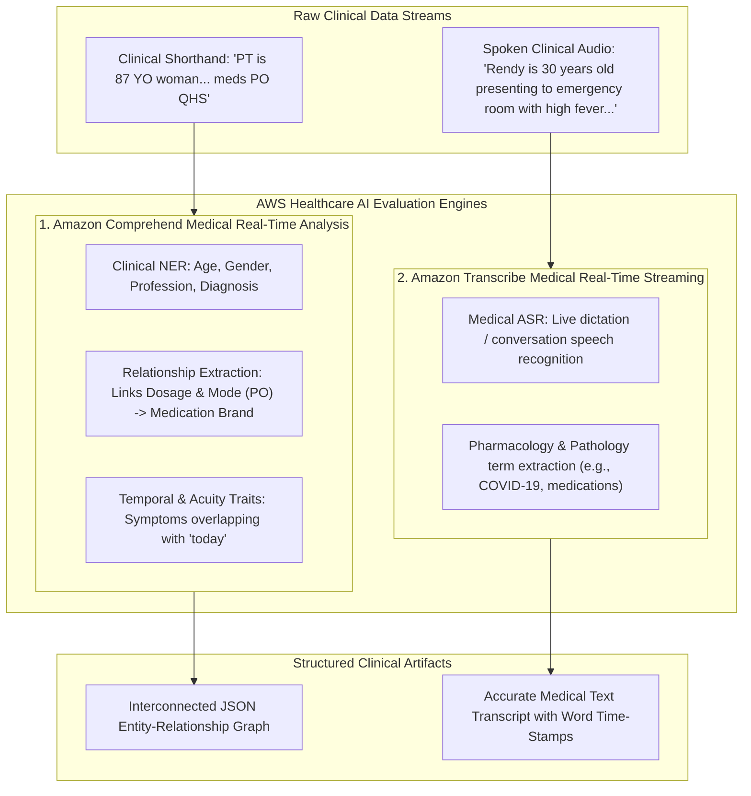
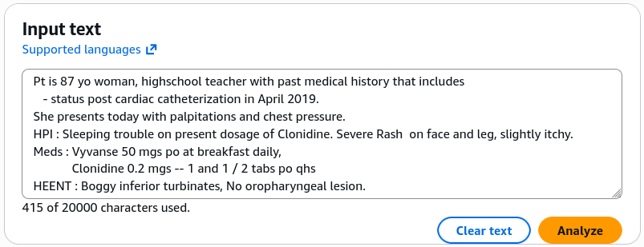
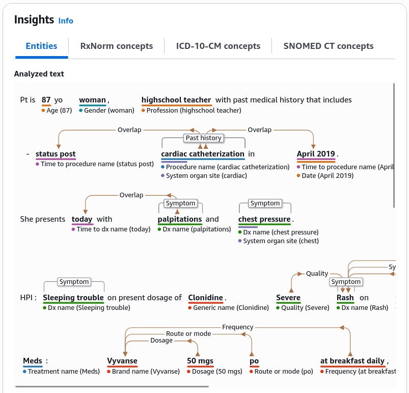
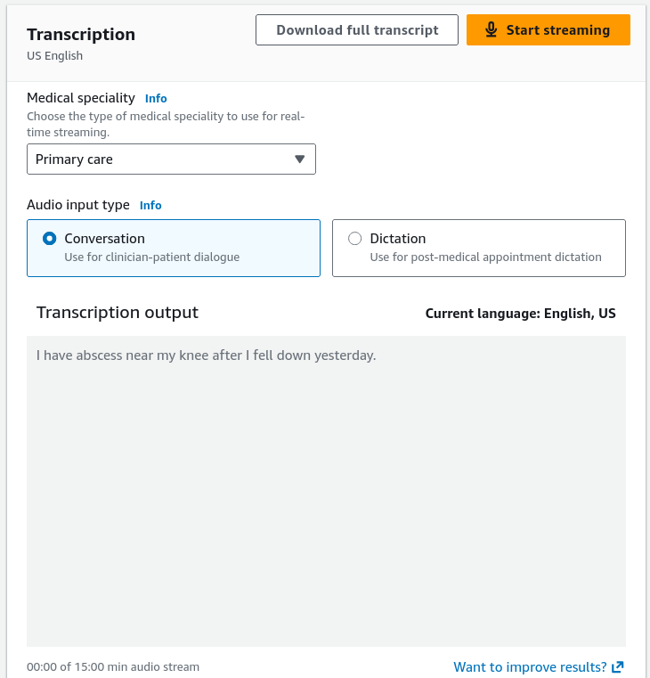
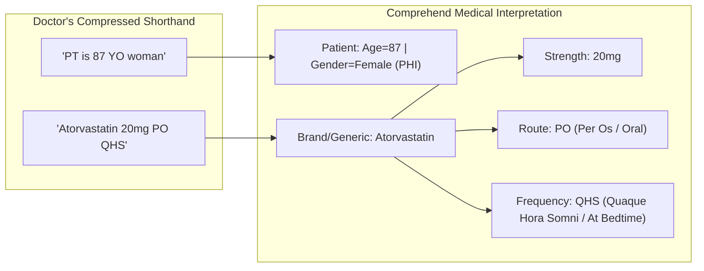

# Hands-On Lab: Amazon Comprehend Medical & Amazon Transcribe Medical in the AWS Console

---

## Key Takeaways

**Amazon Comprehend Medical** and **Amazon Transcribe Medical** provide interactive evaluation consoles within AWS to demonstrate how specialized healthcare AI processes complex clinical shorthand, anatomical references, pharmacology, and speech dictation without manual feature engineering.

The hands-on walkthrough illustrates:

- **Decoding Medical Shorthand:** Comprehend Medical parses compressed clinical jargon (e.g., `PT` $\rightarrow$ _Patient_, `87 YO` $\rightarrow$ _Age: 87_, `PO` $\rightarrow$ _Per Os / Oral Route_, `QHS` $\rightarrow$ _Every night at bedtime_).
- **Entity-Relationship Binding:** Comprehend Medical does not extract terms in isolation; it establishes relational bindings connecting dosages, administration routes, and frequencies to specific drug names.
- **Integrated Console Architecture:** **Amazon Transcribe Medical** is accessed directly within the standard Amazon Transcribe console under its dedicated left navigation menu.

---

## Hands-On Workflow: Testing Comprehend Medical & Transcribe Medical

1. **Launch Real-Time Analysis in Amazon Comprehend Medical:**
   - Open the **Amazon Comprehend Medical Console** in a supported AWS Region.
   - In the left navigation pane, select **Real-time analysis** (or click **Launch real-time analysis** from the service dashboard).
   - Locate the sample clinical input text editor containing unstructured physician notes.
2. **Analyze Unstructured Clinical Shorthand:**
   - Review the sample doctor's note containing clinical abbreviations and acronyms:
   - Notice compressed clinical phrases such as:  
     
   - Click **Analyze** to submit the raw text payload to the clinical NLP engine.
3. **Inspect Clinical Entities, Attributes & Relationship Mappings:**
   - Review the extracted structured entities and their visual relationship connectors:
   - **Demographics & PHI:** Observe `87` classified as `AGE`, `woman` classified as `GENDER`, and `high school teacher` identified as `PROFESSION`.
   - **Relationship Extraction:** Inspect how the dosage (`20mg`) and the administration route (`PO` / oral) are visually and relationally linked to the medication name (`Atorvastatin`).
   - **Temporal & Acuity Traits:** Notice how symptoms (e.g., `chest pressure`) are mapped with acuity and linked temporally to `today`.  
     !
4. **Navigate to Amazon Transcribe Medical in the Console:**
   - Switch to the **Amazon Transcribe Console**:
   - In the left navigation pane, scroll down to the **Amazon Transcribe Medical** section.
   - Select **Real-time transcription**.
   - Select the transcription mode (**Dictation** for single-clinician notes or **Conversation** for doctor-patient discussions).
5. **Execute Live Medical Speech Transcription:**
   - Test real-time medical Automatic Speech Recognition (ASR):
   - Click **Start streaming** and grant browser microphone permissions.
   - Speak a medical sentence into the microphone:
     _"I have abscess near my knee after I fell down yesterday."_
   - Observe the transcription output pane rendering medical pathology and pharmacology terms accurately without phonetic misinterpretations.
   - Click **Stop streaming**.  
     

---

## Shorthand Decoding & Entity Relationship Mapping

| Clinical Shorthand / Term       | Latin / Clinical Meaning        | Comprehend Medical Extracted Type | Associated Relationship / Target Entity |
| ------------------------------- | ------------------------------- | --------------------------------- | --------------------------------------- |
| **`PT`**                        | Patient                         | `PROTECTED_HEALTH_INFORMATION`    | Anchors clinical record context         |
| **`87 YO`**                     | 87 Years Old                    | `AGE` (PHI category)              | Binds to demographic profile            |
| **`PO`** (_per os_)             | Orally / By mouth               | `ROUTE_OR_MODE`                   | Linked directly to target `MEDICATION`  |
| **`QHS`** (_quaque hora somni_) | Every night at bedtime          | `FREQUENCY`                       | Linked directly to target `MEDICATION`  |
| **`PRN`** (_pro re nata_)       | As needed                       | `FREQUENCY` / `TRAIT`             | Linked directly to target `MEDICATION`  |
| **`BID` / `TID` / `QID`**       | Twice / 3 times / 4 times daily | `FREQUENCY`                       | Linked directly to target `MEDICATION`  |

---

## Exam Guide

### Exam Tips

- **Console Location of Transcribe Medical:** Amazon Transcribe Medical is hosted **within the Amazon Transcribe console interface** under a dedicated navigation header.
- **Relationship Extraction:** A primary differentiator of Amazon Comprehend Medical is its ability to perform **relationship extraction**—linking attributes like dosage, route (`PO`), frequency (`QHS`), and duration directly to their respective medication entities rather than treating them as disconnected tokens.
- **Clinical Shorthand Support:** Pre-trained medical NLP models natively recognize standardized medical acronyms, Latin prescription notations (`PO`, `QHS`, `PRN`), and clinical shorthand (`PT`, `YO`, `Dx`, `Rx`).
- **HIPAA Eligibility:** Both Transcribe Medical and Comprehend Medical are **HIPAA-eligible** out of the box for handling Protected Health Information (PHI).

---

### Practice Test

#### Question 1

A clinical software developer tests an electronic medical record ingestion tool using Amazon Comprehend Medical. The input clinical note contains the line: _"Rx: Lisinopril 10mg PO QD for hypertension."_ How does Amazon Comprehend Medical parse and structure this data?

- [ ] A. It outputs an unlinked list of keywords: Lisinopril, 10mg, PO, QD, hypertension
- [ ] B. It identifies Lisinopril as a `MEDICATION` and establishes directional relationships linking `10mg` as Strength, `PO` as Route, `QD` as Frequency, and `hypertension` as the linked `MEDICAL_CONDITION`
- [ ] C. It translates the Latin acronyms into French using Amazon Translate
- [ ] D. It routes the note to Amazon Mechanical Turk for manual transcription

Correct Answer

- [x] B. It identifies Lisinopril as a `MEDICATION` and establishes directional relationships linking `10mg` as Strength, `PO` as Route, `QD` as Frequency, and `hypertension` as the linked `MEDICAL_CONDITION`
  - **Explanation:** Amazon Comprehend Medical performs advanced entity and relationship extraction, binding medication attributes (strength, route, frequency) and diagnoses directly to the target medication entity within a structured JSON output.

---

#### Question 2

Where in the AWS Management Console can a developer access and configure real-time streaming sessions for Amazon Transcribe Medical?

- [ ] A. Inside the Amazon Rekognition console
- [ ] B. Under the Amazon Transcribe console in the dedicated Amazon Transcribe Medical navigation section
- [ ] C. Exclusively via the AWS Systems Manager console
- [ ] D. Inside the Amazon Comprehend Custom Classifier builder

Correct Answer

- [x] B. Under the Amazon Transcribe console in the dedicated Amazon Transcribe Medical navigation section
  - **Explanation:** Amazon Transcribe Medical is integrated directly into the **Amazon Transcribe Console** under the left navigation section labeled **Amazon Transcribe Medical**.

---
