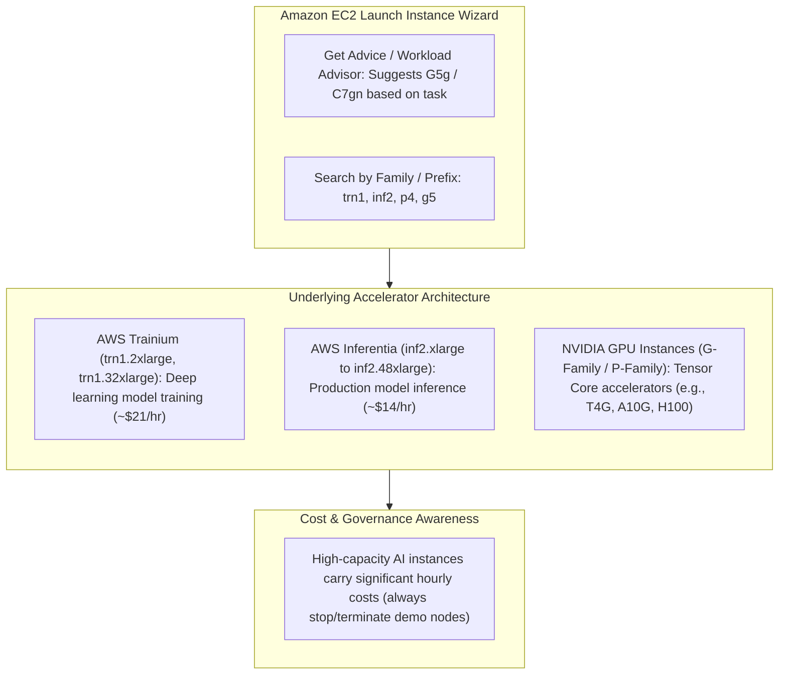
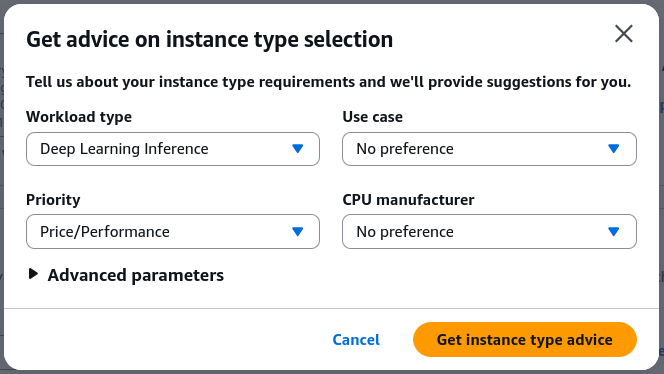
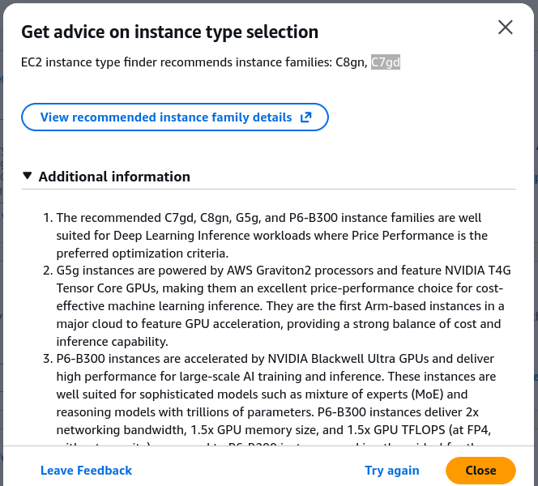
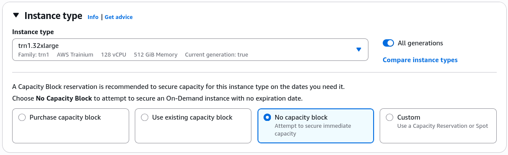
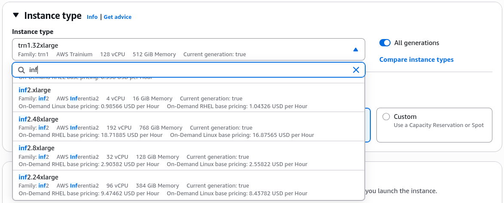

# Hands-On Lab: Amazon EC2 Instance Selection, AI Accelerators & Cost Awareness

---

## Key Takeaways

The **Amazon EC2 Launch Instance Console** provides automated recommendations and manual selection tools to provision compute infrastructure tailored for machine learning workloads.

The console interface provides:

- **Workload-Based Guidance:** The **Get advice** advisor suggests instance families (such as `G5g` or `C7gn`) based on workload categories (e.g., deep learning inference).
- **Instance Filtering:** Quick filtering by prefix reveals specialized hardware like `trn1` (**AWS Trainium** for training) and `inf2` (**AWS Inferentia** for inference).
- **Cost Visibility:** Specialized multi-accelerator nodes (such as `trn1.32xlarge` or `inf2.48xlarge`) carry high hourly costs, highlighting the importance of cost optimization and governance in cloud ML architecture.

---

## Hands-On Workflow: Navigating EC2 Instance Types for AI

1. **Access the EC2 Launch Instance Console:**
   - Open the **Amazon EC2 Console** in your target AWS Region.
   - In the dashboard, click **Launch instance**.
   - Scroll down past the AMI (Amazon Machine Image) selection section to locate the **Instance type** configuration block.
2. **Utilize the Workload Instance Advisor:**
   - Test AWS automated instance recommendations:
   - Click the **Get advice** link next to the instance type selector.
   - Choose a target workload profile (e.g., _Deep learning inference_ or _Machine learning training_).  
     
   - Review the generated recommendations (e.g., `C8gn`, `C7gd`) and inspect the comparative breakdown of vCPUs, memory, network bandwidth, and architectural rationale.  
     
3. **Inspect AWS Trainium (trn1) for Distributed Training:**
   - Search for purpose-built training accelerators:
   - In the instance type search bar, type `trn1`.
   - Select `trn1.32xlarge` (powered by 16 AWS Trainium accelerators).
   - Observe the hardware specifications and the highlighted hourly rate (e.g., ~$21/hour for full 32xlarge instances).
   - Note the role of Trainium in reducing large-scale model pre-training and fine-tuning costs.  
     
4. **Inspect AWS Inferentia (inf2) for Low-Latency Serving:**
   - Search for purpose-built inference accelerators:
   - In the search bar, type `inf2`.
   - Select an instance such as `inf2.48xlarge` (powered by AWS Inferentia2 accelerators).
   - Observe the high memory bandwidth, multi-chip configuration, and pricing metrics (e.g., ~$14/hour for top-tier instances).
   - Confirm that these instances are optimized for high queries per second (QPS) and low cost-per-inference.  
     
5. **Apply Cost Safety & Governance Rules:**
   - Practice cloud financial management (FinOps):
   - Do not launch large specialized accelerator instances unless running active, approved training or benchmarking jobs.
   - Use AWS Budgets, CloudWatch billing alarms, and Auto Scaling Groups (ASGs) to prevent runaway compute costs on unmanaged EC2 nodes.

---

## EC2 Instance Families for Machine Learning

| Family Prefix          | Underlying Hardware                | Target AI/ML Phase       | Typical Sizing & Characteristics                                                                                           |
| ---------------------- | ---------------------------------- | ------------------------ | -------------------------------------------------------------------------------------------------------------------------- |
| **`Trn1` / `Trn1n`**   | **AWS Trainium** custom silicon    | **Model Training**       | 16 Trainium chips (32 NeuronCores), up to 512 GB HBM memory, 800 Gbps network bandwidth. Built for 100B+ parameter models. |
| **`Inf1` / `Inf2`**    | **AWS Inferentia** custom silicon  | **Model Inference**      | Up to 12 Inferentia2 chips, optimized for low latency, high throughput token generation, and lowest cost per inference.    |
| **`G4` / `G5` / `G6`** | **NVIDIA GPUs** (T4, A10G, L4)     | **Inference & Vision**   | Balanced graphics and machine learning inference; widely supported by standard CUDA / TensorRT libraries.                  |
| **`P3` / `P4` / `P5`** | **NVIDIA GPUs** (V100, A100, H100) | **Heavy Training & HPC** | Clustered multi-GPU architectures for intensive deep learning training, scientific simulation, and distributed jobs.       |

---

## Exam Guide

### Exam Tips

- **Instance Family Naming Mappings (Essential for AIF-C01):**
  - `Trn1` $\rightarrow$ **AWS Trainium** $\rightarrow$ **Training**.
  - `Inf1` / `Inf2` $\rightarrow$ **AWS Inferentia** $\rightarrow$ **Inference**.
  - `P-Family` (`P4`, `P5`) $\rightarrow$ **NVIDIA GPUs** $\rightarrow$ Heavy training and HPC compute.
  - `G-Family` (`G4`, `G5`, `G6`) $\rightarrow$ **NVIDIA GPUs** $\rightarrow$ GPU inference, graphics rendering, and video processing.
- **Instance Advisor:** The EC2 console includes an interactive advisor that recommends instance families based on workload requirements (e.g., compute-optimized, GPU inference, memory-intensive).
- **Cost Awareness & Governance:** Dedicated GPU and custom accelerator instances carry higher hourly prices than standard burstable general-purpose instances (`t4g`, `m6i`). For foundational AI practitioner questions, recognize that choosing the right instance family (e.g., `Inf2` over oversized `P5` for basic inference) is a primary driver of cloud cost optimization.

---

### Practice Test

#### Question 1

A machine learning engineer needs to deploy a custom text classification model for high-volume, real-time prediction serving on Amazon EC2. The company wants to minimize compute costs per inference while maximizing throughput. Which EC2 instance family should the engineer select in the launch console?

- [ ] A. Amazon EC2 `Trn1` instances
- [ ] B. Amazon EC2 `Inf2` instances
- [ ] C. Amazon EC2 `P5` instances
- [ ] D. Amazon EC2 `R6i` instances

Correct Answer

- [x] B. Amazon EC2 `Inf2` instances
  - **Explanation:** **Amazon EC2 `Inf2` instances** are purpose-built for inference workloads, providing high throughput and low latency at the lowest cost per inference. In contrast, `Trn1` is optimized for training, and `P5` is designed for heavy training and HPC workloads, which would be overkill for real-time inference.

---

#### Question 2

During a cloud architecture review, an AI practitioner is asked to explain the primary difference between Amazon EC2 `Trn1` instances and Amazon EC2 `P4de` instances. Which statement accurately describes both?

- [ ] A. `Trn1` instances are powered by custom AWS Trainium accelerators, whereas `P4de` instances are powered by NVIDIA A100 GPUs
- [ ] B. `Trn1` instances are designed for inference, whereas `P4de` instances are designed for training
- [ ] C. `Trn1` instances cannot run PyTorch workloads, whereas `P4de` instances can
- [ ] D. `Trn1` instances are serverless, whereas `P4de` instances are managed via Amazon SageMaker Canvas only

Correct Answer

- [x] A. `Trn1` instances are powered by custom AWS Trainium accelerators, whereas `P4de` instances are powered by NVIDIA A100 GPUs
  - **Explanation:** **`Trn1` instances** use AWS's custom **AWS Trainium** silicon, while **`P4de` instances** use **NVIDIA A100 Tensor Core GPUs**. Both support distributed deep learning training through standard ML frameworks (via AWS Neuron SDK and CUDA respectively).

---
