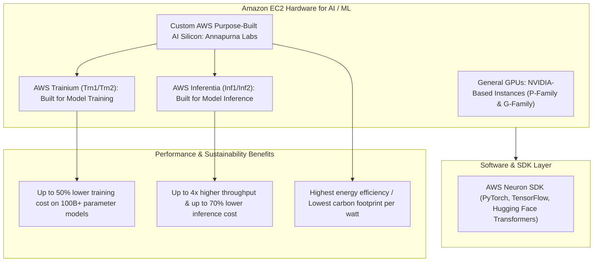
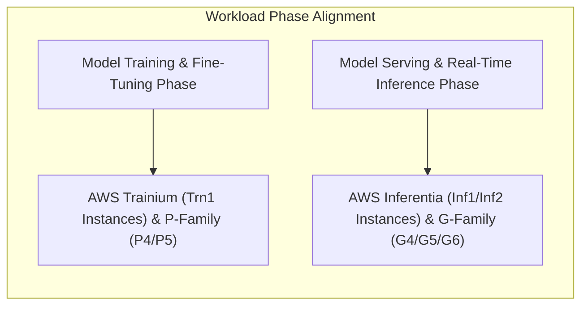
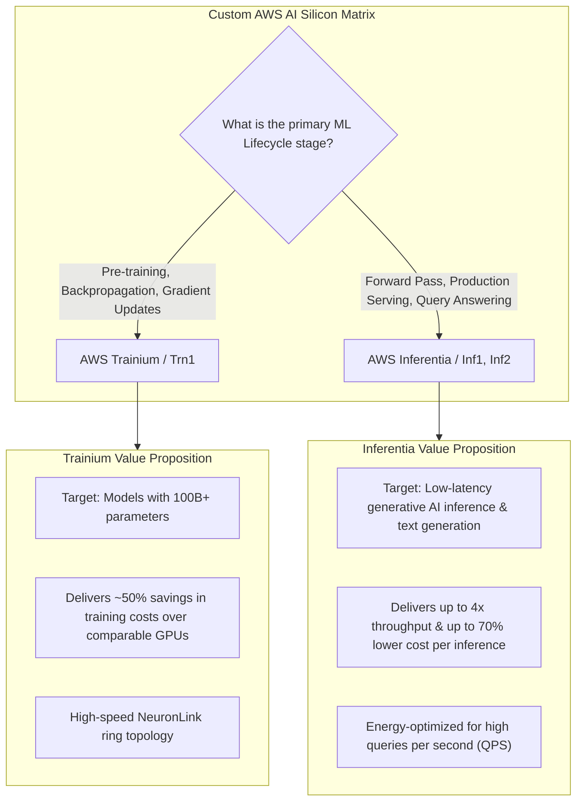
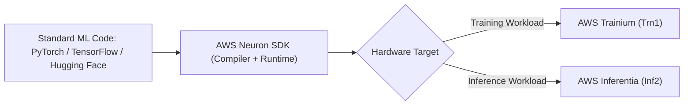

# AWS Hardware for AI: Amazon EC2, GPU Families, AWS Trainium & AWS Inferentia

---

## Key Takeaways

While most AI/ML applications leverage fully managed services (such as Amazon Bedrock, SageMaker, or pre-trained AI services), **Amazon Elastic Compute Cloud (Amazon EC2)** provides Infrastructure as a Service (IaaS) for building, fine-tuning, and hosting custom models on dedicated accelerator hardware.

AWS provides both traditional NVIDIA-powered GPU instances (**P-family** and **G-family**) and custom-designed purpose-built silicon:

- **AWS Trainium (`Trn1` instances):** Custom accelerator built for high-performance, low-cost **deep learning training** on models with 100B+ parameters.
- **AWS Inferentia (`Inf1`, `Inf2` instances):** Custom accelerator built for low-latency, high-throughput **deep learning inference**.
- **Sustainability Advantage:** Trainium and Inferentia provide the lowest energy footprint (performance/watt) for deep learning workloads in AWS.

---

## Main Discussion

### The EC2 AI Hardware Hierarchy

| Hardware Category             | Instance Families                      | Primary Target Workload                                                                                | Key Hardware Specifications                                                                                                                                 |
| ----------------------------- | -------------------------------------- | ------------------------------------------------------------------------------------------------------ | ----------------------------------------------------------------------------------------------------------------------------------------------------------- |
| **AWS Trainium**              | **`Trn1`**, `Trn1n`, `Trn2`            | Large-scale deep learning model training, pre-training, and full fine-tuning (LLMs, Diffusion models). | Up to 16 Trainium chips per instance, up to 512 GB high-bandwidth accelerator memory (HBM), 800 Gbps network bandwidth, interconnected with **NeuronLink**. |
| **AWS Inferentia**            | **`Inf1`**, **`Inf2`**                 | High-throughput, low-latency generative AI model inference and production serving.                     | Up to 12 Inferentia2 chips (`Inf2`), up to 384 GB accelerator memory, ultra-low latency, and scale-out distributed inference support.                       |
| **Training GPUs (NVIDIA)**    | **`P3`**, **`P4`**, **`P5`**           | High-performance distributed training, scientific simulation, HPC, and multi-GPU clustering.           | Powered by NVIDIA GPUs (V100 on P3, A100 on P4, H100 on P5) using CUDA libraries.                                                                           |
| **Graphics & Inference GPUs** | **`G3`**, **`G4`**, **`G5`**, **`G6`** | Cost-effective GPU inference, computer vision models, video transcoding, and 3D graphics rendering.    | Powered by NVIDIA GPUs (T4 on G4dn, A10G on G5, L4 on G6).                                                                                                  |

---

### AWS Trainium vs. AWS Inferentia Comparison

| Dimension            | AWS Trainium (`Trn1`)                                                          | AWS Inferentia (`Inf1` / `Inf2`)                                                          |
| -------------------- | ------------------------------------------------------------------------------ | ----------------------------------------------------------------------------------------- |
| **Primary Workload** | **Model Training** (Supervised learning, RLHF, foundation model pre-training). | **Model Inference** (Real-time generation, prediction serving, classification endpoints). |
| **Instance Type**    | `trn1.32xlarge`, `trn1.2xlarge`, `trn1n`                                       | `inf1.xlarge` to `inf1.24xlarge`, `inf2.xlarge` to `inf2.48xlarge`                        |
| **Cost Advantage**   | Up to **50% savings on training costs** compared to equivalent GPU instances.  | Up to **70% lower cost per inference** and up to **4x higher throughput**.                |
| **Interconnect**     | **NeuronLink-v2** high-speed non-blocking interconnect between chips.          | **NeuronLink** for distributed multi-chip tensor-parallel inference.                      |
| **Software Support** | AWS Neuron SDK (NeuronCore compiler, PyTorch, TensorFlow).                     | AWS Neuron SDK (Neuron Runtime, Hugging Face Optimum).                                    |

---

### The AWS Neuron SDK: Unified Framework Bridge

To run models on AWS Trainium or Inferentia without rewriting deep learning code in a proprietary language, AWS provides the **AWS Neuron SDK**:

- **Seamless Compilation:** Automatically compiles PyTorch, TensorFlow, and Hugging Face Transformers models down to machine instructions optimized for Trainium and Inferentia NeuronCores.
- **Precision Auto-Casting:** Supports automatic mixed-precision math (FP32, TF32, BF16, FP16, and FP8) to boost throughput while preserving numerical stability.

---

### Sustainability & Energy Efficiency in AI

As generative AI models scale, energy consumption and carbon impact become critical architectural considerations:

- **Performance-per-Watt:** Custom AWS silicon achieves significantly higher compute efficiency compared to general-purpose legacy hardware.
- **Lowest Environmental Footprint:** Because Trainium and Inferentia are purpose-built strictly for matrix math and tensor operations, they consume less power per floating-point operation (FLOP), delivering the lowest environmental footprint for cloud-based deep learning.

---

## Exam Guide

### Exam Tips

- **Instance Disambiguation (High Frequency):**
  - **AWS Trainium (`Trn1`):** Purpose-built silicon designed for **training** deep learning and large language models at lowest cost.
  - **AWS Inferentia (`Inf1`, `Inf2`):** Purpose-built silicon designed for **inference** and serving predictions at lowest latency and highest throughput.
- **GPU Instance Families:**
  - **P-Family (`P3`, `P4`, `P5`):** General GPU training and heavy compute (NVIDIA).
  - **G-Family (`G4`, `G5`, `G6`):** General GPU inference and graphics processing (NVIDIA).
- **AWS Neuron SDK:** The designated compiler and runtime toolkit required to run PyTorch and TensorFlow models on Trainium and Inferentia accelerators.
- **Sustainability / Green Computing Question Trigger:** If an exam question asks which compute options provide the **lowest environmental footprint and highest energy efficiency** for deep learning training or inference, select **AWS Trainium** or **AWS Inferentia**.

---

### Practice Test

#### Question 1

An AI research organization is preparing to train a custom 120-billion parameter generative large language model on Amazon EC2. The engineering lead wants to minimize overall model training costs while leveraging purpose-built AWS silicon designed specifically for distributed deep learning training. Which EC2 instance family should the team choose?

- [ ] A. Amazon EC2 `Inf2` instances
- [ ] B. Amazon EC2 `Trn1` instances
- [ ] C. Amazon EC2 `G5` instances
- [ ] D. Amazon EC2 `C6i` instances

Correct Answer

- [x] B. Amazon EC2 `Trn1` instances
  - **Explanation:** **Amazon EC2 `Trn1` instances** are powered by **AWS Trainium** accelerators, which are purpose-built by AWS to deliver high-performance, low-cost distributed deep learning **training** for models with hundreds of billions of parameters.

---

#### Question 2

A fintech enterprise hosts a real-time fraud detection transformer model that processes tens of thousands of transaction predictions per second. The company wants to reduce inference serving costs by up to 70% while improving throughput and meeting corporate environmental sustainability targets. Which AWS hardware acceleration instance should be deployed?

- [ ] A. Amazon EC2 `Inf2` instances powered by AWS Inferentia
- [ ] B. Amazon EC2 `P5` instances powered by NVIDIA H100 GPUs
- [ ] C. Amazon EC2 `M6g` instances powered by Graviton
- [ ] D. Amazon EC2 `Mac` instances

Correct Answer

- [x] A. Amazon EC2 `Inf2` instances powered by AWS Inferentia
  - **Explanation:** **Amazon EC2 `Inf2` instances** are powered by **AWS Inferentia** accelerators, which are custom-designed for deep learning **inference**, offering up to 4x higher throughput, up to 70% lower cost per inference, and superior energy efficiency.

---
