# Hands-On Lab: Amazon Lex Console, Bot Builder, Intents, Slots & Visual Flows

---

## Key Takeaways

**Amazon Lex V2** provides two primary paths for bot authoring: **Traditional Bot Construction** (starting from pre-built domain templates, blank configurations, or conversation transcripts) and **Generative AI Bot Generation** (leveraging Amazon Bedrock foundation models to automatically construct intents, slots, and conversational logic from natural language instructions).

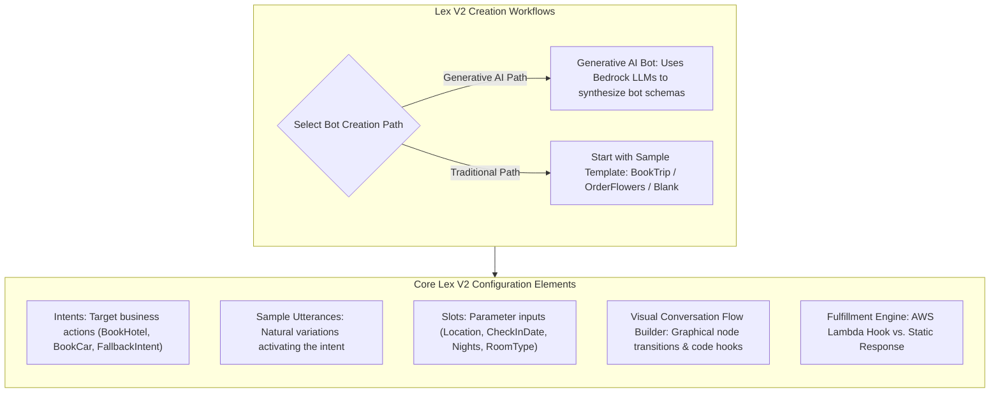

The hands-on architecture relies on configuring **Intents** (what the user wants to accomplish), defining **Sample Utterances** (trigger phrases), eliciting **Slots** (variables like city, dates, and durations), and visualizing state transitions with the **Visual Conversation Builder** before executing serverless business fulfillment via **AWS Lambda Code Hooks**.

---

## Hands-On Workflow: Building & Configuring a Lex V2 Bot

1. **Initialize Bot Creation & Select Authoring Method:**
   - Open the **Amazon Lex V2 Console** in your target AWS Region.
   - Click **Create bot**.
   - Select your creation method:
     - **Generative AI bot:** Automatically creates intents, slots, and conversational dialogue using foundation models via Amazon Bedrock.
     - **Start with an example:** Deploys a pre-structured reference architecture (e.g., the `BookTrip` template).  
       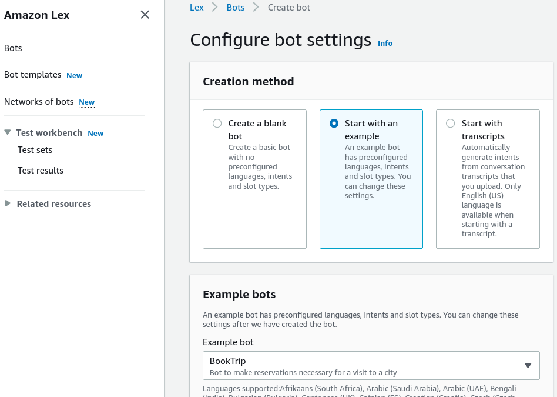
   - Configure metadata:
     - **Bot name:** `DemoBookTrip`  
       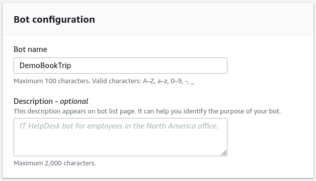
     - **IAM permissions:** Create a role with basic Amazon Lex permissions.  
       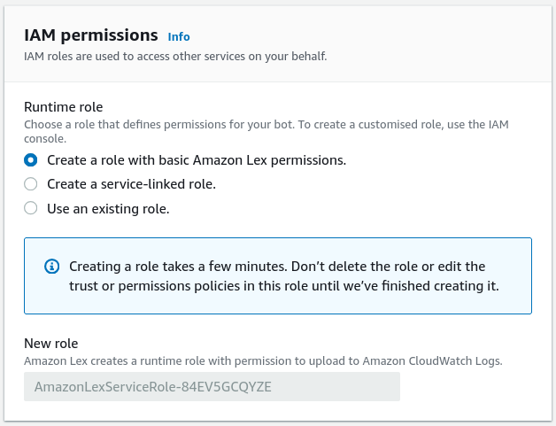
     - **Children's Online Privacy Protection Act (COPPA):** Select `No`.
2. **Configure Language & Voice Persona:**
   - Set linguistic and speech rendering parameters:
   - Select primary language: **English (US)**.
   - Choose an **Amazon Polly Voice Persona** (e.g., _Danielle_ or _Matthew_) to synthesize spoken responses for voice-enabled channels.
   - Click **Done** to initialize the bot builder environment.  
     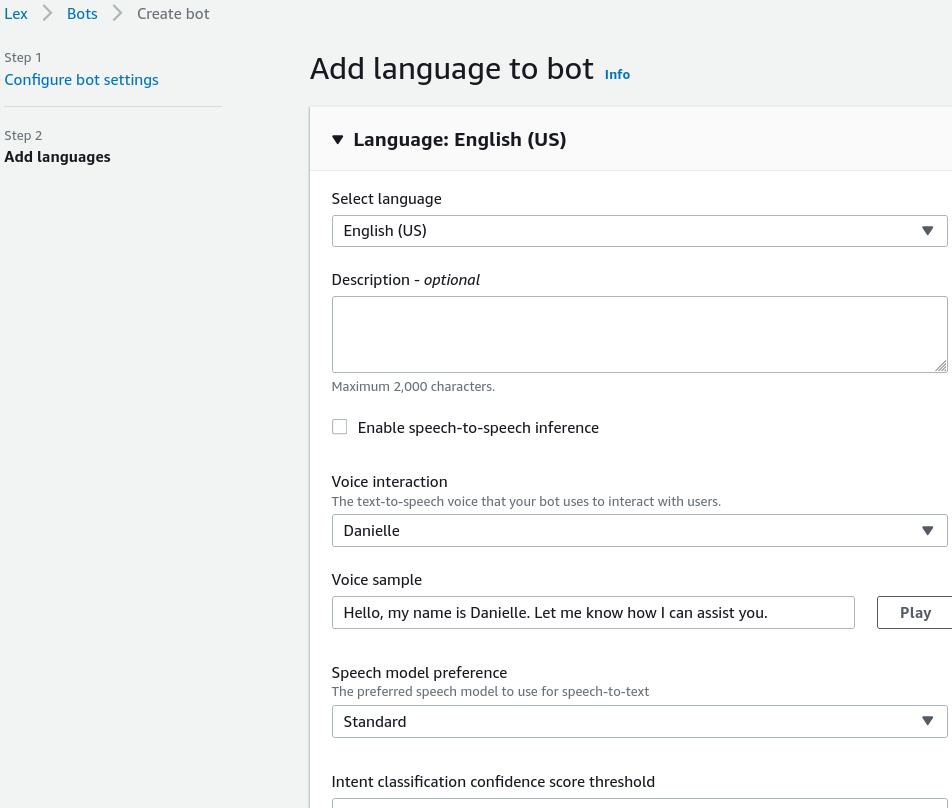
3. **Inspect Intent Hierarchy & Fallback Handling:**
   - Review the intent navigation pane:
   - **`BookHotel` Intent:** Handles hotel reservations.
   - **`BookCar` Intent:** Handles rental vehicle bookings.
   - **`FallbackIntent`:** Triggers automatically when a user utterance cannot be matched to any custom intent, providing recovery prompts or routing to human agents.  
     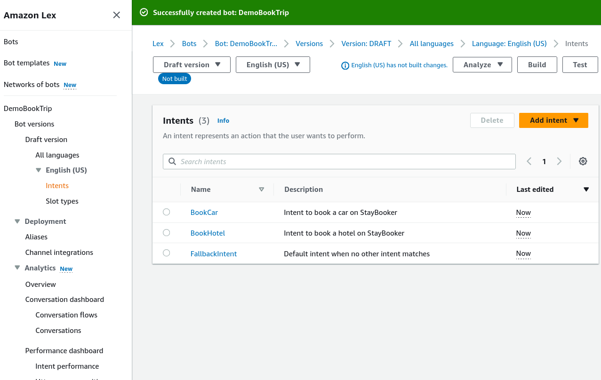
4. **Configure Sample Utterances & Slots in BookHotel:**
   - Open the **`BookHotel`** intent editor:  
     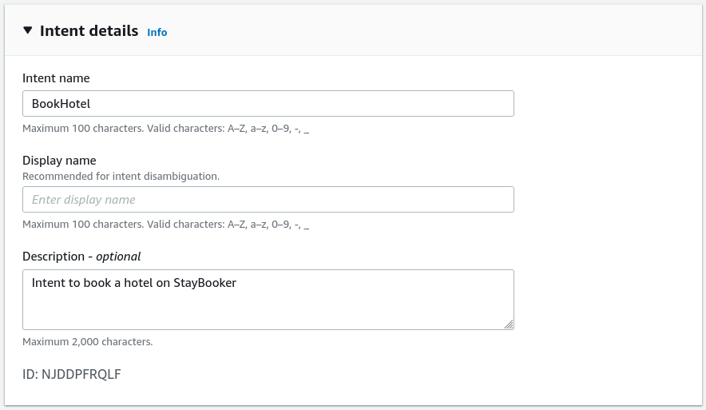
   - Add **Sample Utterances** that users might speak or type:
     - _"Book a hotel"_
     - _"I want to make a hotel reservation"_
     - _"Book `{Nights}` nights in `{Location}`"_
       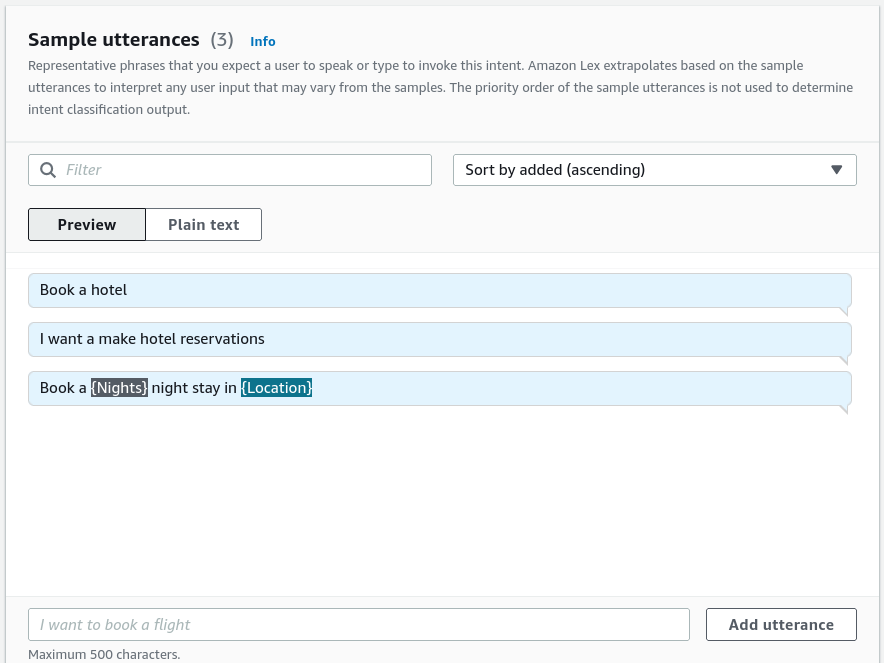
   - Configure the **Slots** (required parameters):
     - `{Location}` (Type: `AMAZON.City`) - Prompt: _"What city will you be staying in?"_
     - `{CheckInDate}` (Type: `AMAZON.Date`) - Prompt: _"What day do you want to check in?"_
     - `{Nights}` (Type: `AMAZON.Number`) - Prompt: _"How many nights will you be staying?"_
     - `{RoomType}` (Type: Custom enumeration: `King`, `Queen`, `Deluxe`) - Prompt: _"What type of room would you prefer?"_  
       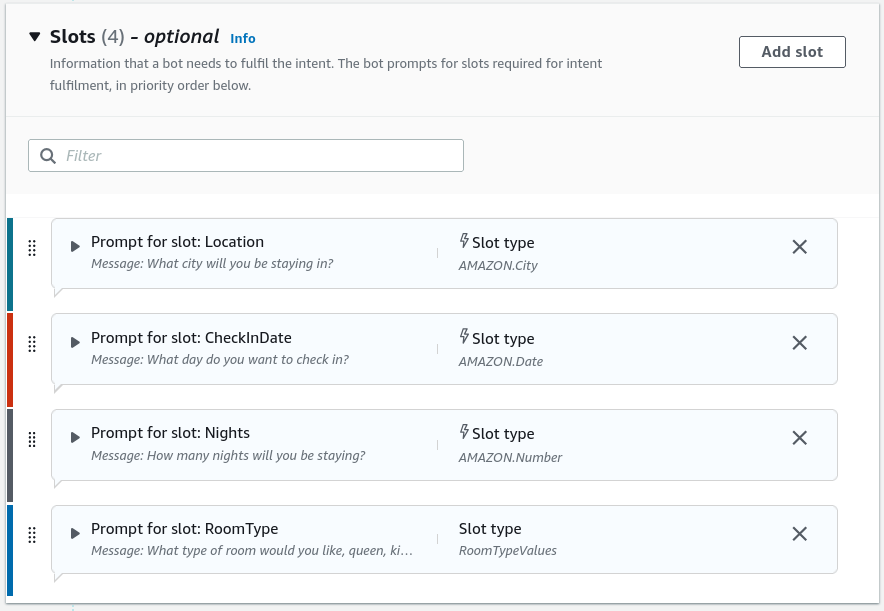
5. **Utilize the Visual Conversation Flow Builder:**
   - Toggle to the **Visual Builder** view:
   - Inspect the graphical flowchart displaying state nodes: **Start Intent** $\rightarrow$ **Initial Response** $\rightarrow$ **Slot Elicitation Sequence** $\rightarrow$ **Confirmation / Rejection Branches** $\rightarrow$ **Fulfillment**.
   - Use drag-and-drop connections to customize dynamic branching logic and error conditions visually.  
     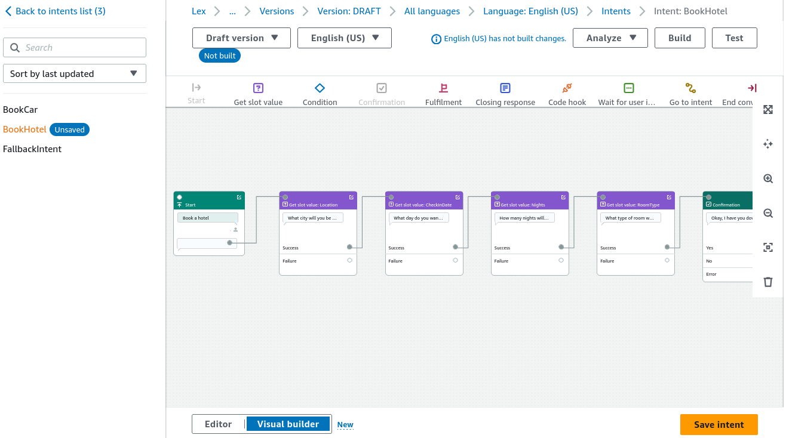
6. **Configure Fulfillment Code Hooks:**
   - Set the final action executed once all slots are validated:
   - Under **Fulfillment**, select **AWS Lambda function** (or static confirmation response).
   - Attach the target Lambda ARN to pass the structured JSON payload containing `{Location}`, `{CheckInDate}`, `{Nights}`, and `{RoomType}` for backend database processing.
   - Click **Build** to compile the NLU model, then click **Test** in the console chat window.  
     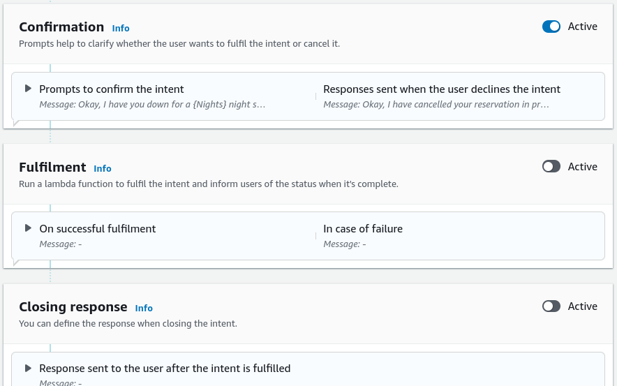

---

## Structural Comparison: Lex Visual Builder vs. Intent Form Editor

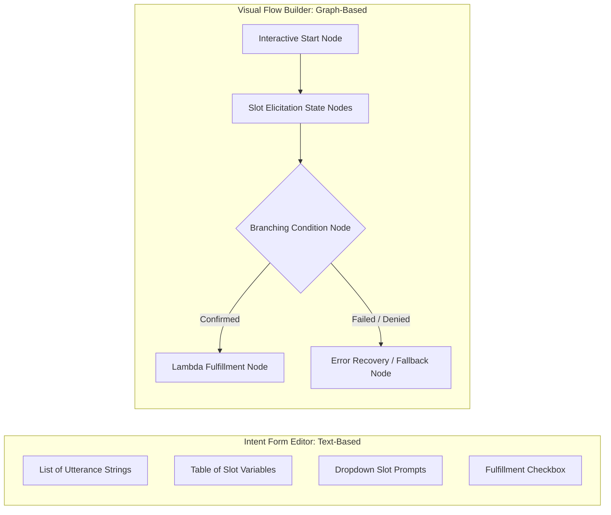

| Dimension                  | Standard Intent Form Editor                                              | Visual Conversation Builder                                           |
| -------------------------- | ------------------------------------------------------------------------ | --------------------------------------------------------------------- |
| **Interface Style**        | Tabular, sequential field entry.                                         | Node-based graphical flowchart.                                       |
| **Branching Visibility**   | Relies on nested dropdown menus and condition tabs.                      | Visual decision trees showing success, failure, and retry logic.      |
| **Complex Dialogue Flows** | Best for simple, linear slot collection.                                 | Best for complex multi-turn dialogues with dynamic conditional forks. |
| **Underlying Engine**      | Both interfaces edit the exact same underlying Amazon Lex V2 bot schema. |                                                                       |

---

## Exam Guide

### Exam Tips

- **Authoring Modes:** Amazon Lex V2 supports traditional intent/slot manual creation, template bootstrapping (e.g., `BookTrip`), and **Generative AI bot creation** powered by Amazon Bedrock foundation models.
- **The Role of FallbackIntent:** Every Lex bot contains a built-in `FallbackIntent` that executes when user utterances fail to match any configured intent with sufficient confidence score.
- **Slot Types:**
  - **Built-in Slots:** Provided by AWS (e.g., `AMAZON.City`, `AMAZON.Date`, `AMAZON.Number`, `AMAZON.PhoneNumber`).
  - **Custom Slots:** Defined by developers for domain-specific lists (e.g., `RoomTypeOptions: [King, Queen, Suite]`).
- **Visual Conversation Builder:** AWS provides a visual flow builder inside Lex V2 that lets developers design conversational logic, retry loops, and branching conditions as a visual state machine without manual scripting.
- **Testing Lifecycle:** You must **Build** the Lex bot before running interactive tests in the console test console.

---

### Practice Test

#### Question 1

A customer service developer is configuring an Amazon Lex bot to handle airline ticket changes. During testing, a test user enters the phrase "Can I switch my seat to business class?", which is not covered by any configured custom intent. Which Amazon Lex component handles this unmatched utterance by default?

- [ ] A. Amazon Rekognition Moderation Adapter
- [ ] B. `FallbackIntent`
- [ ] C. Amazon Comprehend Syntax Tokenizer
- [ ] D. Amazon Polly SSML Break

Correct Answer

- [x] B. `FallbackIntent`
  - **Explanation:** The built-in **`FallbackIntent`** is automatically triggered when a user's utterance cannot be matched to any of the bot's configured custom intents with sufficient natural language understanding confidence.

---

#### Question 2

A retail developer wants to create an Amazon Lex bot for coffee orders. The bot needs to gather the user's desired beverage type (`Espresso`, `Latte`, `Cappuccino`), which is a specific company menu selection not covered by built-in AWS slots. Which component should the developer create?

- [ ] A. A Custom Slot Type with enumeration values
- [ ] B. An Amazon Transcribe Custom Language Model (CLM)
- [ ] C. An Amazon Comprehend PII redaction policy
- [ ] D. A built-in `AMAZON.Number` slot

Correct Answer

- [x] A. A Custom Slot Type with enumeration values
  - **Explanation:** When an intent requires capturing domain-specific parameters that are not part of AWS's built-in slot library, the developer creates a **Custom Slot Type** and defines the allowable enumeration values (e.g., `Espresso`, `Latte`, `Cappuccino`).

---
