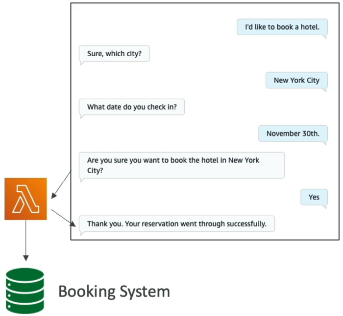
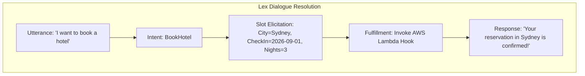
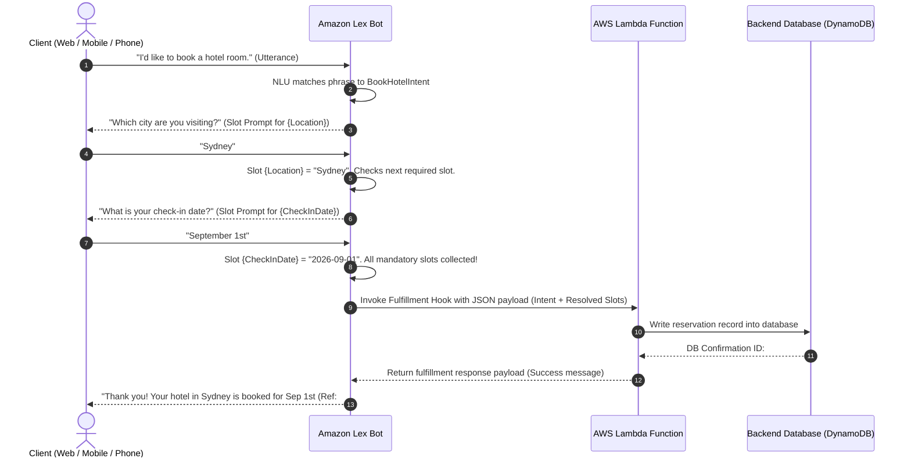
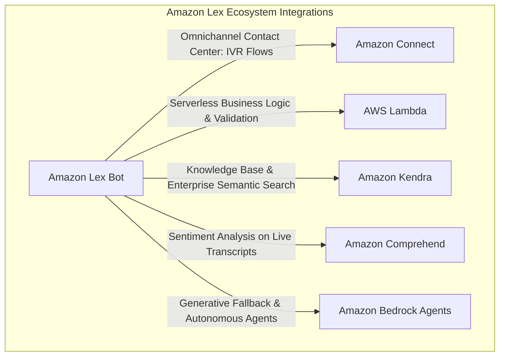

# Amazon Lex: Conversational AI, Core Bot Architecture & Lambda Fulfillment

---

## Key Takeaways

**Amazon Lex** is a fully managed service for building conversational interfaces (chatbots and virtual voice assistants) using both **voice (speech-to-text / ASR)** and **natural language understanding (NLU)**.

<div className="grid grid-cols-1 md:grid-cols-3">

<div className="col-span-1 md:col-span-2">
    ```mermaid
    flowchart TD
        subgraph ClientInteraction [User Input Modalities]
            VoiceIn[Spoken Voice Audio]
            TextIn[Written Text Messages]
        end

        subgraph LexEngine [Amazon Lex Conversational Engine]
            direction TB
            ASR[Automatic Speech Recognition: ASR]
            NLU[Natural Language Understanding: NLU]

            subgraph CoreComponents [Core Bot Building Blocks]
                Utt[Sample Utterances: Training phrases spoken by user]
                Int[Intents: Target goal or action to achieve]
                Slot[Slots: Required parameters & entity variables]
                Prompt[Prompts: Interactive clarifying questions]
            end
        end

        subgraph FulfillmentLayer [Backend Integration & Fulfillment]
            Lambda[AWS Lambda: Business Logic & DB Transactions]
            Connect[Amazon Connect: Cloud Contact Center Integration]
            Kendra[Amazon Kendra: Enterprise FAQ Search]
            Bedrock[Amazon Bedrock Agents / Generative QnA]
        end

        ClientInteraction --> ASR & NLU
        ASR & NLU --> CoreComponents
        CoreComponents --> FulfillmentLayer
    ````

</div>



</div>

Amazon Lex is the core conversational technology that powers Amazon Alexa. It relies on four primary building blocks: **Intents** (the user's goal), **Utterances** (sample phrases that trigger the intent), **Slots** (input parameters needed to complete the task), and **Fulfillment** (executing business logic, typically via **AWS Lambda**).

---

## Main Discussion

### The Anatomy of an Amazon Lex Bot



| Term / Component | Definition & Role                                                                                                  | Concrete Example (Hotel Booking Bot)                                                                           |
| ---------------- | ------------------------------------------------------------------------------------------------------------------ | -------------------------------------------------------------------------------------------------------------- |
| **Bot**          | The container that orchestrates conversational flows, intents, slots, and integrations across supported languages. | `HotelReservationBot`                                                                                          |
| **Intent**       | Represents the action, goal, or purpose the user wants to accomplish.                                              | `BookHotelIntent`, `CancelReservationIntent`                                                                   |
| **Utterance**    | Spoken or typed phrases provided as training samples that trigger a specific intent.                               | • _"I want to book a room"_, _"Reserve a hotel"_, _"Find a hotel in Sydney"_                                   |
| **Slot**         | Parameter variables or entities required by the intent to execute fulfillment logic.                               | • `{Location}` (e.g., `Sydney`)<br/> • `{CheckInDate}` (e.g., `2026-09-01`)<br/> • `{RoomType}` (e.g., `King`) |
| **Slot Type**    | Defines how the slot is validated and parsed (Built-in standard types or custom enumeration lists).                | `AMAZON.City`, `AMAZON.Date`, `AMAZON.Number`, or custom `RoomTypeOptions`                                     |
| **Prompt**       | Questions the bot automatically asks the user to elicit missing slot values.                                       | _"Which city would you like to stay in?"_, _"What is your check-in date?"_                                     |
| **Fulfillment**  | The operational mechanism that carries out the user's validated request once all required slots are populated.     | Invoking an **AWS Lambda function** to record the reservation in an Amazon DynamoDB database.                  |

---

### Step-by-Step Execution Lifecycle with AWS Lambda



1. **Intent Recognition:** Lex matches the user's initial utterance to an intent using natural language understanding.
2. **Slot Elicitation:** Lex sequentially prompts the user until all required slot parameters are collected and validated.
3. **Lambda Code Hook:** Lex passes the structured JSON event containing slot key-value pairs to an **AWS Lambda function**.
4. **Closing Response:** Lambda processes the business transaction (e.g., reserving inventory, billing credit card) and returns the confirmation string to Lex to speak or display to the user.

---

### Key Enterprise Integrations



- **Amazon Connect:** Combines Lex bots with Amazon Connect to build self-service Interactive Voice Response (IVR) call routing and automated voice agents.
- **Amazon Kendra / Amazon Bedrock:** Built-in `AMAZON.KendraSearchIntent` and `AMAZON.QnAIntent` allow Lex bots to query unstructured company documents and enterprise knowledge bases whenever a user asks questions outside standard transactional flows.

---

## Exam Guide

### Exam Tips

- **Core Chatbot Service:** **Amazon Lex** is the standard AWS service for building conversational AI, chatbots, and interactive voice bots.
- **Component Mapping (High Frequency on Exam):**
  - **Intent:** What the user wants to accomplish (e.g., `OrderPizza`).
  - **Utterance:** What the user says or types to trigger the intent (e.g., _"Can I get a large pepperoni?"_).
  - **Slot:** The parameter values needed to complete the action (e.g., `Size=Large`, `Topping=Pepperoni`).
  - **Prompt:** The question the bot asks to collect missing slot information (e.g., _"What size pizza would you like?"_).
  - **Fulfillment:** Executing the action using **AWS Lambda**.
- **Voice + Text Support:** Lex handles both spoken audio and written text natively, using deep learning ASR (Automatic Speech Recognition) and NLU (Natural Language Understanding).
- **AWS Lambda Integration:** The fulfillment mechanism for executing custom business logic, database updates, or third-party API lookups is **AWS Lambda**.

---

### Practice Test

#### Question 1

A food delivery company wants to develop an automated customer chatbot that allows users to reorder past meals via voice or text. The chatbot needs to identify the customer's goal, gather variables such as meal selection and delivery address, and trigger backend order processing in a database. Which combination of AWS services implements this conversational workflow with minimal operational overhead?

- [ ] A. Amazon Rekognition and Amazon DynamoDB
- [ ] B. Amazon Lex for conversational dialogue and AWS Lambda for backend fulfillment
- [ ] C. Amazon Polly and Amazon EC2 GPU instances
- [ ] D. Amazon Comprehend Custom Classification with AWS Glue

<details>
<summary>Correct Answer</summary>

- [x] B. Amazon Lex for conversational dialogue and AWS Lambda for backend fulfillment
  - **Explanation:** **Amazon Lex** provides pre-built conversational AI (intents, utterances, slots) to manage voice and text conversations, while **AWS Lambda** executes serverless business logic and handles database fulfillment.

</details>

---

#### Question 2

In Amazon Lex terminology, if a user configures a travel bot with the variable `{DestinationCity}` to capture where the user wants to fly, what does `{DestinationCity}` represent?

- [ ] A. An Intent
- [ ] B. An Utterance
- [ ] C. A Slot
- [ ] D. A Fulfillment Hook

<details>
<summary>Correct Answer</summary>

- [x] C. A Slot
  - **Explanation:** In Amazon Lex, a **Slot** is a parameter or variable (e.g., `{DestinationCity}`) required by an intent to satisfy and fulfill the user's request.

</details>

---
